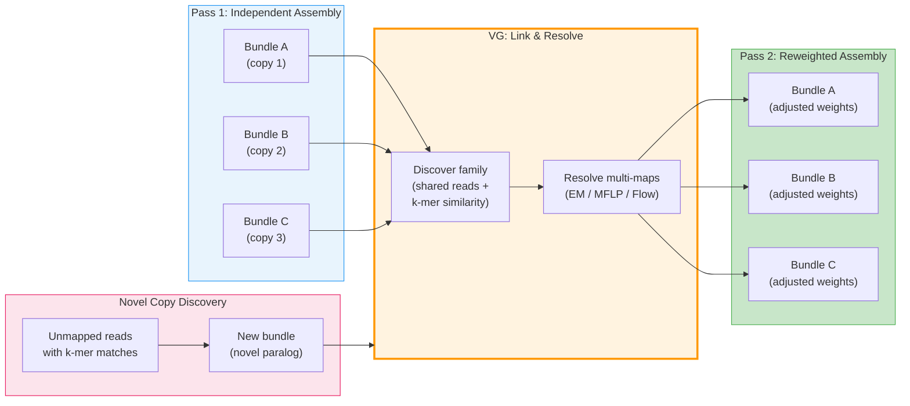
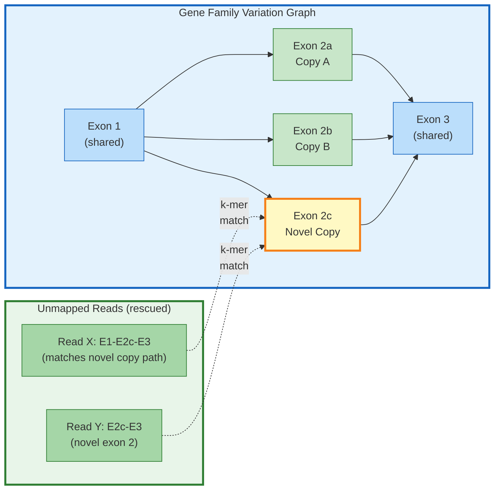
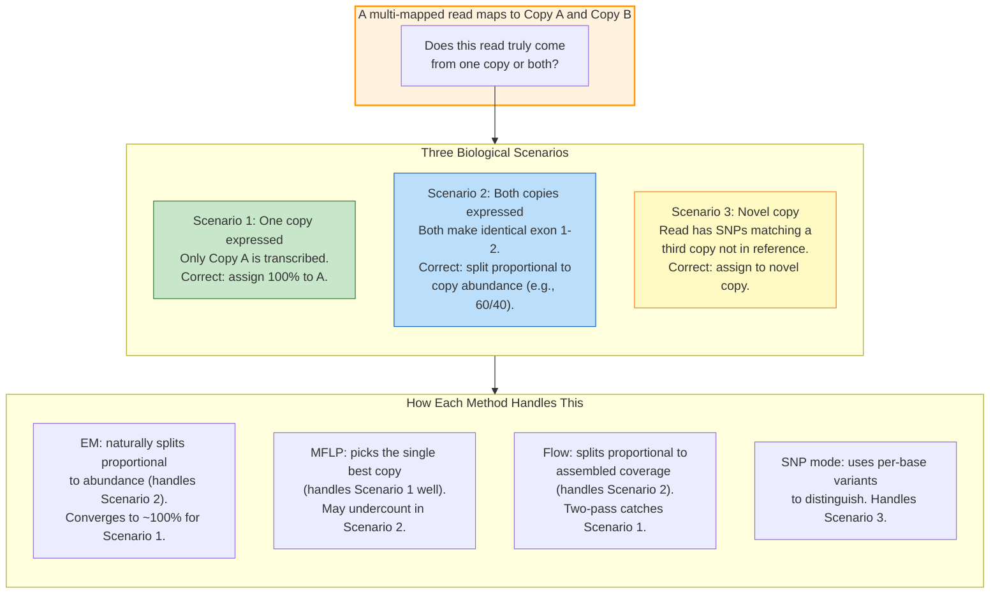
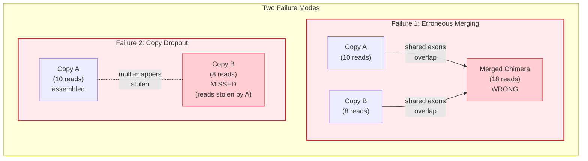

# Rustle

A long-read transcript assembler written in Rust, with a **variation graph (VG) mode** for multi-copy gene family assembly.

## Overview

Rustle assembles transcripts from long-read RNA-seq alignments (PacBio, ONT) using a splice-graph and max-flow decomposition pipeline. It includes a variation graph (VG) mode that links gene family copies via multi-mapping reads and jointly resolves read assignments across paralogs.

### Benchmark: Rustle vs StringTie (GGO chr19, PacBio IsoSeq)

| Metric | Rustle | StringTie | Notes |
|--------|--------|-----------|-------|
| Transcripts assembled | 1,887 | 1,839 | |
| Matching transcripts | 1,440 / 1,839 | — | Rustle vs StringTie output |
| Transcript sensitivity | 78.3% | — | (gffcompare `=` class) |
| Transcript precision | 76.3% | — | |
| Intron-level sensitivity | 96.1% | — | |
| Intron-level precision | 93.9% | — | |
| Locus-level sensitivity | 94.9% | — | |
| Locus-level precision | 95.2% | — | |
| Wall-clock time | **8.0 s** | 13.7 s | **1.7x faster** |
| Language | Rust | C++ | |

> Benchmark: *Gorilla gorilla gorilla* chromosome 19 PacBio IsoSeq (45 MB BAM, 583 loci).
> Rustle's base algorithm is a faithful port of StringTie's splice-graph + max-flow pipeline;
> the remaining transcript-level gap comes from minor differences in graph node granularity
> and pairwise filtering heuristics that are under active development.
> VG mode features (multi-mapping resolution, novel copy discovery) are not reflected in this
> single-chromosome benchmark — they apply when assembling multi-copy gene families genome-wide.

## Features

- **Transcript assembly**: splice graph construction, Edmonds-Karp max-flow, seeded path extraction
- **Long-read optimized**: poly-A/T detection, junction correction, hard boundary inference
- **Variation graph mode** (`--vg`): gene family discovery, EM/MFLP/flow-based multi-mapping resolution
- **SNP-based copy assignment** (`--vg-snp`): use sequence variants to distinguish gene copies
- **Novel copy discovery** (`--vg-discover-novel`): find missing paralogs from unmapped reads via k-mer matching
- **Phased assembly scaffold** (`--vg-phase`): haplotype-aware assembly using HP tags
- **Splice consensus validation**: genome-based GT-AG/GC-AG motif checking
- **Guided and expression-only modes**: `-G` for annotation-guided, `-e` for quantification

## Quick Start

```bash
# Build
cargo build --release

# De novo assembly (long reads)
./target/release/rustle -L -o output.gtf input.bam

# With variation graph mode (gene families)
./target/release/rustle -L --vg --vg-report families.tsv -o output.gtf input.bam

# Guided assembly
./target/release/rustle -L -G reference.gtf -o output.gtf input.bam

# With genome for splice consensus validation
./target/release/rustle -L --genome-fasta genome.fa -o output.gtf input.bam
```

---

## Pipeline Architecture

### Core Assembly Pipeline

```mermaid
flowchart TD
    subgraph INPUT["1. Input"]
        BAM["BAM/SAM\n(aligned reads)"]
        REF["Reference GTF\n(optional guide)"]
        FASTA["Genome FASTA\n(splice consensus)"]
    end

    subgraph BUNDLE["2. Bundle Detection"]
        CLUSTER["Cluster overlapping\nreads into loci"]
        JUNC["Extract & filter\nsplice junctions"]
        CPAS["Detect poly-A\ncut sites (long reads)"]
    end

    subgraph GRAPH["3. Splice Graph Construction"]
        NODES["Segment exonic regions\ninto graph nodes"]
        EDGES["Add collinear +\njunction edges"]
        SRC_SINK["Add source & sink\nnodes"]
        LONGTRIM["Longtrim: split nodes\nat read-boundary peaks\n(long-read mode)"]
    end

    subgraph MAPFLOW["4-5. Read Mapping & Flow"]
        MAP["Map reads onto\ngraph paths (transfrags)"]
        ABSORB["Merge compatible\ntransfrags"]
        MAXFLOW["Edmonds-Karp\nmax-flow decomposition"]
    end

    subgraph EXTRACT["6. Path Extraction"]
        SEED["Seed transcripts from:\n- guide matches\n- junction paths\n- long-read paths"]
        EXTEND["Extend paths\nsource <-> sink"]
        ABUND["Compute per-transcript\nabundance (cov, FPKM, TPM)"]
    end

    subgraph FILTER["7. Transcript Filtering"]
        ISOFRAC["Isofrac: remove\nlow-fraction isoforms"]
        PAIRWISE["Pairwise: remove\ncontained transcripts"]
        DEDUP["Dedup: remove\nintron-chain subsets"]
        RUNOFF["Filter polymerase\nrun-off / run-on"]
    end

    subgraph OUTPUT["8. Output"]
        GTF["Transcript GTF"]
        ABUND_TAB["Gene abundance\ntable"]
    end

    INPUT --> BUNDLE --> GRAPH --> MAPFLOW --> EXTRACT --> FILTER --> OUTPUT

    style INPUT fill:#e8f4fd,stroke:#2196F3
    style BUNDLE fill:#e8f4fd,stroke:#2196F3
    style GRAPH fill:#e8f4fd,stroke:#2196F3
    style MAPFLOW fill:#e8f4fd,stroke:#2196F3
    style EXTRACT fill:#e8f4fd,stroke:#2196F3
    style FILTER fill:#e8f4fd,stroke:#2196F3
    style OUTPUT fill:#e8f4fd,stroke:#2196F3
```



### VG Extension: How It Wraps the Core Pipeline

The standard pipeline treats each locus independently. VG mode adds a layer that links related loci (paralogs, tandem duplicates) and resolves multi-mapping reads across them:



---

## VG Mode: Gene Family Assembly

The `--vg` flag enables variation graph mode for multi-copy gene families:

```bash
# EM solver (default) — junction-based compatibility scoring
./target/release/rustle -L --vg --vg-solver em -o output.gtf input.bam

# MFLP solver — linear programming
./target/release/rustle -L --vg --vg-solver mflp -o output.gtf input.bam

# With SNP-based copy assignment
./target/release/rustle -L --vg --vg-snp --genome-fasta genome.fa -o output.gtf input.bam

# Novel copy discovery from unmapped reads
./target/release/rustle -L --vg --vg-discover-novel --genome-fasta genome.fa -o output.gtf input.bam
```

Family groups are discovered automatically from multi-mapping read patterns (supplementary alignments) and exonic sequence similarity (k-mer Jaccard). The `--vg-report` flag outputs a TSV with per-family details.

### Novel Copy Discovery: Rescuing Unmapped Reads

In a linear reference, reads from paralogs absent in the assembly have nowhere to map and are lost. VG mode builds a variation graph from all known copies and scans unmapped reads against it via k-mer matching:



**These reads never passed through the aligner for this locus** — they were unmapped or mapped elsewhere. VG mode rediscovers them through sequence similarity (k-mer matching) to the family's assembled transcripts, bypassing the aligner's reference bias entirely. If enough reads cluster with novel junctions, a new bundle is created and assembled as a previously-unknown paralog.

---

### Multi-Mapping Resolution: EM vs MFLP vs Flow

When a read maps equally well to multiple gene copies (NH > 1), standard assemblers discard it or split it equally (1/NH). VG mode offers three strategies:



**EM (Expectation-Maximization):** Iteratively refines fractional weights. A multi-mapper at two expressed copies gets split proportionally (e.g., 0.6/0.4). This is the correct answer when both copies are expressed — the sequencer genuinely cannot distinguish which copy produced the molecule in shared regions.

**MFLP (Minimum Flow Linear Program):** Single-shot LP optimization. Tends toward hard 0/1 assignment (LP optima sit at polytope vertices). Best when each read truly originates from one copy and you want the globally optimal assignment.

**Flow (Two-Pass Redistribution):** Assemble first with uniform 1/NH weights, then redistribute multi-mappers proportional to assembled transcript coverage, then reassemble. Like EM but uses assembled structure as evidence.

#### How many multi-mappers are real?

A multi-mapper that maps to two expressed copies _does_ belong at both. EM and Flow correctly split its weight — this is not an error but the honest probabilistic answer. Controls:

1. **Compatibility scoring:** Reads only get weight at copies where their splice junctions match. A read with junctions A-B-C gets near-zero weight at a copy with junctions A-B-D.
2. **Abundance feedback:** Copies with few uniquely-mapped reads attract less multi-mapper weight — the method "learns" expression levels.
3. **SNP discrimination:** When copies differ by even a single nucleotide, `--vg-snp` parses the MD tag to build diagnostic variant profiles and assigns reads by allele match.

| Method | Fractional? | Handles "belongs in both" | Best for |
|--------|-------------|---------------------------|----------|
| EM | Yes | Yes (proportional split) | General use |
| MFLP | Tends to 0/1 | No (picks one) | Clear-cut cases |
| Flow | Yes | Yes (coverage-based) | Complex families |
| SNP | N/A | Distinguishes copies | Divergent copies |

---

### Avoiding Assembly Artifacts

VG mode prevents the two main failure modes in gene family assembly:



**VG mode prevents both:**

- **Chimeric prevention:** Copies stay as separate bundles linked by family grouping — never merged into one splice graph. Multi-mapper weights are redistributed, not the reads themselves.
- **Copy recovery:** EM/MFLP/Flow redistribute weights using junction compatibility, preventing winner-takes-all. Even copies differing by a single splice junction (1bp) get their reads back through compatibility scoring.
- **Novel paralogs:** K-mer scan of unmapped reads against the family variation graph creates new bundles for copies absent from the reference.

| Artifact | Cause | VG Prevention |
|----------|-------|---------------|
| Chimeric transcripts | Merging reads from different copies | Separate bundles, linked by family grouping |
| Copy dropout | Multi-mappers stolen by dominant copy | EM/MFLP/Flow redistribute by junction compatibility |
| Missing paralogs | Novel copy absent from reference | K-mer scan of unmapped reads against family VG |
| SNP-identical copies | Copies differ only by point mutations | `--vg-snp`: diagnostic SNP profiles per copy |
| Haplotype confusion | Two haplotypes create false diversity | `--vg-phase`: split reads by HP tags before assembly |

---

## Key Options

| Flag | Description | Default |
|------|-------------|---------|
| `-L` | Long-read mode | off |
| `-G <GTF>` | Guided assembly with reference annotation | — |
| `-e` | Expression-only (quantify known transcripts) | off |
| `-o <GTF>` | Output GTF path | required |
| `-p <N>` | Threads | auto |
| `-f <F>` | Minimum isoform fraction | 0.01 |
| `-c <F>` | Minimum coverage per bp | 1.0 |
| `--genome-fasta <FA>` | Genome for splice consensus | — |
| `--vg` | Enable variation graph mode | off |
| `--vg-solver {em,mflp,flow}` | Multi-mapping solver | em |
| `--vg-snp` | SNP-based copy assignment | off |
| `--vg-phase` | Phased assembly (HP tags) | off |
| `--vg-discover-novel` | Find novel gene copies | off |
| `--vg-report <TSV>` | Family group report | — |
| `--vg-min-shared <N>` | Min shared reads to link bundles | 3 |

## Output

Standard GTF format with additional attributes:

```
gene_id "RSTL.1"; transcript_id "RSTL.1.1"; cov "12.5"; FPKM "0.5"; TPM "150.0";
source "flow"; longcov "15.0";
```

In VG mode, transcripts from gene families include:
```
family_id "FAM_0"; copy_id "1"; family_size "3";
```

## Installation

Requires Rust toolchain (1.70+):

```bash
git clone https://github.com/juanfraitu1/Rustle.git
cd Rustle
cargo build --release
# Binary: ./target/release/rustle
```

## License

MIT License — see [LICENSE](LICENSE).

Transcript assembly pipeline inspired by StringTie (Pertea et al., Johns Hopkins University). VG mode, multi-mapping resolution, SNP assignment, and novel copy discovery are original contributions.
