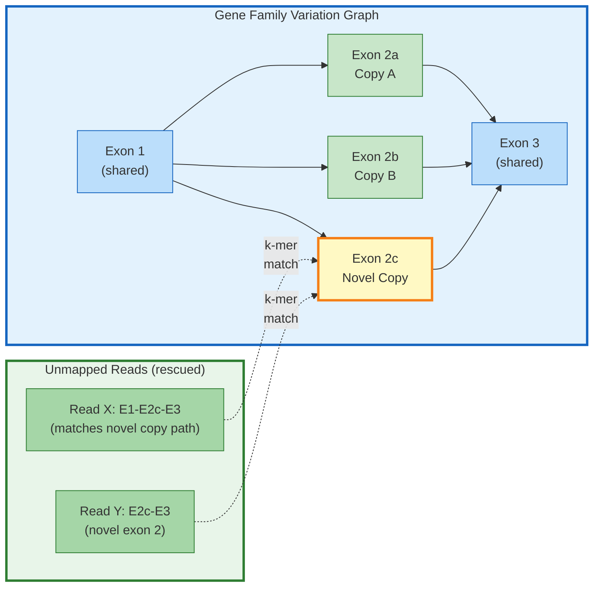
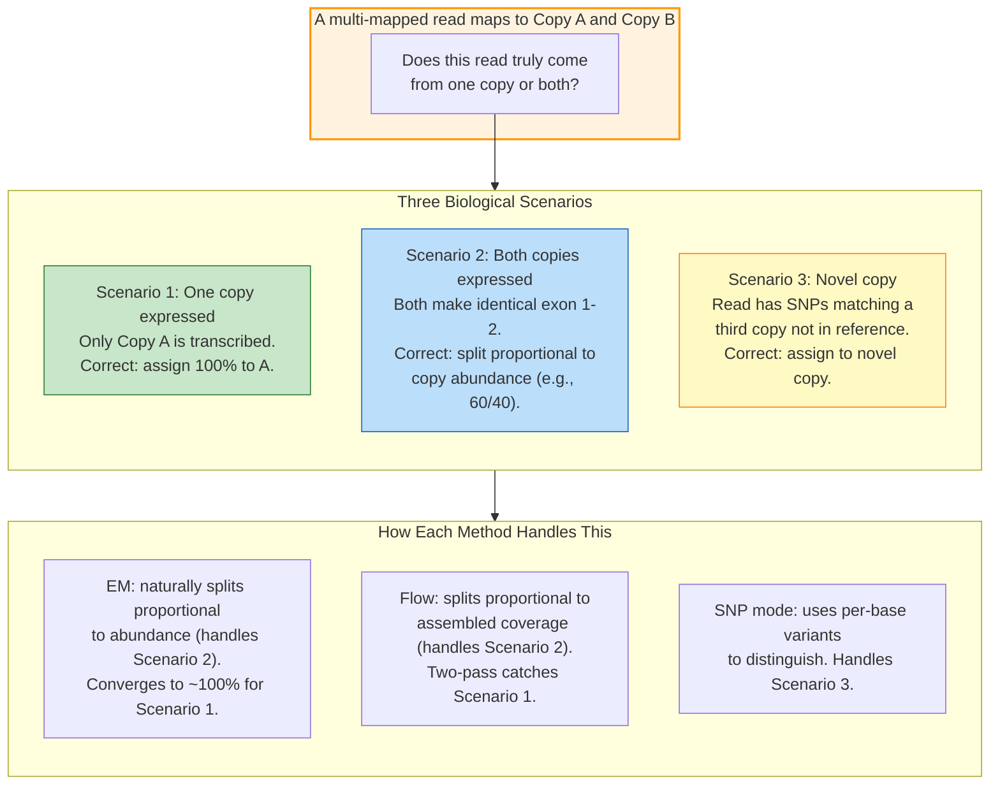
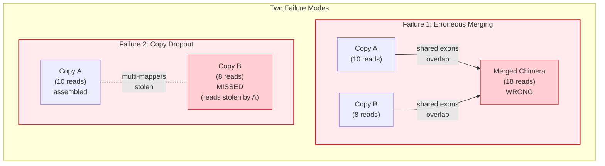

# Rustle

A long-read transcript assembler written in Rust, with a **variation graph (VG) mode** for multi-copy gene family assembly.

> **For the theory:** see [docs/ALGORITHMS.md](docs/ALGORITHMS.md) — derivations of max-flow decomposition, EM for multi-mappers, variation graphs for paralogs, k-mer novel-copy rescue, SNP-based copy assignment, and honest failure-mode analysis.

## Overview

Rustle assembles transcripts from long-read RNA-seq alignments (PacBio, ONT) using a **splice-graph + max-flow decomposition** pipeline. It adds a **variation graph (VG) mode** that links paralogous gene copies via multi-mapping reads and jointly resolves read assignments across the family — including reads that didn't map to any reference copy.

### Why network flow for transcript assembly

A splice graph is a DAG where nodes are exon segments and edges are splice junctions (or contiguous exon boundaries). Every transcript is a path from a source to a sink through this graph. If we treat each read as one unit of mass flowing along its splice pattern, then **the max-flow from source to sink equals the total assembly evidence**, and decomposing that flow into paths recovers individual transcripts with their per-transcript abundance.

This isn't just a computational trick — it's a **mechanistic model of read production**: conservation of flow at every node holds because every read that enters an exon must leave it via exactly one of the outgoing edges (a splice or contiguous choice). The math mirrors the biology.

See [ALGORITHMS §3](docs/ALGORITHMS.md#3-network-flow-formulation-and-why-it-works) for the full formulation.

### Why variation graphs for paralogs

A variation graph represents alternate sequences as parallel paths sharing nodes where they agree and diverging where they differ. Paralogs — gene copies that arose by duplication — share exon sequences where they haven't diverged and differ elsewhere. So **one variation graph can represent the entire gene family**.

Any copy-to-copy difference becomes a *bubble* in the VG with shared flanking nodes:

| Copy-to-copy difference | VG representation | Current Rustle support |
|---|---|---|
| SNP | single-base bubble | ✅ `--vg-snp` (diagnostic-allele detection) |
| Indel (insertion / deletion) | asymmetric bubble | ⚠️ parsed into reads, not yet used as diagnostic feature |
| Copy-specific exon | exon-scale bubble | ✅ implicit (each copy's splice graph differs) |
| Copy-specific splice site | bubble at donor/acceptor | ✅ implicit (junction compatibility in EM) |
| Tandem-repeated exon | repeated node with multiplicity | ⚠️ detected at bundle level, not modelled as repeats |
| Whole copy-specific segment | branched sub-path | ✅ implicit |

"Implicit" means: Rustle doesn't build a single explicit variation-graph data structure for the whole family. Instead, each copy keeps its own splice graph, and the VG abstraction lives in *how reads are weighted across copies* before each copy is assembled. That's the architectural choice explained in [ALGORITHMS §6](docs/ALGORITHMS.md#6-how-vg-mode-wraps-the-network-flow-core).

This buys us two things a linear reference can't:
- A read from a shared region is *naturally attributed to the family* — it contributes mass to each copy weighted by compatibility (junctions and, with `--vg-snp`, diagnostic SNPs).
- A read matching sequence that isn't in *any* reference copy can be *rescued by k-mer similarity* to the family — the aligner missed it, but the VG sees it.

See [ALGORITHMS §5](docs/ALGORITHMS.md#5-variation-graphs-for-gene-families) (what a VG encodes + scope table), [§6](docs/ALGORITHMS.md#6-how-vg-mode-wraps-the-network-flow-core) (how VG connects to network flow), and [§10](docs/ALGORITHMS.md#10-novel-copy-discovery-k-mer-rescue-of-unmapped-reads) (k-mer rescue).

### Network flow × VG in one sentence

**The VG layer re-weights reads across related gene copies; the network flow then runs on each copy's splice graph independently, with those re-weighted reads as input capacities.** See [ALGORITHMS §6](docs/ALGORITHMS.md#6-how-vg-mode-wraps-the-network-flow-core) for the full architectural decomposition and why we chose this over a joint family-wide max-flow.

### Why EM for multi-mappers

A read aligning equally well to *N* copies genuinely might come from any of them. Standard assemblers either discard such reads or split them uniformly (`1/NH`). Neither answer is right when copies have different expression levels. **Expectation-Maximization** iteratively refines the fractional assignment using *junction compatibility* as likelihood:

- E-step: compute posterior probability that read *r* came from copy *k*, given current estimates of copy expression θ and junction-match likelihood P(r | k).
- M-step: update θ from the posterior weights.

Both steps have closed forms. EM provably non-decreases the likelihood each iteration (Jensen's inequality). Convergence in 10-20 iterations on biological data. The honest answer for a read that fits two expressed copies equally is a *probabilistic split* — EM produces it; winner-take-all methods can't.

See [ALGORITHMS §8](docs/ALGORITHMS.md#8-em-solver-derivation-and-convergence) for the derivation.

### Benchmark: Rustle vs StringTie (GGO chr19, PacBio IsoSeq)

| Metric | Rustle | StringTie | Notes |
|--------|--------|-----------|-------|
| Transcripts assembled | 1,732 | 1,839 | |
| Matching transcripts | 1,458 / 1,839 | — | gffcompare `=` class |
| Transcript sensitivity | **79.3%** | — | |
| Transcript precision | **84.2%** | — | |
| Intron-chain sensitivity | 80.4% | — | |
| Intron-level precision | 96.0% | — | |
| Locus-level sensitivity | 95.4% | — | |
| Locus-level precision | 95.1% | — | |
| Wall-clock time | **5.4 s** | 13.7 s | **2.5x faster** |
| Language | Rust | C++ | |

> Benchmark: *Gorilla gorilla gorilla* chromosome 19 PacBio IsoSeq (45 MB BAM, 583 loci).
> Rustle's base algorithm is a faithful port of StringTie's splice-graph + max-flow pipeline,
> modernized in Rust. Junction filter decisions match StringTie with 99.97% parity on
> shared junctions (verified via `JFINAL_TRACE` diagnostic). The remaining transcript-level gap
> is almost entirely in flow-decomposition path enumeration — 99.2% of missed references have
> all their junctions in Rustle's KEEP set but the paths aren't emitted (see
> [docs/STRINGTIE_PARITY_SYSTEMATIC.md](docs/STRINGTIE_PARITY_SYSTEMATIC.md) for details).
>
> VG mode features (multi-mapping resolution, novel copy discovery) are *not* reflected in
> this single-chromosome benchmark — they apply when assembling multi-copy gene families
> genome-wide.

## Features

- **Transcript assembly**: splice graph construction, Edmonds-Karp max-flow, seeded path extraction
- **Long-read optimized**: poly-A/T detection, junction correction, hard boundary inference
- **Variation graph mode** (`--vg`): gene family discovery, EM or flow-based multi-mapping resolution
- **SNP-based copy assignment** (`--vg-snp`): use sequence variants to distinguish gene copies
- **Novel copy discovery** (`--vg-discover-novel`): find missing paralogs from unmapped reads via k-mer matching
- **Phased assembly scaffold** (`--vg-phase`): haplotype-aware assembly using HP tags
- **Splice consensus validation**: genome-based GT-AG/GC-AG motif checking
- **Guided and expression-only modes**: `-G` for annotation-guided, `-e` for quantification

## Quick Start

```bash
# Build
cargo build --release

# De novo assembly (long reads)
./target/release/rustle -L -o output.gtf input.bam

# With variation graph mode (gene families)
./target/release/rustle -L --vg --vg-report families.tsv -o output.gtf input.bam

# Guided assembly
./target/release/rustle -L -G reference.gtf -o output.gtf input.bam

# With genome for splice consensus validation
./target/release/rustle -L --genome-fasta genome.fa -o output.gtf input.bam
```

---

## Pipeline Architecture

### Core Assembly Pipeline

```mermaid
flowchart TD
    subgraph INPUT["1. Input"]
        BAM["BAM/SAM\n(aligned reads)"]
        REF["Reference GTF\n(optional guide)"]
        FASTA["Genome FASTA\n(splice consensus)"]
    end

    subgraph BUNDLE["2. Bundle Detection"]
        CLUSTER["Cluster overlapping\nreads into loci"]
        JUNC["Extract & filter\nsplice junctions"]
        CPAS["Detect poly-A\ncut sites (long reads)"]
    end

    subgraph GRAPH["3. Splice Graph Construction"]
        NODES["Segment exonic regions\ninto graph nodes"]
        EDGES["Add collinear +\njunction edges"]
        SRC_SINK["Add source & sink\nnodes"]
        LONGTRIM["Longtrim: split nodes\nat read-boundary peaks\n(long-read mode)"]
    end

    subgraph MAPFLOW["4-5. Read Mapping & Flow"]
        MAP["Map reads onto\ngraph paths (transfrags)"]
        ABSORB["Merge compatible\ntransfrags"]
        MAXFLOW["Edmonds-Karp\nmax-flow decomposition"]
    end

    subgraph EXTRACT["6. Path Extraction"]
        SEED["Seed transcripts from:\n- guide matches\n- junction paths\n- long-read paths"]
        EXTEND["Extend paths\nsource <-> sink"]
        ABUND["Compute per-transcript\nabundance (cov, FPKM, TPM)"]
    end

    subgraph FILTER["7. Transcript Filtering"]
        ISOFRAC["Isofrac: remove\nlow-fraction isoforms"]
        PAIRWISE["Pairwise: remove\ncontained transcripts"]
        DEDUP["Dedup: remove\nintron-chain subsets"]
        RUNOFF["Filter polymerase\nrun-off / run-on"]
    end

    subgraph OUTPUT["8. Output"]
        GTF["Transcript GTF"]
        ABUND_TAB["Gene abundance\ntable"]
    end

    INPUT --> BUNDLE --> GRAPH --> MAPFLOW --> EXTRACT --> FILTER --> OUTPUT

    style INPUT fill:#e8f4fd,stroke:#2196F3
    style BUNDLE fill:#e8f4fd,stroke:#2196F3
    style GRAPH fill:#e8f4fd,stroke:#2196F3
    style MAPFLOW fill:#e8f4fd,stroke:#2196F3
    style EXTRACT fill:#e8f4fd,stroke:#2196F3
    style FILTER fill:#e8f4fd,stroke:#2196F3
    style OUTPUT fill:#e8f4fd,stroke:#2196F3
```



### Pipeline stages in one sentence each

1. **Input:** BAM (required), GTF guide (optional), genome FASTA (optional, for splice-consensus checks).
2. **Bundle detection:** cluster reads with overlapping alignments into per-locus **bundles**; extract splice junctions; detect poly-A/poly-T cut sites from long reads.
3. **Splice graph construction:** within a bundle, segment exonic regions into **DAG nodes** bounded by junction donors/acceptors; add source and sink; `longtrim` splits nodes at TSS/TES read-boundary peaks (long-read mode).
4. **Read→graph mapping:** each read becomes a **transfrag** — a path of node IDs it overlaps. Transfrags are merged when one is a prefix/suffix of another (read "absorption").
5. **Max-flow:** **Edmonds-Karp** from source to sink on the transfrag-weighted graph. This computes the total flow the graph can carry and is the foundation for path extraction.
6. **Path extraction:** seed from long-read transfrags, extend left (`back_to_source`) and right (`fwd_to_sink`) along highest-residual-flow edges, subtract the path's flow, repeat. Non-extendable transfrags enter **checktrf** for redistribution-or-rescue.
7. **Transcript filtering:** drop isoforms below `transcript_isofrac` of their locus max, drop pairwise-contained transcripts, drop intron-chain subsets, drop low-cov runoff.
8. **Output:** GTF with per-transcript coverage, FPKM, TPM; optional gene abundance table.

Each stage has a "why" to it — the sentence-level summary here is the surface; [ALGORITHMS.md](docs/ALGORITHMS.md) has the derivations.

### VG Extension: How It Wraps the Core Pipeline

The standard pipeline treats each locus independently. VG mode adds a layer that links related loci (paralogs, tandem duplicates) and resolves multi-mapping reads across them:


---

## VG Mode: Gene Family Assembly

The `--vg` flag enables variation graph mode for multi-copy gene families. A gene family is a set of paralogs (duplicated copies of a common ancestor) like olfactory receptors, amylases, or the TBC1D3 family in great apes. Reads from these regions multi-map or fail to map entirely on a linear reference; VG mode jointly resolves them.

**Full algorithmic treatment in [docs/ALGORITHMS.md](docs/ALGORITHMS.md):**
- [§5 Variation graphs for gene families](docs/ALGORITHMS.md#5-variation-graphs-for-gene-families) — what a VG encodes, scope (SNPs, indels, exon-level diffs, repeats)
- [§6 How VG wraps network flow](docs/ALGORITHMS.md#6-how-vg-mode-wraps-the-network-flow-core) — per-copy flow with family-level read reweighting
- [§8 EM solver](docs/ALGORITHMS.md#8-em-solver-derivation-and-convergence) — derivation and convergence
- [§9 Flow solver](docs/ALGORITHMS.md#9-flow-solver-two-pass-redistribution) — two-pass redistribution
- [§10 Novel copy discovery](docs/ALGORITHMS.md#10-novel-copy-discovery-k-mer-rescue-of-unmapped-reads) — k-mer rescue
- [§11 SNP-based assignment](docs/ALGORITHMS.md#11-snp-based-copy-assignment)

```bash
# EM solver (default) — junction-based compatibility scoring
./target/release/rustle -L --vg --vg-solver em -o output.gtf input.bam

# Flow solver — two-pass assembly with coverage-based redistribution
./target/release/rustle -L --vg --vg-solver flow -o output.gtf input.bam

# With SNP-based copy assignment
./target/release/rustle -L --vg --vg-snp --genome-fasta genome.fa -o output.gtf input.bam

# Novel copy discovery from unmapped reads
./target/release/rustle -L --vg --vg-discover-novel --genome-fasta genome.fa -o output.gtf input.bam
```

Family groups are discovered automatically from multi-mapping read patterns (supplementary alignments) and exonic sequence similarity (k-mer Jaccard). The `--vg-report` flag outputs a TSV with per-family details.

### Novel Copy Discovery: Rescuing Unmapped Reads

In a linear reference, reads from paralogs absent in the assembly have nowhere to map and are lost. VG mode builds a variation graph from all known copies and scans unmapped reads against it via k-mer matching:



**These reads never passed through the aligner for this locus** — they were unmapped or mapped elsewhere. VG mode rediscovers them through sequence similarity (k-mer matching) to the family's assembled transcripts, bypassing the aligner's reference bias entirely. If enough reads cluster with novel junctions, a new bundle is created and assembled as a previously-unknown paralog.

---

### Multi-Mapping Resolution: EM vs Flow

When a read maps equally well to multiple gene copies (NH > 1), standard assemblers discard it or split it equally (1/NH). VG mode offers two strategies:



**EM (Expectation-Maximization):** Iteratively refines fractional weights. A multi-mapper at two expressed copies gets split proportionally (e.g., 0.6/0.4). This is the correct answer when both copies are expressed — the sequencer genuinely cannot distinguish which copy produced the molecule in shared regions.

**Flow (Two-Pass Redistribution):** Assemble first with uniform 1/NH weights, then redistribute multi-mappers proportional to assembled transcript coverage, then reassemble. Like EM but uses assembled structure as evidence.

#### How many multi-mappers are real?

A multi-mapper that maps to two expressed copies _does_ belong at both. EM and Flow correctly split its weight — this is not an error but the honest probabilistic answer. Controls:

1. **Compatibility scoring:** Reads only get weight at copies where their splice junctions match. A read with junctions A-B-C gets near-zero weight at a copy with junctions A-B-D.
2. **Abundance feedback:** Copies with few uniquely-mapped reads attract less multi-mapper weight — the method "learns" expression levels.
3. **SNP discrimination:** When copies differ by even a single nucleotide, `--vg-snp` parses the MD tag to build diagnostic variant profiles and assigns reads by allele match.

| Method | Fractional? | Handles "belongs in both" | Best for |
|--------|-------------|---------------------------|----------|
| EM | Yes | Yes (proportional split) | General use |
| Flow | Yes | Yes (coverage-based) | Complex families |
| SNP | N/A | Distinguishes copies | Divergent copies |

---

### Avoiding Assembly Artifacts

VG mode prevents the two main failure modes in gene family assembly:



**VG mode prevents both:**

- **Chimeric prevention:** Copies stay as separate bundles linked by family grouping — never merged into one splice graph. Multi-mapper weights are redistributed, not the reads themselves.
- **Copy recovery:** EM or Flow redistribute weights using junction compatibility, preventing winner-takes-all. Even copies differing by a single splice junction (1bp) get their reads back through compatibility scoring.
- **Novel paralogs:** K-mer scan of unmapped reads against the family variation graph creates new bundles for copies absent from the reference.

| Artifact | Cause | VG Prevention |
|----------|-------|---------------|
| Chimeric transcripts | Merging reads from different copies | Separate bundles, linked by family grouping |
| Copy dropout | Multi-mappers stolen by dominant copy | EM/Flow redistribute by junction compatibility |
| Missing paralogs | Novel copy absent from reference | K-mer scan of unmapped reads against family VG |
| SNP-identical copies | Copies differ only by point mutations | `--vg-snp`: diagnostic SNP profiles per copy |
| Haplotype confusion | Two haplotypes create false diversity | `--vg-phase`: split reads by HP tags before assembly |

---

## Key Options

| Flag | Description | Default |
|------|-------------|---------|
| `-L` | Long-read mode | off |
| `-G <GTF>` | Guided assembly with reference annotation | — |
| `-e` | Expression-only (quantify known transcripts) | off |
| `-o <GTF>` | Output GTF path | required |
| `-p <N>` | Threads | auto |
| `-f <F>` | Minimum isoform fraction | 0.01 |
| `-c <F>` | Minimum coverage per bp | 1.0 |
| `--genome-fasta <FA>` | Genome for splice consensus | — |
| `--vg` | Enable variation graph mode | off |
| `--vg-solver {em,flow}` | Multi-mapping solver | em |
| `--vg-snp` | SNP-based copy assignment | off |
| `--vg-phase` | Phased assembly (HP tags) | off |
| `--vg-discover-novel` | Find novel gene copies | off |
| `--vg-report <TSV>` | Family group report | — |
| `--vg-min-shared <N>` | Min shared reads to link bundles | 3 |

## Output

Standard GTF format with additional attributes:

```
gene_id "RSTL.1"; transcript_id "RSTL.1.1"; cov "12.5"; FPKM "0.5"; TPM "150.0";
source "flow"; longcov "15.0";
```

In VG mode, transcripts from gene families include:
```
family_id "FAM_0"; copy_id "1"; family_size "3";
```

## Installation

Requires Rust toolchain (1.70+):

```bash
git clone https://github.com/juanfraitu1/Rustle.git
cd Rustle
cargo build --release
# Binary: ./target/release/rustle
```

## License

MIT License — see [LICENSE](LICENSE).

Transcript assembly pipeline inspired by StringTie (Pertea et al., Johns Hopkins University). VG mode, multi-mapping resolution, SNP assignment, and novel copy discovery are original contributions.
