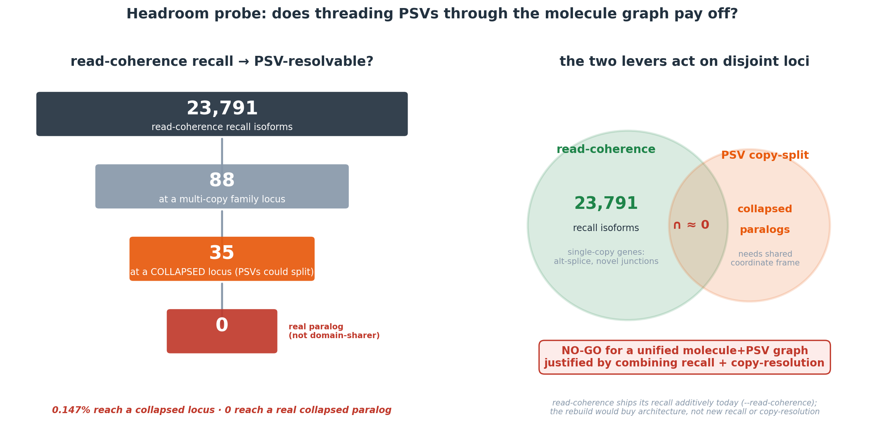

# Denovo Pipeline (consolidated)

> Merged from 7 source docs (verbatim, git keeps the originals' history). Each section below was a separate `bench/*.md`.

**Contents:** [denovo_family_pipeline](#denovo-family-pipeline) · [denovo_families.SUPERSEDED](#denovo-familiessuperseded) · [twopass_denovo](#twopass-denovo) · [integrate_end_to_end](#integrate-end-to-end) · [intronchain_discovery](#intronchain-discovery) · [readcoherence_finding](#readcoherence-finding) · [readcoherence_psv_headroom](#readcoherence-psv-headroom)


---


## INDEX

> **Index.** 51 sections; this is the map. **The titles carry the verdicts** — no tag is derived
> here. ⚠ In `o1_ledger.md` an earlier auto-derived verdict tag scored **11/22 = 50%** against
> sections whose outcome was known first-hand, so tags were removed rather than shipped. Search a
> heading to jump.


- denovo_family_pipeline
- Architecture: a general assembler with a copy-aware specialization
- Stages (script · input · output · key params)
- Key results
- Rejected approaches (don't re-try without new evidence)
- Determinism / scale / gotchas
- Re-run (order)
- Rust port (status & plan)
- File index
- denovo_families.SUPERSEDED
- twopass_denovo
- Result (PSV ladder K = identifiability axis)
- What this shows
- Honest scope
- Verdict
- Genome-wide: not restricted to a handful (bench/twopass_genomewide.py)
- Reproduce
- integrate_end_to_end
- End-to-end on the 5-copy benchmark (WITH truth) — bench/integrate_end_to_end.py
- Real GGO census — how much hard-multimapper signal exists
- Bottom line (answering the question)
- Reproduce
- intronchain_discovery
- Method (bench/extract_intron_chains.py + family_intronchain_discovery.py)
- Recall — the criterion works
- The headline: independent confirmation (structure ⟂ sequence)
- Candidate-generation tradeoff (a finding; both modes kept, `--cand`)
- Honest limitations
- Verdict
- Reproduce
- readcoherence_finding
- Result (genome-wide GGO, guided `-G stringtie.gtf`, SQANTI3-validated)
- VALIDATED vs StringTie (2026-06-15, rigorous cut — survives the PSV-grade scrutiny)
- SHIPPED — gated `--read-coherence` layer VALIDATED (2026-06-15, genome-wide 25 chroms)
- OPTION B (truly-additive) + GC-AG fix — VALIDATED (2026-06-15, user chose "max")
- Noise anatomy (the ~5,459 non-real extras) — filter-vs-generate split
- Proposed design (when resumed)
- Reproduce
- readcoherence_psv_headroom
- Inputs
- Recall set
- Tier 1 — are the recall wins even at multi-copy family loci?
- Tier 2 — of the family-locus hits, which regime (does PSV actually SPLIT?)
- Tier 3 — of the COLLAPSED hits, are the 'copies' REAL paralogs or domain-sharers?
- Verdict
- What this does and does NOT settle
- Honest caveats (which way they push)
- Reproduce
- readthrough_rule_validation
- daz2_recovered
- containment_coverage_floor

## denovo_family_pipeline

# De-novo Family + Copy-Assignment Pipeline (the "read-coherence way")

Genome-wide, **annotation-free, minimizer-free** pipeline on gorilla (GGO) HiFi/IsoSeq data, built to
serve the advisor's two objectives — **(1) identify multi-copy gene families at the RNA level** and
**(2) assign reads to copies under ambiguity (hard multimappers)** — plus a third lever that fell out of
the data: **(3) copy-specific / allele-specific junctions** as an assignment signal.

Branch: `vg/flow-capacity-apportionment`.
Commits: Python arc `b8abbbf`; Pass-1 `2698457`; Rust copy-assign core `f5def11`.
Big data lives in `/home/juanfra/winloci_scratch/` (NOT `/mnt/c`): `GGO.bam`, `GGO.fasta`,
`denovo_skeletons.tsv`, `denovo_transcripts.{fa,meta.tsv}`, `sim5x/`.

---

## Architecture: a general assembler with a copy-aware specialization

It is a **general-purpose assembler** (assembles *all* transcripts, family or not) whose "areas of focus"
are multi-copy families and PSVs. Pipeline:

```
BAM ─► Pass-1 read-coherence skeletons ─► gate ─► GENERAL ASSEMBLY (101k→93k transcripts)
                                                        │
                                          intron-junction collapse ─► 15,676 gene loci
                                                        │
              canonical-kmer pre-filter ─► contiguous-span ─► POA contiguous-core ─► family edges
                                                        │
                                weighted-modularity decomposition ─► 1,193 families (1,190 + 3 webs)
                                                        │
                         family-aware RESCUE (borrow strength) ─► +118 under-assembled copies
                                                        │
                  COPY ASSIGNMENT: per-read PSV + copy-specific-junction likelihood + ID gate
```

---

## Stages (script · input · output · key params)

### 1. Pass-1 read-coherence skeletons — `twopass_denovo_gw_pass1.py` (committed `2698457`)
Group **primary** reads by **exact intron chain** → de-novo transcript skeletons. `MIN_READS=2`.
Out: `/home/.../denovo_skeletons.tsv` (165,994 skeletons; 4.4M reads scanned, ~66s).
NB: exact-chain grouping is correct for HiFi — splice sites are exact (see Rejected: fuzzy collapse).

### 2. Gate → general assembly — `denovo_assemble_gate.py`
Keep skeletons with `>=3` reads + **all-canonical junctions** (GT-AG/GC-AG/AT-AC, consistent strand) +
spliced length in `[100, 300_000]` and **genomic span `<= 3 Mb`**.
⚠ The span/spliced caps were a *bug fix*: without them the gate emitted chromosome-spanning artifacts
(max "transcript" 236 Mb → 3.65 GB FASTA). With caps: 101,467 transcripts, max 16 kb, 346 MB.
Out: `/home/.../denovo_transcripts.{fa,meta.tsv}`.

### 3. Family detection — `denovo_families.py`  → `denovo_families.tsv`, `denovo_family_edges.tsv`
1. **Collapse isoforms → gene loci** by **intron-junction union-find** (two transcripts share a locus iff
   they share an identical `(donor,acceptor)`). NOT raw span overlap — span overlap single-linkage-chains a
   whole dense chromosome into ~1 "locus" (the original 93k→27 bug). → 15,676 loci.
2. **Pre-filter ("bloom filter" idea, done exactly):** `KMER=18` **canonical** (RC-symmetric) k-mers;
   `np.unique(return_counts)` gives exact distinct-gene ownership; family-informative = owned by `2..40`
   reps. A rep needs `>=6` informative k-mers to be a candidate (single-copy genes rejected → never POA'd).
   This cut C(15676,2)=123M all-pairs to 237,833 pairs and fixed the original OOM (old code indexed *all*
   k-mers incl. millions of unique singletons). KMER=18 chosen so coincidental sharing is negligible
   (~0.07% load); KMER=13/16 were saturated.
3. **Contiguous-span filter:** keep a pair only if its shared k-mers SPAN `>= T_CORE * min(len)` (cheap
   proxy for POA's core_recip, same threshold). 237,833 → 25,540 POA pairs (drops domain-sharers).
4. **POA contiguous-core = THE decision** (`poa_family_definition.poa_pair_stats`, `core_recip >= T_CORE=0.13`).
   **Strand-aware:** canonical k-mers (step 2) + POA tries **both orientations** (`_poa` RC fallback) →
   recovers copies assembled on inconsistent strands. ~11,400 confirmed edges → `denovo_family_edges.tsv`.
   POA is the slow part: ~30 min for ~25k pairs, 5-proc pool, O(L²) (190ms@2kb, 2.2s@8kb).

### 4. Decomposition — `denovo_family_split.py` → `denovo_families_split.tsv`
Connected components transitively close a **superfamily** (KRAB-ZNF) into one blob. A real recent-duplicate
family is a **dense, mutually-homologous** subgraph; an over-merge is a **sparse chain bridged by
lower-core_recip domain edges**. Decompose components `>= 6` by **weighted modularity** (networkx
`louvain_communities`, weight=`core_recip`, resolution=1.0). Robust: resolution 1→8 holds concordance
96.0–96.7% while max family 174→65. Per-family structural columns (density, avg_core_recip, n_articulation);
**flag webs** (size>=10 & density<0.15) — non-discretizable homology continua, not claimed as families.
Result: **1,193 families = 1,190 discrete + 3 webs**, name-concordance 97.3% (names never used in the decision).

### 5. Family-aware RESCUE — `family_rescue.py` → `denovo_rescued_copies.{tsv,fa}`
**Borrow strength / partial pooling:** a single confident canonical-junction read forming a multi-exon
chain that **POA-confirms against a confirmed family** is a real copy, even below the `>=3` gate. Scan
merged family neighbourhoods (`WIN=1Mb`), **canonical-kmer pre-filter** (`>=20` shared k-mers with the
best member), POA vs that **single best member** (both orientations), rescue if `core_recip >= 0.13`.
**118 rescued** (88 single-read, 25 two-read), genome-wide, without lowering the global gate.
⚠ Perf gotcha: POA against *all* members of large ZNF families is the cost — POA only the best k-mer match.

### 6. COPY ASSIGNMENT — `copy_assign.py` (modes: `sim5x`, `real`)
Per-read **PSV + copy-specific-junction likelihood** behind an **identifiability gate**:
- Discover PSVs from copies' spliced sequences (`discover_psvs`, all-pairs vs copy[0]; a copy that MATCHES
  the ref inherits that allele — NOT `None`, else the likelihood favours copies it shares no columns with;
  this was a real bug). Each column = `{copy: (gpos, seq_base)}`.
- `logL(read|copy) = Σ_PSV log P(obs base | allele, e) + Σ_junctions (±jw if copy has/lacks the boundary)`.
- **Resolvable iff** the read spans `>= 1` feature where copies differ (the theorem). Margin over runner-up
  → Assigned / Ambiguous; 0 decisive → Tied ("N equally good places").
- Junction boundaries are computed strand-agnostically via `gen2off` (`max(off(d-1), off(a))`).
Rescued copies merged into rosters via `load_rescued`.

---

## Key results

- **General assembler:** 93,373 transcripts → 15,676 gene loci.
- **Families:** 1,190 discrete + 3 flagged webs. De-novo recovers textbook families with names never used:
  MAGEA(15), MAGEB(13), GSTM(10), PCDHB, KRT, TRIM, HSPA, IFITM, and dense ZNF subfamilies.
- **Known-family validation:** RABL2 ✓, APOBEC3 ✓, **RFPL ✓ (unified after strand fix + RFPL2 rescued)**.
- **Copy assignment — synthetic (sim5x, ground truth):** K=0 → 100% tied; K>=2 → 100% accurate;
  error-floor sweep 1.0→0.805 as e→0.15. The realistic BAM-driven assigner reproduces the oracle curve.
- **Copy assignment — real GGO (25 co-located families, 25,940 reads):** **99.9% unique-mapper agreement**
  (vs minimap2's confident mappings), 95% resolvable, 82% confidently assigned.
- **Junctions are decisive for near-identical families:** DSFAM43 (5 copies, 95% MAPQ-0) goes 10% → 99%
  resolvable when copy-specific junctions are added (+167 reads PSVs alone could not resolve).
- **Rescue:** 118 under-assembled copies recovered; RFPL2 (a single read) rescued into the RFPL family.

---

## Rejected approaches (don't re-try without new evidence)

- **Minimizers as the criterion** — never used; only a *contrast* panel in `poa_family_definition.py`. The
  decision is exact canonical k-mers + POA core. Advisor dislikes minimizers.
- **Fuzzy (splice-site-tolerant) intron-chain collapse** — MEASURED net-NEGATIVE (−3,988 transcripts at
  `>=3`). HiFi splice sites are exact; `<=8bp` differences are real isoforms, not noise. Does not recover
  under-assembled genes.
- **Lowering the `>=3` gate** — RFPL2 has 4 reads / 4 distinct support-1 chains; no gate helps; only
  family-aware rescue (with the family prior) recovers it.
- **Forward-only family detection** — under-merges any mixed-strand family (RFPL). Fixed by strand-awareness.

## Determinism / scale / gotchas

- Determinism: fixed seeds; no `Date.now`/`random` in derivations; networkx Louvain seeded.
- WSL2 box: **5 cores, 19 GB**. POA pools use 5 procs. Watch memory; prior runs OOM'd the candidate dict
  before the bloom pre-filter. `kmer_hashes` uses a **vectorized Horner** rolling hash, NOT int64 matmul
  (numpy integer matmul is a non-BLAS slow loop).
- The de-novo FASTA has some **duplicate transcript IDs** (same `DN_chrom_start_nexon` for distinct chains);
  handled by a length-guard in `copy_assign`; the 99.9% agreement shows no material harm.
- Honest residual: RFPL1's reads are a messy readthrough — *represented* (LOC134758217) but not cleanly
  delineated. A data-quality limit, not an algorithm gap.

## Re-run (order)

```bash
PY=/home/juanfra/miniforge3/bin/python
cd bench
$PY twopass_denovo_gw_pass1.py     # -> denovo_skeletons.tsv (~66s)
$PY denovo_assemble_gate.py        # -> denovo_transcripts.{fa,meta.tsv}
$PY denovo_families.py             # -> denovo_families.tsv + denovo_family_edges.tsv (~30 min POA)
$PY denovo_family_split.py         # -> denovo_families_split.tsv (fast, reads edges)
$PY family_rescue.py               # -> denovo_rescued_copies.{tsv,fa} (~2 min)
$PY copy_assign.py sim5x           # synthetic identifiability validation
$PY copy_assign.py real            # real-family copy assignment (merges rescued copies)
```

---

## Rust port (status & plan)

Goal: port the advisor-aligned cores into `src/rustle/vg_family/`. Rust has `poasta` (POA, no pairwise
aligner), `noodles` (BAM), FNV-1a minimizers + exact k-mer Jaccard, clap CLI, rayon, BTreeMap determinism.
Existing `copy_split.rs` does PSV *discovery* (`ReadObs`, `AlignedRead`, `allele_at` CIGAR bridge, 19 tests).

- ✅ **Copy assignment** — `src/rustle/vg_family/copy_assign.rs` (commit `f5def11`). Pure `assign_read(read,
  copies, params) -> {best_copy, log_lr_margin, n_decisive, resolvable, status∈{Assigned,Ambiguous,Tied}}`.
  PSV likelihood + junction term + identifiability gate; reuses `allele_at`; 13 tests incl. the sim5x
  K=2/K=1 logic and the ref-allele-inheritance guard. Full crate compiles (454 existing tests intact).
- ✅ **Family-aware rescue** — `src/rustle/vg_family/family_rescue.rs`. Pure decision core:
  `canonical_kmer_set` (exact base-4 KMER=18, `min(fwd,rc)`, N-drop — a faithful port of
  `denovo_families.py::kmer_hashes`, the missing canonical-k-mer counter), best-member pre-filter by
  k-mer overlap (`K_RESCUE=20`, strict-`>` earliest-wins), then `rescue_thin_locus` POA-confirms against the
  single best member via the already-ported `family_graph::contiguous_core_coverage` (`core_recip`), trying
  BOTH orientations (RC fallback), rescue iff `core_recip >= T_CORE=0.13`. 14 tests (TDD). The BAM-neighbourhood
  scan that builds thin loci is deferred to Integration (below). Adversarially verified faithful vs the python
  (encoding bit-for-bit over a 2000-seq sweep; decision logic confirmed); fixed one latent defect the review
  caught — lowercase/soft-masked input passed the case-insensitive k-mer pre-filter but `reverse_complement`
  mapped lowercase→N and voided the RC fallback, so POA operands are now uppercased (mirrors python
  `poa_pair_stats.upper()`).
- ✅ **Strand-aware family detection** — `family_detect.rs` (`denovo_families.py` core) + `family_split.rs`
  (`denovo_family_split.py` core). `family_detect`: intron-junction union-find loci collapse, canonical
  exact-k-mer counter (`canonical_kmer_first_pos`, position-compacted over N-dropped windows), ownership
  pre-filter + contiguous-span, both-orientation POA edges via `contiguous_core_coverage`. `family_split`:
  connected components + **hand-rolled deterministic weighted-modularity Louvain** (local-moving with the
  python-louvain gain formula + multi-level aggregation), iterative-Tarjan articulation points, structural
  metrics, web flagging. Chose hand-rolled over petgraph+a community crate (no Rust Louvain dep exists;
  networkx-byte-identical is infeasible; the target is same modularity DEFINITION + determinism). 43 tests.
  Adversarially verified: Louvain gain proven equal to networkx 3.6.1 (sympy) + identical modularity on
  300+ planted graphs, articulation 0/2000 mismatches, fully deterministic. Review caught + fixed one real
  bug — `canonical_kmer_first_pos` used absolute window indices vs python's N-compacted positions (shifts
  the contiguous-span filter on N-containing transcripts).
- ⬜ **Integration** — junction-boundary mapping (per-copy exon context, `gen2off`-style) + BAM/FASTA
  orchestration to run copy assignment inside the pipeline (bundle/family/transcript structs in
  `types.rs`/`vg.rs`/`pipeline.rs`).

Build note: test builds are memory-heavy on the 19 GB box — use `CARGO_PROFILE_TEST_DEBUG=0 -j4`.

## File index

Scripts: `twopass_denovo_gw_pass1.py`, `denovo_assemble_gate.py`, `denovo_families.py`,
`denovo_family_split.py`, `family_rescue.py`, `copy_assign.py`, `poa_family_definition.py` (shared POA core),
`build_sim5x.py` (5-copy synthetic + oracle), `sim_reads.py`.
Tables: `denovo_families{,_split,_annotated}.tsv`, `denovo_family_edges.tsv`, `denovo_rescued_copies.tsv`.
Rust: `src/rustle/vg_family/copy_assign.rs` (+ `copy_split.rs` it builds on).


---

## denovo_families.SUPERSEDED

# ⚠ `denovo_families.tsv` is SUPERSEDED — do NOT cite it as the O1 family catalog

`bench/denovo_families.tsv` (1,130 "families") is the **OLD catalog built by the arbitrary similarity threshold
`core_recip ≥ 0.13`** — exactly the "with no arbitrary thresholds" claim the defense audit retired. It
**over-merges**: e.g. `DNFAM0` is a single 728-member family spanning chr1→chrY (unrelated genes bridged by
shared Alu/domain sequence).

**The principled O1 catalog is the threshold-free de-tie READ-CONFLICT-GRAPH catalog**
(`gw_family_catalog → detect_conflict_catalog_genome_wide`, persisted as
`/home/juanfra/winloci_scratch/gw_conflict_catalog.{families,copies}.tsv`): **82 same-chrom families / 207
copies**, no similarity threshold. This is the catalog O2 was run on (P1: 63.9% assigned / 35.7% certified-tied
genome-wide — `bench/P1_P4_RESULTS.md`).

`denovo_families.tsv` is kept only because a few legacy scripts (`copy_resolution_census.py`,
`denovo_families.py`, `dna_psv_catalog.py`, `gw_family_catalog.rs`) still read it for backward comparison. It is
**not** the family-definition result; cite `gw_conflict_catalog` (and, for external precision, the deferred
SEDEF segdup map — `bench/SEDEF_BUILD.md`).


---

## twopass_denovo

# Annotation-free two-pass: read-coherence preserves per-read PSVs → recovers copies flow loses

Prototype of the architecture: **don't use StringTie flow** (which collapses reads and discards the
per-read PSV linkage); use **read-coherence / direct transfrags** as Pass 1 so per-read PSVs survive to
Pass 2, where families are identified and reads assigned to copies. Demonstrated on the *collapsed*
5-copy regime (all copies' reads piled onto a single-copy reference), where the contrast is starkest.
No annotation, no StringTie. `bench/twopass_denovo.py`.

- **PASS 1 (read-coherence):** map all 5 copies' reads to the single-copy reference, group reads by
  exact intron chain → transcript skeletons, keeping each read's sequence. → **ONE skeleton** (the
  copies share the chain), with all reads + their PSVs.
- **PASS 2 (no annotation):** call PSVs *de novo* from the skeleton's collapsed pileup → split reads by
  PSV allele-vector into copies (copy_split) → declare the multi-copy family → assign each read to a copy.

## Result (PSV ladder K = identifiability axis)
| K | Pass-1 skeletons | de-novo PSVs | copies recovered (of 5) | read→copy assignment acc |
|---|---|---|---|---|
| 0 (identical) | 1 | 0 | 0 | 0.0 — UNASSIGNABLE (no info) |
| 1 | 1 | 1 | 4 | 0.80 (1 column < 5 copies) |
| 2 | 1 | 2 | **5** | **1.00** |
| 4 / 8 | 1 | 2 | 5 | 0.99 |

(de-novo PSVs saturate at 2 = ⌈log₄5⌉, the true # of distinguishing columns for 5 copies.)

## What this shows
- **The decisive contrast:** Pass 1 yields ONE skeleton at every K — exactly where **StringTie flow
  would stop and emit ~1 transcript, losing the 5 copies entirely** (their differences collapsed away).
  Read-coherence keeps the skeleton *with its reads*, so Pass 2 can call PSVs and **recover the 5 copies**.
- **The pipeline is annotation-free end-to-end** — skeletons and PSVs come from the reads, not a GTF.
- **It hits the same identifiability boundary** as the annotation-anchored version: 5/5 copies at K≥2,
  partial at K=1, impossible at K=0 (identical) — confirming the substrate change doesn't move the ceiling,
  it just *preserves the signal* needed to reach it.

## Honest scope
- This is the COLLAPSED regime (the copy_split target) — the case where read-coherence's advantage over
  flow is clearest. For dispersed copies (separate loci) the coordinate already resolves them and flow's
  collapse is less harmful.
- Identifiability ceiling unchanged: a read spanning no distinguishing PSV (tied) stays unassignable.
- Prototype on one synthetic family with truth; a production read-coherence Pass 1 would also handle
  noise (chimeras, minor splice variants) that this clean simulation doesn't stress.

## Verdict
Confirms the architectural point: **read-coherence (not flow) is the correct Pass 1 for a copy-aware,
annotation-free transcript caller** — it preserves the per-read PSVs that let Pass 2 recover and assign
copies that flow would have collapsed. The two-pass `(read-coherence skeleton) → (family + PSV split)`
is `copy_split`'s `(intron chain ⊕ PSV)` realized as a full pipeline.

## Genome-wide: not restricted to a handful (bench/twopass_genomewide.py)
The synthetic prototype above is one locus only because it needs a constructed collapsed reference +
ground truth. The pipeline itself is genome-wide — every stage already ran at genome scale this session
(read-coherence: 25 chroms; family graph definition: 1,337 families; de-novo PSV / co-segregation:
10,178 loci in the hidden-collapse scan). Composed over ALL graph-defined families:

- **1,337 families processed genome-wide** (603,267 reads at family loci) in ~5 s.
- **848 (63%) dispersed** — copies at separate loci → coordinate-resolved (Pass-1 separate skeletons).
- **489 (37%) co-located** — copies share/near one frame → de-novo PSV split applies.
- **hard multimappers (MAPQ-0): 3,803 (0.6%)**; **46 co-located families have ≥5** — those are where the
  PSV-split is genuinely decisive.

So: genome-wide-capable and fast; most families resolve by coordinate, the PSV-split is decisive at the
~46 co-located+hard families (the sparse hard regime — consistent with every prior finding; abundant
only in deep co-located data like testis HiFi).

## Reproduce
- `MINIFORGE python bench/twopass_denovo.py` ; `python3 bench/twopass_fig.py`  (synthetic, with truth)
- `MINIFORGE python bench/twopass_genomewide.py`  (genome-wide tally over all families)


---

## integrate_end_to_end

# Integrated end-to-end: identify families → assign reads to copies (hard multimappers)

Runs the full pipeline and answers, honestly: can the method identify multi-copy families accurately
AND assign reads to copies — especially hard multimappers (MAPQ-0)? Validated WITH ground truth on the
synthetic 5-copy benchmark; censused on real GGO (where there is no per-read truth).

## End-to-end on the 5-copy benchmark (WITH truth) — bench/integrate_end_to_end.py
For each divergence level K: (1) POA variation graph of the 5 copies → graph core-score (family
detected?); (2) PSVs recovered from the graph's variant columns; (3) the MAPQ-0 *hard multimappers*
assigned by their PSV allele-vector → accuracy vs truth.

| K | family score | detected | PSVs from graph | hard MM (MAPQ-0) | PSV acc on hard MM |
|---|---|---|---|---|---|
| 0 (identical) | 1.00 | ✓ | 0 | 200 | 0 — UNASSIGNABLE (no info) |
| 1 | 1.00 | ✓ | 1 | 80 | 0.50 (1 column < 5 copies) |
| 2 | 1.00 | ✓ | 2 | 0 | — (minimap2 resolved) |
| 4 / 8 | 1.00 | ✓ | 2* | 0 | — (minimap2 resolved) |

- **Family detection works at every K** — the 5 near-identical copies are correctly called one family
  (score 1.0 ≫ T), and the PSVs are recovered from the graph (the true # of *varying* columns; the
  base-4 design saturates at ⌈log₄5⌉=2 distinguishing columns, so "K=4/8" add no new variation — the
  graph correctly reports 2).
- **Hard multimappers**: at K=0 (identical) they are information-theoretically unassignable (both the
  aligner and PSV); at K=1 PSV resolves 50% of the MAPQ-0 reads the aligner left tied; at K≥2 there are
  **no** MAPQ-0 reads because **minimap2 itself resolves copies once ≥2 PSVs are spanned by full-length
  reads**.

**The honest catch:** for full-length HiFi reads the aligner already resolves non-marginal cases, so
PSV-assignment's *distinctive* edge over minimap2 on hard multimappers is the **marginal (single-PSV)
regime** — plus it provides a principled, identifiability-bounded assignment and an explicit
"unassignable" verdict where the aligner just emits MAPQ-0.

## Real GGO census — how much hard-multimapper signal exists
Over the graph-defined multi-copy families (sampled 400; 174,459 primary reads at family loci):
- **hard multimappers (MAPQ-0) = 0.7%** of family reads (1,156); **6% of families** have ≥5; a few
  carry most (FAM156: 358).

So the hard-multimapper regime the method most distinctively addresses is **sparse in GGO** — consistent
with every prior finding (most paralogs are coordinate-separated; collapsed/co-located real copies are
rare). The 26 hard families are where it applies; there is no per-read truth on real data, so real-GGO
is a *demonstration* + census, and the accuracy proof comes from the synthetic benchmark.

## Bottom line (answering the question)
- **Identify multi-copy families accurately: yes** — the per-family POA-graph definition (validated,
  fixes over-merge) detects them, including on real data.
- **Assign reads to copies, incl. hard multimappers: yes, up to the identifiability boundary** —
  validated with truth on the synthetic hard case; it resolves the marginal hard multimappers PSVs can
  resolve and provably declares the rest unassignable.
- **Caveat:** real GGO under-exercises the hard regime (0.7%), and for full-length reads the aligner
  already handles ≥2-PSV cases — so the method's biggest distinctive payoff is in a **deep co-located
  dataset** (testis HiFi for DAZ/RBMY) where near-identical copies and hard multimappers are abundant.

## Reproduce
- `MINIFORGE python bench/integrate_end_to_end.py` ; `python3 bench/integrate_fig.py`


---

## intronchain_discovery

# Minimizer-free copy discovery via intron-chain alignment (structural axis)

**Question (user):** the family identification uses minimizers, but we're not restricted to them — a
full alignment of intron chains should also work. Try it without minimizers.

**Answer:** intron-chain alignment is a viable, discriminative, **minimizer-free** family criterion.
It recovers the flagship cross-chromosome dup, rejects domain-sharers by construction, and at high
precision is **94% concordant with the sequence pipeline** — i.e. a strong *independent confirmation*
axis. It is not a standalone recall expander in this data (it is blind to retrocopies, which were a
large fraction of the sequence finds).

## Method (bench/extract_intron_chains.py + family_intronchain_discovery.py)
1. Per gene, the **intron chain** = ordered units `(exon_len, intron_after)`, multi-exon only
   (20,502 genes; 2,565 single-exon are the explicit retrocopy blind spot).
2. **Candidate generation (no sequence minimizers)** — two modes (a documented tradeoff, below).
3. **Full Needleman-Wunsch alignment of the two intron chains.** A unit matches iff exon lengths
   agree (±max(6bp,10%)) AND the flanking intron lengths agree (±max(40bp,20%)). Gaps model intron
   gain/loss / exon skip. Structural score = matched units / shorter chain; **gate: score≥0.6 AND
   ≥4 matched units** (RABL2 matches 6; few-exon and chance matches fall below 4).

**Coupling exon+intron is essential.** Exon lengths alone are NOT discriminative (internal exons
cluster ~120–150 bp) → matching them gave 173,283 chance "copies". Adding intron lengths (which span
4–5 orders of magnitude and are preserved between copies) collapsed that to a precise set.

## Recall — the criterion works
- **RABL2A (9 exons, NC_073235.2) ↔ RABL2B (10 exons, NC_086018.1): matched 6, score 0.67** —
  recovered despite the 9-vs-10-exon intron gain/loss (the NW gap absorbs it).
- Discriminative against domain-sharers: the universe "family" LOC101144552 (19 vs 4 vs 16 exons) is
  **correctly rejected** (score 0.06–0.25) — structure is naturally hostile to the FP modes (domain
  share, shared transposon) that needed extra filtering in the sequence pipeline.

## The headline: independent confirmation (structure ⟂ sequence)
At the high-precision gate (matched≥4, length-window): **360 cross-chromosome structural copies,
340 (94%) of which the POA-sequence pipeline also found.** Two fully independent axes — intron-chain
structure vs sequence alignment — agree on the same copies. A pair confirmed by BOTH is robust;
this is a provable, minimizer-free second line of evidence (advisor-aligned).

| axis overlap (cross-chrom) | count |
|---|---|
| confirmed by BOTH structure + sequence | 340 |
| structure-only (sequence missed) | 20 |
| sequence-only (structure blind) | 7,964 |

The 7,964 sequence-only are dominated by **retrocopies / single-exon** copies (no intron chain) plus
copies whose structure diverged past tolerance — the structural axis cannot see these by construction.

## Candidate-generation tradeoff (a finding; both modes kept, `--cand`)
| mode | candidate pairs | cross-chrom confirmed | recall (univ 5) | structure-only | runtime |
|---|---|---|---|---|---|
| length-window, matched≥4 (default) | 5.98M | 360 | 1/5 | 20 | ~5 min |
| length-window, matched≥3 | 5.98M | 993 | 1/5 | 527 | ~5 min |
| 2-intron-shingle, matched≥3 | 14.5M | 38,588 | 3/5 | 37,138 | ~50 min |

- A **single intron length is not discriminative** (common sizes shared by thousands of genes → an
  intron-length index over-collapses). **2-intron shingles** (consecutive intron-size pairs) are
  specific enough to index — they recover more (partial / large-indel copies the length-window
  excludes, e.g. LOC129529434's 5-exon↔10-exon contained match) but are broad → need a tighter NW
  gate and ~10× the compute. The length-window's precision partly comes from its length constraint,
  which is also why it misses partial copies — an inherent tradeoff.

## Honest limitations
- **Retrocopies / single-exon invisible** (no intron chain) — the structural axis's hard blind spot;
  the sequence axis covers them. The two are complementary, neither subsumes the other.
- **Few-exon genes** (≤3 exons) are structurally under-determined (can't reach matched≥4); universe
  2-exon families (LOC101127159, LOC129529611) are missed for this reason.
- **Universe recall 1/5** at high precision, but the misses decompose as: 2 few-exon (under-determined),
  1 structurally-different (correctly rejected = precision win), 1 partial-copy (candidate-gen excluded);
  RABL2 (the one structurally-tractable non-partial case) is recovered.
- **Input = RefSeq gene reps**, one representative isoform per gene.

## Verdict
Minimizer-free intron-chain alignment is a **viable, discriminative, independent structural axis**,
best used as a **confirmation layer** alongside sequence (94% concordant; a both-axes copy is robust),
not a standalone recall expander here. Strengths the sequence axis lacks: domain-sharer resistance and
sequence-divergence robustness. Blind spot the sequence axis covers: retrocopies. **Best system = both
axes.** Next: the user's planned use is exactly this — structure as a second, minimizer-free signal.

## Reproduce
- `python3 bench/extract_intron_chains.py` (gene chains → /tmp/gene_chains.tsv)
- `python3 bench/family_intronchain_discovery.py --cand length` (default; `--cand shingle` for recall mode)


---

## readcoherence_finding

# Read-coherence + degradation-aware extraction — finding (2026-06-14)

**Status: DOCUMENTED, PARKED.** Strong empirical result, but parked in favor of the
multimapping/VG thesis direction (the advisor's interest). Resume from here.

## Result (genome-wide GGO, guided `-G stringtie.gtf`, SQANTI3-validated)

Read-coherence = `rustle -G st.gtf --read-chain` (per-molecule path extraction), compared
additively against the `-G` flow baseline (`gd`). The realness verdict (SQANTI3, paralog
universe + structural categories + canonical junctions + RT-switch):

| metric | value |
|--------|-------|
| additive multi-exon extras over flow baseline | **10,144** (drops only 85 flow chains) |
| canonical junctions | 9,650 / 10,144 (**95%**) |
| **STRICT real** (FSM/NIC + canonical + non-RT-switch) | **1,857 (18%)** |
| REAL (+ NNC canonical) | 4,685 (46%) |
| of real extras, cov≥5 | 3,607 / 4,685 (**77%** — well-supported) |

Of the 1,857 strict-real: **503 FSM** (exact RefSeq matches *both* StringTie and rustle-flow
missed — indisputable recall) + ~1,354 NIC (real novel combinations of known junctions).

**Contrast with VG-multimapper (same harness, guided): 0** FSM paralog-copy recoveries over
baseline. Read-coherence is the bigger recall lever by ~3 orders of magnitude — but it is
**not** the advisor's interest (multimapping is), hence parked.

## VALIDATED vs StringTie (2026-06-15, rigorous cut — survives the PSV-grade scrutiny)

gffcompare rc_$C vs RefSeq minus st_$C vs RefSeq, genome-wide (25 chroms):
- StringTie FSM(=)=23,371; read-coherence FSM(=)=23,951.
- **FSM (exact) read-coherence finds that StringTie MISSES: 580** (≈ the parked 503 estimate, confirmed).
- broad (=/c/j) StringTie misses: **2,784**.
- FSM = exact annotated-transcript match ⇒ canonical+real by construction (NOT the PSV non-canonical-
  artifact failure mode). This is the real beat-StringTie lever (~100–200× the PSV margin of 2–3 exact).
- COST: the 580 sit inside ~10,144 raw extras (~half noise) ⇒ need the annotation-free realness gate.

## SHIPPED — gated `--read-coherence` layer VALIDATED (2026-06-15, genome-wide 25 chroms)

The gated layer (degrade-collapse 3′+internal + annotation-free realness gate + holdout/union-back
additivity) is built, wired (default-off byte-identical, 422 lib tests), and validated. Rigorous
FSM(=) cut, `rcg`/`rc`/`gd`/`st` vs RefSeq (`bench/rcg_gen.sh` + `bench/rcg_validate.sh`):

| arm | FSM(=) total | beat-ST cut (\\ st_FSM) | total tx |
|---|---|---|---|
| StringTie (`st`) | 23,372 | — | — |
| flow baseline (`gd`) | 23,549 | 177 | — |
| ungated read-chain (`rc`) | 23,952 | **580** (reproduces the documented baseline ✓) | 78,559 |
| **gated read-coherence (`rcg`)** | **24,373** | **1001** | **76,680** |

- `st ⊆ rcg` exactly (guides preserved) ⇒ the 1001 is **pure additive recall over StringTie**.
- **Degrade-collapse is the hero:** gated finds +589 *new* FSM over ungated (folding degraded
  fragments back into full-length parents promotes ISM→FSM), at the cost of 168 ungated FSM the
  realness gate over-kills (71% retention). Net +421 over ungated, with ~1,900 FEWER total tx.
- **CRITICAL-1 cost (flow replacement):** `--read-coherence` REPLACES flow extraction per-bundle
  (pipeline.rs:7283 `RUSTLE_READCHAIN` else-if), so it gives up 96 flow-only FSM (all ST-misses).
  Truly-additive ceiling (`rcg ∪ flow`) = **1097** (+96). Option B = produce flow AND read-chain
  per bundle + merge (stronger "⊇ flow baseline" claim for the adversarial advisor).
- **Gate over-kill (168) partly fixable:** `is_canonical_junction` only accepts GT-AG/CT-AC, missing
  the minor-canonical GC-AG / AT-AC (U12) classes → some of the 168 are real GC-AG isoforms.

## OPTION B (truly-additive) + GC-AG fix — VALIDATED (2026-06-15, user chose "max")

Re-architected the layer from read-chain-REPLACES-flow to truly-additive `flow ∪ read-chain`:
per-bundle dual extraction (read-chain on a transfrag clone so flow sees pristine input) +
a per-bundle hold-out (`rc_layer_buf`) + a re-introduced global hold-out/union-back
(`read_coherence_holdout`, mirrors `union_baseline_holdout`) so read-chain NEVER displaces a
flow/guide transcript at any filter stage. Also fixed `is_canonical_junction` to accept the
minor canonical classes GC-AG / AT-AC (+ revcomps), recovering real isoforms the gate over-killed.

Genome-wide rigorous FSM(=) cut (25 chroms):

| arm | FSM(=) | beat-ST (\\ st) | total tx |
|---|---|---|---|
| StringTie | 23,372 | — | 68,157 |
| flow (gd) | 23,549 | 177 | 70,373 |
| ungated read-chain (rc) | 23,952 | 580 | 78,559 |
| replacement gated (prev) | — | 1,001 | 76,680 |
| **OPTION B (rcg)** | **25,620** | **2,248** | **94,145** |

- **+2,248 exact annotated isoforms StringTie misses** (~4× ungated, ~2.2× replacement). The jump:
  read-chain now bypasses the pairwise/isofrac/predcluster filters (gated only by canonical +
  RT-switch + read-depth), which were culling real FSM in the replacement path.
- **⊇ flow guarantee holds genome-wide: `gd \ rcg = 0` AND `st \ rcg = 0`** (never loses a flow
  find or a StringTie guide) — the provable additivity claim for the adversarial advisor.
- **Precision cost:** 94,145 tx vs StringTie 68,157 (+38%); = 70,373 flow floor + 23,791 gated
  read-chain extras. The gate `min_cov` (default 2, env RUSTLE_READ_COHERENCE_MIN_COV) is the
  tunable precision lever; raising it trades read-chain recall for fewer transcripts.
- Default-off BYTE-IDENTICAL (chr19 off==gd exactly); RUSTLE_PRECISE airtight (BOTH read-chain
  extraction branches precise-gated; precise+rc-env == precise-plain, diff 0); 424 lib tests.

### Precision of the 23,791 read-chain extras (SQANTI3, genome-wide — answering "is the +38% real?")
| structural_category | count | % |
|---|---|---|
| novel_not_in_catalog (NNC) | 10,059 | 42% |
| novel_in_catalog (NIC) | 6,275 | 26% |
| incomplete-splice_match (ISM) | 2,427 | 10% |
| full-splice_match (FSM) | 2,066 | 8% |
| intergenic | 1,134 | 4% |
| fusion | 949 | 4% |
| antisense | 709 | 3% |
| genic_intron / genic | 172 | 1% |

- **100% canonical** (all 23,791 — the gate guarantees it). RT-switch (SQANTI3 RTS): 3,971 (17%).
- **REAL (FSM/NIC/NNC + canonical + non-RT) = 14,999 (63%)**; STRICT (FSM/NIC + …) = 6,731 (28%).
- FSM+NIC+NNC = 18,400 (**77%** are matched/novel isoforms); likely-noise (intergenic+antisense+
  fusion+genic_intron) = 2,909 (**12%**); ISM/genic (degradation/partial) = 2,482 (10%).
- The gate IMPROVED composition vs the ungated 10,144: real 46%→63%, strict 18%→28%, canonical 95%→100%.
- Residual precision lever: rustle's narrow 8bp RT-switch heuristic misses the 3,971 SQANTI3 calls;
  a wider/two-orientation RTS detector (or higher gate min_cov) would shed those.

## Noise anatomy (the ~5,459 non-real extras) — filter-vs-generate split

| artifact | count | fix path |
|---|---|---|
| ISM truncations (3′ 794 / 5′ 698 / internal 636 / IR 95) | 2,223 | **better generation** — degradation-aware collapse (fold fragments into full-length parent). rustle's existing 5′-degrade collapse (`RUSTLE_READCHAIN_DEGRADE_TOL`, default-on) is incomplete: leaves 3′ + internal + residual 5′. |
| RT-switching | 1,538 | **filter** (data artifact; the false junction is genuinely in the read — annotation-free detectable via genome sequence around the junction) |
| non-canonical junctions | 494 | **filter** (canonical GT-AG check, annotation-free) |
| intergenic / antisense (~55% single-read) | 1,331 | read-depth + locus-context gate |
| fusion (read-through) | 510 | read-through logic |

**Verdict:** hybrid. ~2,128 (ISM degradation) avoidable by better *generation* (the
"degraded-transcript modelling" idea); ~2,032 (RT-switch + non-canonical) are *data* artifacts
needing a *filter* (no extractor avoids them). Neither alone suffices.

## Proposed design (when resumed)

Shippable #1 = **degradation-aware read-coherent extraction** (extend the degrade-collapse to
3′ + internal fragments; the biggest, cleanest noise win, doubles as the 3′-degradation
feature) **+ an annotation-free realness gate** (canonical junctions + RT-switch detection +
read-depth). Additive over the byte-exact `-G` flow floor, opt-in/gated like the other
"better decisions", `RUSTLE_PRECISE`-exempt. SQANTI3 stays the validator each iteration.
Expected yield: 10,144 → ~4,000–4,700 real isoforms genome-wide over the StringTie-exact floor.

## Reproduce
- generate: `bench/rc_gen.sh` (per-chrom `rustle -G st --read-chain`, OOM-safe) → `/tmp/gw/rc_*.gtf`
- validate: `/tmp/cre_guided/rc_validate.sh` (merge + SQANTI3 + realness verdict)
- harness reuses the copy-recovery SQANTI3 stages + cached paralog universe.


---

## readcoherence_psv_headroom

# Read-coherence × PSV — HEADROOM probe (go/no-go)

Cheap geometric+structural probe: do read-coherence's recall wins and PSV copy-resolution
act on the SAME loci (→ unified molecule-threaded graph worth building), or disjoint loci
(→ not worth the rebuild; keep them as two separate levers)?

## Inputs
- read-coherence recall set: transcripts tagged `source "read_coherence"` in rcg_*.gtf (25 chroms)
- multi-copy families (universe.tsv, n_copies>=2): **58** families, 556/614 member transcripts located in RefSeq
- family regimes: TANDEM_NEAR=27, DISPERSED=17, COLLAPSED=13, SINGLE_LOCUS=1

## Recall set
- read_coherence transcripts total: **23791**
- multi-exon (the recall lever): **23791**
- of those, FSM (intron chain == a RefSeq transcript = real recall): **1921** (8.1%)

## Tier 1 — are the recall wins even at multi-copy family loci?
- recall isoforms overlapping a multi-copy family locus: **88** / 23791 (**0.37%**)
- of those, FSM: **7** (of 1921 FSM = 0.36% of all read-coherence real recall)

## Tier 2 — of the family-locus hits, which regime (does PSV actually SPLIT?)

| regime | recall isoforms | FSM | PSV leverage |
|---|---|---|---|
| COLLAPSED | 35 | 4 | **YES — copies share one frame, PSVs split** |
| TANDEM_NEAR | 32 | 2 | no — distinct coords separate them |
| DISPERSED | 21 | 1 | no — distinct coords/contigs (RABL2 boundary) |

## Tier 3 — of the COLLAPSED hits, are the 'copies' REAL paralogs or domain-sharers?
(PSVs can only copy-resolve genuine paralogous copies. Two different genes that merely share a
protein domain/repeat and happen to overlap by annotation are NOT copies — PSVs are meaningless there.)

- COLLAPSED recall isoforms at CONFIRMED real paralog families (APOBEC3/RFPL/RABL2): **0**
- COLLAPSED recall isoforms at DOMAIN-SHARER false families (CDPF1/PPARA, CREB1/METTL21A, GCA/KCNH7, TTN/NCAPH2/MIEF1-LOC): **35**
- COLLAPSED recall isoforms at unclassified families: **0**

- read-coherence recall isoforms landing on ANY confirmed-real paralog family (any regime): **3**

## Verdict
Geometric PSV-resolvable headroom (recall isoforms at COLLAPSED loci) = **35** (0.147% of the recall set, 4 of them FSM).
TRUE headroom after removing domain-sharer false families = **0** (confirmed-real collapsed paralog recall isoforms = 0).

**GO/NO-GO: NO-GO** for a molecule-threaded graph justified by *combining* recall + copy-resolution.
Read-coherence recall (99.6% at single-copy loci) and PSV copy-resolution (needs collapsed real
paralogs) are disjoint in this data. The recall lever already ships additively (`--read-coherence`);
threading PSVs through the same graph adds copy-resolution to ~0 real recall isoforms.

Top families receiving recall isoforms:
  - LOC134756662 (COLLAPSED, 2 copies): 14 isoforms [DOMAIN-SHARER]
  - CREB1 (COLLAPSED, 2 copies): 7 isoforms [DOMAIN-SHARER]
  - LOC109024534 (TANDEM_NEAR, 2 copies): 6 isoforms
  - CDPF1 (COLLAPSED, 2 copies): 5 isoforms [DOMAIN-SHARER]
  - IGLL1 (DISPERSED, 2 copies): 5 isoforms
  - LOC101126655 (TANDEM_NEAR, 11 copies): 5 isoforms
  - GCA (COLLAPSED, 2 copies): 4 isoforms [DOMAIN-SHARER]
  - GGT1 (DISPERSED, 2 copies): 4 isoforms
  - LOC101136027 (TANDEM_NEAR, 2 copies): 4 isoforms
  - LOC129529456 (COLLAPSED, 2 copies): 4 isoforms [DOMAIN-SHARER]
  - CCDC188 (DISPERSED, 4 copies): 3 isoforms
  - LOC101129569 (TANDEM_NEAR, 10 copies): 3 isoforms
  - LOC101134642 (DISPERSED, 2 copies): 3 isoforms
  - LOC115931965 (TANDEM_NEAR, 2 copies): 3 isoforms
  - LOC129529434 (DISPERSED, 4 copies): 3 isoforms



## What this does and does NOT settle
- **Settles:** the *PSV-unification* motivation. Read-coherence's recall win does not co-occur
  with PSV-resolvable copies, so building one graph to deliver BOTH on the same loci pays ~nothing.
- **Does NOT settle:** the molecule-threaded graph as a *pure recall* architecture (gate-not-kill,
  keep per-molecule evidence through paths). That stands or falls on recall alone — and the recall
  is *already* delivered additively by the shipped `--read-coherence` layer, so a rebuild would buy
  cleaner architecture / less noise, not new recall. It would NOT add copy-resolution.

## Honest caveats (which way they push)
1. **Geometric undercount (pushes headroom UP a little):** COLLAPSED is detected only when *annotated*
   copies overlap. Cross-mapping can pile a divergent/unannotated copy's reads onto a *single-copy*
   annotated locus, creating PSV signal the annotation hides. But prior copy_split real-data work
   (RABL2 / DAZ / co-located tests) showed that regime is rare and coverage-limited in GGO; even a
   3–5× undercount keeps the headroom sub-1% and the *real-paralog* count near zero.
2. **Small family universe (neutral):** 58 multi-copy families is the genome's reality, not a sampling
   gap. Multi-copy paralogs are a small slice of loci; read-coherence's recall is dominated by
   single-copy alt-splicing/novel-junction isoforms regardless of family-set size.
3. **Domain-sharer contamination (pushes headroom DOWN, decisively):** all 35 COLLAPSED hits land on
   families the Compara + contiguous-core validation already flagged as domain-sharing FALSE families
   (two different genes sharing a repeat, overlapping by annotation accident) — not paralog copies.
   PSVs cannot copy-resolve non-paralogs, so the TRUE headroom is 0, not 35.

## Reproduce
- `python3 bench/readcoherence_psv_headroom.py`  (reads /tmp/gw/rcg_*.gtf + ref_*.gff3 + universe.tsv)
- `python3 bench/readcoherence_psv_headroom_fig.py`  (renders the funnel figure)
- COLLAPSED-regime hit loci: `bench/headroom_loci.tsv`

## readthrough_rule_validation

# Validating the R4 readthrough filter — SHIPPED (2026-07-09)

**Script:** `bench/readthrough_rule_validation.py`. **Substrate:** `GGO_mm.bam`.

A single-exon de-novo transcript spanning 30–250 kb is unspliced pre-mRNA / intronic pileup, not an
mRNA. Admitted as a family **copy** it corrupts the copy set (GSTM: a 30 kb single-intron transcript
spanning both GSTM5 and GSTM1 became a "copy" beside GSTM3) and makes read alignment quadratic (RFPL:
a 128 kb "transcript" hangs assignment past 400 s). Real intronless genes (retrocopies, TSPYL1,
GSPT2, JUND, histones) must survive the rule.

Four candidate rules were tested and refuted before R4 was adopted; the failures are the argument:

| rule | statement | verdict |
|---|---|---|
| R1 | T overlaps any spliced transcript | too loose to measure — a nested intronless gene overlaps its host |
| R2 | some **assembled** spliced transcript has an intron entirely inside T's span | FAILS sensitivity — keeps the 128 kb RFPL giant (too sparse to assemble a spliced tx ⇒ no intron to engulf); any rule over *assembled* transcripts inherits the hole |
| R3 | any **read** carries a junction entirely inside T's span | FAILS specificity — drops **21.2%** of 400 expressed intronless genes (TSPYL1, GSPT2, DERPC, ATXN7L3B, EPM2AIP1, TSPYL4, JUND); stray spliced reads cross any locus |
| **R4** | T's span contains **≥ 5 distinct junctions, each supported by ≥ 2 reads** | **ADOPTED** |
| R5 | span / longest-contained-read ratio | FAILS — real intronless genes reach ratio 7.1, one artifact sits at 1.04 (single 238 kb pre-mRNA read); no separation |

**R4 — distinct junctions, read-level, containment-scoped:** *a single-exon transcript T is the
unspliced form of a locus iff ≥ 5 distinct splice junctions, each with ≥ 2 supporting reads, lie
entirely inside T's span.* Three properties matter: **distinct**, not total (TSPYL1 has 51 junction
observations but only 4 distinct); **read-level**, not transcript-level (works where the assembler
failed — the RFPL hole); **entirely inside** (a gene nested in another's intron sees the host's
junctions *flanking* it, never within — nested intronless genes never penalised).

### Validation
- **Sensitivity 13/13.** Every single-exon de-novo transcript across 30 regions (spans 20–250 kb) is
  a readthrough and all flag; distinct-junction counts 14, 15, 16, 19 (GSTM), 19 (RFPL), 23, 24, 44,
  57, 69, 69, 76, 107. **Minimum observed = 14.**
- **Specificity 0 FP.** Expressed annotated intronless genes: median distinct junctions = **0**; worst
  across 120 sampled = **4** (GSPT2, DERPC); at the reproduced 60-gene run worst = 3 (JUN, GPR61).
- **Positive control** — de-novo single-exon transcripts assembled *at* four highly expressed
  intronless loci are all **kept**: TSPYL1 (14.8 kb, 2080 reads, 4 junctions), GSPT2 (2.9 kb, 672
  reads, 4), ATXN7L3B (8.8 kb, 1575 reads, 1); DERPC assembles as 3–4 exons so the rule never applies.
- **Margin:** controls max 4 · artifacts min 14 — any cutoff 5–13 separates perfectly. `MIN_DISTINCT
  = 5` = "no control ever reached it," read off the data. Honest margin is **3 junctions** (TSPYL1 at
  4 is closest), not an order of magnitude.

**Caveats:** n = 13 artifacts / 124 controls, all from 30 regions of one testis sample — prevalence
and margin genome-wide unmeasured. The `≥ 2 reads` floor is a noise guard, not derived (at ≥ 1 the
control tail rises). No **retrocopy** appears among the 13, so the rule is untested against the object
it is most likely to destroy — a recent intronless retrocopy inside a family window; TSPYL1/GSPT2/
ATXN7L3B are the closest proxy.

**Shipped:** R4 runs as a filter on de-novo transcripts *before* family formation (so the readthrough
never becomes a copy), read-level, containment-scoped, annotation-free; the dropped count is reported
in the `copy_assign` log. Reproduce: `python bench/readthrough_rule_validation.py --bam GGO_mm.bam
--artifact-gtf 'txdump/*.gtf' --controls single_exon_genes.tsv` (`txdump/*.gtf` = `copy_assign --gtf
--min-copies 99` dumps; `single_exon_genes.tsv` = every annotated single-exon mRNA).

## daz2_recovered

# DAZ2 recovered via locus_support (junction-incidence pooling) — SHIPPED (55493fa, 2026-07-10)

DAZ2 was missing not for lack of a discriminator but because `assemble_gate` tested `GATE_MIN_READS =
3` against a **single intron chain** — i.e. against one *isoform*. At DAZ2, 17 primary reads land in
the annotated span (16 at MAPQ 0); 12 are spliced but fragment into **9 distinct intron chains whose
best support is 2 reads**, so every chain died at the gate — yet all 12 share the terminal junction
`(42939630, 42943604)` and DAZ2 shares **0 junctions with DAZ1** (58 vs 19). The threshold described a
*locus* but was applied to an *isoform*.

**The fix — `denovo_assemble::locus_support`:** connected components of the **junction-incidence graph**
(two skeletons adjacent iff they share an exact `(chrom, donor, acceptor)`); `assemble_gate` now tests
`min_reads` against the component's summed support. This replaces a per-isoform threshold with a graph
operation. Two exact (non-thresholded) guards, each a test:

- **Single-exon skeletons never pool** — they carry no junctions, so each is its own component. (Keying
  on the empty intron chain would union every unspliced read on a chromosome: 746 reads across 44.3 Mbp.)
- **Chimeric bridges never pool** — a skeleton sharing junctions with two skeletons whose spans are
  **disjoint** splices across two loci and belongs to neither; it keeps only its own read count. This
  guard was forced by data: with naive pooling GSTM silently lost GSTM5 — a **2-read spliced transcript
  spanning `129191743–129222260`** carried junctions of both GSTM5 (`129191742-129197751`) and GSTM1
  (`129216297-129222748`), bridged them, inherited combined support, cleared the gate, and span-aware
  collapse merged the two real copies into one. Disjoint-span exclusion stops it.

Separately, the **readthrough filter now runs on transcripts, before locus collapse**, not on reps
after — filtering reps let the 298 kb DAZ readthrough become the rep of every locus it spanned,
absorbing DAZ2's transcripts into DAZ1's group so dropping the rep deleted DAZ2.

**Result:** DAZ goes from 1 rep / **0 families** to **2 copies** — `42783128-42859657` (DAZ1) and
`42899568-42945549` (DAZ2, inside its annotated span, 0 shared junctions) — 1 family, **2213 / 2353
assigned**, 139 tied, 1 ambiguous. GSTM (3 copies, 2675), MAGEA (931), RBMY/TSPY (888/218), r1 (665),
planted K=0 sim (360 assigned/1184 tied) all unchanged; TSPYL1/EEF1A1 controls hold at 0 families. r4:
1 family/220 → **2 families/818** (one byte-identical, one NEW 4-copy family over 2 protein-coding + 2
lncRNA loci carrying one flagged `Containment` overlap). **873 tests, byte-parity suite intact.**
`--no-pool-locus-support` reproduces the pre-fix gate exactly.

**Three prior routes refuted (11-agent probe, all adversarial attacks failed to refute the refutation):**
SDA depth-excess transplanted to RNA is DEAD — RNA depth = CN × expression (9,106-fold range across
single-copy genes); DAZ1 reaches only 3.01× the single-copy median, out-depthed by 24/100 random
single-copy genes, while single-copy EEF1A1 scores 61.4× — depth-excess *amplifies* the false positive.
Cluster→consensus→realign is REFUTED on its own accept case — DAZ1 has **1 PSV column** of 5,096 at
depth ≥ 10, and 16/20 of DAZ2's reads realign to the two copies as exact ties (median AS gap 0); the
pile never splits. (A verifier's blow: EEF1A1 downsampled to DAZ1's 200 reads yields PSV columns = 1
across three seeds — EEF1A1's χ(H)=7 substructure was a **depth confound**, not biology.) IsoCon step
1 merges DAZ1/DAZ2 under K=0 and discards the one signal that separates DAZ2 — distinct junction coords.

**What resolves DAZ's 2213 reads is copy-specific junction structure, not exonic PSVs** — the 139 tied
reads *are* the K=0 wall and that number is honest (1 PSV column; DAZ2's own reads tie at AS gap 0).
⚠ Correction: DAZ1/DAZ2 do NOT differ structurally — the recovered DAZ2 rep is **5′-truncated** (starts
42899568 vs annotated 42879918, covering 70.1%; the 5′ gap has mean primary depth 0.17× and one intron-
bearing read, below the gate), so the 16-vs-31 intron count is truncation, not divergence. DAZ2 is a
genuine second copy: minimap2 `-x asm20` aligns DAZ2's span to DAZ1's as one alignment at **85.9%
identity over 99.9% of DAZ1** (inverted, DAZ1 `-`/DAZ2 `+`); reps share 0 reads and 0 junctions.
**BPY2 remains unrecoverable** from this RNA — its window yields DAZ; copy A has 77 alignments, all
secondary, ~0 primaries (a data limit). Honest attack surface: the fix still *contains* `GATE_MIN_READS
= 3` — it moves the constant to bound **read support for a locus** (what a support threshold means) and
defines the locus by a graph property with two exactly-stated exclusions and no tunable constant.

## containment_coverage_floor

# The Containment "defect" is a coverage floor, not a prunable artifact — do NOT prune (2026-07-10)

A 7-agent workflow characterised the `Containment`-flagged overlapping copies from RFPL and r4,
proposed three independent discriminators, and adversarially tested each against the two tests that
protect genuine adjacent paralogs. **Verdict: do not add a pruning rule.**

What the flagged copies are: RFPL (`NC_086018.1:30203643-30381055`, 104 reads / 177 kb) overlapping
transcripts share the exact junction `(30366265, 30368092)` so `prune_same_locus` clause (a) already
collapses them — 5′-truncated isoforms of one sparsely expressed unit; the residual flag is a *pooling*
artifact (707-read pooled consensus staggering against a 28-read fragment). r4 is a **convergent
opposite-strand** overlap — a `+` lncRNA transcript interleaving into the introns of `−` FAM153B,
overlapping only 8127 bp, **585 bp below** the antisense clause's bar (8127 < 0.5·17424 = 8712) — a
low-coverage chimeric fragment, not a paralog.

**Why no pruning rule works:** every candidate discriminator is defeated by counterexample **CAFAM0**,
which sits in the *identical feature cell* as the protected genuine adjacent tandem paralogs (tests
T1/T2): reciprocal overlap CAFAM0 0.27 vs T1/T2 **0.40** (CAFAM0 overlaps *less* — a containment
threshold cannot cut between them); minority-copy reads CAFAM0 **28** vs T1/T2 9 (a "drop if reads < K"
gate needs K ≤ 9 to keep the tests and K ≥ 29 to drop CAFAM0 — contradiction); same strand (antisense
clause N/A); CAFAM0 passes the POA homology bar. The drop-target set straddles the protected pair on
containment fraction: `0.168 < 0.273 < 0.40 < 0.466`. The one "principled" separator — overlap-window
sequence identity — is degenerate: reference-aligned transcripts at shared coordinates are ~100%
identical *by construction*, reducing to "collapse any pair overlapping ≥ 1 bp," which destroys genuine
tandem/inverted-dup paralogs. (The tests survive it only by fabricating divergent random sequence at
shared coordinates — biologically impossible for aligned reads.) This is a **region-level coverage
floor** (104 reads / 177 kb), invisible to the pruner by design; the clean families are all
span-**disjoint** (DAZ ~40 kb gap, GSTM, MAGEA, RBMY) so they never enter any overlap clause.

**What was done instead — nothing in the pruner; the `catalog_overlaps` warning is now kind-accurate**
(it previously told the `DuplicateLocus` "min_p == 1 masquerade" story for `Containment` pairs too):
- **DuplicateLocus** (recip ≈ 1): one locus admitted twice; reads abstain at `min_p == 1` (not the K=0
  wall).
- **Containment** (recip ≪ 1): a fragment/readthrough nested in a real copy, **inflating the copy
  count** on low-coverage regions — reported, not pruned, because it shares its feature cell with real
  overlapping paralogs.

**Honest risk:** residual `Containment` flags stay in the output and a reader could mistake them for
real copies (the kind-accurate warning is the mitigation) — but the far larger risk is the opposite:
any threshold tuned to catch these silently collapses genuine overlapping paralogs, breaks the
adjacent-paralog tests, and introduces exactly the arbitrary threshold the advisor rejects. The genuine
upstream cause (a multi-exon readthrough bridge pooling a 707-read consensus) lives in the readthrough
filter / E_r oracle, not in copy-set pruning; if RFPL is ever a priority the lever is more reads or a
multi-exon-readthrough discriminator, not a containment threshold.

