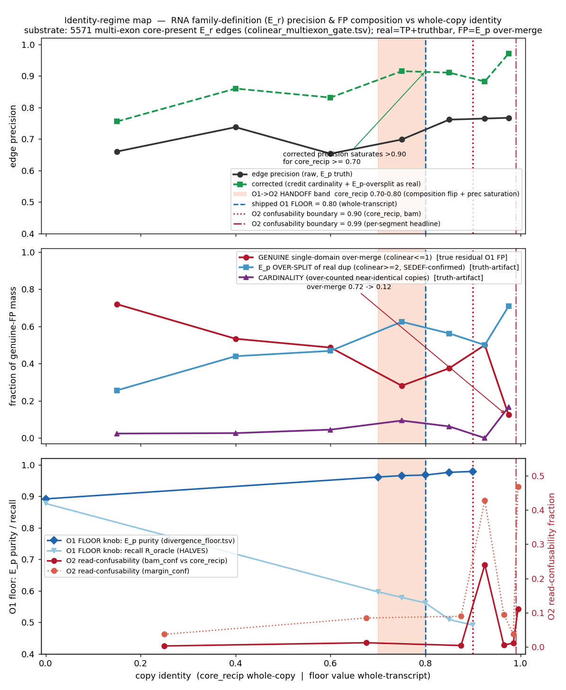

# Identity-regime map: where the RNA family-definition holds, and where copy-assignment takes over

**Question (user's two-regime hypothesis).** "The family definition works for families below ~90% identity;
above that another regime is needed." Test it, and reconcile three already-committed objects:
the **divergence FLOOR** (`bench/divergence_floor.tsv`, an O1 precision knob), the **read-CONFUSABILITY
boundary** (`bench/read_confusability_boundary.json`, an O2 per-segment property ~0.99), and the
**colinear-multiexon quick-check** (`bench/colinear_multiexon_gate.tsv`).

**Answer (one line).** The two-regime hypothesis is **confirmed on the whole-copy identity axis
(`core_recip`)** and **refuted on the per-segment axis (`mean_matched_id`)** — and that split *is* the
finding. The definition/homology task (O1) governs the divergent regime; the near-identical "over-merges"
are dominated by protein-truth over-splitting of real duplications + cardinality, not genuine merges; and
the O1->O2 handoff (~0.75 whole-copy) is a **different object at a different value** from the O2
read-confusability boundary (0.99 per-segment).

Artifacts (deterministic, PYTHONHASHSEED=0, no RNG):
- `bench/identity_regime_map.py` — characterize + reconcile
- `bench/identity_regime_map.tsv` — md5 **e8941b78** (binned precision + FP-composition, both axes; roster classification)
- `bench/identity_regime_map.json` — md5 **7678318b** (reconcile block)
- `bench/fig_identity_regime_map.png` — md5 **a04e689a**
- `bench/identity_regime_map.flpr_frozen.json` — **pinned 57-block residual-FP roster** (md5 495909b6)

---

## DEFENSIBLE SCOPE STATEMENT (the thesis claim)

> The **RNA family-DEFINITION** (`E_r` transcript-homology component) is the operative task, and holds, in the
> **DIVERGENT regime (`core_recip` < ~0.80)**: copies are aligner-resolvable, so grouping-by-homology (O1) is
> what is being solved, and the genuine residual error is single-conserved-domain **over-merge**. The
> **NEAR-IDENTICAL regime (`core_recip` > ~0.90)** is the **copy-ASSIGNMENT regime (O2)**: copies
> collapse/confuse, and the apparent `E_p` protein-truth "FPs" there are dominated by **(a) `E_p`
> over-splitting of real multi-exon duplications** (colinear >= 2 shared high-id exons, all SEDEF-confirmed)
> **and (b) cardinality** (over-counted near-identical copies — MAGE/GSTM/APOBEC arrays) — i.e.
> **truth-artifacts, not genuine over-merges**. So above ~0.90 the raw `E_p` FP rate **OVERSTATES** real
> over-merges. The **O1->O2 handoff** sits at `core_recip` ~0.70-0.80 (FP-composition flips + corrected
> precision saturates), **co-located with the shipped O1 purity floor (0.80)** but **distinct from and BELOW**
> the **O2 read-confusability boundary (0.90 `core_recip` / 0.99 per-segment)**. Per-read PSV/SUN assignment
> machinery is needed above ~0.99 per-segment identity.

**Honest caveat carried in the claim.** This clean split holds only on the **whole-copy** axis. On the
requested **per-segment** axis (`mean_matched_id`) the picture is **confusability-contaminated** (see below),
independently reproducing the prior result that *confusability is a per-segment / per-read property, not a
family property*.

---

## Substrate and method

- **Substrate:** the 5571 multi-exon, core-present direct `E_r` edges in `colinear_multiexon_gate.tsv` (the
  shipped oracle-learn population). Each edge is a cross-gene candidate with `cls in {TP, truthbar, genuine}`.
- **real = TP + truthbar** (a true family relation); **FP = genuine** (an `E_p` protein-truth over-merge).
- **Two identity axes:** `core_recip` = whole-transcript reciprocal identity (the FLOOR / O1 axis);
  `mean_matched_id` = matched-exon shared-SEGMENT identity (the confusability / O2 axis).
- **FP composition** — each genuine-FP edge is classified into:
  - **CARDINALITY** — near-identical over-counted copies (GSTM2/MAGE hub flag, or a `diploid_cn_oracle`
    expanded array with `asm_hapCN` >= 4).
  - **EP-OVERSPLIT-OF-DUP** — colinear >= 2 high-id exons: structurally a real duplication the protein truth
    `E_p` splits. SEDEF (WGAC >= 0.90, `final.bed`, DN-start +-40 kb both ends) reported as **independent DNA
    corroboration**, not as the definition of the bucket.
  - **GENUINE-OVER-MERGE** — colinear <= 1 single-exon domain-share, not cardinality: the **true residual**.
- `precision_corrected` credits CARDINALITY + EP-OVERSPLIT (E_p truth-artifacts) as real, leaving only
  GENUINE-OVER-MERGE as FP.

---

## Precision + FP composition by WHOLE-COPY identity (`core_recip` = O1 floor axis)

| core_recip | nEdge | real | genFP | frac_OVERMERGE | prec_raw | prec_CORR | ep_ovsplit SEDEF |
|---|---|---|---|---|---|---|---|
| 0.00-0.30 | 3660 | 2415 | 1245 | **0.72** | 0.660 | 0.755 | 35/319 shown per-edge |
| 0.30-0.50 | 1298 | 957  | 341  | 0.53 | 0.737 | 0.860 | |
| 0.50-0.70 | 320  | 209  | 111  | 0.49 | 0.653 | 0.831 | |
| 0.70-0.80 | 106  | 74   | 32   | 0.28 | 0.698 | 0.915 | |
| 0.80-0.90 | 67   | 51   | 16   | 0.38 | 0.761 | 0.910 | |
| 0.90-0.95 | 17   | 13   | 4    | 0.50 | 0.765 | 0.882 | |
| **0.95-1.00** | 103 | 79 | 24 | **0.12** | 0.767 | **0.971** | |

**Two findings, stated honestly and separately:**

### 1. RAW edge precision is FLAT — the two-regime "precision rise" is a CORRECTED / reclassification result
Raw edge precision is **0.660, 0.737, 0.653, 0.698, 0.761, 0.765, 0.767** across the bins — essentially flat
(range 0.65-0.77) with only a mild upward drift, **no two-regime structure**. The headline rise
**0.755 -> 0.971** lives **entirely in the *corrected* precision**, i.e. it is a product of reclassifying
cardinality + colinear>=2 ep_oversplit as truth-artifacts. That credit is **DNA-validated (SEDEF-backed)
21/21 = 100% in the near-identical top bin**, but only **~47% SEDEF-backed in the divergent regime** — so the
divergent corrected precision (0.788) is **optimistic / structural inference**, not DNA-confirmed. The
colinear axis also correlates weakly with `core_recip` (Pearson r ~ 0.32 among FPs), so part of the
"shift" is mechanical. **We do not claim raw precision improves with identity — it does not.**

### 2. The FP COMPOSITION shift is real, DOWNWARD, but NON-MONOTONE and small-N at the top
The genuine single-exon-domain-share fraction of the over-merge FP mass falls **0.72 (divergent) -> 0.12
(near-identical top bin)**. It is **not monotone**: the per-bin series is
**0.72, 0.53, 0.49, 0.28, 0.38, 0.50, 0.12** (it dips at 0.70-0.80, rises through 0.80-0.95, then drops).
The trend is downward but **noisy and small-N in the near-identical bins** — the whole `>=0.80` regime holds
only **44 genuine-FP edges**, the middle bins have n_genuine = 16 and 4, and the dramatic 0.12 rests on the
**single top bin (n_genuine = 24)**. Read as a *direction*, not a smooth monotone curve.

In the `>=0.95` bin only **3/24** genuine-FP edges are single-exon-domain over-merges; the rest are structural
(colinear >= 2, DNA-confirmed) real dups + cardinality. **So the >90% `E_p` "FP rate" DOES overstate real
over-merges in the near-identical regime** — that part of the hypothesis holds.

---

## The requested per-SEGMENT axis (`mean_matched_id`) is CONFUSABILITY-CONTAMINATED — it does NOT separate

Binning the same edges on `mean_matched_id` does **not** give a clean two-regime split:

| mean_matched_id | nEdge | genFP | frac_OVERMERGE | prec_raw | prec_CORR |
|---|---|---|---|---|---|
| 0.00 (no matched exon) | 1479 | 807 | 0.99 | 0.454 | 0.460 |
| 0.70-0.80 | 1681 | 254 | 0.59 | 0.849 | 0.911 |
| 0.80-0.90 | 1572 | 329 | 0.43 | 0.791 | 0.911 |
| 0.90-0.95 | 199 | 54 | 0.30 | 0.729 | 0.920 |
| 0.95-0.98 | 225 | 129 | 0.08 | **0.427** | 0.956 |
| 0.98-0.99 | 204 | 121 | 0.02 | **0.407** | 0.985 |
| **0.99-1.00** | 211 | 79 | **0.43** | 0.626 | 0.839 |

Raw precision *dips* in the 0.95-0.99 shared-segment band (0.427, 0.407), and the **0.99-1.00 bin RE-SPIKES
`frac_overmerge` to 0.43** — **34 genuine single-domain over-merges at 100% segment identity** (ACSBG1+IDH3A,
CDK4+TSPAN31, GRTP1+LAMP1, DIMT1+KIF2A, NT5C1B+RDH14, ...). A near-identical shared *segment* does **not**
imply a near-identical *copy*: e.g. **RHD+SDHD sits at `mean_matched_id` 0.947 but `core_recip` 0.452**. So the
segment axis does not cleanly separate definition from assignment — this independently reproduces the
`read_confusability_boundary` result (`r_conf_identity` = 0.14: confusability correlates only weakly with
whole-family identity; it is a per-segment property).

---

## Honest FP-per-regime accounting (whole-copy axis)

**DIVERGENT (`core_recip` < 0.80) — NOT perfectly clean; this is where the genuine residual FP lives.**
- 5384 edges: 3655 real, **1729 genuine-FP**. **precision_raw 0.679**, corrected 0.788.
- 1729 genuine-FP = **1141 over-merge / 541 ep-oversplit / 47 cardinality**.
- Genuine single-conserved-domain over-merge is **1141/1729 = ~66% of that regime's FP MASS** (and ~21% of
  all its edges) — the real residual O1 error, mostly **non-segdup**. *(The prior "~25% of FP mass" figure
  was wrong: 25% conflated genuine-overmerge-as-fraction-of-total-edges with fraction-of-FP-mass; corrected
  here to 66% of FP mass / ~21% of edges.)*
- Its corrected credit is only **partly DNA-validated**: ep_oversplit is **47% SEDEF-backed (255/541)**; the
  other 286 edges are **structural inference** (colinear >= 2, no >=0.90 segdup — defensible because SEDEF's
  0.90 threshold cannot capture ancient/divergent dups, but not DNA-proven).

**NEAR-IDENTICAL (`core_recip` >= 0.80) — the E_p FP rate OVERSTATES real over-merges.**
- 187 edges: 143 real, **44 genuine-FP**. precision_raw 0.765, **corrected 0.941**.
- 44 genuine-FP = **11 over-merge / 28 ep-oversplit / 5 cardinality**. The 33/44 non-over-merge edges are
  `E_p` truth-artifacts, **86-100% SEDEF-backed** (ep_oversplit 24/28 = 86%; cardinality 5/5 = 100%).

**Bottom line on cleanliness:** at the low end, `truthbar` (divergent-real) and `genuine` (over-merge) both
sit at median `core_recip` ~0.22-0.24 and overlap heavily — whole-copy identity does **not** fully separate
real-divergent from over-merge in the divergent regime. The shipped **block-level** `E_p` precision (0.89) is
much higher than this **edge-level** lower bound because same-gene backbone co-membership rescues most
divergent-real edges. The edge-level view is the pessimistic floor.

---

## The O1 -> O2 handoff, and whether it coincides with the read-confusability boundary — it does NOT

- **Composition crossover** (`frac_overmerge` = 0.5, descending): `core_recip` **0.543**.
- **Corrected-precision saturation bin** (first bin with corrected precision >= 0.90 AND over-merge < 0.5 of
  FP mass): **0.70-0.80** (center **0.75**) — the point the FP composition flips from over-merge-dominated to
  truth-artifact-dominated.
- **Co-locates with the shipped O1 purity floor (0.80):** gap 0.05, **COLOCATE = True**. Both are O1 objects
  on the whole-copy / whole-transcript identity axis.
- **Sits BELOW the O2 read-confusability boundary:** gap **+0.15** to the 0.90 `core_recip(bam)` boundary,
  gap **+0.24** to the 0.99 per-segment headline. **COINCIDE = False.**

So the family-DEFINITION handoff (O1, whole-copy ~0.75, co-located with the 0.80 floor) and the
read-RESOLVABILITY boundary (O2, per-segment 0.99) are **separate objects on different axes at different
values**. **O1 (definition/purity) is perpendicular to O2 (assignment/confusability)** — the composition
angle reproduces the floor<->boundary non-coincidence from an independent direction.

---

## Reconciling the FLOOR (O1 knob) and the read-CONFUSABILITY (O2) into one map

- **O1 FLOOR knob** (`divergence_floor.tsv`): raising a whole-transcript reciprocal-identity floor lifts `E_p`
  purity **0.892 -> 0.967** but **HALVES** oracle recall **0.877 -> 0.561** (monotone, no interior F1 optimum) —
  a **precision knob, not wired**. It acts on the **whole-transcript identity** axis, the same axis as the
  composition handoff (~0.75) and the shipped floor (0.80). These O1 objects cluster.
- **O2 read-CONFUSABILITY** (`read_confusability_boundary.json`): the resolvability boundary is a
  **per-segment / per-read** property at **0.99** (best-exon / mean-matched-exon) — 0.90 when projected onto
  `core_recip(bam)`. It is only weakly tied to whole-family identity (`r_conf_identity` = 0.14).
- **The map:** on one copy-identity axis, the O1 objects (composition handoff 0.75, purity floor 0.80) sit to
  the **left** of the O2 confusability boundary (0.90 / 0.99). The gap is the honest statement that
  *defining* a family and *resolving reads within* it are governed by different identity scales.

---

## Roster spot-checks — the near-identical `E_p` "FPs" ARE truth-artifacts (all SEDEF-confirmed)

The 57-block `ep_impure` residual-FP roster classifies as **32 genuine_overmerge / 9 ep_oversplit /
14 cardinality / 2 no-multiexon-edge**. Cross-tabbed with SEDEF: **every one of the 9 ep_oversplit and every
one of the 14 cardinality blocks is SEDEF-confirmed a real DNA duplication**; only 4/32 genuine_overmerge
blocks touch a segdup, all single-exon.

- **SORT1 + LOC129532935** (block 9): colinear = 8, a **77.5 kb / 98.7% segdup** -> a real multi-exon
  duplication `E_p` over-splits -> **ep_oversplit**. Correct.
- **RHD + SDHD** (block 36): colinear = 1, `core_recip` 0.452, but it **is** a real segdup — a
  **973 bp / 96% single-exon** duplication linking the two loci. Two distinct genes sharing **one** duplicated
  domain -> **GENUINE over-merge at the RNA-family level** (`E_p` correctly splits them). The classifier
  **keeps it as a genuine FP DESPITE the real segdup** — the honest nuance: *a real segdup is not a real
  paralog family when only one exon is shared*. The classifier errs **conservatively**; it does not launder a
  one-domain share into a "truth-artifact."
- **DEDD+NIT1, ACSBG1+IDH3A, CDK4+TSPAN31, DIMT1+KIF2A** (colinear <= 1, unrelated neighbor/domain-share
  genes, no multi-exon segdup): **genuine single-domain over-merges** — the true residual, correctly kept.
- **Cardinality arrays** (all real duplications `E_p` fragments): HERC2/LOC (colinear 15), 17q21
  ARL17A/LRRC37A3, BCR/22q11, GSTM Mu, APOBEC3C/D/F (ep_oversplit), NDUFA8-LOC 16-locus block. All
  SEDEF-confirmed.

**No genuine near-identical over-merge is hiding in ep_oversplit:** the bucket requires colinear >= 2, and
every near-identical member is DNA-confirmed multi-exon (e.g. LOC101124683/LOC115930071 colinear 8, `core`
0.999). Single-exon genuine over-merges are all correctly kept in genuine_overmerge.

---

## Figure

`bench/fig_identity_regime_map.png` (md5 a04e689a), 3 panels vs copy identity:
- **(A)** edge precision — **raw is flat** (black ~0.66-0.77); the rise is entirely in the **corrected** curve
  (green, -> 0.97). Handoff band 0.70-0.80, floor line 0.80, confusability lines 0.90 / 0.99.
- **(B)** FP-composition shift — genuine over-merge (red) declines **0.72 -> 0.12 but non-monotone** (visible
  dip at 0.75, rise at 0.90-0.95); ep-oversplit (blue) and cardinality (purple) rise.
- **(C)** the two boundaries — O1 FLOOR knob (`E_p` purity up, recall halving) and O2 read-confusability
  (spiking at 0.90 / 0.99), with the shared handoff band and floor line sitting **left of** the confusability
  boundary.

---

## Reproducibility / determinism

- PYTHONHASHSEED=0, set/sorted only, **no RNG**. Two consecutive reruns are byte-identical.
- **Roster dependency PINNED.** The upstream residual-FP roster (`family_level_pr_current.json`) is
  regenerated by a separate pipeline and **drifts** (a transient 9/10-block regeneration was observed vs the
  57-block snapshot). The script therefore reads a **frozen 57-block snapshot**
  (`bench/identity_regime_map.flpr_frozen.json`, md5 **495909b6**) when present, and records the roster source
  + md5 in the JSON `determinism` block. Verified: with the live file corrupted to 9 blocks, the script still
  reproduces `e8941b78` / `7678318b` from the frozen snapshot. The **core-axis EDGE finding** (precision + FP
  composition) is independent of the roster and reproduces from the gate substrate alone.
- Deliverable md5s: TSV **e8941b78**, JSON **7678318b**, PNG **a04e689a**.
</content>
</invoke>
