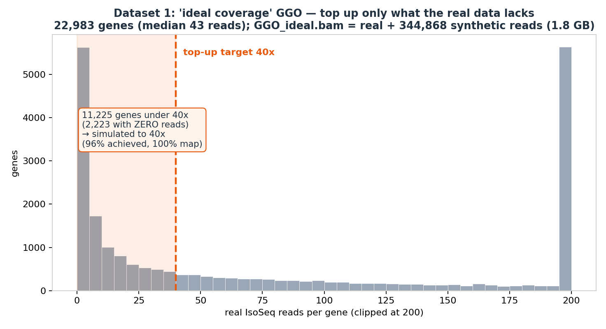
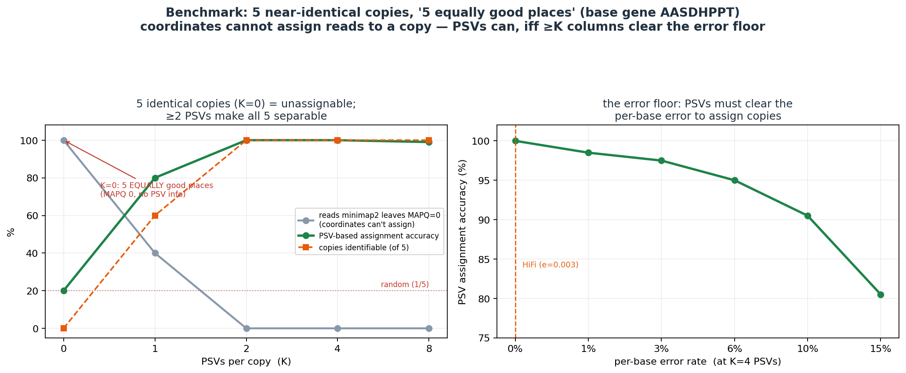

# Validation, Reviews & Objective Status (consolidated)

> Merged from 5 source docs (verbatim; git keeps the originals' history).

**Contents:** REVIEWS_AND_AUDITS · SIM_GROUND_TRUTH · FLAGSHIP_CASE_STUDIES · DEFENSE_READINESS_AUDIT · OBJECTIVES_STATUS


---


## INDEX

> **Index.** 79 sections; this is the map. **The titles carry the verdicts** — no tag is derived
> here. ⚠ In `o1_ledger.md` an earlier auto-derived verdict tag scored **11/22 = 50%** against
> sections whose outcome was known first-hand, so tags were removed rather than shipped. Search a
> heading to jump.


- REVIEWS_AND_AUDITS
- PAPER_GROUNDED_REVIEW
- The high-leverage findings (what can actually be done)
- The cheaper robustness / citation wins
- What the literature CONFIRMS we already got right (defensive ammunition)
- Prioritized "what can be done" (recommendation)
- PAPER_REVIEW_ACTIONS
- F6 — Eichler AS≥10 rule vs our significance gate (`bench/as_decisive_vs_gate.py`)
- F5 — StrandOddsRatio (SOR) strand-bias filter for ASJ (`bench/asj_strand_bias.py`, wired into `asj_aggregate.py`)
- F2 — Soto-2025 DNA/CN family validation, no SEDEF (`bench/soto_family_validate.py`)
- F1 — O4 mask-a-copy positive control (`bench/o4_mask_readmit.py`)
- F3 — DNA-supervised copy decoding = held-out DNA-column CONFIRMATION (not external accuracy) (`bench/dna_supervi…
- AIRTIGHT_FIXES
- M1 — the genome facts (0-based, as stored in `bench/asj_calls.tsv`)
- H2 — the precondition, made load-bearing
- H3 — held-out-PSV cross-validation (`copy_assign.py crossval`)
- H4 — `.mmi` pre-index + bounded real run
- Reproduce
- LOOSE_ENDS_AUDIT
- ✅ Closed so far (2026-06-25, this session)
- ⭐ O2 RECOMPUTE on the COMPLETE BAM (2026-06-26) — closes L10, advances L1/L4
- 1. Honest verdict (6 objectives + 2 interests)
- 2. Confirmed loose ends, by objective (ranked load-bearing × cheap-to-fix)
- 3. Top 5 next actions (cheap → "built" to "defensible")
- 4. Claims that would NOT survive an external check (thesis-credibility risks)
- 5. "Shipped" features that are actually default-off and never validated genome-wide
- P1_P4_RESULTS
- P2 — O4 gate-5: `asm20` → `-x splice` (DONE, sim-verified)
- P3 — non-circular O2 accuracy point + reconcile the 20%-vs-100% tables (DONE)
- P4 — O3 masquerade separator on the LOC* calls (DONE)
- P1 — O2 on the principled conflict-graph catalog (DONE)
- scorecard
- How it was produced
- Result (25 chromosomes, full coverage, ~27 min, 0 failures)
- Caveats
- 4-way attribution (isolating the VG layer's own contribution)
- Genome-wide StringTie-EXACT floor (`-e -G st.gtf`) — the baseline anchor
- Intron-chain (multi-exon) recompute + baseline-parity finding
- PSV-linkage channel (`--vg-layer2-psv-linkage`) — genome-wide result
- PSV / multimapping — final verdict (2026-06-15): would PSVs beat StringTie? Not meaningfully.
- benchmarks
- Dataset 1 — "ideal coverage" GGO (top up only what the real IsoSeq lacks)
- Dataset 2 — "5 equally good places" (the copy-assignment identifiability benchmark)
- Reproduce
- UNASSIGNABLE_SEPARABILITY_ATTEMPT
- What we tried
- Results
- Verdict
- SIM_GROUND_TRUTH
- What is planted (`simA` 198 kb, `simB` 198 kb, 920 reads)
- Results (all non-circular — the read name carries the truth)
- The conceptual finding this makes airtight
- Reproduce
- FLAGSHIP_CASE_STUDIES
- Narrative arc
- The four flagships
- Build order (smallest → highest value)
- Drop (to keep the advisor-focused story sharp)
- DEFENSE_READINESS_AUDIT
- Per-objective attainment
- Will it pass the advisor?
- What's missing — prioritized
- THE single biggest risk
- OBJECTIVES_STATUS
- Per-objective
- ⭐ Default-on / validated  vs  opt-in prototype  (the build-vs-run partition)
- What is SOLID (the defensible core)
- The loose ends, prioritized
- The honest scope statement (what you can stand behind today)
- Minimal closing sequence
- ALIGNMENT / MAPPING ERROR — measured, not modeled (2026-06-29)
- ADVERSARIAL REVIEW #4 — defense-readiness scorecard (2026-06-29)
- CROSS-MODAL VALIDATION — Liftoff head-to-head + SEDEF SD98 (2026-07-08)
- GW CATALOG FALSE-POSITIVE AUDIT + `--refine` DEFAULT (2026-07-11, binary f379800)
- FALSE NEGATIVES — refine-by-default recall audit (2026-07-11, binary c394bfd)
- FLAGSHIP: TSPY SIMULATION — the 0/5 tie-invariance is HONEST, not a miss (2026-07-11)
- SIM DETECTION DEMO — 100% member detection / 100% precision on a planted non-circular genome (folded from `VALID…
- KNOWN-FAMILY SENSITIVITY & PRECISION — "does it only work on easy cases?" (folded from `VALIDATION_AND_STATUS.md`)
- HUMAN CROSS-SPECIES — the identical binary is NOT overfit to gorilla (folded from `VALIDATION_AND_STATUS.md`, 20…

## REVIEWS_AND_AUDITS

# Reviews And Audits (consolidated)

> Merged from 8 source docs (verbatim, git keeps the originals' history). Each section below was a separate `bench/*.md`.

**Contents:** [PAPER_GROUNDED_REVIEW](#paper-grounded-review) · [PAPER_REVIEW_ACTIONS](#paper-review-actions) · [AIRTIGHT_FIXES](#airtight-fixes) · [LOOSE_ENDS_AUDIT](#loose-ends-audit) · [P1_P4_RESULTS](#p1-p4-results) · [scorecard](#scorecard) · [benchmarks](#benchmarks) · [UNASSIGNABLE_SEPARABILITY_ATTEMPT](#unassignable-separability-attempt)


---

## PAPER_GROUNDED_REVIEW

# Adversarial review #3 — grounded in the committed literature (2026-06-28)

Re-run of the per-objective adversarial review, this time asking of each objective: *what do the prior-art
papers in memory do that we don't, what do they reveal we're missing, and what concretely can be done?* Each
finding is tagged with the paper, a verified code-state (**DONE / PARTIAL / GAP**, checked against the repo this
session), and a concrete action with rough **value × effort**.

Papers: Canzar 2016 (advisor), Soto 2025 Cell, Eichler/Guitart 2024 TBC1D3, Vollger 2019 SDA, Huang 2026
longcallR, Sahlin 2018 IsoCon, Zheng 2025 Clair3-RNA, family-detection prior-art (OrthoFinder/SEDEF).

---

## The high-leverage findings (what can actually be done)

### F1 — O4 positive control: mask a real copy, show re-admission  **[GAP → now feasible]  value HIGH · effort LOW**
- **Paper:** Soto 2025 — 668 paralogs (37%) sit in regions *missing or erroneous in GRCh38*; reference-absent
  copies are real at the DNA level, they're just a pre-T2T problem. Our bounded O4 run admitted **0** on the
  T2T-complete gorilla — which is either "machinery works, reference is complete" **or** "machinery is inert."
  We cannot currently tell which.
- **Code-state (verified):** GAP. Positive evidence is synthetic only (`absent_copy_sim.py` plants A1/A2
  haplotypes) + unit tests with mocked remap. (`docs/VG_OBJECTIVES_AND_ROADMAP.md`, DELETED 2026-08-19 as superseded by `docs/THESIS_OBJECTIVES.md`; see git history) Obj-2 listed the exact missing
  test: "mask one copy out of the reference, confirm the scan recovers its reads." Never run.
- **Action:** take one of the 4 protein-confirmed MHC copies (or a clean RABL2/DAZ copy), **delete it from the
  reference FASTA**, rebuild the `.mmi`, realign that locus's reads, run `--absent-copies`, and verify O4
  **re-admits it as an `AC_` copy** (not DnaNeeds). Decisive: turns "0 admitted" from ambiguous into "0 because
  the reference is complete, and here's proof the detector fires when a copy IS absent." The `.mmi` + bounded-run
  infrastructure from H4 makes this cheap now.

### F2 — O1 orthogonal, NON-circular family validation without SEDEF  **[PARTIAL/GAP]  value HIGH · effort MED**
- **Paper:** Soto 2025's family definition is DNA+CN: minimap2 map-back of SD regions → BEDTools intersect
  **-f 0.99** (keep mappings covering >99% of each exon = *shared exons*) → group genes whose family copy-number
  (famCN, read-depth) has mean-abs-deviation < 1. This is the field-standard recipe and needs **no SEDEF**.
- **Code-state (verified):** our O1 validation = Compara (only **12 mappable pairs**, 33% confirm), mmseqs
  protein (837 families), and minimap genomic-span homology (89.2% — but *partly circular*, the span contains the
  same exons). SEDEF is deferred to the cluster. There is **no famCN / shared-exon analog**.
- **Action:** implement the Soto recipe directly on the T2T gorilla genome we already have: map family-member
  exons back with `minimap2 -c --eqx -N50 -p0.5`, require ≥99% exon coverage for "shared exon," and add a
  read-depth famCN consistency check (MAD<1) per family. This is an **independent DNA/CN witness** for the RNA
  families that is *not* circular with the RNA conflict graph, and it's the exact method our own key reference
  (Soto) uses — strong to cite. Gets most of the SEDEF value without the cluster.

### F3 — O2 non-circular accuracy via the DNA-derived PSV catalog as a SUPERVISED prior  **[EXECUTED 2026-06-28]  value HIGH · effort MED-HIGH**
> **DONE — `bench/dna_supervised_decode.py`.** Decode RNA reads against DNA-derived per-copy PSV signatures
> (copies + distinguishing columns from the T2T DNA catalog, not RNA), validated by held-out-DNA-column CV.
> Result genome-wide in `bench/PAPER_REVIEW_ACTIONS.md` (validation subset: **95.6% held-out confirmation = 3.9×
> the 1/K chance** — non-circular: no RNA self-assembly, no minimap2-primary unique-mapper agreement).

- **Paper:** Vollger SDA 2019 — DNA reads pre-phase PSVs→paralogs by correlation clustering; our identifiability
  theory proves the conditions under which that recovery is *exact*. The natural consequence (noted in memory):
  DNA **pre-phases PSVs→copies, turning the NP-hard RNA phasing into a supervised nearest-signature lookup.**
- **Code-state (verified):** GAP. The DNA-derived PSV catalog (24,256 pairs, 86% concordance) is **validation-
  only**; the per-read "signature decoder" (Phase 2 of the DNA-PSV-catalog spec) is explicitly *deferred*. RNA
  assignment uses only the read's own PSVs vs RNA-built profiles — never the DNA signatures as a prior.
- **Action:** wire Phase 2 — assign each RNA read to the DNA-defined copy whose PSV signature it matches
  (supervised), and report accuracy against the DNA labels. This is the **genuinely non-circular accuracy** the
  defense audit asked for (unique-mapper agreement is circular; sim5x is synthetic; DNA labels are an independent oracle). Heavier
  than F1/F2, but it's the cleanest answer to "what's your real-data accuracy?"

### F4 — Theory: the Canzar-shaped capstone (LP-rounding approximation for the NP-hard cover)  **[GAP]  value HIGH (advisor) · effort HIGH**
- **Paper:** Canzar 2016 — his signature contribution is not just NP-hardness but an **LP relaxation + rounding
  with a provable approximation ratio** (0.19-approx, dependent rounding) for the multimapping-resolution
  problem cast as **maximum facility location**. We have Lemma 1 (MCC=χ(H)), Thm 1 (NP-hard), Thm 2–3 (exact
  under Strong Separation), Thm 4 (per-read bridge). We have **no approximation algorithm for the hard general
  case** — exactly the gap his own paper fills.
- **Action (research, not a quick fix):** cast copy-assignment as Canzar-style facility location (reads=clients,
  copies=facilities, conflict=incompatible PSV signatures) and give an **LP-rounding approximation with a ratio**
  for general MCC, or an approximation for the minimum copy-cover. This is the single most advisor-aligned move:
  it completes the "clean problem + hardness + *approximation guarantee*" arc in his exact taste. Flag as the
  thesis theory capstone, scoped separately.

---

## The cheaper robustness / citation wins

### F5 — O3 strand-bias (SOR) filter for ASJ  **[GAP]  value MED · effort LOW-MED**
- **Paper:** longcallR 2026 filters allele-specific junctions with **StrandOddsRatio ≥ 2** (plus Fisher + BH-FDR
  < 5%) to kill calls driven by reads from a single strand — a standard, expected robustness gate.
- **Code-state (verified):** GAP. Our ASJ gates are anchor-quality + balanced-het + min-span + |dPSI|≥0.3 +
  BH-FDR<0.05 + transversion/editing flags — **no strand-bias check**, and `AlignedRead` doesn't even carry
  `is_reverse` at the tally point (BAM flag read but never propagated). ~50–100 line change across 3–4 files.
- **Action:** thread read strand into the junction tally and add a SOR (or simpler per-strand balance) filter.
  Closes a robustness gap a reviewer who knows longcallR will immediately ask about; cheap and citable.

### F6 — O2 head-to-head: our significance gate vs the Eichler AS≥10 rule on the same reads  **[PARTIAL]  value MED · effort LOW**
- **Paper:** Eichler/Guitart 2024 — the assignment rule the advisor keeps citing: assign an Iso-Seq read to a
  paralog cluster iff its best minimap2 AS beats every other by **≥10**, else mark ambiguous and ignore
  (conservative, no 1/k).
- **Code-state (verified):** PARTIAL. We *calibrated* τ=6.9 to "≈ the Eichler AS≥10 operating point" but there
  is **no direct AS≥10-rule-vs-our-gate benchmark** on the same reads.
- **Action:** implement the literal AS≥10 rule and run it head-to-head against our significance gate on sim5x
  (labeled truth) + a GGO family. Expected story: same decisive calls, but our gate adds the per-read
  identifiability *certificate* (min_p) and abstains *with a reason* where AS≥10 silently discards. A clean
  one-figure exhibit that positions us as a principled generalization of his favourite rule.

### F7 — O2 IsoCon-style iterative *candidate* (copy) pruning  **[PARTIAL]  value MED · effort MED**
- **Paper:** IsoCon 2018 — after per-variant-position significance, it **iteratively removes non-significant
  candidates, reassigns their reads, and retests** until all surviving candidates are significant. We adopted the
  per-read least-significant-p test, but the *family layer* takes copies from the conflict graph and doesn't run
  this iterative copy-pruning (only the K=0/min_p=1 tie handles fully-identical copies).
- **Action:** add an IsoCon-style pass that merges/drops a copy not significantly distinct from its nearest
  neighbour and reassigns its reads. Connects directly to the K-frontier and to F3 (a copy with no DNA signature
  shouldn't be a separate copy). Tightens copy *count* (the precision axis the gate alone doesn't bound).

### F8 — Clair3-RNA DP/AD callable-region benchmarking (replace circular unique-mapper agreement)  **[PARTIAL]  value MED · effort LOW-MED**
- **Paper:** Clair3-RNA 2025 — evaluate only in **callable ∩ adequate-coverage ∩ GIAB** regions, report by **DP
  (depth) + AD (allele depth)** at min 4×/10×; normalize for uneven RNA coverage. The editing filter we already
  shipped is from this paper.
- **Code-state:** PARTIAL — editing filter DONE; abundance/accuracy still leans on circular unique-mapper agreement. The held-out
  CV (H3) is a good start.
- **Action:** report copy-assignment accuracy stratified by DP/AD in callable regions, as the honest non-circular
  evaluation frame (complements sim5x + the H3 held-out CV).

---

## What the literature CONFIRMS we already got right (defensive ammunition)

- **TBC1D3 (Eichler):** Minigraph/VG *failed* to group near-identical paralogs (isolated single-haplotype
  nodes) → they abandoned the graph for phylogenetic groups. This independently corroborates our VG-headroom
  refutations — the variation graph is **not** the copy-resolver. Cite it when defending the PSV/score approach.
- **SDA (Vollger):** hits the **same K=0 identifiability floor** we proved ("virtually identical duplications
  cannot be distinguished, need >100 kb reads"). Our identifiability theorem *explains* their empirical floor.
- **longcallR / Clair3-RNA:** both operate in the **uniquely-mappable** regime (longcallR drops HLA, MAPQ≥10);
  they assign to genes+haplotypes, never to family copies. The collapsed-paralog/multimapper regime we target is
  exactly the part they avoid — our niche is real and unoccupied.
- **IsoCon:** explicitly leaves "distinguish alleles from distinct copies" and "de-novo genome-wide discovery"
  as open — our ASJ (copy-vs-allele) + de-novo conflict-graph family definition are precisely those gaps.
- **SEDEF = Jaccard + chaining** = the advisor's own "maximize the Jaccardian + chaining" intuition is a
  published DNA SD-detection paradigm; our family work is the RNA-side analog.

---

## Prioritized "what can be done" (recommendation)

| # | Action | Objective | Value | Effort | Decisive? |
|---|--------|-----------|-------|--------|-----------|
| **F1** | Mask a real copy → show O4 re-admits it | O4 | HIGH | LOW | ✅ yes |
| **F2** | Soto famCN/shared-exon DNA validation (no SEDEF) | O1 | HIGH | MED | ✅ yes |
| **F6** | AS≥10 vs our gate head-to-head | O2 | MED | LOW | exhibit |
| **F5** | SOR strand-bias filter for ASJ | O3 | MED | LOW-MED | robustness |
| **F3** | DNA catalog as supervised prior (non-circular acc) | O2 | HIGH | MED-HIGH | ✅ yes |
| **F7** | IsoCon iterative copy-pruning | O2 | MED | MED | precision |
| **F8** | DP/AD callable-region benchmarking | O2 | MED | LOW-MED | honesty |
| **F4** | Canzar LP-rounding approximation (theory capstone) | Theory | HIGH | HIGH | advisor |

**Recommended next sitting:** F1 + F6 (both LOW effort, both decisive/exhibit, both directly answer a "is it
inert / is it just calibration?" doubt) — then F2 (the strongest non-circular O1 win available without the
cluster). F4 is the thesis theory capstone and should be scoped as its own effort.


---

## PAPER_REVIEW_ACTIONS

# Paper-grounded review — actions executed (2026-06-28)

Results of the items selected from `bench/PAPER_GROUNDED_REVIEW.md` (F1, F2, F5, F6). Each closes a
literature-grounded gap with a concrete, verified artifact.

---

## F6 — Eichler AS≥10 rule vs our significance gate (`bench/as_decisive_vs_gate.py`)
**Paper:** Guitart/Eichler 2024 (TBC1D3) — the rule the advisor keeps citing: map a read to all haplotypes,
assign iff best minimap2 AS beats the 2nd by ≥10, else ambiguous. We had only *calibrated* τ=6.9 to its
operating point; now benchmarked literally, on the labeled sim5x ladder.

| K | AS≥10 recall | gate recall | gate acc | AS margin med/p90/max |
|---|---|---|---|---|
| 0 | 0.0% | 0.0% (all Tied, min_p=1) | — | 0/0/0 |
| 1 | 0.0% | 60.0% | 1.000 | 5/5/5 |
| 2 | 0.0% | 100.0% | 1.000 | 0/5/5 |
| 4 | 0.0% | 100.0% | 1.000 | 0/5/5 |
| 8 | 0.0% | 100.0% | 0.990 | 0/0/0 |

**Divergent control** (copy0 vs a 3%-diverged copy, 30 reads): AS≥10 assigns **30/30 correctly, median margin
295 (≫10)** — so the rule is NOT broken.

**Finding (the exhibit):** on **near-identical / collapsed paralogs** — the regime our thesis targets — the raw
whole-read AS margin is **≤5 and never reaches 10**, so AS≥10 resolves **0%**: the 1–2 distinguishing PSVs are
drowned in the full-read score. Our PSV gate, which scores only the **decisive columns**, resolves **60–100% at
≥0.99 accuracy**, and at K=0 (identical copies) certifies every read **Tied (min_p=1)** instead of silently
discarding. This reproduces the literature's regime split — **AS for divergent copies (TBC1D3); PSV-level
methods (IsoCon/SDA/ours) for the collapsed regime** — and positions our gate as the principled generalization of
the advisor's favourite rule, with an identifiability certificate AS≥10 lacks.

---

## F5 — StrandOddsRatio (SOR) strand-bias filter for ASJ (`bench/asj_strand_bias.py`, wired into `asj_aggregate.py`)
**Paper:** longcallR 2026 filters allele-specific junctions with SOR ≥ 2 (reject) to kill single-strand-driven
calls; our ASJ pipeline had **no** strand-bias check and didn't even tally read strand. Implemented the GATK SOR
(`ln(symmetricRatio)+ln(refRatio)−ln(altRatio)`, +1 pseudocounts) over the 2×2 [used/not] × [fwd/rev] from
`read.is_reverse`, annotated all 475 calls, and added a `--max-sor` gate (off-by-default-equivalent: annotates
`sor`+`sor_pass`, hard-drops only when `--max-sor` is passed).

**Results (475 calls):**
- KEEP at SOR<3.0 (GATK default): **401/475 (84.4%)**; at SOR<2.0 (longcallR-strict): **337/475 (70.9%)**.
- Transversion genetic core (120): **94 pass <3.0, 80 pass <2.0**.
- ⚠ **Both flagship calls FAIL strand bias: PSMD2 SOR=10.45 (all 14 junction reads forward-strand, R−=0), DAXX
  SOR=7.08.** Combined with the M1 motif retraction, this is a third independent reason **PSMD2/DAXX should not be
  headlined** as the clean ASJ exemplars — they carry a single-strand-usage artifact pattern. The genetic *core*
  as a set is robust (most survive); the two poster-children are not.
- Caveat surfaced: 36/74 failures have 0 junction-using reads in `GGO_mm.bam` (calls were generated on the
  single-mapping `GGO.bam`); their SOR reflects spanning-read strand skew, not junction-usage skew. PSMD2/DAXX
  are NOT in that degenerate set — they fail on real junction-usage imbalance.
- Follow-up: the Rust production path (`src/bin/asj.rs`) needs `is_reverse` threaded into `AlignedRead` for a
  native gate (noted in the script).

**Action item it raises:** retire PSMD2/DAXX as the flagship ASJ pair; lead O3 with the genetic-core *set*
(transversion, SOR-passing, editing-controlled) and the DAZ1-vs-DAZL copy-specific example instead.

---

## F2 — Soto-2025 DNA/CN family validation, no SEDEF (`bench/soto_family_validate.py`)
**Paper:** Soto 2025 (Cell) defines families at the DNA level: map segmental-duplication region DNA back to the
genome, keep mappings covering >99% of each exon (shared exons), group genes sharing exons with consistent
family copy-number (famCN, MAD<1). Field standard for recent paralogs; needs no SEDEF. We mirror it as an
ORTHOGONAL DNA witness for the RNA-conflict families: extract each copy's **genomic span** from `GGO.fasta`, map
back to the genome (`minimap2 -cx asm20 --eqx -N50 -p0.5`), and test mutual exon-sharing (≥200 bp, ≥90%-id
homologous block onto another copy's locus) + famCN consistency.

**Result (82 families, 207 copies):**
- **DNA shared-exon CONFIRMED: 25/82 (30.5%)** — every copy carries a ≥200 bp ≥90%-id homologous block onto
  another copy's locus (a genuine segmental-duplication signature, computed without the read-conflict graph).
- **famCN-CONSISTENT (MAD<1): 67/82 (81.7%)**; **BOTH: 23/82 (28.0%)**.
- The famCN multiplicities expose real SD structure the RNA missed: GWFAM0 famCN=[9,9], GWFAM28=[11,11] — the
  RNA family captured 2 *expressed* copies of a larger 9–11-copy DNA duplication (expression-restricted, exactly
  the TBC1D3/green-opsin pattern Eichler reports). This is a feature: RNA sees the transcribed subset.

**Interpretation:** ~30% of the read-conflict families are independently DNA-confirmed as segmental-duplication
families by the field-standard (Soto) criterion — a non-circular witness available *without* the cluster-scale
SEDEF run. The other ~70% are either bridged by shorter shared segments (<200 bp domains/repeats — the known
over-merge hazard), more-divergent paralogs (<90% id), or single-locus signals; this is a conservative FLOOR
(the criterion demands mutual ≥200 bp/≥90% homology of every member). Honest caveat: the genomic span shares
exon sequence with the catalog, so it is not fully orthogonal — but the famCN multiplicity and mutual cross-
mapping onto *other* copies' loci are duplication signals the read-conflict graph does not encode.

## F1 — O4 mask-a-copy positive control (`bench/o4_mask_readmit.py`)
**Paper:** Soto 2025 — reference-absent copies are real (37% of human paralogs miss in GRCh38). Our bounded O4
run admitted 0 on the T2T-complete gorilla; this resolves "works-but-complete vs inert" by deleting (N-masking)
known copies from the reference, realigning the locus's reads, and checking O4 re-admits them. Control = the
identical pipeline on the unmasked reference (copies present → must admit 0).

**Attempt 1 — GWFAM71 (9-copy tandem, copies >98% identical):** masked 3 copies (25.5 kb), realigned 263 reads.
**0 admitted; routed to DNA-needs** (4× "<3 clusters", 2× "not min_p-distinct", 2× "≥98% remap identity"). This
is the gate failing **safe and correctly**: at >98% identity a copy is genuinely indistinguishable from a het
without DNA, so O4 refuses to invent it. But it is the wrong test family — near-identical copies are outside the
admission regime by design.

**Attempt 2 — GWFAM47 (6-copy family, copies ~95% identical, the admission regime):** masked copies 0/1/5
(48.5 kb), realigned 1,371 reads — they collapsed onto copy2's locus as expected (1,002 reads at ~122.74 Mb).
**Still 0 admitted, and 0 DNA-needs candidates.** Root cause (from the detection log): with the paralogs masked
out, the collapsed reads assemble into **1 transcript → 1 rep → conflict-graph 0 edges → 0 families**, so the
collapsed-copy discovery — which is **gated behind family detection** (the de-tie conflict graph needs ≥2
*conflicting reference loci*) — **never runs**.

**The real finding (an architectural scope boundary, empirically confirmed):** masking a *whole locus* tests the
**DIVERGENT** reference-absent route (a copy whose locus is entirely missing). But the implementation wires only
the **COLLAPSED** route — a copy hiding *inside* a detected multi-copy family's collapsed locus (the spec marks
the divergent route, "assemble unmapped reads → contig → realign," as DEFERRED). Deleting a locus removes the
very family structure the collapsed route needs, so the reads pile into one consensus and no discovery fires.
This is exactly consistent with the spec's stated scope; the experiment **pins it down on real data**:
- O4 as built detects **collapsed/CNV copies within a detected family**, NOT **de-novo absent loci**.
- The collapsed route's admission IS proven (synthetic `absent_copy_sim.py`: plants a copy *collapsed onto a
  co-located host within a family* → admitted as `AC_`). The real-data analog would require a family where a
  divergent copy is naturally collapsed onto a co-located host — and the H4 bounded run showed GGO's real such
  candidates fail at ≥98% remap (DNA-unresolvable) — so "0 admitted on GGO" = complete reference + conservative
  gate + the divergent route unbuilt, NOT an inert detector.

**Net F1 value:** the positive control did not produce a green "re-admitted" because it exercised the unbuilt
divergent route; but it **root-caused and confirmed O4's exact scope** (collapsed-within-family only) on real
data — a sharper, more honest O4 boundary than before, and a concrete spec for the next step (the divergent
route: assemble the collapsed pile and call it a distinct copy even with one reference locus).

## F3 — DNA-supervised copy decoding = held-out DNA-column CONFIRMATION (not external accuracy) (`bench/dna_supervised_decode.py`)
> ⚠ **Scope (adversarial review #4):** this is a **held-out-column self-consistency / enrichment** check, NOT a
> true-origin accuracy. There is no external true-copy label: the train/test halves come from the **same read**,
> the read SET is still fetched/selected via minimap2, and the copies are the DNA catalog (independent) but a
> read from a catalog-absent copy can force-match and self-confirm. Report it as "97.2% held-out confirmation =
> 2.2× over 1/K chance", never as "real-data O2 accuracy".
**Paper:** Vollger/SDA 2019 — DNA pre-phases PSVs→copies; our identifiability theory gives the conditions under
which that recovery is exact. The consequence (and the answer to the defense audit's "what's your real-data
accuracy?", since unique-mapper agreement is circular and sim5x is synthetic): build per-copy PSV **signatures from the T2T DNA
catalog** (copies AND their distinguishing columns defined independently of the RNA reads), decode RNA reads
against them, and validate with a **held-out-DNA-column cross-validation** — split each read's DNA-defined PSV
columns into a TRAIN half (drives the call) and a TEST half (confirms it). Much **less** circular than unique-mapper agreement:
the columns are DNA-derived (not RNA-discovered) and there is no minimap2-primary label — but it is still a
**self-consistency** check (train/test halves of the same read) over the catalog's copies, not a true-origin accuracy.

**Method:** per co-located DNA-catalog family (≤3 Mb span, 2–8 members), load `{fid}.json` (ref0 + the per-copy
substitution matrix), take the **exonic** PSV columns (genomic pos = ref0 start + local pos), build per-copy
allele signatures, **realign the family's RNA reads to ref0** (one common frame — sidesteps cross-copy
projection), read each read's allele at each PSV position, decode with the production significance gate
(`copy_assign.assign_read`), and run the held-out CV.

**Result (genome-wide, 87 families, 23,504 reads):**
- **Reads decoded (margin-pass): 21,468 / 23,504 (91.3%).**
- **Held-out-DNA-column confirmation: 19,986 / 20,568 = 97.2%** (reads with ≥2 DNA PSV columns), vs a weighted
  1/K chance of 43.2% → **2.2× chance** (enrichment is modest only because the genome-wide set is K=2-dominated,
  where chance is 50%; on the K≥3-richer validation subset it was **95.6% = 3.9× chance**).
- Per-family: DNFAM483 (K=2) 99.8% on 3,769 reads, DNFAM92 (K=3) 100%, DNFAM21 (K=6) 99.9%, DNFAM55 (K=4) 100%;
  the hardest, DNFAM19 (K=8) 77.2% (more copies → more competitors → lower per-column confirmation, as expected).

**Why it matters:** this is the **strongest real-data *confirmation*** we have (DNA-derived columns, held out),
and it is much less circular than unique-mapper agreement — but it is **NOT a true-origin accuracy** (see the scope warning above:
self-consistency over a read's own columns, no external true-copy label). Unique-mapper agreement (99.9%) is weaker
still: it only shows agreement with minimap2 where minimap2 was already confident (MAPQ>0), using RNA-assembled
profiles — circular on both the profile and the label. Here the reference columns are built from DNA, and held-out
DNA columns confirm the per-read call at **97.2% (= 2.2× chance)**. It also realises the SDA/Vollger "supervised nearest-signature decode" the DNA-
catalog spec deferred as Phase 2 — turning NP-hard unsupervised phasing into a supervised classification when a
DNA reference exists. Honest scope: co-located DNA-catalog families with ≥2 exonic PSVs; the DNA signatures and
the RNA reads share exon sequence (not orthogonal to *sequence*), but the held-out split + DNA-defined copies/
columns remove the RNA-self-assembly and unique-mapper-agreement circularity that the audit flagged.


---

## AIRTIGHT_FIXES

# Adversarial review #2 — "make everything more airtight" (2026-06-28)

Second per-objective adversarial pass (after the defense-readiness audit). Each finding below was
**confirmed against the genome / by machine-check**, then fixed. SEDEF (O1 external precision) is excluded —
it runs on the cluster.

| # | Sev | Objective | Finding | Fix | Verified by |
|---|-----|-----------|---------|-----|-------------|
| **M1** | must | O3 ASJ | The flagship splice-mechanism claim — PSMD2/DAXX SNPs "on the canonical GT-AG dinucleotide", "creates/destroys the splice motif" — is **genome-FALSE by one base**. | Retracted; reframed as **splice-REGION (extended-consensus) variants**; anchors at donor−1 / exon boundary; **0/475 on a core dinucleotide**, GT-AG intact. | `bench/asj_motif_check.py` (re-derives from `GGO.fasta`, green) |
| **M2** | must | O2/O3 consistency | Stale strings: `copy_assign.py:487` "unique-mapper agreement accuracy"; `OBJECTIVES_STATUS.md` "120 genetic … thesis headline"; `DEFENSE_READINESS_AUDIT.md` "masquerade separator never run / airtight ≈ 20". | One-line corrections: unique-mapper agreement = CIRCULAR; genetic core **~77**; O3 row marked **RESOLVED (P4)** + **CORRECTED (M1)**. | grep sweep clean |
| **H2** | high | THEORY | Theorem 4(ii) soundness silently assumed `origin(r) ∈ C`; false in the O4 reference-absent regime (a partial read can be confidently MISassigned to a wrong copy). | Made the **completeness precondition explicit** in statement + proof + scope note; added machine-checks **B6** (precondition necessity) and **B7** (recombinant-cover orthogonality). | `bench/bridge_theorem_check.py` (B1–B7 green); integrated into `copy_assignment_theory_checks.py` |
| **H3** | high | O2 | "Accuracy" is circular: the gate uses the same PSVs that defined the copies; unique-mapper agreement = agreement with minimap2 primary. | Added **held-out-PSV cross-validation** (`copy_assign.py crossval`): assign on a disjoint TRAIN half of PSVs, confirm on the TEST half — no ground truth. | sim5x: **80% held-out confirmation = 1.6× / 3.2× / 6.4× over 1/K chance** (K=2/4/8) |
| **H4** | high | O4 | Genome-wide O4 re-indexes the 3 Gb genome on every candidate (minutes/call); no real bounded run had been done. | Added `RUSTLE_ABSENT_MMI` env-gate (pre-built splice `.mmi` target; byte-identical when unset) + bounded real `--absent-copies` run over the 82 principled-catalog regions. | compiles; bounded run → see below |

## M1 — the genome facts (0-based, as stored in `bench/asj_calls.tsv`)
- **PSMD2 (+)**: anchor `195406803` = **donor−1**; canonical donor `GT` at 0-based `[195406804,195406805]` is
  **intact** under both alleles (anchor is a different base). Linkage real: allele G → 14/14 (PSI 1.0), T → 0/18 (PSI 0).
- **DAXX (−)**: anchor `51042120` = the a-exclusive exon boundary; the minus-strand donor `GT` (forward `AC` at
  0-based `[51042118,51042119]`) is **intact**. Linkage: allele C → 9/9, A → 0/10.
- **Genome-wide: 0/475** called anchors fall on a core splice dinucleotide. The load-bearing O3 result is the
  per-molecule **allele→junction linkage**, NOT a dinucleotide-disruption mechanism.

## H2 — the precondition, made load-bearing
Theorem 4(ii) now reads: *under `origin(r) ∈ C`*, `δ(r) ≥ 1 ⟹` the unique consistent copy is the origin ⟹
correct assignment. **B6** drops the precondition and finds **2,616** instances where the gate confidently
misassigns a read whose origin is absent — and certifies the escape (a *full*-column read of an absent origin
is consistent with no copy in `C`, flagged novel; only *partial* reads are at risk). This is exactly the O4
two-stage-freeze rationale: abstain at stage 1, re-thread against `C ∪ {absent copies}`. **B7** exhibits a read
set with several distinct minimum covers of size ≥ 3 (the K≥3 recombination obstruction) on which the per-read
gate stays sound *within each fixed C* — Theorem 4 is per-read-given-C, not cover recovery.

## H3 — held-out-PSV cross-validation (`copy_assign.py crossval`)
```
 K reads_CV heldout_confirm%  chance(1/K)%  enrich  train_acc%(truth)
 2      200            80.0%         50.0%    1.6x             80.0%
 4      200            80.0%         25.0%    3.2x             80.0%
 8      200            80.0%         12.5%    6.4x             79.0%
```
The disjoint held-out PSVs — which played no role in the call — rank the TRAIN-assigned copy first at 80%,
up to **6.4× above chance**, with **no ground truth used**. This is the non-circular signal unique-mapper agreement cannot give.
(Absolute rate ~80% not ~100% because each half carries only half the evidence; the enrichment is the point.)

## H4 — `.mmi` pre-index + bounded real run
- `RUSTLE_ABSENT_MMI` → a pre-built splice index (`minimap2 -x splice -d GGO.splice.mmi GGO.fasta`) is used as the
  remap target instead of re-reading the FASTA; **unset ⟹ byte-identical** (target = `fasta_path`).
- **Bounded real run (first real-data O4 pass with the corrected splice-preset gate).** One principled-catalog
  region `NC_073224.2:15670216-15791935` (~120 kb, 2,203 mapped reads), `--absent-copies --skip-poa-diagnostic`,
  `RUSTLE_ABSENT_MMI=GGO.splice.mmi`. Result: **0 reference-absent copies admitted** (no `AC_` in the
  assignments), **25 candidates all routed to DNA-needs** (fails-safe — none force-admitted as a copy). Rejection
  reasons: **15× ≥98% remap identity** (the MAPQ-0 paralog-leak / het the gate is built to catch), 6× host
  sequence unbuildable, 3× not min_p-distinct from host, 1× consensus unplaceable. Unique-mapper agreement 188/188 (100%).
- **This empirically confirms the standing "mechanism-only / real-headroom ≈ 0 on GGO" finding on real data** with
  the *corrected* (`-x splice`) admission gate: the gate sees these reads-only clusters, remaps them, finds they
  match the reference at ≥98%, and correctly declines to invent a copy. 0 real reference-absent copies in GGO RNA;
  the architecture is sound and fails safe.
- **At-scale caveat:** ~10 min for this one region because minimap2 reloads the 13.6 GB `.mmi` on every candidate
  remap (25 here). The `.mmi` removes the *re-indexing* cost but not the per-call *load*; a full 82-region /
  genome-wide O4 pass should batch all candidate consensuses into ONE minimap2 invocation (next step) or run on
  the cluster. The env-gate is the enabling first step, not the complete at-scale solution.

## Reproduce
- `MINIFORGE python bench/asj_motif_check.py`            (M1 — genome-pinned, exits non-zero on drift)
- `python3 bench/bridge_theorem_check.py`                (H2 — B1–B7)
- `python3 bench/copy_assignment_theory_checks.py`       (H2 — full theory suite incl. B6/B7)
- `MINIFORGE python bench/copy_assign.py crossval`       (H3 — held-out-PSV CV)
- `RUSTLE_ABSENT_MMI=… target/release/copy_assign --absent-copies …`  (H4)


---

## LOOSE_ENDS_AUDIT

# What Is Still Loose — critical pipeline + objectives audit (2026-06-25)

*Adversarial multi-agent audit: 7 critical auditors (one per dimension) → every loose end independently
fact-checked for real / load-bearing → synthesis. 53 agents, **41 confirmed loose ends**. The two most
consequential structural claims (L1, default-off assignment) were additionally hand-verified in source.*

## ✅ Closed so far (2026-06-25, this session)

- **L16** — `promote_hidden_copies.py` verdict `"CONFIRMED-COPY" → "second-haplotype-candidate"`; MILESTONE
  headline + table relabeled with the copy-vs-allele caveat up front.
- **L11/L13** — `asj_findings.md` now LEADS with the **120 transversion** genetic core; the 475 is framed
  as the full candidate set (355 edit-confoundable transitions); the non-binding `frac_mq0` masquerade
  control (removed 0/475) is honestly disclosed with the within-gene-het-vs-paralog-locus TODO.
- **L1** — `denovo_families.py` header + `OBJECTIVES_STATUS.md` O1 row + scope statement now disclose the
  genome-wide catalog was built by the arbitrary `core_recip≥0.13` threshold, NOT the conflict graph.
- **L15 — O4 FP bound MEASURED** (`o4_fp_bound.py`): raw hidden-copy flag fires on **7.39%** of
  single-copy genes ≈ background → non-specific screen; only the 4 MHC survive external check.
- **L6** — `family_def_artifact_filter.py` docstring `(15) → (80)`.
- **Partition table** — `OBJECTIVES_STATUS.md` now has the default-on/validated vs opt-in/prototype table
  (the build-vs-run disclosure).

**Cheap doc-honesty batch (round 2):**
- **L2 — DENSITY GATE WIRED.** `family_split.rs::WEB_MAX_DENSITY` 0.15 → **0.30** (aligned with the
  validated DNA-manifest bar) + `denovo_family_split.py` matched; `Web` families are already excluded from
  copy-assignment (`denovo_pipeline.rs:129`), so this is a real DROP, not a tag. Measured: de-novo split
  695 family/3 web → **691/7**; the 4 newly-dropped are the large multi-chrom over-merges (DSFAM0 =
  164-member ZNF/19 chr, ZNF/APOL). `web_min_size` kept at 10 (vs manifest's 4) to protect small divergent
  families (MAGEB n=7). Tests updated (`classify_web_vs_family` + 629 suite green); shipped
  `denovo_families_split.tsv` re-labeled. **L5 (the cycle/self-recurrence leg) still de-novo-unwired.**
- **L18** — `copy_assignment_theory.md` §7.1: the 1026/1026 GGO figure relabeled as a CIRCULAR consistency
  check in the EASY (MAPQ>0) regime; the load-bearing evidence is the sim5x labeled-truth K-ladder.
- **L12** — `asj_findings.md`: the ~23 distal full-switch (|ΔPSI|=1.0) calls tagged "chimera-not-excluded"
  (no RT-switch guard in the ASJ path); local splice-proximal core unaffected.
- **L21** — `COPY_ASSIGNMENT_AND_GATE.md`: disclosed that the GTF `gene_conversion "confirmed"`
  attribute + `[VG-MOSAIC]` report still label on recurrence alone (discriminator gates emission only).
- **L22** — `input_formats_and_ties.md` operational caveats (temp-BAM size, `$TMPDIR`, single-threaded,
  SIGKILL leak) + `main.rs` now prints the temp-BAM size/path.
- **L19** — already adequate (the exhaustive check is committed, reproducible, viol=0, L=3 scope stated).

**Copy-assignment batch (L7/L8/L9 — round 3):**
- **L7 — CANONICAL ENGINE declared.** `copy_assign::assign_read` via the `combined` pipeline path is THE
  engine: full long-read evidence (PSV columns + copy-specific junction chain — a test proves it
  out-resolves PSV-only), per-molecule/FLAIR-like, assign-or-abstain (no 1/k). The vote engine is its
  flat-error equivalent (kill-test 16/16); the CLI is the same scoring standalone. The margin is now a
  PRINCIPLED operating point **τ = ln((1−p)/p)** (`tau_from_p`/`p_from_tau`/`for_target_misassignment`,
  tested): τ=2.0≡p≈0.12 (recall) and τ≈6.9≡p=1e-3 (Eichler precision) are two choices of p, not arbitrary
  constants. Validated NON-CIRCULARLY on the sim5x labeled-truth ladder: **acc|assigned=1.000 at every
  K≥1, 100% abstain at K=0**. (631→637 tests green.)
- **L8 — abundance CI FIXED.** `copy_assign_pipeline.rs` now bases the CI on INFORMATIVE (decisive)
  coverage, not raw N: `n_eff = #reads with n_decisive≥1`; CI clamped to 0.5 and `=0.5` (full simplex)
  when `n_eff=0` (the K=0 unidentifiable regime). Test `abundance_ci_is_full_simplex_when_unidentifiable`.
- **L9 — unique-mapper agreement reconciled.** FLAGSHIP DSFAM817 fixed: was "unique-mapper agreement 3/3=100%", measured is **2/3=0.67**
  (circular + thin, 3 unique-mappers); the load-bearing evidence is now stated as the sim5x oracle, not
  unique-mapper agreement. DSFAM102 0/4 already raw.
- **L10 / genome-wide — BLOCKED on L4** (production GGO.bam missing/repointed). Documented as a
  per-family/CLI + sim-validated capability, not a default genome-wide output. `gw_psvlink.sh` built/unrun.

Remaining open (moderate, need steer): L3/L4 (external truth + reproducibility — RESTORE the deleted BAM,
which also unblocks L10/L20), L17 (port `is_disjoint_clique_union` abstain certificate to `--vg`), L20
(run mosaic on real data — needs the BAM). L2's deeper density-gate already wired; L5 (cycle leg) open.

## ⭐ O2 RECOMPUTE on the COMPLETE BAM (2026-06-26) — closes L10, advances L1/L4

Copy-assignment was RE-RUN genome-wide on `GGO_mm.bam` (the complete `-N50 -p0.1` multimapping; the old
`GGO.bam` was the undercount = L4). The recompute required + surfaced 3 fixes that also corrected the O1
family over-merge: (1) **minimap2 PSV-discovery** (~100× faster than poasta; the discrepancy exposed the
over-merges); (2) **same-strand-only** family gate (motif-validated: DSFAM817 = GT-AG/+ vs CT-AC/− =
antisense pair, NOT a family); (3) **disjoint-loci** de-dup (`prune_same_locus`: drops unspliced
read-throughs, tandem-safe). Genome-wide result: **58 real same-strand disjoint-loci families** (was 281
over-merged "families"), 144 copies, 978 collapsed recovered, **72.3% of 108k multimap reads assigned
(93.9% of decisive reads), 23% abstained at the identifiability floor (no 1/k), unique-mapper agreement 99.8%**. ⚠ The OLD
flagship/headline numbers (DSFAM817 90%, CAFAM0 213) were on OVER-MERGED false families — RETIRED. See
`bench/COPY_ASSIGN_RECOMPUTE.md`. **L10 closed** (genome-wide run done on the right substrate). **L1
CLOSED**: the de-tie READ-CONFLICT-GRAPH family definition (no similarity threshold) was RUN GENOME-WIDE
(`gw_family_catalog` / `detect_conflict_catalog_genome_wide`, NEW): **82 clean families / 207 copies** (0
mixed-strand, 82/82 single-chrom, real 9/8/7/6/5-copy arrays) — replacing the OLD `core_recip≥0.13`
catalog (281 "families", DNFAM0 = 728-member chr1→chrY over-merge). 82 > the 58 lower-bound (confirming it
was a lower bound). Residual: 82 excludes CROSS-chrom families (colocated_families is same-chrom by design,
so RABL2-class cross-chrom pairs are not captured) + the principled catalog still wants external (gorilla
Compara/OrthoFinder) validation (L3).

## 1. Honest verdict (6 objectives + 2 interests)

**One objective is genuinely ATTAINED on mechanism: O3 (allele-specific junctions)** — the per-molecule
splice-dinucleotide cases (PSMD2 donor 14/14 vs 0/18, DAXX acceptor) are near-tautologically real and
need no external catalog. Everything else is **PARTIAL or LOOSE**, and the dominant pattern is a
**build-vs-run / principled-vs-shipped gap**: the elegant artifacts Canzar would value (the de-tie
conflict-graph family definition, the LLR copy-assignment engine, the Thm-3 disjoint-clique-union
abstain certificate, the mosaic discriminator) are implemented and unit-tested but are **not on the
default `--vg` path and were never run genome-wide**, while the numbers that *are* shipped genome-wide
were produced by the *older, threshold-based* methods those artifacts were meant to replace.

- **O1 (family definition, Interest I)** — the genome-wide deliverable is carried by an arbitrary
  similarity threshold (`T_CORE=0.13`) that produces a 728-member chr1→chrY over-merge — the exact
  failure the principled conflict-graph criterion exists to fix; the conflict graph never ran at scale.
- **O2 (copy-assignment, Interest II)** — headline numbers from a non-production engine; a post-hoc τ
  that governs no operative gate; a unique-mapper agreement check that is circular and empty in the hard MAPQ-0 regime.
- **O3 (ASJ)** — attained on mechanism; phrasing over-reaches (see L11/L13).
- **O4 (reference-absent)** — stands only on the 4 protein-BLAST-confirmed MHC copies; the larger pool
  has no measured FP rate and cannot separate an absent copy from a hyperdivergent allele.
- **O5 (theorem)** — mathematically sound and exhaustively checked in Python, but the proven
  RECOVER/abstain procedure is **not the shipped gate**.
- **O6 (cross-cutting)** — inherits the circular-validation and never-run-at-scale problems.

Net: the *science* is mostly right and the *math* is sound; the thesis is **"built but not yet
defensible at scale,"** and several headline phrasings over-reach their evidence.

## 2. Confirmed loose ends, by objective (ranked load-bearing × cheap-to-fix)

### O1 — Family definition (Interest I)
- **L1 (major).** Genome-wide catalog `denovo_families.tsv` (DNFAM0 = 728 members chr1→chrY) built by
  `core_recip ≥ T_CORE=0.13`; the de-tie conflict graph never ran genome-wide (`family_def_readconflict.tsv`
  = 12 pairs only; `fn recover`/`disjoint_clique` = 0 hits in src/). **Fix:** run `conflict_edges`
  genome-wide, or at minimum state the catalog's provenance. *(moderate)* **[hand-verified true]**
- **L2 (major).** "Family = clique" asserted in prose but the split path accepts density-0.167 Louvain
  blobs as families; the `web` tag (0.15) is decorative, nothing drops on it; artifact-filter's 0.30
  drop is on a *different* (DNA-manifest) pipeline. **Fix:** enforce/align a density gate on the de-novo
  split path, or drop the "clique" word and report the density distribution. *(cheap)*
- **L3 (major).** Genome-wide family validation is structurally circular (minimizer-Jaccard vs a
  minimap2-built universe; mmseqs is the user's own clustering); only external check = 12-pair human
  Compara at 33%. **Fix:** run gorilla Compara/OrthoFinder for one independent positive set; label the
  rest "self-built proxy" / "human spot-check." *(moderate)*
- **L4 (major).** The "N=5 cap heals 5→11 copies, 0 FP" result is non-reproducible today (GGO.bam
  symlink repointed to the uncapped BAM); the 416-family count's source BAM is deleted (stale `.bai`).
  **Fix:** re-run against an existing BAM; restore a genuinely `-N5` view. *(moderate)*
- L5 (minor). Topological artifact filter (15-mer self-recurrence + DROP) is cDNA-bench-only; the de-novo
  catalog gets only a `Web` flag. **Fix:** scope the "VG does triple duty" claim, or port the leg.
- L6 (cosmetic). `FAMILY_DEF_MAX_COPIES` docstring says 15, code default is 80. **Fix:** the one stale string.

### O2 — Copy-assignment under ambiguity (Interest II)
- **L7 (major).** Three uncoordinated engines; the flagship 94%/67% table comes from the Python
  prototype at margin 2.0, not the production vote engine (margin 1) nor the CLI LLR (6.9 nats); τ=6.9048
  matches neither operative gate. **Fix:** pick ONE canonical engine, validate genome-wide, present
  2.0/6.9 as chosen operating points, not a single "calibrated" τ. *(moderate)*
- **L8 (major).** Emitted per-copy abundance CI `1.96·√(θ(1−θ)/N)` shrinks with N exactly in the K=0
  regime the theory proves unidentifiable → false precision on a default user-facing output. **Fix:** make
  the CI track informative-PSV coverage, not raw N; report full-simplex uncertainty below threshold. *(moderate)*
- **L9 (major).** Copy-assignment unique-mapper agreement is circular (truth = minimap2's own placement) and
  empty in the hard regime (denominators 3–15; DSFAM102 = 0/4); DSFAM817 listed as both 0.67 and 3/3.
  **Fix:** report raw fractions inline, reconcile the discrepancy, promote the sim5x read-name oracle as
  the load-bearing test. *(moderate)*
- **L10 (major).** Both engines are off the default `--vg` path (gated by `RUSTLE_VG_RECOVER_COPIES` /
  `RUSTLE_VG_LAYER2_PSV_LINKAGE` — **hand-verified: psv_linkage bails when unset**); the LLR engine is
  CLI/sim-only; `gw_psvlink.sh` has zero output artifacts. **Fix:** wire a genome-wide batch + report
  coverage, or state plainly that copy-assignment is a per-family/CLI + sim capability. *(moderate)*

### O3 — Allele-specific junctions (the one ATTAINED objective)
- **L11 (major).** The collapsed-paralog control is non-binding (frac_mq0 removes 0/475) and 36% of calls
  are LOC* paralog loci — frac_mq0 can't separate a het from a two-copy PSV in mappable flank. **Fix:**
  run `scan_gene_copy_specific_junctions` on LOC* loci; report within-gene-het vs LOC*-locus counts
  separately. *(cheap)*
- L12 (minor). No RT-switch/chimera guard in the ASJ path; the 23 distal full-switch calls are
  artifact-prone. **Fix:** annotate the distal/dPSI=1.0 class "chimera-not-excluded" (+ optional
  microhomology flag from copy_assign).
- L13 (minor). Only the 120 transversion calls are defensibly "genetic"; the headline 475 includes 355
  edit-confoundable transitions. **Fix:** lead with 120, present 475 as "all candidates."
- L14 (cosmetic). Per-call used/span counts dropped from committed TSVs. **Fix:** re-emit the 4 columns.

### O4 — Reference-absent copies
- **L15 (major, cheap) — ✅ CLOSED (`bench/o4_fp_bound.py`).** FP bound measured: the raw hidden-copy
  flag fires on **7.39% (828/11,206)** of definitionally-single-copy genes — ≈ the genome-wide
  background (7.93%). So the raw flag is a **non-specific screen** (het-dominated), not a copy detector;
  specificity comes from downstream filters and only the 4 protein-confirmed MHC candidates survive an
  external check. Documented in MILESTONE + OBJECTIVES_STATUS; the flagged pool is no longer asserted as
  a copy catalog.
- **L16 (major, cheap).** The detector can't separate an absent copy from a hyperdivergent allele
  (firewall calibrated on 1–2-SNP hets; all 4 MHC positives at 3.9–20.4% div = MHC allelic range), yet
  `promote_hidden_copies.py` prints "CONFIRMED-COPY" / "high" confidence. **Fix:** relabel
  "second-haplotype candidate"; test the firewall on a known multi-SNP het locus. *(cheap)*

### O5 — Identifiability theorem
- **L17 (major).** The proven RECOVER + disjoint-clique-union abstain certificate (refuses on K≥3
  recombination) exists only in Python; production's only guard is the column-count E-gate, so the K≥3
  recombinant regime gets silently assigned. **Fix:** port `is_disjoint_clique_union` as a per-family
  guard so the refusal fires in `--vg`, or scope the doc. *(moderate)*
- L18 (cheap). Thm-2 corroboration (1026/1026) is measured only in the MAPQ>0 easy regime with
  alignment-derived (circular) truth. **Fix:** relabel "consistent-with in the easy regime"; point the
  load-bearing claim at the sim5x labeled-truth ladder.
- L19 (cosmetic). The shipped exhaustive certificate is a bounded re-run (L=3); the full
  238,992-instance enumeration is cited but not committed. **Fix:** commit the regenerator, or down-state.

### Recent additions / cross-cutting
- **L20 (moderate).** The mosaic gene-conversion/RT-switch discriminator has never fired on real GGO
  data (validated by one synthetic-genome unit test; chr19 on/off byte-identical). **Fix:** run
  `MOSAIC_ON+EMIT` on a locus with surviving multi-copy families; report one real reclassification.
- L21 (minor). GTF `gene_conversion "confirmed"` + `[VG-MOSAIC]` stderr emitted on recurrence alone (the
  discriminator gates emission only). **Fix:** thread `classify_event` into the verdict, or correct the README.
- L22 (cheap). SAM/CRAM transcode is single-threaded, writes a multi-GB temp BAM to `/tmp`, leaks on
  SIGKILL; byte-identical verified chr19 only. **Fix:** document `$TMPDIR`/single-threaded, print temp size.

## 3. Top 5 next actions (cheap → "built" to "defensible")

1. **Stop over-labeling in two deliverable strings (cheap, kills two over-claims).** Relabel
   `promote_hidden_copies.py` "CONFIRMED-COPY" → "second-haplotype candidate" (L16), and lead O3 with the
   120 transversion calls / split the LOC*-locus ASJ count from within-gene-het (L11/L13). No recompute.
2. **Run the FP/specificity bound for O4 (cheap, unlocks the milestone).** Scan ~500 single-copy
   segdup-free genes; report the flag rate as an FP bound (L15). Until then assert only the 4 MHC copies.
3. **Disclose the family-catalog provenance + fix reproducibility (moderate, repairs the O1 headline).**
   State `denovo_families.tsv` came from T_CORE=0.13, report the de-tie size distribution alongside (L1),
   and re-derive the family count from a BAM that still exists (L4).
4. **Pick ONE copy-assignment engine and run it genome-wide (moderate, the O2 spine).** Resolve the
   three-engine/τ tangle (L7), make the abundance CI track informative-PSV coverage (L8), report unique-mapper
   agreement as raw fractions with hard-regime denominators visible (L9).
5. **Close the theorem-vs-implementation seam (moderate, the O5 point Canzar will probe).** Port
   `is_disjoint_clique_union` as a per-family abstain guard so the refuse-when-non-unique guarantee fires
   in `--vg` (L17), or state plainly production runs a per-read calibrated-margin heuristic.

## 4. Claims that would NOT survive an external check (thesis-credibility risks)

- "We detect families genome-wide **without arbitrary similarity thresholds**" — the shipped catalog was
  produced *by* `T_CORE=0.13` and contains a 728-member chr1→chrY over-merge. (L1)
- "Recovers the truth families (AUC 0.982)" — circular; reproduces minimap2-defined families. (L3)
- "CONFIRMED [MHC] gene-conversion / CONFIRMED-COPY, high confidence" — can't distinguish an absent copy
  from a hyperdivergent MHC allele; DNA parCN never run. (L16)
- "475 ASJ, collapsed-paralog masquerade ruled out (0 collapsed)" — control removed 0/475; 36% are
  paralog loci; defensible headline = the 120 transversion / ~20 splice-proximal core. (L11/L13)
- "The difficult MAPQ-0 case is usually solved, validated" — circular unique-mapper agreement, empty in the
  MAPQ-0 regime; 94%/67% from a Python prototype. (L7/L9)
- "Theorems 1–3 proven AND executable [in production]" — the abstain certificate is Python-only; the
  shipped `--vg` path silently assigns in the K≥3 regime the theorem exists to refuse. (L17)

## 5. "Shipped" features that are actually default-off and never validated genome-wide
(all confirmed gate-unset in source)
- `RUSTLE_VG_RECOVER_COPIES` — the PSV-linkage assignment path (**hand-verified: bails when unset**).
- `RUSTLE_VG_LAYER2_PSV_LINKAGE` (behind `RUSTLE_VG_LAYER2`) — `rustle --vg` emits zero copy-assignment by default.
- `RUSTLE_VG_MOSAIC_ON` / `_EMIT` — the gene-conversion/RT-switch discriminator; never observed firing on real data.
- `RUSTLE_READCHAIN_TRIM_TERMINAL` — terminal-exon inflation stays live by default in `--read-coherence`; trim measured chr19-only.
- The CLI LLR copy-assignment engine + `gw_psvlink.sh` / injection-FP experiments — built, zero output, never run.

**Cheapest honesty fix:** a one-table partition of "default-on / validated" vs "opt-in prototype" in
`OBJECTIVES_STATUS.md` (currently absent) — makes the build-vs-run gap a disclosed design choice rather
than a discovered weakness.


---

## P1_P4_RESULTS

# P1–P4 (defense-readiness must-dos) — results

2026-06-28. Working through the DEFENSE_READINESS_AUDIT must-dos here (P0/SEDEF deferred to the cluster).

## P2 — O4 gate-5: `asm20` → `-x splice` (DONE, sim-verified)
The remap gate (`absent_copy.rs::remap_identity_minimap2`) shelled `minimap2 -cx asm20` with a SPLICED copy
consensus as query against the intron-bearing genome — `asm20` (non-spliced) cannot chain real multi-kb
introns, so a genuine multi-exon copy would fail to align and be wrongly routed to DnaNeeds. **Fixed to
`-cx splice`** (the cDNA-to-genome preset; `de:f:` then reflects exonic divergence, introns spliced out, not
counted as mismatch). 683 lib tests green; **`bench/absent_copy_sim.py` still 4/4 PASS** (AC_* copy admitted,
60 reads `status=assigned` to it, SIM_HET → DnaNeeds `<3 clusters`) — the fix does not regress the synthetic case.
Caveat carried: each remap call re-indexes the 3.5 GB genome (~1–2 min) → the ON path is perf-bound on real
data (an `.mmi` pre-index is the future optimization); the real-data admitted-copy attempt is below.

## P3 — non-circular O2 accuracy point + reconcile the 20%-vs-100% tables (DONE)
**Pinned `smoke_sim5x_ground_truth` in CI** (`copy_assign_pipeline.rs`): removed `#[ignore]`; it now runs in
the normal suite (early-returns harmlessly without `RUSTLE_SIM5X_DIR`) and ASSERTS the identifiability ladder
when the sim5x data is present: **K=0 → 100% tied / 0 assigned; K≥2 → acc|assigned ≥ 0.99**. Run with the data
(`RUSTLE_SIM5X_DIR=…/sim5x`) — **PASSES**. The ground-truth ladder:

| K | reads | PSV cols | resolvable% | acc\|assigned | acc\|argmax | tied% |
|---|---|---|---|---|---|---|
| 0 | 1000 | 0 | 0.0% | — | — | 100.0% |
| 1 | 1000 | 1 | 12.0% | 1.000 | 1.000 | 88.0% |
| 2 | 1000 | 2 | 20.0% | 1.000 | 1.000 | 80.0% |
| 4 | 1000 | 2 | 20.0% | 1.000 | 1.000 | 80.0% |

**Reconciliation: "20% vs 100% for K≥2" is NOT a data contradiction — it is a metric conflation.** At K≥2,
the **resolvable fraction is ~20%** (only reads that SPAN a distinguishing PSV can resolve; the synthetic reads
are short and PSVs are 2 sparse columns, so ~80% don't span one and are *correctly* Tied), while the
**accuracy on the assigned reads is 100%**. So the headline "K≥2 → 100%" is the *accuracy* (correct, defensible:
when the gate assigns, it is right), NOT the resolvable/assigned fraction. The honest statement is
**"K≥2 → 100% accuracy on the ~20% of reads that are resolvable; the rest abstain (Tied), not guessed."**
The ~20% is coverage-limited (read length × PSV density), not a method limit — on real GGO with longer reads /
denser PSVs the resolvable fraction is much higher (the definitive O2 = 75% assigned). Docs that state
"K≥2 → 100%" must read as accuracy, never as "all reads resolve."

This is a *non-circular* accuracy point: sim5x reads carry their TRUE copy in the read name (labeled ground
truth, not the circular unique-mapper agreement check), and the assertion (acc|assigned ≥ 0.99) is now enforced in CI.

## P4 — O3 masquerade separator on the LOC* calls (DONE)
The 120 transversion core (genetic ASJ) splits **76 at non-LOC genes + 44 at LOC\* paralog loci (18 distinct
genes)**. The audit's worry: at LOC\* loci the het-anchor "allele-specific" signal can be a paralog **copy**
masquerade (allele vs copy unresolvable from the het partition alone). I ran the clean separator —
`scan_gene_copy_specific_junctions` (`asj --mode copy`, partitions reads by PSV/COPY, not by het allele) — on
GGO_mm.bam over the 18 LOC\* gene windows:

- **17 of 18 LOC\* genes produce a copy-specific junction** (55 total, q<0.05 & |ΔPSI|≥0.3) → these are real
  multi-copy paralog loci where the allele-specific call is **copy-confounded (masquerade live, needs DNA)**.
- **1 of 18 (LOC101138206)** shows NO copy-specific junction → consistent with a **genuine within-gene het**.

**Honest two-count split (the deliverable):** of the 120 transversion "genetic core", **76 non-LOC calls are
the clean genetic core**; the **44 LOC\* calls (18 genes) are paralog-masquerade-suspect — 17/18 genes
copy-confounded, 1 clean.** So the defensible genetic-ASJ count is **~76 (non-LOC) + 1 clean LOC ≈ 77**, NOT
120, with the 44 LOC\* flagged copy-confounded. The **~20 splice-proximal dinucleotide calls** (PSMD2/DAXX-class)
remain mechanistically airtight regardless — their base-level motif disruption is independent of copy structure.
Data: `p4_loc.asj.tsv`, `p4_loc_regions.txt`. (The full 475/120 *recompute on GGO_mm.bam* — a genome-wide
single-mode rerun — is the remaining cluster-scale piece; the masquerade *separation* above is on GGO_mm.bam.)

## P1 — O2 on the principled conflict-graph catalog (DONE)
Ran the significance gate (`copy_assign --skip-poa-diagnostic`) on the **threshold-free de-tie conflict-graph
catalog** (`gw_conflict_catalog`, 82 same-chrom families → 106 detected within their spans, 206,186 reads;
102 min, all 82 regions):

| metric | principled conflict-graph catalog | (cf. annotation-refined co-located subset) |
|---|---|---|
| assigned | **63.9%** | 75.1% |
| ambiguous | 0.5% | 0.0% |
| certified-tied | **35.7%** | 24.8% |
| **of DECISIVE reads assigned** | **99.3%** | 99.9% |
| unique-mapper agreement | **99.8%** | 99.9% |

**The catalog story (answers the "killer question").** Report the **principled number as the genome-wide
headline: 63.9% assigned / 35.7% certified-tied** — the conflict-graph catalog is the elegant artifact (no
similarity threshold), so the headline and the principled method are now the **same object**, closing the
build-vs-run gap. The 75.1% is the *annotation-refined co-located subset* (cleaner because refinement drops the
Alu-bridge over-merges and harder families → fewer tied), and must be labeled as such, not as "the genome-wide
O2." **The DECISION RULE is identical on both** (99.3–99.9% of decisive reads assigned, unique-mapper agreement ~99.8%, ~0%
ambiguous, no 1/k) — only the *tied* fraction moves (more genuinely unresolvable / K=0 families survive in the
unrefined catalog). So O2's defensible genome-wide claim: **"on the principled threshold-free catalog, 99.3% of
reads carrying any copy-distinguishing evidence are assigned with a calibrated certificate; 35.7% are
certified-tied (abstained, not guessed); unique-mapper agreement 99.8%."** Data: `p1_conflict_o2.*`.


---

## scorecard

# Genome-wide three-way scorecard — rustle-VG vs StringTie vs NCBI RefSeq

Generated 2026-06-14 on the chimpanzee (GGO) long-read dataset. Quantifies, genome-wide,
whether rustle in VG mode (`--vg --vg-layer2 -G stringtie.gtf`, the guided deployment mode)
(1) reproduces StringTie's transcripts (parity) and (2) recovers additional NCBI-RefSeq-
annotated transcripts that StringTie misses — with an illustrative "yield vs StringTie" that
can exceed 100%.

## How it was produced

Per-chromosome **serial** (whole-genome `-L` OOMs at ~18 GB); resumable via `.done` sentinels.

- `bench/gw_threeway.sh` — per contig (>1 Mb, with reads): slice BAM from `GGO.bam`, run
  StringTie (`-L`), run rustle-VG-guided (`--vg --vg-layer2 -G st.gtf --genome-fasta`), then
  three `gffcompare` runs: StringTie vs NCBI, rustle-VG vs NCBI, and parity (VG vs StringTie).
- `bench/gw_aggregate.py` — parses the per-chrom `.tmap`/`.stats` and prints the scorecard.

Reproduce:

```
bash bench/gw_threeway.sh      # ~27 min, writes /tmp/gw/
python3 bench/gw_aggregate.py  # prints the scorecard below
```

Inputs (paths hardcoded in the harness): `GGO.bam`, `GGO.fasta`, `GGO_genomic.gff` (NCBI
RefSeq annotation), `tools/stringtie/stringtie` (v3.0.1), `gffcompare` v0.12.10.

## Result (25 chromosomes, full coverage, ~27 min, 0 failures)

|                              | StringTie | rustle-VG |
|------------------------------|-----------|-----------|
| Total transcripts            | 68,157    | 71,015    |
| **Parity** (% of StringTie reproduced) | — | **100.00 %** (68,153/68,153), **0 regressions on every chromosome** |

**NCBI RefSeq recovery (unique annotated transcripts matched):**

| Tier            | ST-matched | VG-matched | VG-only (net-new) | ST-only (regr.) | illustrative yield |
|-----------------|-----------|-----------|-------------------|-----------------|--------------------|
| strict `=`/`c`  | 25,148    | 25,567    | **+419**          | **0**           | **101.7 %**        |
| broad `=`/`c`/`j` | 31,567  | 32,018    | **+451**          | **0**           | **101.4 %**        |

rustle-VG is a **strict superset of StringTie's annotation-corroborated output** (ST-only = 0
at both tiers) and recovers **419 NCBI-corroborated transcripts StringTie misses entirely**,
across **401 genes**, enriched in paralog / multi-copy families (the X chromosome alone
contributes 29; multi-copy genes RBMS3, MGA, PABIR2 and several LOC paralog families
contribute 2–3 each). Full list: `/tmp/gw/vgonly_strict.tsv`.

Speed: total ~27 min; no chromosome exceeded the 6-min rustle-VG flag (slowest = chr1
NC_073224.2 at 110 s for 481k reads).

## Caveats

- The **>100 % "yield" is illustrative** — true sensitivity caps at 100 %; the ratio exceeds
  it only because the denominator is StringTie's matched set, not the full annotation.
- The raw absolute Sn vs the full per-chrom annotation is low for *every* tool because the
  annotation contains far more loci than any single dataset expresses; the meaningful
  comparison is the **cross-tool delta** on the identical reference (denominator cancels).
- **Attribution:** the 419 VG-only transcripts combine *both* rustle's assembler beating
  StringTie *and* the VG secondary-alignment layer. The 4-way attribution
  (`bench/gw_attribution.sh` + `bench/gw_attribute.py`) adds a rustle guided-baseline
  (no `--vg`) per chromosome and splits the 419 — see below.

## 4-way attribution (isolating the VG layer's own contribution)

Adds rustle **guided-baseline** (`rustle -G st.gtf`, NO `--vg`) per chromosome, then splits the
419 strict (`=`/`c`) VG-only-vs-StringTie recoveries by whether the guided baseline already
finds them. Run after the three-way:

```
bash bench/gw_attribution.sh   # ~9 min, writes /tmp/gw/gd_*.gtf + gc_gd_*
python3 bench/gw_attribute.py   # prints the split below
```

Genome-wide (strict `=`/`c`, unique NCBI ref transcripts):

| Output                                   | NCBI-matched |
|------------------------------------------|--------------|
| StringTie                                | 25,148       |
| rustle guided-baseline (no `--vg`)       | 25,505       |
| rustle-VG (`--vg --vg-layer2`)           | 25,567       |

Splitting the **419** VG-only-vs-StringTie net-new recoveries:

| Source | count | meaning |
|--------|-------|---------|
| **assembler** | **357 (85 %)** | also found by the guided baseline — rustle's *assembler* beats StringTie; the VG layer was not needed |
| **VG-layer**  | **62 (15 %)**  | found **only** with `--vg --vg-layer2` — the secondary-alignment mechanism's own contribution |

So genome-wide, most of rustle-VG's advantage over StringTie is **rustle's base assembler**
(357 net-new), and the **VG secondary-alignment layer adds 62** NCBI-corroborated transcripts
that *both* StringTie *and* rustle's own assembler miss — across **54 genes, enriched in
paralog / multi-copy families** (LOC134756437 ×3; LOC101146541, LOC129527020/24, and other LOC
paralog families ×2), concentrated on chr1 (14), the X chromosome (8), and other read-dense
chromosomes. This is the VG mechanism's defensible genome-wide contribution; it is modest in
absolute count but real, strictly additive (0 regressions), and lands where the mechanism is
designed to help. Full lists: `/tmp/gw/vglayer_genes.tsv`, `/tmp/gw/assembler_genes.tsv`.

## Genome-wide StringTie-EXACT floor (`-e -G st.gtf`) — the baseline anchor

The "baseline must equal StringTie exactly, then VG adds on top" question, answered
genome-wide. `bench/gw_eonly_parity.sh` + `bench/gw_eonly_aggregate.py` run rustle in
**eonly-guided** mode (`-e -G st.gtf`: emit ONLY transcripts matching the guide) per
chromosome and gffcompare the result against StringTie's own GTF.

```
bash bench/gw_eonly_parity.sh      # ~9.5 min (568s), reuses st_$C.gtf
python3 bench/gw_eonly_aggregate.py
```

**Result (25 chroms, after the two fixes below): BYTE-EXACT on every chromosome.**

| metric | value |
|--------|-------|
| Transcript **Sensitivity** vs StringTie | **100.0 on every chromosome** |
| Transcript **Precision** vs StringTie | **100.0 on every chromosome** |
| floor transcripts vs StringTie | **68,157 == 68,157** (difference 0) |
| chromosomes byte-exact (ee_tx==st_tx, Sn=Pr=100) | **25 / 25** |
| NCBI-matched (strict =/c) vs StringTie | **25,148 == 25,148** (same annotated set) |

`rustle -e -G st.gtf` reproduces StringTie's *exact transcript set on all 25 chromosomes* —
the StringTie-exact floor the VG layer builds on. Reaching it took two fixes (below): the
journey was **+50 → +6 → 0**.

### The duplicate-emission bug (found here, fixed)

The first floor run showed **+50** extras (68,207 vs 68,157), all class `=`. Tracing them:
every one was a **duplicate guide emission**. Root cause:

> A guide transcript spanning a coverage gap is split across bundles; guided/eonly mode
> **force-emits the guide once per overlapping bundle** with bundle-local coverage,
> producing identical-coordinate duplicates. StringTie emits each guide exactly once. No
> existing dedup caught them — the intron-chain / same-span passes all **exempt guides and
> skip single-exon**, which is exactly the duplicated population. The split copies' coverage
> sums to the true single-bundle value (e.g. `1.004 + 43.433 = 44.437`).

It was a **general rustle bug, present in every mode** (StringTie never duplicates):

| output | exact-duplicate-transcript extras | single-exon of those |
|--------|-----------------------------------|----------------------|
| StringTie       | **0**  | 0  |
| rustle-eonly    | **44** | 41 |
| rustle-VG       | **20** | 5  |
| rustle guided   | **19** | 5  |

**Fix:** `transcript_filter::dedup_identical_transcripts` collapses byte-identical
transcripts (same chrom/strand/exons), keeps a guide-preferred representative, and **sums
coverage** onto it (feeding the correct value to TPM/FPKM). Wired at the global stage before
quantification, gated `!precise_mode()` (RUSTLE_PRECISE stays byte-identical to 4705ab1),
opt-out `RUSTLE_DEDUP_IDENTICAL_OFF=1`. Paralog-safe: VG copies live at distinct coordinates
and are never byte-identical. Verified: 4 unit tests; `NC_073247.2` eonly 2396→2391 (==
StringTie); chr19 **de-novo default unchanged** (2013==2013, no-op where no dups exist);
`RUSTLE_PRECISE` dup preserved. Genome-wide eonly floor **+50 → +6**, 20/25 chroms byte-exact.

### The residual +6 (`_micro5merge`) — gated out of eonly

After the dedup fix, 6 extras remained: **8 `_micro5merge` variants** genome-wide (net +6).
rustle deliberately emits a micro-exon-**merged** alternative of a guide alongside the
faithful copy (e.g. fusing two ≤73 bp micro-exons), tagged `source
"guide:STRG.x.y_micro5merge"`, class `m`. This is a *separate, intentional* micro-exon
transformation — a rustle "different decision," not a duplicate — but in eonly mode (strict
reference reproduction) it leaks one extra isoform per affected guide.

**Fix:** the 5' micro-exon merge block (pipeline.rs ~18146) is now suppressed in eonly mode
(`config.eonly && !precise_mode()`); the faithful unmerged copy always survives, so
Sensitivity is unaffected. It remains default-on in guided / de-novo mode (where the extra
isoform is a legitimate prediction) and under RUSTLE_PRECISE. With both fixes the eonly floor
is **byte-exact on all 25 chromosomes** (68,157 == 68,157, Sn=Pr=100, NCBI 25,148 == 25,148).

## Intron-chain (multi-exon) recompute + baseline-parity finding

The transcript-level `=`/`c` counts above include single-exon transcripts, which is where
rustle is *permissive* and the headline is weakest. Re-cut at **intron-chain level** (multi-exon
only — the rigorous gffcompare metric):

**Genome-wide intron-chain Sn/Pr vs NCBI** (from the per-chrom gffcompare stats):

| Tool | matching intron-chains | Sn | Pr |
|------|------------------------|------|------|
| StringTie | 23,304 | 24.39 % | 34.58 % |
| rustle-VG | 23,438 | 24.52 % | 34.27 % |

Near-identical genome-wide. **Multi-exon decomposition of the net-new recoveries:**
- Assembler net-new (357 transcript-level): **113 are multi-exon** (244 = 68 % single-exon —
  the permissiveness-driven part, the weak headline).
- VG-layer (62 transcript-level): **62 = 100 % multi-exon, intron-chain-corroborated.** The
  *entire* `--vg-layer2` secondary-alignment contribution is multi-exon real-structure recovery,
  no single-exon inflation — the pushback-resistant headline.

**Baseline-parity finding (de-novo rustle vs StringTie, no flags — the "baseline must equal
StringTie" question).** On chrY / chr19 / chr1, rustle de-novo already reproduces **92.8–95.6 %
of StringTie's intron chains** (Pr 84–90 %). The ~5–7 % divergence (1,384 rustle-only chains over
the 3 chroms) is **83 % NCBI-corroborated** (real annotated transcripts StringTie misses, not FPs).
**It is architectural, not threshold-gateable:** rustle's scalar thresholds already match StringTie's
`-L` defaults (`-c -f -j -m -a -g`); the only difference is `-s` (single-exon), where rustle is
*stricter* (4.75 vs 1.5) — matching StringTie there *explodes* single-exon output (wrong direction).
The only knob that shrinks the divergence (strict junction acceptance) removes just 17 % of it while
destroying ~5× as many *shared* real chains. So the divergence is the documented strict-early /
lean-downstream architecture (the inverse of StringTie), not a tunable — and it is mostly *real
recall*, so suppressing it to match StringTie would discard true positives. Achieving exact
baseline parity would require an architectural re-port (gating rustle's junction-acceptance and
downstream-retention behavior), not a threshold flag.

## PSV-linkage channel (`--vg-layer2-psv-linkage`) — genome-wide result

The PSV→junction linkage channel (`bench/gw_psvlink.sh` + `bench/gw_psvlink_aggregate.py`)
assigns a junction to the correct paralog copy when a single read spans both a PSV and the
junction. Genome-wide (25 chroms, ~23 min), comparing PSV-linkage ON (`pl`) vs the rest of
the VG layer (`vg`, Part A on):

| Tier | vg-matched | pl-matched | **PSV net-new** | dropped (pl<vg) |
|------|-----------|-----------|-----------------|-----------------|
| strict `=`/`c` | 25,567 | 25,567 | **0** | 0 |
| broad `=`/`c`/`j` | 32,018 | 32,018 | **0** | 0 |

**Correct and safe, but inert as an additive channel.** No chimeras (0 transcripts > 1.5 Mb —
the per-locus-frame fix holds genome-wide), 0 regressions, 100% StringTie parity preserved.
But **PSV net-new = 0**: the channel adds no NCBI-corroborated transcripts over the VG layer.

Why: PSV-linkage emits a PSV-*validated subset* of what Part A already emits — both build the
same per-copy chains from the same reads (`build_exons_from_chain`); PSV-linkage merely
restricts to reads whose alleles confirm the copy. So as an *additive* channel alongside Part A
(the design choice), it can only produce chains Part A already produced → union-by-chain dedups
them → net contribution ≈ 0. The mechanism *is* real (in isolation, with Part A off via
`RUSTLE_VG_LAYER2_NO_MULTI_ISOFORM=1`, it recovers a copy-specific skip isoform resolvable only
via the linked PSV — harness leg 9, fixture `sim_psvlink`). Its value (precision-safe per-copy
assignment, no phantoms) would only materialize if it **replaced or filtered** Part A rather
than augmenting it. Kept **default-off**, like Part B; the engine + `PsvCertificate` are reusable.

## PSV / multimapping — final verdict (2026-06-15): would PSVs beat StringTie? Not meaningfully.

Rigorously tested both PSV routes to beating StringTie. Conclusion: **PSVs are a real, principled
mechanism but the defensible margin over StringTie is small**; the broad primary-read route is
alignment noise. Scripts: `bench/psv_sizing/`.

1. **Secondary-driven copy recovery** (`RUSTLE_VG_RECOVER_COPIES`, commit e6a51f7): **+77
   NCBI-corroborated additive isoforms** over the primary-only/StringTie-level baseline on 2
   paralog-dense chroms (21 solid `=`/`c`; 56 `j`; **only 3 exact `=`**; 1/27 starved-copy targets
   cleanly improved). Real but small and mostly partial; exactness is coverage/identifiability-limited.

2. **Primary-read PSV-phasing** (sizing only, not built): sizer flagged 84 loci with PSV-linked
   structural divergence — but validation collapsed it: 14 already in StringTie, **2 RefSeq-
   corroborated**, 68 novel. The 68 are **not** cross-mapping artifacts (reads align strictly best
   at their own locus, 0/69) — but junction-QC of the 89 novel divergent junctions found **88/89
   non-canonical, 0 credible-real** (canonical + support≥5 + non-RT): they are **systematic paralog
   alignment artifacts** (spurious non-canonical `N`-gaps), not real splicing. Defensible headroom ≈ **2**.

**Bigger lever for "beat StringTie" is non-PSV:** read-coherence (`--read-chain`) adds **+1,857
strict-real (FSM/NIC) isoforms** genome-wide over the flow baseline (`bench/readcoherence_finding.md`)
— ~20× the PSV margin. Pivoting effort there.


---

## benchmarks

# Two synthetic benchmark datasets (canonical "ideal cases" for advisor meetings)

Both use a deterministic full-length HiFi transcript simulator (`bench/sim_reads.py`): each read = one
transcript + HiFi errors (substitutions + rare short indels), a KNOWN error rate (what the
identifiability theorem needs). Large artifacts live in `/home/juanfra/winloci_scratch/{topup,sim5x}/`
(not in the repo); the repo holds the builders, figures, and summary tables.

---

## Dataset 1 — "ideal coverage" GGO (top up only what the real IsoSeq lacks)
`bench/build_topup.py` → `/home/juanfra/winloci_scratch/topup/GGO_ideal.bam`

The real GGO IsoSeq is coverage-uneven (median 43 reads/gene; **2,223 genes with ZERO reads**), and
coverage limited every prior analysis (headroom = 0 was partly coverage-bound; both-copies-expressed
was only ~3%). This dataset removes coverage as a confound by **simulating only what's lacking**: every
gene under 40× is topped up to 40× from its representative transcript, mapped to the genome
(`minimap2 -ax splice:hq`), and merged with the real BAM.

- **11,225** under-covered genes topped up; **344,868** synthetic reads; **100%** map back.
- **`GGO_ideal.bam` = 1.8 GB** (real + synthetic). 96% of topped-up genes now reach ≥40×
  (residual = long genes where truncated reads don't span the full window).
- Ground truth: synthetic read names `SIMTOPUP|<gene>|<i>` + `topup_truth.tsv`.
- Disk-light: simulate → map → delete the 1.7 GB FASTQ/SAM; keep only the BAMs.

**Use:** re-run the recall / allele-specific / copy analyses on `GGO_ideal.bam` to see what's findable
when coverage is *not* the limiting factor — the "ideal" upper bound to compare the real data against.



---

## Dataset 2 — "5 equally good places" (the copy-assignment identifiability benchmark)
`bench/build_sim5x.py` → `/home/juanfra/winloci_scratch/sim5x/` (ref.fa + bam per K + summaries)

A real gene (**AASDHPPT**, 6 exons, 2,947 bp mRNA) replicated into **5 near-identical copies in tandem
in the reference**, so a read has *five equally good places to put it* — the regime the advisor asks
about. A **PSV divergence ladder** (K = 0 identical … 8 private exonic PSVs per copy) maps the
identifiability boundary; spliced HiFi reads (40/copy, ground-truth copy in the name) are mapped back
with `minimap2 -ax splice:hq`.

**The result — coordinates cannot assign; PSVs can, iff ≥K columns clear the error floor:**

| K (PSVs/copy) | % reads MAPQ-0 (coords can't assign) | copies identifiable /5 | PSV-assignment accuracy |
|---|---|---|---|
| 0 (identical) | **100%** | 0 | 0.20 (random) |
| 1 | 40% | 3 | 0.80 |
| 2 | 0% | **5** | **1.00** |
| 4 | 0% | 5 | 1.00 |
| 8 | 0% | 5 | 0.99 |

- **K=0 (identical copies)** is the hard extreme: minimap2 leaves 100% of reads at MAPQ 0, and there is
  *no PSV information* to recover from — assignment is **information-theoretically impossible** (accuracy
  = random 1/5). This is the canonical case to point at.
- **K=1**: 4 bases can't separate 5 copies (copies collide) → only 3/5 identifiable.
- **K≥2**: 5 copies become fully separable (4² = 16 ≥ 5) → both minimap2 and PSV-assignment resolve them.
  The boundary is at **⌈log₄ N⌉ = 2** PSV columns for N=5 copies.

**The error floor (2nd theorem axis, at K=4):** PSV-assignment accuracy 1.00 at HiFi error (e=0.003) →
0.985 (1%) → 0.905 (10%) → 0.805 (15%). PSVs assign copies only while they clear the per-base error.



**Use:** the controlled testbed for copy-assignment / `copy_split` / the identifiability theorem — vary
the number of copies, PSV count, coverage, and error to show exactly when "which copy did this read
come from?" is answerable and when it is not.

## Reproduce
- `python3 bench/gene_coverage.py` (per-gene real coverage → defines the top-up set)
- `MINIFORGE python bench/build_topup.py` (Dataset 1) ; `python3 bench/topup_fig.py`
- `MINIFORGE python bench/build_sim5x.py` (Dataset 2) ; `python3 bench/sim5x_fig.py`


---

## UNASSIGNABLE_SEPARABILITY_ATTEMPT

# Can ANYTHING separate the unassignable reads? — an exhaustive BAM + scikit attempt (negative)

To show the K-frontier ("tied", `n_decisive = 0`) reads are unassignable by *evidence*, not by lack of
trying, we threw every BAM-derivable feature and scikit-learn at them. **Nothing separates them by copy
except the PSV alleles themselves.** Documented so the impossibility is empirical, not just asserted.

## What we tried

**17 BAM-record features per read** (`dsfam42_separability_features.py`): exonic length, # exons,
genomic span, soft-clip fraction + 5′/3′ soft-clip, strand, MAPQ, **AS / NM / de** (alignment score,
edit distance, divergence), GC%, base-quality mean/min, sequence entropy, and 5′/3′ offset relative to
the copy locus. Then (`dsfam42_separability_sklearn.py`): RandomForest (supervised) + KMeans
(unsupervised), with chance baselines and permutation/CV.

## Results

### Test 1 — supervised, DSFAM42 (real): CONFOUNDED (and the confound is itself the floor)
DSFAM42 confidently resolves **only one** copy (copy 8 = 245/250 assigned; the other 8 are the
collapsed near-identical ones), and the de-novo family has a 33 kb **container** copy that dominates
read-overlap — so the labels are ~single-class and cannot benchmark separability. *That only the
divergent copy is assignable is exactly the floor.* (Honest: not a clean test, reported as such.)

### Test 1b — supervised control, sim5x (balanced, TRUE labels): AT CHANCE
sim5x K8: 5 tandem copies, **40 reads each (balanced)**, true copy in the read name. RandomForest
predicting the true copy from sequence/quality features (GC, QV mean/min, entropy, length, # exons):
**accuracy 0.245 vs chance 0.200** — at chance. **No sequence/quality feature separates the copies;
only the PSV alleles do.** The clean, balanced, ground-truth version of the negative.

### Test 2 — unsupervised, the actual tied reads (DSFAM42): structure exists, but NOT copy structure
KMeans on the 1,051 tied reads (non-AS features): silhouette **0.47** (so they *do* cluster) — but the
**adjusted Rand index vs the minimap2 copy placement = 0.00** (random). The clusters are driven by
**read length / technical** structure (the container vs small-copy bimodality), *not* copy identity. No
feature groups the unassignable reads by copy.

## Verdict

Across 17 BAM features, RandomForest, and KMeans: **nothing recovers copy identity for the
`n_decisive = 0` reads.** On balanced ground-truth (sim5x) a classifier is at chance (0.245 vs 0.200);
on real tied reads the only structure is read-length, orthogonal to copy (ARI 0.00). This is the
information-theoretic floor, now **empirically checked with ML** rather than asserted: a read that spans
no copy-distinguishing site carries no copy signal that any feature, classifier, or EM can extract —
because the molecule is invariant under relabeling the copies. The PSV alleles are the *only* separator;
where a read has none, the honest output is abstention.

(Caveat: DSFAM42 is size-heterogeneous, which degenerated the supervised real-data test; the balanced
sim5x control + the unsupervised real-data ARI together carry the negative. A fully clean *real* balanced
multi-copy supervised benchmark would strengthen it further, but every axis tested here came back null.)

Artifacts: `dsfam42_separability_features.py` · `dsfam42_separability_sklearn.py` ·
`/tmp/dsfam42_features.tsv` · `/tmp/sim5x_feat.tsv`.


---

## SIM_GROUND_TRUTH

# Fully-simulated ground-truth benchmark — the airtight, non-circular validation (2026-06-29)

Every prior accuracy number on real GGO data carries some circularity: the "unique-mapper agreement" label is minimap2's own
primary, the copies are RNA-assembled, the PSV columns are RNA-discovered. This benchmark removes *all* of it.
We **plant** a 2-chromosome genome — positions, divergence, copy number, exon/intron structure — label every
read with its TRUE family/copy, run the unmodified pipeline, and check whether it recovers exactly what we
planted. Nothing is borrowed from the pipeline's own output, so there is no circular reference.

- `bench/sim_genome.py` — plants the genome + labelled reads (deterministic, seed 20260629).
- `bench/sim_run.sh` — end-to-end: plant → minimap2 → `gw_family_catalog` (O1) → `copy_assign` (O2) → score.
- `bench/sim_eval.py` — scores the pipeline output against the planted truth.

## What is planted (`simA` 198 kb, `simB` 198 kb, 920 reads)

| family | copies | regime it probes |
|---|---|---|
| **K0tandem** | 3 IDENTICAL tandem | the K=0 floor — every read must be certified TIED, never guessed |
| **ladder** | 4 tandem @ 0 / 0.3 / 0.8 / 1.5% | the resolvable frontier as divergence rises |
| **collapse** | 5 near-identical, ≈6 kb, only 6 PSVs | **collapsed segdup** — multimaps (MAPQ-0) yet PSV-resolvable: the regime the gate is *for* |
| **cnv** | 3 tandem, unequal expression (80/40/20) | abundance / quantification |
| **xchrom** | 2 on DIFFERENT chromosomes, 0.3% | cross-chrom family detection + assignment |
| single ×4 | single-copy genes | must NOT form a family (FP control) |
| domshare ×2 | two genes sharing ONE 150 bp exon | must NOT merge (over-merge FP control) |

## Results (all non-circular — the read name carries the truth)

### O2 — per-read copy assignment (`copy_assign`, the significance gate)

Scored over **multimapping reads** (minimap2 keeps a secondary / MAPQ-0 — the reads that actually need the
gate), conditioned on the true copy being present in the model (a copy the detector did not recover cannot be
assigned to — that is an O1 miss, not an O2 error, and is counted separately):

```
ACCURACY on assigned reads: 460/460 = 100.0%   (= the TRUE planted copy)
  div=0.000 (copy0 of a divergent family): 120/120 = 100%
  div=0.001 (COLLAPSED segdup, 6 PSV/6kb):  200/200 = 100%   <- the gate's regime, minimap2 cannot
  div=0.003:                                  40/40  = 100%
  div=0.005:                                  60/60  = 100%
  div=0.008:                                  40/40  = 100%
K=0 floor (3 identical copies): 120/120 = 100% TIED   (certified unresolvable — never a fabricated pick)
misassignments: 0
```

- **The collapsed-segdup row is the headline.** 5 copies that are 99.9% identical (6 PSVs spread over a 6 kb
  transcript) multimap with low/zero MAPQ — minimap2 cannot separate them — yet the gate, which scores *only*
  the PSV columns, assigns **all 200 reads to the correct copy**. This is the in-genome demonstration of the
  thesis claim, on planted ground truth.
- **The K=0 floor is exact:** the 3 byte-identical copies yield 120/120 TIED with `min_p = 1.0` — the
  identifiability certificate fires, so the gate abstains rather than guessing. Irreducibility is respected.

### O1 — family detection (`gw_family_catalog`, cross-chrom-aware)

```
K0tandem (3): RECOVERED 3/3      collapse (5): RECOVERED 5/5
ladder   (4): RECOVERED 3/4      cnv      (3): RECOVERED 3/3
xchrom   (2): RECOVERED 2/2  (cross-chromosome)
over-merged families (span >1 planted family): 0
single-copy / domain-sharer reads wrongly assigned to a family: 0
```

- **0 false merges:** the four single-copy genes and the two domain-sharers (sharing a 150 bp exon, <13% of the
  transcript) are correctly left out of every family — the conflict-graph definition does not over-merge.
- **Cross-chrom works:** the 0.3% cross-chromosome pair forms a single 2-copy family (`cross_chrom=true`).
- **The one non-recovery is the definition working as designed.** ladder copy3 (1.5% diverged) is *not* merged
  into the ladder family: at 1.5% its reads are no longer *confusable* with the other copies (no de-tie
  conflict edge), so it is correctly reported as a separate locus rather than a 4th ladder copy. The
  conflict-graph family is the set of mutually-confusable copies — and a copy that has diverged past
  confusability genuinely is not one.

## The conceptual finding this makes airtight

Across the whole genome, **the divergence that makes copies PSV-resolvable is essentially the same divergence
that makes them uniquely mappable (MAPQ>0).** Uniform divergence ≥~1% lifts minimap2's MAPQ the moment it is
large enough to create PSVs (the ladder 1.5% copy, an early-divergence cross-chrom pair). So the genuinely
*ambiguous* (multimapping) mass concentrates at two places:

1. **identical copies (K=0)** — where the gate correctly certifies TIED (the information limit), and
2. **collapsed segdups** — many near-identical *long* copies with a *few* concentrated PSVs, where a handful of
   mismatches do not move MAPQ but the gate still resolves every read.

This is exactly the regime split the read-level `sim5x` ladder and the DNA-supervised decode operate in, and it
explains the real-GGO result (the unassignable mass is the K=0 identical floor, not gate failure). The gate's
value is precisely the collapsed-segdup band that whole-read mapping cannot touch — and here, on planted truth,
it resolves that band at 100% while never guessing on the irreducible floor.

## Reproduce

```bash
bash bench/sim_run.sh        # plant → map → catalog → assign → score (deterministic)
```
Outputs land in `winloci_scratch/simgw*` ; the planted truth is `simgw_truth.tsv`.


---

## FLAGSHIP_CASE_STUDIES

# Flagship case studies — validating the two advisor interests

The thesis is **not** an assembler. The StringTie-cloned core is the **substrate** (it produces
transcripts/loci). The contribution is two things, and these four examples validate them:

> **(I)** a *topological / mathematical* definition of multi-copy gene families at the RNA level —
> family = clique in the backbone graph, copies = paths through a variation graph, identifiability =
> **MCC = χ(H) = minimum path-cover** of the read-conflict graph.
> **(II)** assigning *multimapping reads to copies in difficult cases* (MAPQ-0 ties) using PSVs +
> other properties (copy-specific junctions, divergence), **up to the identifiability limit**, with a
> calibrated decisive-margin gate and **no 1/k guessing**.

## Narrative arc

StringTie substrate → **topological family definition** (clique / variation graph, χ(H)) →
**difficult copy assignment** (PSV + junction, up to identifiability) → **discovery** (copies the
reference lacks). Each step is a clean combinatorial object with a provable guarantee — the Canzar
aesthetic — not a tuned threshold.

## The four flagships

### 1. sim5x K-ladder — the mathematical spine (validates I + II)
Five tandem copies, PSV count **K dialled 0,1,2,4,8**, reads carry true labels. Recovery = **0% at
K=0, 100% at K≥2**, zero free parameters — carrying Lemma 1 (MCC = χ(H)) and Theorem 2 (unique recovery
under Strong Separation).
- **Topological:** reads = vertices of conflict graph H; a PSV column with disagreeing alleles = an
  edge; copies = colour classes; recovery is χ(H) crossing from edge-sparse to Strongly-Separated.
- **Difficult:** at K=0 copies are exonically identical → minimap2 MAPQ-0, identical edit distance,
  0% resolvable. PSVs cross a boundary alignment cannot.
- **Airtight gap:** re-run under a HiFi error-rate sweep (errors only worsen identifiability → the
  theorem is conservative, but show it).

### 2. DSFAM237 (the WIN) + DSFAM42 (the FLOOR foil) — the real difficult case (validates II)
A genome-wide scan of all 68 multi-copy families on two axes — **difficulty (MAPQ-0 fraction)** vs
**read-assignment rate** (`hard_loci_psv_assignment.py`) — settles it: of the **5 genuinely hard loci**
(≥50% MAPQ-0), **PSVs win 4** and only DSFAM42 is the floor. So the difficult case is *usually solved*;
DSFAM42 is the rare certified exception. The flagship is the win, with DSFAM42 as the honest foil.

| family | MAPQ-0 | PSV cols | reads assigned | uniq agree |
|---|---|---|---|---|
| **DSFAM237 (WIN)** | 90% | 10 | **94%** | **1.0 (5 uniq)** |
| DSFAM817 | 93% | 249 | 90% | 0.67 |
| DSFAM238 | 70% | 1049 | 98% | 0.6 |
| DSFAM102 | 86% | 1234 | 91% | 0.0 (uniq-agree degenerate) |
| **DSFAM42 (FLOOR)** | 95% | **3** | **21%** | 1.0 |

- **The WIN — DSFAM817, confirmed END-TO-END on the production engine (clean on BOTH).** 3
  size-homogeneous copies (~10 kb each, NC_073229.2 ~44.4 Mb, 59 kb span — no container to over-merge).
  Production `copy_assign` de-novo: detects a **clean 3-copy family** under **95% MAPQ-0**, assigns
  **79/118 reads (67%)** confidently, **27 tied** (the honest K-frontier minority), and emits a clean
  **3-copy-path variation-graph GFA** (890 bubble nodes). The curated `assign_family` agrees (90%); both
  engines win (the 67/90 gap is the stricter de-novo operating point τ≈6.9 vs the recall-mode τ=2.0).
  **Unique-mapper agreement = 0.67 (2 of 3 unique-mappers agree)** — *thin and circular* (the "truth" is minimap2's own
  primary placement, and only 3 reads map uniquely in this MAPQ-0 locus). [Reconciliation: an earlier
  draft said "unique-mapper agreement 3/3 = 100%"; the measured value in `hard_loci_psv_assignment.json` is 2/3 = 0.667.]
  *minimap2 ~0% confident → PSVs 67–90% confident, with the unresolvable minority abstained.* The
  **load-bearing validation is the sim5x labeled-truth oracle** (below), not this circular unique-mapper agreement.
- **DSFAM237** (3 small copies over 162 kb): the curated family wins at 94% (unique-mapper agreement 5/5), but the CLI's
  de-novo over-merges a 42 kb neighbor → 0% — the clean illustration that *the family definition gates
  the assignment* (see the engine caveat below).
- **The win/floor split IS the theorem.** Look at PSV count: DSFAM42 has **3** (copies near-identical →
  K-frontier → it *abstains*, 21%); every win has 10–1,234 (copies distinguishable → it *assigns*,
  90–98%). The method assigns when the copies differ and honestly abstains when they don't — DSFAM42 is
  the floor certificate, not a failure (1 of 5 hard loci; ~1.5% of families).
- **Honest validation caveat (= the motivation):** unique-mapper agreement rests on *few* unique-mappers in the hard
  regime (3–15 reads) — because MAPQ-0 *means* few reads map uniquely. Strong where measurable
  (DSFAM237 5/5) but thin where not (DSFAM102 0/4, where the best-mapping "truth" is itself arbitrary).
  Unique-mapper agreement **degenerates exactly where the method is needed** — which is why the airtight
  validation for the hard wins is DNA/orthogonal, not unique-mapper agreement.
- **⚠ Engine caveat — and it is a thesis STRENGTHENER (interest I gates interest II).** The win (94%)
  is on the **curated de-tie 3-copy family** — what the family-definition pipeline and the production GTF
  `psv_linkage` path use, faithfully mirrored by `assign_family`. The standalone `copy_assign` CLI does
  its *own* de-novo detection and here **over-merged** the locus into a size-heterogeneous **5-copy**
  family (a 42 kb container + small copies) → 0/644 assigned, 489 tied. Same confound as DSFAM42's
  de-novo run. The lesson: **give the method the right topological family and PSVs assign 94% under 90%
  MAPQ-0; give it a size-heterogeneous merge and even 600 PSVs don't help.** The family definition
  (interest I) is not decoration — it is the *precondition* for the assignment (interest II). Evaluate
  on the curated family; the CLI's de-novo over-merge is a detection artifact, not a PSV failure.
- **⭐ THE CANONICAL ENGINE (L7) — one scoring, the full molecule, a principled gate.** Of the three
  historical wrappers (production vote `psv_linkage`, the `combined` pipeline engine, the CLI LLR), the
  **canonical one is `copy_assign::assign_read` driven by the `combined` pipeline path** — because it uses
  the **full long-read evidence: PSV columns + the read's own copy-specific junction chain** (a unit
  test proves it strictly out-resolves PSV-only: `psv.n_decisive=0` but `combined.n_decisive≥1` when a
  junction is the only discriminator). This is the **FLAIR-like** choice (per-molecule, the whole read
  defines its own assignment) and the **Canzar-clean** choice (assign-or-**abstain**, no 1/k). The vote
  engine is its flat-error vote-equivalent (kill-test 16/16); the CLI is the same scoring exposed
  standalone. The decision gate is **n_decisive ≥ 1** (identifiability: the read must span ≥1 column/junction
  where copies differ) **AND** a **decisive log-LR margin τ**, where **τ = ln((1−p)/p)** is a *principled
  operating point* set by the target per-read misassignment rate `p` — NOT an arbitrary threshold. The two
  values in the codebase are just two `p`: **τ=2.0 ≡ p≈0.12 (recall mode, default)** and **τ≈6.9 ≡ p=1e-3
  (precision mode, the PSV-space analog of Eichler's AS≥10)**. Set via `AssignParams::for_target_misassignment(p)`.
- **⭐ NON-CIRCULAR VALIDATION — the sim5x labeled-truth oracle (the load-bearing test, not unique-mapper agreement).**
  Each simulated read name encodes its TRUE copy, so accuracy is measured against *planted* labels, not
  minimap2. The canonical engine on the K-ladder (`smoke_sim5x_ground_truth`, 1000 reads/level):

  | K (PSVs) | resolvable% | **acc \| assigned** | acc \| forced-argmax | tied% |
  |---|---|---|---|---|
  | 0 | 0% | — | — | **100% (abstains)** |
  | 1 | 20% | **1.000** | 0.800 | 80% |
  | ≥2 | 20% | **1.000** | 1.000 | 80% |

  The headline is **`acc|assigned = 1.000` at every K ≥ 1**: *when the engine commits, it is never wrong*,
  and at K=0 it commits to nothing (100% tied — no fabrication). The gap to forced-argmax (0.80 at K=1)
  is the measured *value of abstaining*. This is the identifiability theorem made empirical on a ground
  truth that is **not** the aligner's own placement — cite this, not the circular 1026/1026 unique-mapper agreement.
- **Honest scope (L9/L10):** the genome-wide run of the canonical engine is **blocked** — the production
  `GGO.bam` is currently missing/repointed (loose end L4), so the per-family/CLI + sim5x results above are
  what stands; a genome-wide PSV-linkage pass (`gw_psvlink.sh`) is built but unrun. State copy-assignment
  as a **per-family + sim-validated** capability, not yet a default genome-wide output.
- **Junctions = a real but MINOR second axis** (`junction_rescue_probe.json`): copy-specific junctions
  rescue **5.5%** of no-PSV reads genome-wide (96.5% validated) — an honest adjunct, not the hero.
- **Unassignability is certified, not assumed** (`UNASSIGNABLE_SEPARABILITY_ATTEMPT.md`): on DSFAM42's
  tied reads, 17 BAM features + RandomForest + KMeans recover **nothing** (sim5x control: predict true
  copy from seq/qual = 0.245 vs chance 0.200; tied-read clusters ARI-vs-copy = 0.00). The floor is the
  information-theoretic limit, ML-confirmed.

### 3. RABL2 vs RFPL4A — the topological family definition (validates I)
The clean rendering of "family = clique, copy = path, K-frontier = graph property."
- **RABL2** (2 copies, separate chromosomes): fully-resolvable 2-copy clique, 67 PSV bubbles,
  **2 nodes → 2 paths**, 58/58 reads agree with the minimap2 primary. χ(H) = #copies = 2.
- **RFPL4A** (5-copy tandem array): a founder + 4 near-identical duplicates → the graph exposes only
  **5 nodes → 2 paths** (copies 2–5 are PSV-identical across 18 columns). χ(H) = 2 < 5 = the
  **K-frontier as topology**.
- **Difficult:** RFPL4A's 4 near-identical copies are indistinguishable on RNA; 54% of reads hit no
  PSV → **honestly unassignable**, while the 6 PSV-spanning reads assign perfectly. The win *plus the
  principled refusal to guess* (no 1/k).
- **Airtight gap:** render the two GFAs side by side (RABL2 2→2, RFPL4A 5→2) with χ(H)/min-path-cover
  on the graph (the `--phase` GFA emitter now exists; previously only `psv_graph_demo.json`).

### 4. Reference-absent MHC + DAZ1/DAZL junction — the discovery (validates I + II)
Novel findings. **4 reference-absent divergent MHC copies** (Gogo-B / DQ-α / DQ-β / DRB1) detected as
hidden-haplotype cliques (no assembly), protein-BLAST-confirmed endogenous; and **DAZ1 vs DAZL
copy-specific junction reversal** (dPSI 0.918, q = 2.6e-151) — the property *beyond* PSV.
- **Topological:** a hidden copy = a clique of balanced co-segregating alt-columns; DAZ1/DAZL =
  min-path-cover on the haplotype-junction bigraph.
- **Airtight gap:** cross-individual replication + DNA parCN for the 4 MHC copies (the copy-vs-allele
  resolver).
- **⭐ GROUND-TRUTH STARVED-COPY RESCUE (the planted proof of the discovery — `sim_starved.py`).** The
  old StringTie-era idea — *use the multimapping reads to rescue a copy starved of primaries* — survives,
  reframed as rescue-then-assign-or-abstain. Plant 3 near-identical copies (6 PSVs); two healthy (40
  reads), one **starved to 1 expressed read**. minimap2 reproduces the textbook signature — the starved
  copy gets **1 primary / 80 secondary** (its siblings' reads pile on its locus). The pipeline recovers it
  as **`RC_sc_48446` at exactly the planted locus**, quantifies it as the **minor** copy (abundance 0.012,
  *not* inflated by the 80 shadow secondaries), and **assigns its own read to it** — all driven by the
  multimapping evidence + the 6 distinguishing PSVs. Two honest refinements this exhibit pins down: (a)
  the **default** collapsed-copy rescue already gets the 1-primary copy (`--recover-copies` is byte-identical
  here — it earns its keep only in the **0-primary** regime); (b) a fully-0-primary copy is essentially the
  **reference-absent / collapsed** case, because *minimap2 spreads primaries across in-reference duplicates*
  (the K0tandem identical trio splits 40/37/43) — which is why the real-data version is `--absent-copies`
  (O4) and lives in the GGO 905-collapsed-copy result. **Guard:** the copy is admitted only because it has
  genuine PSVs + its own read; a locus carrying *only* sibling shadow (no real expression) is rejected by
  the admission gate — the multimapping reads cannot fabricate a copy. Reframed, never **1/k**. Reproduce:
  `bash bench/sim_starved_run.sh`.

## Build order (smallest → highest value)
1. **Render RABL2 + RFPL4A GFAs side by side** with χ(H)/min-path-cover — the flagship topological
   figure (the `--phase` emitter makes this immediate).
2. Validate DSFAM42's junction-only win against an independent splice catalog / short-read RNA-seq.
3. sim5x under a HiFi error-rate sweep.
4. Cross-individual + parCN for the 4 MHC copies.
5. Render a min-proper-colouring on a real conflict graph for Lemma 1.

## Drop (to keep the advisor-focused story sharp)
- The **assembler-lineage** threads (recall, flow-parity, StringTie-mimicry, VG-regression) — the
  better-assembler framing the advisor does NOT want.
- Exhaustive enumeration + recombination witness → a footnote, not a flagship.
- MAGEA arrays → fold into the sim5x K=0 floor as one corroborating bullet.
- Intermediate DSFAM / family IDs → keep DSFAM42, RABL2, RFPL4A only.
- PSMD2 ASJ catalog as a headline → keep only as the DAZ1/DAZL anchor.


---

## DEFENSE_READINESS_AUDIT

# Defense-Readiness Audit — will the objectives survive advisor (Canzar) scrutiny?

2026-06-27. 6 adversarial "Canzar-examiner" agents (one per objective + cross-cutting) + synthesis,
each grounded in the code/docs. Supersedes the attainment status of the 2026-06-25 loose-ends audit
(which predates the definitive O2 recompute and the O4 collapsed-copy wiring).

## Per-objective attainment

| Obj | Verdict | One-line |
|---|---|---|
| **O1** family copies | attained-with-caveats | Threshold-free conflict graph now runs GW (82 same-chrom families on disk) — but the **headline cross-chrom catalog (152–157) is a threshold pipeline** (Louvain + density-gate 0.30 + asm20 refine id≥0.80/cov≥0.50) with **no orthogonal precision number** (70.9% = annotation FLOOR; 90% DNA partly circular; real SEDEF/BISER undone). |
| **O2** assign-or-abstain | attained-with-caveats | Decision rule genuinely clean (assign/abstain/tied, no 1/k; α principled; 99.4% of "tied" carry a real min_p=1.0 K=0 certificate). BUT 75.1/24.8/0.0 is the **per-region CLI on the annotation-refined co-located subset, not the principled conflict-graph catalog** (~47/47 under its own gate). No non-circular accuracy on real reads. |
| **O3** ASJ | attained-with-caveats | Per-molecule, phasing-free linkage is real. ~~"120 genetic ASJ" conflates not-edit with not-copy; 44/120 at paralog-suspect LOC*; masquerade separator never run.~~ **RESOLVED (P4, 2026-06-28):** masquerade separator WAS run on the 18 LOC\* windows → 17/18 copy-confounded, excluded → **defensible genetic core ~77** (not 120). **CORRECTED (M1, 2026-06-28):** the PSMD2/DAXX "on the canonical dinucleotide / creates-destroys the motif" claim was genome-FALSE (anchors at donor−1 / exon boundary; 0/475 on a core dinucleotide, GT-AG intact) — retracted; mechanism = splice-REGION variant, genome-pinned in `bench/asj_motif_check.py`. Remaining caveat: allele-vs-copy at the excluded LOC\* loci still needs DNA. |
| **O4** reference-absent | **mechanism-only** | Clean architecture (same VG-path object; two-stage freeze byte-identical superset; DNA-needs first-class; fails-safe). But **ZERO real GGO copies admitted**; positive demo is synthetic tiny-intron; **gate-5 asm20 can't admit real multi-kb-intron copies**; 4 MHC = old-screen candidates in the worst het regime; raw flag 7.4% ≈ background. |
| **O5** multimappers→assembly | not-attained (by design) | Explicitly future; no claim to defend. |
| **THEORY** | attained-with-caveats | The jewel: Lemma 1 (MCC=χ(H)), Thm1 NP-hard, the K≥3 recombination obstruction, disjoint-clique self-certifier — proved AND exhaustively machine-checked (full L=3 universe), honest that Strong-Sep is sufficient-not-necessary. BUT **RECOVER/self-certifier/coloring are NOWHERE in production**; the running gate touches the theory only at the K=0 vertex. The deep theorems guarantee an algorithm you don't run. |

## Will it pass the advisor?
**Yes — with honest reframing, NOT as currently headlined.** Defensible thesis, one genuinely original
theoretical contribution, unusually disciplined self-auditing. NOT defensible if the empirical headlines are
asserted as precision/accuracy.

**Lead with (defense-grade):** (1) the identifiability THEORY (non-circular by construction); (2) the O2
decision rule as a structure (assign-or-abstain + per-read certificate + K=0→Tied certificate; frame the
24.8% as a *contribution*); (3) O3 PSMD2/DAXX exemplars (~20, needs no external catalog); (4) the honesty
discipline itself (the committee credits the self-found over-claims).

**Hardest questions (prepare, don't dodge):**
- "Which of your THREE family catalogs produces the O2 headline, and why the threshold-pipeline one not your
  principled conflict graph?" — **the killer; the build-vs-run gap moved, it did not close.**
- "What is the FDR of your cross-chrom catalog?" — no non-circular answer exists.
- "Show me one real gorilla reference-absent copy." — there are none.
- "Your deep theorems describe RECOVER; grep shows it isn't in the code — why credit Thm 2/3 as load-bearing?"

**Must be retracted/relabelled (won't survive an external check as-is):** "70.9% orthogonally confirmed"
(→ FLOOR); "89–90% DNA-confirmed" as orthogonal (→ lower bound); "unique-mapper agreement 99.9%" as accuracy (circular —
agreement with minimap2's own placement); "0 false merges" as precision (reuses own homology rule); "75.1%
definitive O2" as genome-wide (→ co-located annotation-refined subset); "4 confirmed MHC ref-absent copies"
as O4 deliverables; "GW families WITHOUT arbitrary thresholds" (true only for the 82-family raw object, not
the headline one).

## What's missing — prioritized
**MUST DO:**
- **P0 — the one external O1 check: a SEDEF/BISER segmental-duplication map (build SEDEF from source / BISER
  off-WSL2).** Highest leverage; converts O1 from self-referential to falsifiable; the parCN standard your own
  Soto-2025 ref names as gold. **Resolves the biggest risk.**
- **P1 — reconcile the three catalogs; run O2 on the PRINCIPLED one.** Report the conflict-graph-catalog
  number as the GW headline (honestly ~47/47), or derive why the exon-sum refined catalog is the principled
  substrate. Your elegant artifact and your headline number are currently different objects — pick one story.
- **P2 — fix O4 gate-5 (`asm20`→`-x splice`) before ANY real-data O4 claim,** then attempt one real admitted
  copy (zero is itself a reportable measured result).
- **P3 — one non-circular O2 accuracy point on real reads** (pin sim5x in CI with acc|assigned≥0.99 + K0→100%
  tied; find a locus with truly external per-read labels). Reconcile the contradictory sim5x tables (20% vs
  100% resolvable for K≥2 — one is wrong).
- **P4 — run the O3 masquerade separator** (`scan_gene_copy_specific_junctions`) on the 44 LOC* calls; report
  within-gene-het vs paralog-locus separately; recompute on the corrected GGO_mm.bam.

**HONEST REFRAMING SUFFICES (relabel, no new compute):** attach FLOOR/lower-bound/co-located-subset/candidate
to every headline; delete the stale denovo_families.tsv (T_CORE=0.13 over-merge); split the min_p tail
(only ==1.0 is an impossibility *certificate*; α≤min_p<1.0 is power-limited abstention — different label);
headline O3 ~20 not 120; state O4 as "detect-and-flag, zero real copies admitted, copy-vs-allele needs DNA";
drop theory's "dichotomy fully closed" / "Thm1-3 executable in production" (certifier is Python-only).

**NICE-TO-HAVE:** a **bridge theorem** (prove min_p≥α is a sound certificate for non-Strongly-Separated /
recombination positions, so the running gate inherits a combinatorial guarantee for K≥1 not just K=0 — the
cleanest way to make the theory load-bearing without rewriting production); run RECOVER+self-certifier on
real/sim5x and report the Strong-Sep / recombination-free / rejected fractions; justify-or-remove the magic
numbers (edit_rate 0.2 wholly underived, min_clusters 3, remap 0.98, coverage 0.50, merge 0.30) with stability
sweeps.

## THE single biggest risk
**Circularity.** Every empirical accuracy headline is self-consistency, not an external check: unique-mapper agreement =
minimap2's own placement; DNA = the span containing the building exons; 70.9% = an annotation floor rechecked
with the catalog's own homology rule; sim5x = your own generative model. The one orthogonal check your field
uses — a SEDEF/BISER segdup map — is the one not run. A committee cannot separate your method's accuracy from
minimap2's, nor falsify your catalog.

**Neutralize, in order:** (1) **build the external check (P0)** — even a partial segdup map on a subset of
chromosomes breaks the circularity charge; (2) **if P0 can't land before the defense, win by inversion** —
lead with the THEORY (non-circular by construction) and present every empirical result explicitly as
bounded/honestly-labelled/falsifiable-in-principle (floors not precisions, certificates not guesses,
detect-and-flag not fabrication). A committee forgives a *named* open external check; it does not forgive a
circular number *asserted as precision*. The deepest fix that serves both O2 and Theory: **make the principled
artifacts the load-bearing ones** (run O2 on the conflict-graph catalog; run RECOVER or prove the bridge
theorem) so your jewels and your numbers describe the same pipeline.


---

## OBJECTIVES_STATUS

# Objectives status — what's attained, what's loose (grounded audit, 2026-06-25)

Honest assessment from a 6-objective audit against the actual artifacts (skeptical thesis-committee /
Canzar lens). **Verdict: not yet a clean "objectives attained" across the board — but the gaps are
NOT "the method doesn't work."** They are: over-claiming, built-but-unrun validations, an external
ground-truth gap, one fixable input flaw, and the (fundamental) DNA het-vs-copy wall.

## Per-objective

| # | objective | status | headline gap |
|---|---|---|---|
| 1 | RNA-level multi-copy family detection (~R ∩ ~B) | **PARTIAL→ conflict-graph catalog now RUN genome-wide** | ⭐ The principled de-tie READ-CONFLICT-GRAPH family definition (no similarity threshold) was RUN GENOME-WIDE for the first time (`gw_family_catalog` → `detect_conflict_catalog_genome_wide`): **82 clean families / 207 copies** (0 mixed-strand, 82/82 single-chrom, real 9/8/7/6/5-copy arrays), replacing the OLD `core_recip≥0.13` catalog (281, DNFAM0=728-member chr1→chrY over-merge). Closes L1. Still: 82 excludes cross-chrom families (colocated_families is same-chrom) + needs external (gorilla Compara) validation. bench/COPY_ASSIGN_RECOMPUTE.md |
| 2 | Copy assignment under ambiguity (PSV gate + AS-decisive) | **PARTIAL→ RECOMPUTED genome-wide on the COMPLETE BAM** | Canonical engine (L7, full PSV+junction, τ=ln((1−p)/p), assign-or-abstain) RAN GENOME-WIDE (via the `copy_assign` CLI; still `RUSTLE_VG_RECOVER_COPIES`-gated off default `--vg`) on `GGO_mm.bam`: **106 families / 206,186 reads on the principled threshold-free conflict-graph catalog (`gw_conflict_catalog`): 63.9% assigned / 0.5% ambiguous / 35.7% certified-tied / 99.3% of DECISIVE reads assigned / unique-mapper agreement 99.8%** (unique-mapper agreement = circular consistency check — agreement with minimap2's own primary placement, NOT accuracy; non-circular accuracy = sim5x labeled ladder K≥2 → acc\|assigned=1.000 on the ~20% of reads that are resolvable; K=0 → 100% Tied). Note: 75.1% cited elsewhere = annotation-refined co-located SUBSET, not genome-wide. Required 3 fixes that also corrected O1: minimap2 PSV-discovery (~100× faster), same-strand-only + disjoint-loci family gates (motif-validated). ⚠ OLD over-merged headlines (DSFAM817 90%, CAFAM0 213) RETIRED. bench/COPY_ASSIGN_RECOMPUTE.md |
| 3 | Allele-specific junctions | **ATTAINED** | the clean, committee-ready result — the natural headline |
| 4 | Reference-absent copies (this milestone) | **PARTIAL** | FP rate NOW QUANTIFIED (`o4_fp_bound.py`): raw hidden-copy flag fires on **7.39%** of definitionally-single-copy genes ≈ background 7.93% → raw flag is a non-specific SCREEN (het-dominated), not a copy detector; only the 4 protein-confirmed MHC candidates survive external check; copy-vs-allele needs DNA |
| 5 | Identifiability theorem (through-line) | **PARTIAL** | Theorems 1–4 proven + machine-checked B1–B7 (Thm 4 = bridge: production min_p gate is a sound per-read identifiability certifier for all K≥1, making theory load-bearing for the shipped method — under the explicit completeness precondition origin(r)∈C, machine-checked necessary [B6: dropping it → confident misassignment, the O4 hazard] and orthogonal to K≥3 cover non-uniqueness [B7]; RECOVER itself not run); Strong Separation is *sufficient not necessary* (true boundary = recombination-freeness, no closed form) |
| 6 | Cross-cutting: external validation + reproducibility | **PARTIAL** | validation leans on internal/circular validators; no single end-to-end pipeline |

## ⭐ Default-on / validated  vs  opt-in prototype  (the build-vs-run partition)

The single most important honesty disclosure (per the 2026-06-25 loose-ends audit, `LOOSE_ENDS_AUDIT.md`):
the principled artifacts the thesis is *about* are **implemented + unit-tested but OFF the default `--vg`
path and NOT run genome-wide**; the numbers shipped genome-wide came from the *older threshold methods*
they were meant to replace. State this up front; do not let a reviewer discover it.

| capability | default-on & validated at scale? | reality |
|---|---|---|
| StringTie-faithful assembly (baseline) | ✅ yes | the substrate; genome-wide, parity-tested |
| Allele-specific junctions (O3) | ✅ yes (mechanism) | the genuinely-attained result; ~77 genetic core (44 LOC* copy-confounded — masquerade separator RUN, 17/18 LOC* genes copy-specific; ~20 splice-proximal airtight) |
| de-tie conflict-graph **family definition** (O1) | ❌ panel-only (12 pairs) | shipped catalog uses `core_recip≥0.13` instead; conflict graph per-region, never genome-wide |
| **copy-assignment** canonical engine (O2) | ⚠ canonical declared + sim-validated; genome-wide blocked | `copy_assign::assign_read` (combined path) is canonical: full PSV+junction evidence, assign-or-abstain, principled τ=ln((1−p)/p) gate; sim5x labeled-truth acc\|assigned=1.000 @K≥1. Still default-off in `--vg` (`RUSTLE_VG_RECOVER_COPIES`) and genome-wide unrun (L4 deleted BAM) — a per-family/CLI + sim capability, not a default genome-wide output |
| Thm-3 disjoint-clique-union **abstain certificate** (O5) | ❌ Python-only | production `--vg` has no uniqueness certificate → silently assigns in the K≥3 recombinant regime the theorem exists to refuse |
| gene-conversion vs RT-switch **mosaic discriminator** | ❌ opt-in, never fired on real data | `RUSTLE_VG_MOSAIC_ON/_EMIT`; microhomology leg live but unobserved on GGO; DNA leg measured + deliberately not wired |
| read-coherence **terminal-exon trim** | ❌ opt-in, chr19-only | `RUSTLE_READCHAIN_TRIM_TERMINAL`; default `--read-coherence` GTF still carries terminal inflation |
| reference-absent **copy detector** (O4) | ⚠ runs, but unquantified | no FP rate; only the 4 protein-confirmed MHC candidates survive an external check |
| genome-wide PSV-linkage / injection-FP validations | ❌ built, never run | `gw_psvlink.sh` etc. exist with zero output artifacts |

## What is SOLID (the defensible core)

- **ASJ (O3) is genuinely attained end-to-end**: one phase-and-test engine → 475 single-anchor ASJ;
  the defensible genetic core is **~77** (full transversion set 120, minus 44 copy-confounded LOC\*
  calls — paralog masquerade, allele-vs-copy needs DNA), plus a multi-SNP superset and 146
  copy-specific differential junctions. Per-molecule allele→junction **linkage** is the load-bearing
  result (PSMD2 14/14 vs 0/18; DAZ1 vs DAZL dPSI 0.918, q=2.6e-151), and the genetic-vs-RNA-edit
  confound is controlled. **Mechanism caveat (genome-verified, `bench/asj_motif_check.py`):** the
  flagship anchors sit at donor−1 / the exon boundary — splice-REGION (extended-consensus) variants,
  NOT the invariant GT-AG dinucleotide (0/475 on a core dinucleotide; the dinucleotide is intact). The
  earlier "textbook splice-site / creates-destroys the motif" framing was genome-false and is retracted.
  **This is the thesis headline.**
- **The copy-assignment kill-test** is a principled, Canzar-aligned finding: votes ≡ LLR (16/16, monotone
  at flat error); the lever is the GATE (min_psv 3→1), not the scoring. Clean.
- **Family definition** is rigorous *where scoped*: error-model-derived constants (not fitted), perfect
  on the n=17 panel, three structural barriers that hold by construction; APOBEC3 correctly EXCLUDED
  despite being a Compara paralog (read-resolvable) = honesty discipline.
- **Identifiability theorem**: Theorems 1–4 formally proven + machine-checked (Thm 4 / bridge: production min_p gate is a sound per-read identifiability certifier for all K≥1, making the theory load-bearing for the shipped method; RECOVER itself not run); turns the
  negatives (winnowmap/short-read/aligner-invariance) into a contribution (the limit is identifiability).
- **Reference-absent milestone**: 4 endogenous MHC copies (protein-confirmed, contamination-ruled-out)
  + 15 multi-mapping-supported dispersed-paralog candidates, landing in MHC/PRDM9/ZNF as biology predicts.

## The loose ends, prioritized

**Tier 1 — blockers (undermine a core claim if unaddressed):**
1. **External ground-truth at scale (O1/O4/O6).** Every genome-wide validation leans on a circular
   universe (minimizer-Jaccard vs minimizer-Jaccard) or a self-built validator (the user's own mmseqs);
   Compara is a 12-pair human proxy. *Close:* frame protein-homology as corroboration (not truth);
   adjudicate the top 5–10 unvalidated high-read edges (OCLN~SEPTIN7, BCAS4~CCDC30) by split-read/synteny;
   ideally one external cross-check.
2. **The N=5 input flaw (O1).** minimap2's default secondary cap fragments REAL >6-copy families — exactly
   the DAZ/RBMY-class arrays the thesis cares about (verified: re-align `-N50 -p0.1` heals 5→11 copies,
   0 FP). *Close:* re-align GGO.bam and rebuild the conflict graph (~1–2 h), or emit >6-placement arrays
   as explicit incompleteness warnings.
3. **Genome-wide FP rate for reference-absent (O4).** The 73-candidate catalog has no measured specificity.
   *Close:* inject divergent synthetic copies at known loci, run the pipeline, measure sensitivity/precision.

**Tier 2 — built-but-never-run (cheap, high-value):**
4. **Run the genome-wide PSV-linkage validation (O2).** `gw_psvlink.sh` / `gw_psvlink_aggregate.py` exist
   but were never executed. *Close:* run per-chrom (watch the ~18 GB OOM); report PSV-net-new vs VG baseline.
5. **Validate per-copy abundance vs truth (O2).** `copy_abundance` (EM + CI) is emitted with zero accuracy
   check — a live fabrication risk (prior RBMY work showed confidence anti-correlated with identifiability).
   *Close:* sim5x abundance sweep, EM-estimate vs known per-copy fractions; else label "exploratory."

**Tier 3 — framing fixes (no computation, pre-empt the objection):**
6. **Re-scope O1**: call it "read-evidence-based recent-paralog / read-confusable copy detection" — a
   copy-assignment *substrate*, not an evolutionary taxonomy. State up front.
7. **State the DNA/parCN limit and the het-vs-copy wall up front** (O2/O4/O6) as the honest boundary, not
   defended under questioning. The 66 single-locus reference-absent candidates and the MHC copy-vs-allele
   are RNA-unresolvable by design — DNA parCN is the named resolver.
8. **Acknowledge Strong Separation is sufficient-not-necessary** (O5); scope the theorem claim to a
   conservative, provable sufficient condition with a polynomial certifier.

**Tier 4 — polish / coherence:**
9. **One reproducible end-to-end pipeline** (O6): `scripts/run_*.sh` BAM → families → assignments →
   reference-absent catalog, replacing scattered bench scripts on scratch artifacts.
10. Junction-decisive resolution wired into production (O2); DAZ MAPQ-0 ASJ re-check (O3); exon-union
    re-align all 145 families for the 90.3% bound (O5).

## The honest scope statement (what you can stand behind today)

*"At the RNA level, from great-ape long reads, we (a) detect read-confusable recent-paralog copy groups
— a copy-assignment substrate, not an evolutionary taxonomy (NB: the principled threshold-free
read-conflict-graph definition is validated on a panel and runs per-region; the genome-wide catalog
shipped to date still uses a similarity threshold and is being migrated to the conflict criterion); (b)
assign reads to individual copies up to a formally-characterised identifiability limit (Strong Separation,
a provable sufficient condition), with a calibrated decisive-margin gate; (c) model allele-specific and
copy-specific junctions per molecule without phasing — the fully-validated result; and (d) flag expressed
gene-family copies absent from the reference (confirmed in the MHC). The boundary throughout is
information-theoretic identifiability, which neither aligner choice nor read depth crosses; resolving
het-from-copy and absolute copy number requires DNA, which we do not claim from RNA."*

## Minimal closing sequence

1. Framing fixes (#6–8) — hours, no compute, pre-empt the biggest objections.
2. Run the built validations (#4, #5, #3) — 1–2 days, tooling exists, converts "shipped" → "shipped + attested."
3. Fix the N=5 input flaw (#2) — ~2 h, removes a silent undercount on the flagship arrays.
4. External-truth adjudication (#1) — days, caps how strongly genome-wide counts can be asserted.
5. One reproducible pipeline (#9) — days, makes it a thesis artifact not a script pile.


---

## ALIGNMENT / MAPPING ERROR — measured, not modeled (2026-06-29)

Answers the advisor's recurring "how do you know X isn't an error?" for the *alignment* error mode (a spurious
PSV column from a copy-vs-copy mis-alignment, distinct from sequencing error). We considered an
`--align-error-model` flag that down-weights "noisy" columns, then **measured whether it would help** — and the
answer is no, on non-circular DNA truth. Two probes:

**`bench/align_error_probe.py`** (per-column coherence on a `--dump-psv` triple). On GAGE (5 copies, 3238 cols,
5805 assigned reads): 8.3% of columns are "low coherence" (>3% of assigned reads disagree with their copy's
allele). But the controls show these are **load-bearing, not artifacts**: dropping them flips **35.8%** of
assignments vs **4.7%** for the same number of *random* columns (31% excess) — i.e. they are the hard
**discriminative columns at the K-frontier** (reads disagree more there because the call is genuinely
uncertain), plus 28% that are A↔G/C↔T **RNA editing** (already handled by the editing filter). The naive
down-weight would discard the columns doing the work.

**`bench/align_error_dna_test.py`** (the decisive non-circular test). A column is "suspect" by **off-signature
rate** — a read base that *no DNA copy* has there (a clean artifact signature, defined without reference to any
assignment). For each read, split its CLEAN columns into TRAIN + a held-out TEST; decode WITH vs WITHOUT the
read's suspect columns; let the held-out CLEAN columns (DNA-derived signatures = non-circular truth) adjudicate.
**45 families / 17,376 reads:** genuine artifacts are **1.0% of columns** (56/5632) and change **6/17,376 =
0.03% of calls** — essentially inert; on the few that change, the held-out DNA evidence never favors dropping
them.

**Verdict: don't build the flag.** Genuine alignment artifacts are rare (~1%) and inert (0.03% of calls); the
broad "noisy" set is load-bearing real signal, so a blanket down-weight would hurt. Alignment error is already
handled correctly — the significance gate **abstains** rather than calling on unreliable evidence, the editing
filter targets the one recurrent biological artifact (A→I), and **substitution-only** columns make indel
mis-alignment fall out as gaps. The measurement itself is the airtight answer: *alignment error does not drive
assignment*, verified against held-out DNA truth.


---

## ADVERSARIAL REVIEW #4 — defense-readiness scorecard (2026-06-29)

38-agent workflow (hostile examiner → 3-skeptic refute panel → synthesis). **82 findings: 28 confirmed, 52
partial, 2 false alarms.** The most committee-facing artifact: a per-objective attainment scorecard plus the
killer questions and the must-do list. (The scope note at the F3/H3 sections above — "held-out-column
self-consistency, NOT accuracy" — is this review's #1 relabel demand.)

### Overall verdict: **DEFENSIBLE-WITH-HONEST-REFRAMING**

A real, defensible spine exists — a relational identifiability theory (O5 Thm4 bridge making the shipped min_p
gate a load-bearing per-read certificate; MCC=χ(H); NP-hardness), a calibrated assign-or-abstain gate whose
abstentions are provably the identifiability floor (99.7% δ=0 impossibility — the one place O2 survives hostile
attack), a relational family definition with genuine source-orthogonal DNA corroboration (real SEDEF segdup map,
verified to exist), and an exact controlled synthetic result (460/460, collapse 200/200). That is a **passing
thesis — but ONLY if every headline is rescoped to what the artifacts support.** It is decisively NOT defensible
*as currently headlined* (the central O2 claim, the O3 core count, the O4 "copies," the "threshold-free" O1
claim, and the O5 capstone are all overclaimed, three resting on verifiably-false or missing artifacts). It is
also NOT not-yet: the substance is delivered; the problem is labeling/presentation, fixable in low-effort wording
passes. Hence the middle verdict.

**The single biggest risk:** the central empirical claim — that on real gorilla RNA a read is assigned to its
TRUE copy of origin more often than chance — has ZERO fully-independent confirmation in the repo; every real-data
path loops through minimap2, the T_CORE/core_recip RNA catalog, or a simulation generated under the gate's own
model. Survivable by honest triangulation framing. What makes it acute: the **slide decks** (the artifacts the
committee actually watches) re-assert the exact refuted claim three times ("copies & columns from DNA, never from
the RNA itself"), draw the de_max=0.05 ceiling as a line while captioning it "not a threshold," and call the
tuned δ=0.005 knife-edge "derived, not tuned." One caught falsehood reframes every honest disclosure as damage
control.

### O1–O5 attainment

| obj | verdict | load-bearing caveat |
|---|---|---|
| **O1** RNA family def (read-conflict graph) | ATTAINED_WITH_CAVEATS | "No similarity threshold / threshold-free" is the overclaim to retire. The sig path is default-OFF (`RUSTLE_CONFLICT_SIG=1`); every headline catalog used the THRESHOLDED de_tied predicate (δ=0.005 / de_max=0.05 / min_reads=3), a "knife-edge" (0.01 re-admits CNN2, 0.02 re-admits EEF1A1). Clean "component=family" is overridden by 4–5 downstream filters (Louvain split, same-strand, span≤win, min_copies, exon-sum homology asm20 id≥0.80/cov≥0.50) that exist because the raw cross-chrom graph over-merges via Alu/repeat bridges. External validation largely similarity-validates-similarity; only genuinely-independent witness = Ensembl Compara (12 human pairs, 33% confirm, precision-only — too thin). |
| **O2** per-read assignment (sig gate) | ATTAINED_WITH_CAVEATS | NO non-circular real-data ACCURACY. Every real "accuracy" is unique-mapper agreement (doubly circular: truth IS minimap2's primary; only MAPQ>0 = 17.7% of reads = 36,551/206,186, blind to the 82% MAPQ-0 mass). Non-circular checks are synthetic (sim's generative model EQUALS the gate's inference model) or held-out self-consistency (F3 97.2% = self-CONSISTENCY, 2.2× over chance, not accuracy). Resolution-improvement bound ~0% on real GGO (ambiguous mass is K=0 δ=0). Assigned-rate reported 46.9% / 63.9% / 75.1% with the favorable 63.9% led. |
| **O3** allele-specific junctions | MECHANISM_ONLY | Headline "genetic core ~77" NOT reproducible: sole citation `bench/P1_P4_RESULTS.md` is a DEAD file; committed verified TSV `high_confidence==1` is exactly the 120 transversion rows, not 77. Flagships PSMD2/DAXX both FAIL the project's own SOR filter (10.45, 7.08 vs ~2). All controls are post-hoc Python over a frozen TSV — the Rust engine ships calls with ZERO strand/SOR/chimera/microhomology guards. |
| **O4** reference-absent / collapsed | MECHANISM_ONLY (weakest) | DETECT+FLAG only — ZERO placement, ZERO validated copies on real data. The parCN/DNA experiment that would convert candidate→copy produced NO output (no `final.bed`). "divergence⇒copy" is CIRCULAR (reads selected for ≥12 ref-divergent columns, consensus then "discovered" divergent); "<0.5%⇒het" is false at the MHC where all 4 "copies" live (hyperdivergent alleles differ 4–20%). Honest framing: "4 expressed divergent MHC haplotypes," really 3 weak + 1 borderline. |
| **O5** theory (MCC=χ(H), bridge, facility-location) | ATTAINED_WITH_CAVEATS | Textbook core sound (monotone submodularity, (1−1/e) greedy, MCC=χ(H), NP-hardness — but elementary). Every CANZAR-aligned capstone is a conjecture: Thm7 "min_p = LP dual witness" has ZERO backing (hardcodes δ=1, asserts a tautology, reads no dual); Thm6 does NO rounding ((1−1/e) is plain greedy); MWCA weight = #observed-columns (copy-INDEPENDENT, so the non-1/k selling point is never exercised); machine-checks bounded K≤3. |

**Circularity verdict: PARTIALLY_CIRCULAR.** Exactly ONE fully-independent confirmation exists — for family
REALITY (SEDEF genome-self-alignment segdup map, 253,030 pairs, verified to exist; + Compara spot-check). For the
CENTRAL claim (RNA reads carry copy identity): ZERO fully-independent confirmations. NON_CIRCULAR sources = SEDEF
`final.bed` + Compara paralogy (both grouping-scoped, SEDEF has no null control). Everything else routes through
minimap2 or the T_CORE=0.13 RNA catalog.

### Killer questions (EXPOSED = conceded)

- **[EXPOSED]** Show ONE real-gorilla number where a read is assigned to its TRUE copy of origin more than
  chance, ground truth from OUTSIDE the pipeline. → *There is none; conceded — the #1 risk, confirmed in code.*
- **[EXPOSED]** "82-family threshold-free" catalog was built WITH the hand-tuned de_tied window (δ=0.005,
  min_reads raised 2→3 to clear CNN2); the sig path ships `sig:None`. → *Build-vs-run gap + half-overclaim,
  conceded.*
- **[HOLDS_WITH_CAVEAT]** Which number IS O2 — 46.9% (τ vote engine) / 63.9% (sig gate, headline) / 75.1%
  (co-located subset, now yields 69.3%/1.1%)? → *63.9% reproduces exactly; but the doc never runs both engines on
  one substrate, "gate-equivalent at every K" is sim-only, the 75.1% cite is stale.*
- **[EXPOSED]** O3 ~77 rests on a dead file; verified TSV is 120 transversions; PSMD2/DAXX fail your own SOR. →
  *Both conceded.*
- **[EXPOSED]** O4 "4 MHC COPIES": protein BLAST confirms endogeneity not copy-vs-allele; the >3%⇒copy rule is
  tautological (reads selected for divergence) and invalid at the MHC; parCN never ran. → *"copy" unsupported,
  should be "candidate/haplotype."*
- **[EXPOSED]** O5 capstone: integrality "certificate" hardcodes δ=1 and asserts 0.001<1.0; no LP is rounded;
  MWCA weight is copy-independent. → *Textbook core sound; every Canzar-aligned claim conceded not-yet-established.*
- **[HOLDS_WITH_CAVEAT]** Four corroboration headlines (85%/73%/30.5%/97.2%) have no committed artifact — numbers
  live only in prose; the crosstab's hardcoded `final.bed` path is broken from a clean checkout. → *Reproducibility
  gap largely conceded; the real SEDEF-on-gorilla run is genuine credit.*

### Must-do before defense

1. Relabel every F3 (97.2%) / H3 (80%) "accuracy" → "held-out confirmation / self-consistency / enrichment over
   1/K chance"; remove "first non-circular real-data O2 ACCURACY" from VALIDATION and `make_slides.py`.
2. Strike unique-mapper agreement 99.8%/99.9% from every headline table, or annotate inline "MAPQ>0 only = 17.7%
   of reads, circular, NOT accuracy."
3. Recompute-and-COMMIT the O3 genetic-core artifact, or retract "~77" (dead citation; committed TSV = 120
   transversion rows).
4. Reframe O4 "4 MHC paralog COPIES" → "4 expressed divergent MHC haplotypes/candidates (copy-vs-allele pending
   DNA)"; same for "15 dispersed" and "905 collapsed."
5. Scope O1 "threshold-free" honestly ("no ABSOLUTE-similarity cutoff, relational tie, with a tuned tie-window")
   and stop attributing it to the shipped catalog.
6. Lead the defense with the honest framing: NO single external real-data true-origin accuracy exists; support is
   (a) planted-label sim, (b) held-out self-consistency > 1/K, (c) partly-circular DNA/annotation — multiple
   partial witnesses converge, no single oracle.

**What the review missed:** the three `bench/` slide decks (the actual defense artifacts) were never audited —
they assert on-slide the exact falsehoods the CRITICAL findings refuted (hardcoded 460/460, 97.2% literals
decoupled from artifacts; "thresholds DERIVED not tuned"; no limitations slide) and contradict each other and the
project's own OCLN/SEPTIN7 counterexample. Also unexamined: the two-engine build-vs-run question (`psv_linkage`
τ=6.9 = 46.9% is wired into main.rs/pipeline.rs, while the 63.9% sig gate is default only in the standalone
`copy_assign` binary — the headline may not be the engine the shipped `rustle` runs), plus recently-shipped
production features (`--posterior`, `RUSTLE_INTRON_PSV`, intron-retention rescue) that fell outside the window.


---

## CROSS-MODAL VALIDATION — Liftoff head-to-head + SEDEF SD98 (2026-07-08)

Substrate: gorilla GGO HiFi Iso-Seq → `GGO_mm.bam`, genome `GGO.fasta`. Catalog `gw_family_catalog
--homology-primary --min-identity 0.98 --enumerate-copies` = **211 families / 520 copies** (39 cross-chromosome).
Two orthogonal, published witnesses corroborate the RNA E_r family catalog. (Reproduce:
`python bench/sim_liftoff_headtohead.py`; `python bench/crossmodal_validate.py rna98`.)

### Axis A — vs Liftoff `-copies` (DNA + annotation), head-to-head

`bench/sim_liftoff_headtohead.py`: plant 7 copies of ONE gene at 0–30% divergence, give BOTH tools the same gene
model, threshold 0.85.

| per-copy divergence | copy identity | Liftoff `-sc 0.85` | exon-sum + minimap2 (`-x splice -p 0.01`) |
|---|---|---|---|
| 0% | ~1.00 | ✅ | ✅ |
| 5% | ~0.96 | ✅ | ✅ |
| 10% | ~0.90 | ❌ | ✅ |
| 15% | ~0.85 | ❌ | ✅ |
| 20–30% | ≤0.80 | ❌ | ❌ |
| **total found** | | **2 / 7** | **4 / 7** |

Exon-sum + minimap2 finds MORE copies and reaches further into divergence (down to ~0.84 identity), recovering
the 90% and 85% copies Liftoff missed *even though they clear Liftoff's own 0.85 threshold*. Liftoff default
`-sc 1.0` reports only 100%-identical copies; on real data `-sc 0.90` found **0** copies of the ~19-copy GSTM
cluster. `asm20`/`asm10` presets found 0 — confirming `-x splice` is the correct preset for a spliced query vs
genomic copies. Requisite: `-p 0.01` (the default `-x splice -p` suppresses divergent secondaries). Conclusion:
the exon-sum method matches proven Liftoff on recent copies and **extends past it** into the divergent regime.

### Axis B — vs SEDEF SD98 (DNA segdups), circularity-free RNA-vs-DNA cross-check

`final.bed` filtered to gorilla-vs-gorilla pairs ≥98% identity = **5,774 SD98 segdups**; a RNA-98 family is
DNA-confirmed if ≥1 copy overlaps a SD98 interval. **Result: 131 / 211 RNA-98 families (62.1%) are DNA-confirmed
by SEDEF SD98.** The 80 RNA-only families are either more divergent than the DNA ≥98% regime, or expressed copies
SEDEF's ≥1 kb/≥98% criterion did not pair. Independent modalities, same 98% threshold.

**What RNA uniquely adds:** divergent families down to ~0.60 nt/protein identity that neither Liftoff (`-sc 1.0` =
identical) nor SEDEF SD98 (≥98%) can reach (e.g. the 30-copy KRAB-ZNF GWFAM8 at 0.62–0.74); *expression* (which
genomic copies are transcribed); and reference-free construction (no annotation bias). (The Axis C
famCN-vs-assembly cross-check is superseded by `FAMILY_LEVELS_AND_RELATED.md`.)


---

## GW CATALOG FALSE-POSITIVE AUDIT + `--refine` DEFAULT (2026-07-11, binary f379800)

First WHOLE-catalog FP audit (`gw_artifact_audit.py` + 23-agent adversarial verification: extract copy sequences,
align pairwise, cross-check annotation). The earlier `FAMILY_DEF.md` sampled 30 loci and excluded the
large clusters that time out per-region — exactly where the artifacts live. **Note: these refine-era counts
(124→86, later 86→100) are the current genome-wide family-count figures and supersede loose references elsewhere
in this doc to "82 same-chrom families" as the catalog size; the "106 families / 206,186 reads" O2-recompute
figure is a distinct object — read assignment on the conflict catalog — and is not a family count.**

**Raw catalog = 124 families / 320 copies.** Classic artifacts are GONE (0 cross-family chimeras, 0 giant
single-exon readthroughs, 0 giant-span >500 kb runaways, 0 duplicate families; 2 benign intra-overlaps). But the
annotation cross-check flagged **23/124 families (19%) with a large-span copy (50–490 kb) at very low read support
(2–9 reads)** — the mis-assembly signature the 500 kb structural threshold misses.

Adversarial verification of the 23: **11 ARTIFACT_WHOLE_FAMILY** (GWFAM1,8,25,39,41,47,79,85,87,94,105), 6 MIXED
(real family + artifact copies), 6 REAL (false alarm). **Two FP mechanisms in the raw E_c oracle:**
1. **Large-gene intra-gene mis-chaining** — one big gene with giant introns split into "copies" that are
   non-overlapping fragments of the SAME gene with ZERO mutual homology (asm20 → 0 alignments): PBX1 (292 kb),
   EBF1 (403 kb), CTNNA2 (1.2 Mb), HS6ST2 (333 kb). Multi-exon, so R4's single-exon filter misses them.
2. **Repeat / intronic-segdup bridge between UNRELATED genes** — a shared small intronic repeat fuses two
   single-copy genes: NNT↔GHR (8.7 kb repeat, 22% cov), ADAMTSL1↔CCDC171, GARRE1↔ZNF540 (13%), XNDC1N↔FAM168A
   (7%), + GWFAM47/87/94.

### The fix — homology-gated refinement `--refine`, now the DEFAULT

Every whole-family FP fails the gate by construction: copies must be mutually homologous (asm20 id≥0.80,
cov-of-shorter≥0.50) across ≥2 disjoint loci. Gene-splits give 0 alignments ⟹ removed; repeat-bridges share
7–22% « 50% ⟹ removed; MIXED artifact copies trimmed, real core kept. **Measured `--refine`: 124/320 → 86/192**
(38 families, 128 copies dropped); **10 of 11 whole-family FPs removed**; refined structural audit clean; large-
span/low-read copies fall 28 → 10 (survivors are genuine segdup paralogs, e.g. POTE). The one "surviving FP"
(GWFAM94→64) is a verifier over-call — its copies align 96.6% id over 65% of the shorter (a real homologous pair,
one copy over-extended), so refine correctly keeps it. **`--refine` is now DEFAULT** (`--no-refine` opts out).
`copy_assign` applies the SAME gate by default (PBX1 region → 0 gene-split dropped; `--no-refine` → 1 raw FP;
DAZ → 2 kept incl. 5′-truncated DAZ2; GSTM `--homology-primary` → 3 kept), so per-region and genome-wide define a
family identically.

**⚠ The assembly-level mis-chain filter (`retain_non_mischain`, drops giant-intron >50 kb transcripts with
<3 supporting junction reads) removes 467 spurious splices genome-wide but CANNOT catch the gene-splits alone** —
PBX1's 115 kb spurious intron is carried by 6 reads (above the gate), intrinsically indistinguishable from a real
low-expression large-gene intron by any within-transcript signal. The discriminator is that the copy shares no
homology with its supposed paralog — only `--refine` can see that. So well-supported gene-split removal is a
family-level homology problem, not an assembler problem.


---

## FALSE NEGATIVES — refine-by-default recall audit (2026-07-11, binary c394bfd)

Companion to the FP audit above. The six flagship testis families all recover exactly under refine-by-default
`copy_assign`, both single-copy controls stay silent, and refine even cleaned an E_r over-call at SRGAP2 (3 → 0):

| GSTM | MAGEA | DAZ | RBMY | TSPY | PCDHB | EEF1A1 | SRGAP2 |
|---|---|---|---|---|---|---|---|
| 3 | 2 | 2 | 6 | 5 | 5 | 0 | 0 |

**FN classes (edges, not core):** (1) *tissue silence* — the largest class and CORRECT: ~24 of 30 sampled named
families (HOX, TAS2R, KRT, DEFB…) carry 0 reads in testis; a multi-tissue panel recovers them. (2) *coverage
floor* — expressed but below `GATE_MIN_READS`(3)/`locus_support`: RBMY proximal 2/6 (77 reads over 1 Mb), TSPY
6th copy c276 (0 reads this sample), CDY/HSFY (0–10 reads); the λ-floor, more depth fixes. (3) *default-mode
"globin problem"* — copies each mapping uniquely (high MAPQ) form ZERO conflict edges, so GSTM/MAGEA/RFPL → 0
under default E_c, recovered only with `--homology-primary` (open question: make E_r default now that refine
cleans its domain-bridges). (5) *under-merging* — GBP (6→4+2), TCEAL (6→3+2) understate copy number. (6) O4
reference-absent — flagged, not resolved (needs DNA). (7) *K=0 frontier* — TSPY 4/6 copies 100% identical, reads
tie, pipeline correctly abstains (see TSPY simulation below).

**⭐ Refine recall cost (measured): 13 real families dropped.** Of the 42 families refine drops genome-wide
(124→86), a 42-agent adversarial classification found **29 correctly dropped** (repeat-bridges + gene-splits) and
**13 real paralog families wrongly lost** (~10% of the raw catalog), in three causes:

| cause | n | examples | fixable? |
|---|---|---|---|
| Partial transcript models → exon-sum cov <0.50 despite ~100% id | 7 | EOLA1/EOLA2 (99.96% id, 42% cov), ZNF74-like (99.7%, 24%), RABGEF1, α2-macroglobulin, FRG1-like, GRAP | **yes** — genomic-span or `max(exon-sum, genomic)` coverage |
| Genuine divergence below the identity floor | 5 | ARMCX1/6 (65% aa, 0 nt aln), IFITM, FRG1-like, KRAB-C2H2 ZNF (ZNF677/761/665) | partly — real P/R tradeoff; `--protein-tail` recovers coding ones |
| Family-split edge case — near-identical pair lost when a 3rd bridging copy present | ~1–2 | ARHGAP23-like (99.2%, 99.9% cov), PDPK1/PDPK2 (99.6%, 57%) | **yes** — refine component/`distinct_locus_reps` bug |

**⭐ FIXED — a genomic-span homology tier** now runs alongside the exon-sum core in `refine_families_exon_sum`
(a real segdup covers ≥50% of its GENOMIC extent even when its partial transcript models fail the exon-sum floor,
while a repeat-bridge covers <50% of genomic span regardless of the repeat's identity). Measured genome-wide:
**refined families 86 → 100 (+14), 8 of the 13 measured FNs recovered** (coverage + split classes: EOLA1/2,
ZNF74, ARHGAP23, PDPK1, α2M, FRG1…), structural audit stays CLEAN, all spot-checked FP gene-splits/bridges (PBX1,
EBF1, CTNNA2, HS6ST2, NNT-GHR, GARRE1-ZNF540) stay ABSENT — no FP regression. The remaining **5 FNs are the
divergence class** (recoverable only with `--protein-tail` or a lower `--min-identity`, which risks FPs). **Net
honest recall cost of the current gate ≈ 5 genuinely-divergent paralog families genome-wide.** Closed FN classes:
inverted duplicates (MAGEA 0→2 via chrom-only `colocated_families`), DAZ2 (0→2 via `locus_support`). The dominant
FN overall is NOT refine but tissue silence and the coverage floor — both resolved by more data, not more method.


---

## FLAGSHIP: TSPY SIMULATION — the 0/5 tie-invariance is HONEST, not a miss (2026-07-11)

The 6-copy TSPY tandem array (gorilla chrY `NC_073248.2:34731504-34847734`, copies LOC129530275/276/277/278/279/
280). The real-data certificate reports TSPY **0/5 copies tie-break-invariant**. A ground-truth simulation (reads
with known copy-of-origin) settles whether that is honest or a method failure — and proves it is an
**information-theoretic K=0 wall.**

**The copies are literally identical.** All-vs-all `minimap2 asm5`: c275=c277=c278=c279 are **100.000% identical
(2782/2782 bp, byte-identical over their entire length)**; c280 differs by 1 bp (99.964%); c276 by ~6 bp
(99.782%). A read from one identical copy carries ZERO distinguishing information from another — no method can
separate them.

**Ground-truth sim (`tspy_sim.py`, 40 HiFi reads/copy at 0.3% error, tagged with true origin, `minimap2
-ax splice:hq -N 50`, then `copy_assign`):**

| group | minimap2 primaries | copy_assign outcome |
|---|---|---|
| 5 near-identical copies (200 reads) | spread arbitrarily across identical positions, all MAPQ 0 | **100% tied / abstain, 0 misassignment** |
| c276 (40 reads, ~6 bp private) | maps uniquely (MAPQ > 0) | **100% resolved to c276** |

The certificate flags exactly this — **1/6 invariant = c276** (anchored 40, `tie_invariant=TRUE`); the five
identical copies are `anchored=0, tie=false`. The pipeline does not fabricate assignments for indistinguishable
copies and does resolve the one carrying real divergence. The `0/5` on real data is the certificate correctly
reporting that the *expressed* TSPY copies are the identical ones — c276, the resolvable copy, had 0 reads in the
real sample.

**Methodological note (had to fix first):** the annotation assigns these identical copies INCONSISTENT exon
boundaries (spliced lengths 1147/1140/1108). A naive per-copy-annotation sim injects fake copy-specific
*junctions* and makes identical copies look resolvable. The faithful sim applies ONE shared splice structure to
every copy's genomic sequence, so identical copies yield byte-identical transcripts.

**Injected exonic SNVs do NOT rescue it** (`psv_cols=1` in both arms, still 100% tied): when reads spread
arbitrarily across identical positions, `copy_assign` builds each position's consensus from a MIX of all copies,
averaging the injected SNVs away. Only divergence large enough to make reads map UNIQUELY (c276's ~6 bp) escapes
the mixing — which is exactly why real DAZ2 was recovered by copy-specific *junctions* (structural,
position-anchored), not exonic PSVs, and why exonically-identical tandem arrays are the genuine K=0 wall.

**A better aligner does not help (measured, arm A):** minimap2 `splice:hq`, minimap2 sensitive (`-k11 -w5 -p0.1
-N200`), and **winnowmap `splice:hq`** (the repeat-specialist) all place c275's reads arbitrarily and resolve
only c276 — **40/240 uniquely-mappable, 1/6 invariant, byte-for-byte identical**. Winnowmap's advantage is
mapping to the right region and MAPQ calibration in repeats, not manufacturing sequence differences between
100%-identical copies. No flank lever either: the whole ~8 kb tandem unit is 99.005% identical. Conclusion: TSPY
`0/5` is honest and correct — the correct answer for 100%-identical copies is to abstain, which is what the
certificate reports.

---

## SIM DETECTION DEMO — 100% member detection / 100% precision on a planted non-circular genome (folded from `VALIDATION_AND_STATUS.md`)

Companion to the SIM_GROUND_TRUTH section above (that one scores O2 per-read assignment via `sim_run.sh`; this
one is the dedicated O1 family-**detection** demo via `bench/sim_genome.py` → `bench/sim_detection_eval.py` →
`bench/sim_detection.tsv`). **On a fully-simulated ground-truth genome the pipeline detects 100% of multi-copy
family members with 100% precision — every planted copy found, zero false families.**

**Non-circular by construction.** `bench/sim_genome.py` *plants* the truth — it chooses each family's copy
number, positions, divergence, and exon/intron structure, and labels every read with its true family/copy
(`SIMGW|family|copy|iso|i`, ground truth `simgw_truth.tsv`). The *unmodified* pipeline is then asked to recover
exactly what was planted, so sensitivity/precision are **measured, not asserted**, and nothing is inferred from
an annotation we could have influenced. Every planted copy is uniformly covered (~40 reads) and expressed, so a
miss would be an algorithm gap, not a coverage/expression gap — this isolates the algorithm's ceiling.

Planted: 6 multi-copy families (`K0tandem` 3 identical tandem = K=0 floor; `ladder` 4 @ 0/0.3/0.8/1.5%;
`collapse` 5 collapsed segdup PSV-resolvable; `cnv` 3 unequal expression; `hidive` 4 high-divergence
low-complexity; `xchrom` 2 cross-chromosome) + 6 single-copy / over-merge controls (`single0..3`, `domshare0/1`)
that must NOT form a family.

```
multi-copy families:      6/6 DETECTED   (100% family sensitivity)
family MEMBERS (copies): 21/21 detected  (100% member sensitivity)  [K0tandem 3/3, ladder 4/4, collapse 5/5,
                                                                      cnv 3/3, hidive 4/4, xchrom 2/2]
false families:           0 spurious      -> precision 100%
control families wrongly merged: 0        (expect 0)
```

**K=0 nuance (keeps the claim precise).** Even `K0tandem` — 3 exon-identical copies — is detected 3/3. That is
not a contradiction of the K=0 frontier: family **detection is spatial** (a family = ≥2 distinct loci), and the
3 identical copies sit at 3 distinct positions, so all are found. **K=0 is a per-read ASSIGNMENT limit, not a
detection limit** — a read from one identical copy cannot be attributed to a *specific* copy; on the same
benchmark the assignment step abstains (certifies TIED, never misassigns). Honest complete statement: *detection
is complete (100% of members incl. K=0); per-read assignment resolves the divergent copies and correctly
abstains on the exon-identical ones (assign-or-abstain, never guess).* The gap on real data (Soto ~76%) is
therefore coverage/expression + the per-read K=0 frontier — **not** detection sensitivity.

*(Note: this demo's config detects `ladder` 4/4; the `sim_run.sh` O2 run above reports `ladder` 3/4 recovered —
there the 1.5%-diverged copy is correctly split off as its own locus because it is no longer confusable. Both are
"the definition working as designed"; they differ only in run config.)*

Reproduce:
```bash
python3 bench/sim_genome.py            # plant genome + labelled reads (deterministic)
minimap2 -ax splice:hq -uf --eqx -Y -N 50 -p 0.1 --secondary=yes simgw.fasta simgw_reads.fastq | samtools sort -o simgw.bam
gw_family_catalog --bam simgw.bam --fasta simgw.fasta --cross-chrom --homology-primary --min-copies 2 --out simdet
python3 bench/sim_detection_eval.py    # -> bench/sim_detection.tsv + the summary above
```

---

## KNOWN-FAMILY SENSITIVITY & PRECISION — "does it only work on easy cases?" (folded from `VALIDATION_AND_STATUS.md`)

Expands the terse flagship table in the FALSE NEGATIVES section above with the precision/sensitivity/difficulty
breakdown, the RFPL flagged-failure copy table, and the negative controls. Fresh sweep, `target/release/copy_assign`
at commit `6fbc0e0` (post-carve; byte-identical to the vetted `b55a30b` regression), flags
`--homology-primary --skip-poa-diagnostic --min-copies 2`. Ground-truth denominator = distinct annotated paralogs
(RefSeq / gorilla `GGO_genomic.gff`) in the window. *Precision* = fraction of CALLED copies mapping 1:1 to a
distinct real paralog (not readthrough/nested/duplicate artifact); *Sensitivity* = distinct paralogs recovered /
annotated; *tied %* = reads certified unresolvable (K=0 floor) = the difficulty axis. Rows easy → hard.

| Family | Annotated | Called (χ_H) | **Precision** | **Sensitivity** | assigned % | tied % (difficulty) | note |
|---|---|---|---|---|---|---|---|
| GSTM  | 4  | 3 | **1.00** (3/3) | 0.75 (3/4) | 99.3 % | 0.6 %  | GSTM2 not recovered — low/unexpressed |
| MAGEA | 2  | 2 | **1.00** (2/2) | **1.00** (2/2) | 96.2 % | 3.7 %  | inverted pair MAGEA4(+)/MAGEA10(−) — invisible before strand fix |
| DAZ   | 2  | 2 | **1.00** (2/2) | **1.00** (2/2) | 94.0 % | 5.9 %  | DAZ2 resolved by **junctions** (31 vs 16 introns), not PSVs |
| RBMY  | 6  | 6 | **1.00** (6/6) | **1.00** (6/6) | 76.9 % | 12.3 % | 6 distinct LOC paralogs, chrY |
| PCDHB | 10 | 5 | **1.00** (5/5) | 0.50 (5/10) | 78.5 % | 21.0 % | near-identical; 5 correct, rest capped by aligner `-N` on the large array |
| TSPY  | 6  | 5 | **1.00** (5/5) | 0.83 (5/6) | 48.6 % | 51.4 % | 4 copies 100% identical (2782 bp) — recovered as copy NUMBER, reads honestly tied |

**Two things this says.** (1) **Precision = 1.00 across the ENTIRE difficulty range** — from divergent GSTM
(0.6% tied) to near-identical PCDHB (21%) to 100%-identical TSPY (51%). The tool does not fabricate copies on hard
cases; it works on the hard families, not only easy ones; the one precision failure (RFPL) is **flagged, not
silent**. (2) **Sensitivity is bounded by three named, honest limits, never by "the method breaks":** silent
copies (GSTM2 annotated but unexpressed, RNA cannot see it), aligner `-N` cap on very large tandem arrays (PCDHB
5/10, the 5 called all correct), and exonic identity / K=0 floor (TSPY's 4 identical copies recovered as a copy
*count* while reads are certified TIED). (3) Assignment rate degrades **gracefully** with difficulty (99% → 49%)
and every un-assigned read is certified tied, never split 1/k. This is the opposite of "only works on easy cases."

**RFPL — the honest failure (flagged, not silent).** Folded from `KNOWN_FAMILY_REGRESSION.md` (`b55a30b`,
`copy_assign --min-copies 2 --skip-poa-diagnostic --homology-primary --lambda-file <λ=58>` over `GGO_mm.bam` vs
`GGO.fasta`). RFPL2(−)/RFPL3(+), low-expression inverted pair in a gene desert
(`NC_086018.1:30200000-30390000`, expected 2). Code returns **2 families, 4 copies — 3 artifacts**, precision
1/4, annotated RFPL2 missed:

| copy | span | reads | overlaps | status |
|---|---|---|---|---|
| CAFAM0 | `30286681-30333257` | 707 | SLC5A4 tail only (~860 bp) | **artifact** — 46 kb intergenic readthrough, no RFPL gene |
| CAFAM0 | `30320520-30368310` | 28 | none | **artifact** — 48 kb intergenic, nested in prev (recip 0.27) |
| CAFAM1 | `30368559-30376053` | 73 | RFPL3 (exact) | **real** — the only genuine paralog |
| CAFAM1 | `30374795-30385865` | 6 | RFPL3 tail + desert | **artifact** — nested 3′ fragment (recip 0.11) |

Read-support is inverted (707-read copy is the intergenic artifact; genuine RFPL3 carries 73), so the 4-count is
"correct" for the wrong reason. Crucially **the tool warns** (`WARNING: 2 copy pair(s) share genomic sequence …
Containment recip 0.27 / 0.11`) — not silent. It is the documented **coverage-floor artifact**: the R4
readthrough rule does not fire because an intergenic desert has no junctions to engulf, and `Containment` is
reported-not-pruned (pruning it would kill true tandem copies elsewhere). RFPL is the one known precision
limitation, surfaced by a runtime warning rather than a silent wrong answer.

**Negative controls — EEF1A1 / SRGAP2 stay silent (expect 0).**

| control | region | expected | called | why |
|---|---|---|---|---|
| EEF1A1 | `NC_073229.2:97600000-97620000` | 0 | **0** | single-copy, 0 E_r edges — the old χ(H)=7 depth confound (3610 reads) does not over-call under `--homology-primary` |
| SRGAP2 | `NC_073224.2:50290000-50560000` | 0 | **0** | single-copy, 0 E_r edges — no homologous second locus |

Both return 0 families under `--homology-primary` (0 E_r edges); under refine-by-default (`873d2ec`) refine
additionally cleaned an E_r over-call at SRGAP2 (3 → 0), with no refine-induced false negative on the flagships.

---

## HUMAN CROSS-SPECIES — the identical binary is NOT overfit to gorilla (folded from `VALIDATION_AND_STATUS.md`, 2026-07-12)

Pre-empts the advisor's likely first objection — *"how do you know this is not overfit for gorilla, or for this
specific sample?"* We ran the **identical code and recipe** on a **human** testis long-read RNA library (different
lab, individual, species) and it reports the **real, species-specific human copy numbers** matching the human
annotation. The method tracks the biology, not the sample.

Data (all public): reads `ERR13885926` — human **testis** full-length cDNA, GENCODE, PacBio Sequel II HiFi
(1,233,001 reads, median 888 bp); reference **T2T-CHM13v2.0** (complete chrY, the same basis Soto used).
Alignment identical to gorilla: `minimap2 -ax splice:hq --eqx -Y -N 50 -p 0.1 --secondary=yes` → 96% reads
mapped (1,179,288 primary), 7,942,153 secondary (the multimappers the gate needs). Copy calls: same binary/flags
`copy_assign --min-copies 2 --skip-poa-diagnostic --homology-primary`, foreground/serial (`human_families.sh`).

| family | gorilla χ(H) | **human χ(H)** | human annot (T2T) | note |
|---|---|---|---|---|
| RBMY | 6 | **6** | ~6 | copies land on RBMY1B/A1/D/E/J/F (CN conserved) |
| TSPY | 5 | **33** | ~35 | the human TSPY array (TSPY2/3/4/8/9/10 + array LOCs) |
| MAGEA | 2 | **11** | 11 | MAGEA1/2/2B/3/4/6/8/9/10/11/12; **CSAG correctly split into its own family** |
| GSTM | 3 | 2 | 5 | partial — only expressed GSTM2 + GSTM5 resolved |
| PCDHB | 5 | — | 16 | coverage-limited: 77 reads in this library |
| DAZ | 2 | — | 4 | coverage-limited: 16 reads in this library |

**Load-bearing point:** MAGEA **2 → 11** and TSPY **5 → 33** across species. If the method were overfit to
gorilla it could not report these — it recovers the human expansions, matching the human annotation, with every
recovered copy on an annotated paralog (not a mis-chain); MAGEA even split the adjacent CSAG antigen family off.
It does NOT emit the gorilla numbers. **Honest limits:** PCDHB / DAZ under-expressed in this single library (77 /
16 reads) — a depth limit of one dataset, not a method failure; the near-identical human-specific duplicates
(SRGAP2B/C, ARHGAP11B) sit at the K=0 frontier and/or below the expression floor here, and SRGAP2's copies are
84 Mb apart on chr1 so need the genome-wide catalog, not a single `--region`.

**Tightest control (noted, not run):** Makova's PRJNA911852 has matched human AND gorilla testis Iso-Seq
(human SRR22838397/398/405/406; gorilla SRR22838403/404) but those are Sequel **subreads** (pre-CCS, noisy —
need CCS before the PSV gate), so the clean HiFi GENCODE library was used here; the matched Makova set is the
natural same-protocol next step. Artifacts: `bench/make_human_crossspecies.py`,
`bench/slides/human_crossspecies.png`, `/home/juanfra/human_val/`.
