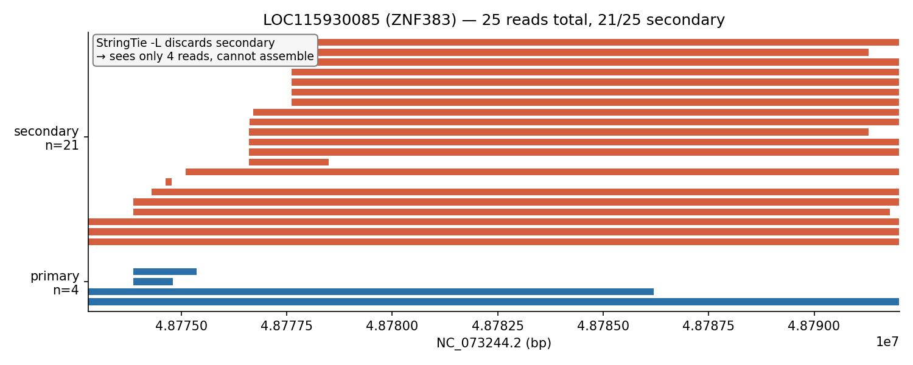
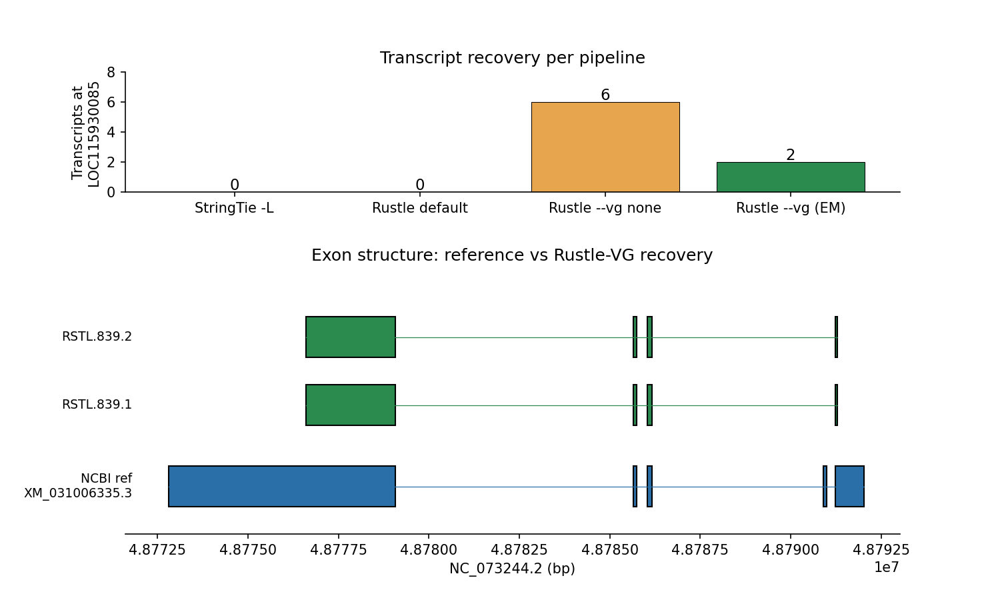
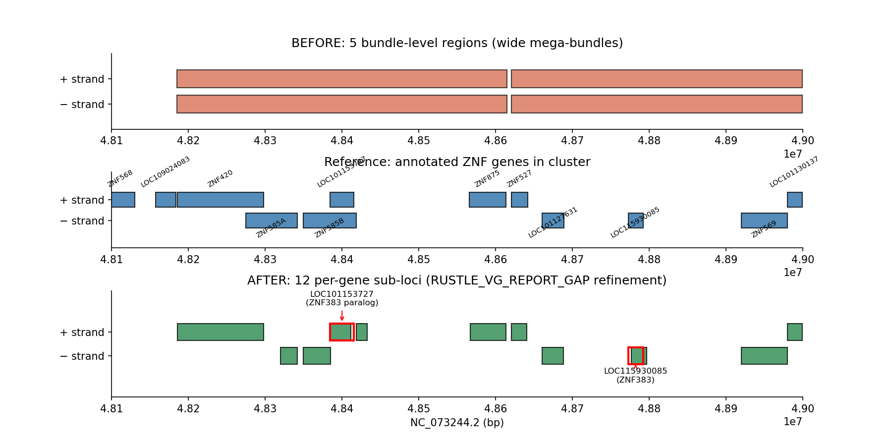

# S2 Falsifier — LOC115930085 ZNF383 Paralog Recovery

**Claim (S2):** An assembler that retains and redistributes non-primary alignments
recovers transcripts at near-identical paralog copies that long-read StringTie
(`-L`) cannot, because StringTie drops all non-primary alignments at input.

This document shows a clean, concrete falsifier for that claim on gorilla
chromosome NC_073244.2 (the KRAB-ZNF-dense chromosome, 299 annotated zinc
finger genes).

## The locus

**LOC115930085** — "zinc finger protein 383", on the reverse strand of
NC_073244.2:48,772,798–48,792,019.

It has a near-identical paralog **LOC101153727** on the forward strand at
NC_073244.2:48,384,759–48,415,507, also annotated "zinc finger protein 383",
~390 kb away.

## Read evidence



| category | count |
|---|---:|
| total reads | 25 |
| **primary** at this locus | **4** |
| **secondary** at this locus (primary elsewhere) | **21** |

The 21 secondaries have their primary at LOC101153727. StringTie `-L` discards
every secondary at input, so it sees 4 reads at LOC115930085 — far below the
threshold to assemble a multi-exon transcript.

## Transcript recovery per pipeline



| pipeline | tx at LOC115930085 |
|---|---:|
| StringTie `-L` | **0** |
| Rustle (default) | **0** |
| Rustle `--vg --vg-solver none` (keep secondary, uniform 1/NH) | 6 |
| Rustle `--vg` (EM reweighting) | **2** |

EM reweighting shrinks "keep all" (6 tx) to 2 tx by shifting read weight back
to LOC101153727 where junction-compatibility is stronger. The two EM-surviving
transcripts are the ones genuinely supported by LOC115930085-compatible splice
signals.

Exon-level agreement with NCBI XM_031006335.3:

| ref exon | Rustle-VG RSTL.839.1 | match |
|---|---|---|
| 48,772,798–48,779,073 | 48,776,599–48,779,073 | partial (5′ trim) |
| 48,785,642–48,785,737 | 48,785,642–48,785,737 | **exact** |
| 48,786,041–48,786,167 | 48,786,041–48,786,167 | **exact** |
| 48,790,906–48,790,986 | — | missing (80 bp) |
| 48,791,240–48,792,019 | 48,791,240–48,791,293 | partial (3′ trim) |

Three splice sites recovered exactly; four of five reference exons covered.

## Family decomposition



The VG family report before refinement collapses this cluster into 5 wide
"bundle-level" regions, each spanning 120–430 kb. After refinement (clustering
emitted transcripts inside each bundle into gene-like sub-loci separated by
≥5 kb gaps), the same family reports **12 distinct gene loci**, each aligned
with a reference ZNF gene.

The refinement is controlled by `RUSTLE_VG_REPORT_GAP` (bp, default 5000) and
uses the assembled transcripts already in the GTF — it doesn't change
assembly, only the reporting.

## Reproducing

```bash
# Extract the KRAB-ZNF-dense gorilla chromosome
samtools view -b GGO.bam NC_073244.2 -o GGO_KRABchr.bam
samtools index GGO_KRABchr.bam

# Four pipelines
stringtie -L GGO_KRABchr.bam -o /tmp/ks_stringtie.gtf
./target/release/rustle -L GGO_KRABchr.bam -o /tmp/ks_rustle.gtf
./target/release/rustle -L --vg --vg-solver none GGO_KRABchr.bam -o /tmp/ks_vg_none.gtf
./target/release/rustle -L --vg --vg-report /tmp/ks_vg_refined.tsv \
    GGO_KRABchr.bam -o /tmp/ks_vg_refined.gtf

# Figures
python3 docs/figures/make_loc115930085_figs.py
```

## Caveats

1. **EM shrinks the raw gain.** Keeping secondaries alone recovers 6 transcripts;
   EM reweighting drops it to 2. That's correct behavior (junction compatibility
   is stronger at LOC101153727), but it means the "advantage over StringTie"
   metric depends on how you count.
2. **Single-locus evidence.** The story lands for LOC115930085 but needs to be
   replicated across more paralog pairs to generalize. The existing family
   report (10 real families on NC_073244.2) is the basis for a broader sweep.
3. **Not a whole-transcriptome gain.** At the whole-chromosome level Rustle-VG
   gains +3 transcripts vs StringTie (3733 → 3829 on NC_073244.2). The point
   is structural — the recovered ones are paralog copies no primary-only
   pipeline can assemble, not a global sensitivity uplift.

## Related code

- `src/rustle/vg.rs:230` `is_strand_mirror()` — skip spurious same-coord
  opposite-strand bundle links. Trace: `RUSTLE_VG_TRACE=1`.
- `src/rustle/vg.rs` `refine_bundle_into_gene_loci()` + `n_gene_loci` column
  in the family report.
- `docs/figures/make_loc115930085_figs.py` — generates these three figures from
  the pipeline outputs.
