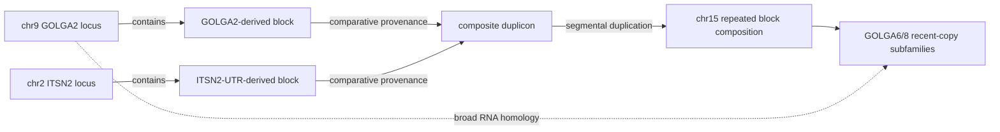

# O1 extension: block-aware duplication provenance graph

**Status (assessed 2026-08-19):** model specified; pairwise-witness prototype run on five local
HSA cases; stable multi-locus block classes and rooted provenance remain unimplemented.

**Assessment: keep the representation, do not build the rooting layer before the thesis is written.**
The four measurements behind that split are in [§0](#0-assessment-what-this-model-can-and-cannot-do)
and are binding on every section below.

---

## 0. Assessment: what this model can and cannot do

### It does not close O1's named definitional hole

The 30 definitional failures in [`o1_error_case_census.md`](o1_error_case_census.md) are **false
merges formed in the broad `E_r` layer**. Implementation invariant 1 of this document requires the
human broad partition to stay byte-identical with the extension off, and invariant 2 forbids the
outgroup from adding, removing, merging or splitting a family. **By construction this model cannot
reject any of those 30 cases.** It changes what is *reported*, not what is *admitted*.

GOLGA2 is not one of them. It falls in the census's **26 "not an error"** cases — correctly called
after checking. Answering it is a labelling improvement, not a definitional repair.

### The four measurements

| # | finding | number |
|---|---|---|
| 1 | `repeat_multiplicity` is candidate **R5**, already refuted — it breaks **P1** | MRPS17's block scores **50** partners over the whole catalog and **1** from a 4-node seed |
| 2 | a broad/recent split needs n ≥ 3, so the hierarchy is structurally inert on most families | GGO **348/494 = 70.45%** are 2-copy ⇒ ceiling **146/494 = 29.55%**; HSA **283/394 = 71.83%** ⇒ ceiling **111/394 = 28.17%** |
| 3 | the rooting pilot did not scale on its own probe set | `gorilla_synteny.tsv`: **30/40 rows `NO_TWO_SIDED_SYNTENY`**, 10 `TWO_SIDED_UNIQUE` ⇒ **3 of 18 family probes** certified in both haplotypes |
| 4 | the pilot's substrate is **inverted** relative to the thesis | PoC is human-study / gorilla-outgroup; the thesis substrate is gorilla-study. Flipping it needs new probes and new flanks; the PoC does not transfer. KB3781's two haplotypes are one individual, so concordance excludes assembly artefact, **not** polymorphism |

Measurement 2 is an **upper** bound: it assumes every n ≥ 3 family has internal structure, which the
graph-class panel already contradicts for the families at density 1.000.

### What survives

The **typed multiplex representation** and the **non-implications** — `shared_block ⇏ broad_family`,
`broad_family ⇏ recent_subfamily`, and the prohibition on taking connected components of the unioned
layer. These restate objects Rustle already computes (`E_r`, `E_dna`, `E_c`, λ) at no new inference
cost, and they are the answer to "why does your family not merge everything through NBPF". They
belong in the O1 definition chapter as framing plus a stated limitation. The rooting layer is
declared future work.

## Why a flat family graph is insufficient

O1 currently asks whether two expressed loci belong to one RNA homology family. That relation is
useful but symmetric and flat. It cannot distinguish:

- two recent copies of the same duplicated locus;
- an older ancestral homolog and its derived expansion;
- two different genes carried together inside one segmental-duplication unit; or
- loci sharing only one mobile/core duplicon block.

GOLGA exposes all four cases. Fresh Rustle correctly detects substantial transcript homology
between chr9 GOLGA2 and chr15 GOLGA6/8. Comparative work, however, reconstructs a composite unit:
a GOLGA2-derived segment and an ITSN2-UTR-derived segment were combined and copied to chromosome
15, where the unit expanded. A conventional gene tree assumes one history for the whole locus and
is therefore also too simple. The appropriate object is a **block-aware provenance network**.

Primary evidence and case measurements are recorded in
[`bench/o1_golga2_subfamily_audit.md`](../bench/o1_golga2_subfamily_audit.md). The chromosome-15
reconstruction is described in *The DNA sequence and analysis of human chromosome 15*:
<https://www.genenames.org/files/PMID16572171.pdf>.

## Proposed graph

Use four node types:

```text
Locus       one physical genomic locus detected by Rustle
Transcript  one expressed splice path through a locus
Block       one homologous DNA/RNA sequence module with explicit boundaries
Subfamily   a repeated ordered block composition at multiple physical loci
```

Use typed edges rather than treating every similarity as membership:

```text
EXPRESSES          Locus -> Transcript
CONTAINS           Locus -> Block       (orientation, interval, coverage)
RNA_HOMOLOGY       Transcript -- Transcript
DNA_DUPLICATION    Block -- Block       (identity, coverage, orientation)
READ_CONFUSABLE    Locus -- Locus       (O2 evidence)
DERIVED_FROM       Block/Subfamily -> Block/Subfamily
```

`DERIVED_FROM` is directional and has a higher evidence requirement than the other edges. It may
be emitted only when comparative synteny/outgroup evidence roots the relationship. With one genome
alone, Rustle must report the relationship as undirected `DNA_DUPLICATION`; sequence similarity
cannot determine which copy is ancestral.

## GOLGA example



This representation says all of the following without contradiction:

- GOLGA2 and GOLGA6/8 share a broad homology relationship;
- GOLGA2 is outside the recent chr15 copy subfamily;
- ITSN2 is not thereby converted into a GOLGA gene-family member;
- an ITSN2-derived block can still be part of the composite duplicon; and
- the direction toward the chr15 expansion comes from comparative evidence, not from a symmetric
  minimap2 alignment.

## Formal object

Let:

- `L` be Rustle physical loci;
- `T` be expressed transcript paths;
- `B` be homologous block classes;
- `P(l)` be the ordered, oriented block path through locus `l`; and
- `S` be recent-copy subfamilies.

The model is the multiplex graph:

```text
G = (L union T union B union S,
     E_express union E_contains union E_rna union E_dna union E_reads union E_provenance)
```

### Is this just a set of connected graphs?

No. The implementable object is a **heterogeneous multiplex property graph with ordered paths and
a directed provenance-DAG overlay**:

- **heterogeneous:** locus, transcript, block, and subfamily nodes have different semantics;
- **multiplex:** RNA homology, DNA duplication, read conflict, containment, and provenance remain
  separate edge layers over linked biological entities;
- **property graph:** nodes and edges carry coordinates, orientation, identity, coverage, evidence
  source, and uncertainty;
- **ordered-path structure:** a locus is not merely adjacent to a bag of blocks; `P(l)` records their
  order and orientation, which distinguishes intact duplicated units from rearranged mosaics; and
- **provenance DAG:** `DERIVED_FROM` may have multiple parents because a composite duplicon can inherit
  blocks from different source loci. It is not required to be a tree.

A block present in many loci is conceptually a hyperedge. Rustle does not need a specialised
hypergraph library: reify the block as its own `Block` node and connect every occurrence with a
typed `CONTAINS` edge. This ordinary property-graph representation preserves the same information
and serialises naturally to TSV.

The layers can be written separately,

```text
G_rna    = (T, E_rna)                broad expressed homology
G_dna    = (B_occurrence, E_dna)     duplicated sequence blocks
G_reads  = (L, E_reads)              operational copy ambiguity
G_inc    = (L union T union B, E_express union E_contains)
D_prov   = (B union S, E_provenance) rooted block/subfamily history when identifiable
```

but they are not independent graphs: `G_inc` supplies the cross-layer incidence maps, and every
entity has one stable id. The complete model is their typed union plus `P(l)`, not a list of
unrelated component assignments.

### What connected components are allowed to mean

Connected components remain useful only as coarse candidate envelopes:

| operation | permitted interpretation | not permitted |
|---|---|---|
| component of `G_rna` | candidate broad homology universe before quasi-clique refinement | recent copies or common ancestry |
| component of `G_dna` | candidate duplicated-block class | gene family |
| component of `G_reads` | loci whose reads may need joint O2 assignment | homology family |
| weak component of `D_prov` | one provenance system | a single tree or one source locus |

Final family/subfamily decisions require typed predicates. In particular, taking connected
components after unioning all edge layers is forbidden: one ubiquitous duplicon block would then
transitively merge unrelated genes, reproducing the NBPF and ITSN2 failure mode.

### Why the provenance layer is a DAG rather than a tree

For a simple duplication, one source block may lead to several derived block occurrences. For a
mosaic duplication, one derived unit may have several parents:

```text
GOLGA2-derived block ----\
                          > composite chr10/chr15 unit -> later chr15 copies
ITSN2-UTR-derived block --/
```

Only `DERIVED_FROM` is constrained to be acyclic. RNA, DNA-similarity, and read-conflict layers may
contain arbitrary cycles. If two blocks within one locus support incompatible roots, preserve both
block histories and mark the whole-locus direction `CONFLICTING`; do not force a consensus tree.

The existing broad O1 family remains a gamma-quasi-clique over `E_rna`. A recent-copy subfamily is
a multi-locus block whose members have compatible ordered block paths and pass the high-identity
DNA edge rule. Sharing a block is evidence in `E_contains`; it is not sufficient by itself to make
two loci members of the same gene family.

Ancestry is separately identifiable:

```text
single genome                unrooted duplication network only
outgroup sequence            candidate root by copy presence/divergence
outgroup + conserved synteny rooted provenance edge
```

### Membership is a query over the graph, not a component label

The useful outputs are graph queries:

```text
broad_family(l) = gamma-quasi-clique membership in G_rna

recent_subfamily(l) = repeated compatible P(l) plus a multi-locus high-identity
                      DNA block in G_dna

shared_block(l1,l2) = exists b: CONTAINS(l1,b) and CONTAINS(l2,b)

ancestral_source(b) = root of D_prov only when direction_status is
                      OUTGROUP_SUPPORTED, SYNTENY_ROOTED, or MULTI_OUTGROUP_ROOTED
```

`shared_block` does not imply `broad_family`, and `broad_family` does not imply
`recent_subfamily`. These non-implications are the main precision protection supplied by the model.

## Inference plan using permitted components

No Liftoff-style annotation projection is required.

1. **Discover loci from RNA** with the current Rustle node constructor.
2. **Align locus sequences with minimap2** on both transcript and genomic-span substrates.
3. **Segment alignments into blocks** by collecting alignment breakpoints, merging mutually
   homologous intervals, and recording each locus as an ordered/oriented path through block ids.
4. **Build recent subfamilies** from repeated compatible block paths plus the existing DNA
   identity/coverage rule. This is the nested output specified in
   [`o1_hierarchical_family_followup.md`](o1_hierarchical_family_followup.md).
5. **Overlay expression and ambiguity:** RNA splice paths annotate which block compositions are
   expressed; O2 read-conflict edges show which recent copies are operationally confusable.
6. **Optionally root provenance** using minimap2 alignments to selected outgroup assemblies and
   conserved flanking order. The outgroup is used to orient history, not as a better reference for
   assembling the study individual.

The last distinction addresses the reference-bias concern: a second genome is unnecessary for
detecting the study sample's nodes or assigning its reads. It becomes necessary only if the claim
uses directional words such as “ancestral,” “source,” or “derived.”

### Block-construction procedure

The first implementation should build blocks conservatively from the minimap2 records already
available to Rustle:

1. Retain every qualifying alignment interval with query/target coordinates and orientation; do
   not collapse it immediately to a Boolean locus edge.
2. Project transcript-space intervals back through exon coordinates and retain genomic-span
   intervals separately. RNA and DNA intervals are evidence about different substrates.
3. Split each locus occurrence at recurrent alignment endpoints. Nearby endpoints may be merged
   only under an explicit, certified tolerance so sequencing/alignment jitter does not create one
   block per base.
4. Treat each resulting interval as a **block occurrence**. Cluster mutually compatible occurrences
   into a block class using reciprocal coverage and the existing deterministic quasi-clique engine.
   Do not use unrestricted transitive closure: `A~B` and `B~C` must not imply `A~C` when B is a
   promiscuous repeat fragment.
   ⚠ **The stopping condition may not be a promiscuity count.** Partner count over the catalog is
   candidate **R5**, refuted in [`o1_coverage_repair.md`](o1_coverage_repair.md) §5: it is a function
   of the node set, not of the two sequences, so the same pair is rejected run-whole and accepted
   run-from-seed — the exact negation of the locality P1 rests on. Use reciprocal coverage and
   ordered-path compatibility, both of which are pair-local.
5. Record every locus as `P(l) = [(block_id, orientation, start, end), ...]`, sorted in locus order.
6. Compare paths by shared block coverage, order, orientation, and adjacency. A locus sharing one
   block is `shared_block`; a repeated compatible multi-block path can support a recent subfamily.
7. Build block-specific distance trees or networks only after the block classes are fixed. Root a
   block history only where an outgroup ortholog and conserved flanking order agree.

This procedure makes alignment blocks first-class evidence. The present O1 edge can still be
derived as a summary, but Rustle no longer has to discard *which part* of each locus produced it.

## Local pairwise-witness prototype

[`bench/o1_provenance_witness_prototype.py`](../bench/o1_provenance_witness_prototype.py) applies
the typed model to five HSA cases already emitted on disk. It recovers one actual passing minimap2
PAF record for every selected RNA or DNA pair and reifies that record as a block-witness node. It
does **not** yet merge overlapping pairwise witnesses into stable multi-locus block classes, and it
emits no directional ancestry claim.

| case | loci | RNA edges | DNA edges | both | edge-layer Jaccard | RNA components | DNA components |
|---|---:|---:|---:|---:|---:|---|---|
| GOLGA6/8 | 19 | 76 | 84 | 58 | 0.5686 | 17,1,1 | 19 |
| MAGEA | 10 | 22 | 17 | 17 | 0.7727 | 7,3 | 7,1,1,1 |
| RABL2 | 2 | 1 | 1 | 1 | 1.0000 | 2 | 2 |
| NBPF core | 19 | 49 | 100 | 42 | 0.3925 | 17,1,1 | 19 |
| NBPF repeat bridge | 15 | 26 | 14 | 6 | 0.1765 | 11,2,1,1 | 11,1,1,1,1 |

Component lists include isolated loci. The contrast is already useful even before block-class
consolidation:

- RABL2 is a two-copy, fully concordant positive control.
- The seven MAGEA loci form the DNA-supported core. MAGEB1, MAGEB2, and MAGEB18 have only RNA
  links in this selected case and are explicitly `EXCLUDE_CONFOUND`, so shared RNA homology does
  not silently redefine them as MAGEA copies.
- The adversarial NBPF bridge has only 6 pairs supported by both layers among 34 pairs supported by
  either layer (`Jaccard = 0.1765`) and fragments in both layers. NBPF4 remains a known outlier;
  TCTN1, DHRS4L2, TTC6, TTBK2, CEP152, ATP9B, DNAH14, LIMS4, and NMBR remain confounds rather than
  family members.
- GOLGA2/SWI5 has five RNA-only links, one DNA-only link, and zero two-layer links to the selected
  GOLGA6/8 loci. It is retained as `CONTEXT_OUTGROUP`, not admitted to the recent-copy family core.
  GOLGA8B provides the converse warning: it has no selected RNA edge but 11 DNA edges, so requiring
  RNA+DNA support for every true copy would create a false negative. Layer concordance is therefore
  a typed diagnostic and membership feature, not a universal intersection rule.

The durable outputs are in
[`bench/o1_provenance_witness_prototype/`](../bench/o1_provenance_witness_prototype/): normative
entity, relation, locus, and path TSVs plus per-case typed GFA projections. Reproduce the export
after the fresh and joint HSA evidence files exist with:

```bash
python3 bench/o1_provenance_witness_prototype.py
```

This prototype supports a conservative next rule: keep annotation-independent RNA and DNA layers,
learn coherent cores from repeated block paths, and allow typed `BROAD_ONLY`, `CONTEXT_OUTGROUP`,
or `DNA_UNRESOLVED` satellites. Do not promote a node merely because it touches a core, and do not
require every true member to have an edge in both layers.

## Single-outgroup rooting extension

> **DEFERRED (2026-08-19) — future work, not a thesis deliverable.** Two reasons, both measured:
> the pilot certified **3 of 18 family probes** with two-sided synteny in both gorilla haplotypes
> (30/40 `gorilla_synteny.tsv` rows are `NO_TWO_SIDED_SYNTENY`), and its substrate is inverted
> relative to the thesis (human-study / gorilla-outgroup, where the thesis is gorilla-study).
> The specification below is retained because it is correct and reusable; nothing in it should be
> implemented before O1/O2/O3 are written up.


### Scope and claim boundary

One ape species is sufficient for a first rooting experiment, but not for an unconditional ancestral
claim. The first implementation will use gorilla as an **orientation witness** over the fixed human
graph. It must not use the gorilla assembly to redefine human loci, transfer a GFF, or change the
human broad-family/recent-subfamily partition.

The local disk contains both phased KB3781 gorilla haplotypes. They are two assemblies of one
species and one individual, not two phylogenetic outgroups. Agreement between them is nevertheless
valuable: it distinguishes a reproducible gorilla copy state from haplotype polymorphism or a
haplotype-specific assembly problem. The local data paths and WSL mount procedure are documented in
[`linuxdisk_data_access.md`](linuxdisk_data_access.md).

For GOLGA, gorilla is the appropriate first species. Complete ape genome comparisons report a much
simpler gorilla GOLGA8 state, whereas orangutan has its own large GOLGA8 expansion and is therefore
an adversarial first root for this family. Chimpanzee and orangutan assemblies already on disk can
be added later without changing the one-outgroup interface. Primary comparative resource:
<https://www.nature.com/articles/s41586-025-08816-3>.

### Dependency on stable human blocks

The current prototype reifies one block node per pairwise PAF witness. Those overlapping witnesses
are not yet stable multi-locus block classes. Therefore:

- a pilot may align the existing human locus and pairwise-block probes and emit
  `ROOT_CANDIDATE` records;
- it may not emit production `DERIVED_FROM` edges from those provisional pairwise blocks; and
- production rooting begins only after reciprocal-overlap plus quasi-clique block consolidation
  assigns stable block ids and ordered human block paths.

This ordering prevents a convenient outgroup match from turning an alignment artifact into a
directional biological claim.

### Additional graph entities and relations

```text
OutgroupLocus            one physical ape assembly interval
OutgroupBlockOccurrence  one human block-class occurrence in that interval

ORTHOLOG_OF              OutgroupLocus -- HumanLocus
OUTGROUP_CONTAINS         OutgroupLocus -> OutgroupBlockOccurrence
BLOCK_CLASS_MATCH         OutgroupBlockOccurrence -- HumanBlock
SYNTENIC_WITH             OutgroupLocus -- HumanLocus
DERIVED_FROM              HumanBlock/Subfamily -> HumanBlock/Subfamily
```

`ORTHOLOG_OF` and `SYNTENIC_WITH` are evidence edges. They do not grant family membership. The ape
occurrences live in a context layer and cannot be returned by a query for human O1 copies.

### Two-pass minimap2 search

Generate two human query sets from CHM13v2.0:

```text
human_locus_flanks.fa  stable block/locus plus left and right flanking anchors
human_blocks.fa        consolidated block-class occurrences without flanks
```

Run strict assembly alignment for locus/flank orthology and a separate sensitive pass for older
duplicated-block homology. Retain secondary placements because copy multiplicity is part of the
evidence:

```bash
GORILLA_ROOT=/mnt/linuxdisk/home/juanfraitu/gorilla_haps
ROOTING_WORK=bench/o1_outgroup_rooting/work
mkdir -p "$ROOTING_WORK"

minimap2 -x asm5 -c --eqx --secondary=yes -N 100 \
  "$GORILLA_ROOT/mat.fa" "$ROOTING_WORK/human_locus_flanks.fa" \
  > "$ROOTING_WORK/gorilla_mat.flanks.paf"
minimap2 -x asm5 -c --eqx --secondary=yes -N 100 \
  "$GORILLA_ROOT/pat.fa" "$ROOTING_WORK/human_locus_flanks.fa" \
  > "$ROOTING_WORK/gorilla_pat.flanks.paf"

minimap2 -x asm20 -c --eqx --secondary=yes -N 100 \
  "$GORILLA_ROOT/mat.fa" "$ROOTING_WORK/human_blocks.fa" \
  > "$ROOTING_WORK/gorilla_mat.blocks.paf"
minimap2 -x asm20 -c --eqx --secondary=yes -N 100 \
  "$GORILLA_ROOT/pat.fa" "$ROOTING_WORK/human_blocks.fa" \
  > "$ROOTING_WORK/gorilla_pat.blocks.paf"
```

The strict and sensitive passes must remain separate. A sensitive block hit establishes homology;
it does not establish orthology. A two-sided, correctly ordered flank placement supplies the
synteny evidence needed to orient the history.

### Inference procedure

For each stable human block class:

1. **Enumerate ape occurrences.** Retain every qualifying primary or secondary block alignment,
   with PAF coordinates, strand, identity, shorter-sequence coverage, alignment score and haplotype.
2. **Anchor synteny independently.** Align the left and right human flanks. A syntenic candidate
   requires both anchors on one ape sequence in compatible order and orientation with the block
   between them. One-sided or repeat-multimapping flanks cannot root an edge.
3. **Certify assembly context.** Record local `N` content, contig/chromosome status, competing hits,
   and whether the corresponding interval is recoverable in both gorilla haplotypes. Absence next
   to a gap is `OUTGROUP_UNRESOLVED`, never a loss.
4. **Compare ordered paths.** Determine whether the syntenic gorilla locus carries the human
   source-like block path, the derived repeated/composite path, both, or neither.
5. **Check haplotype agreement.** Concordant maternal and paternal results may support a
   single-species root. Discordance emits `OUTGROUP_HAPLOTYPE_DISCORDANT` and no direction.
6. **Orient parsimoniously and abstain explicitly.** Emit a directed human provenance edge only
   when the source-like path, two-sided synteny, copy state and assembly checks agree. Sequence
   proximity alone is insufficient because gene conversion can make a derived paralog appear
   deceptively close to the ape sequence.

Flank uniqueness and span-distortion thresholds must be registered parameters, calibrated on
single-copy positive and shuffled-flank negative controls before the GOLGA result is inspected.
They must not be chosen post hoc to make GOLGA2 root successfully.

### One-species decision table

| gorilla observation | allowed interpretation | direction emitted? |
|---|---|---:|
| syntenic source-like path only; both haplotypes agree | human expansion is provisionally derived | yes, `SYNTENY_ROOTED` |
| source-like and expanded paths both present | duplication probably predates the split | no |
| expanded path but source-like path absent | possible loss, conversion, or wrong ortholog | no |
| homologous block but flanks disagree | paralogous/shared block only | no |
| neither path or interval contains a gap | absence is not interpretable | no |
| maternal and paternal gorilla disagree | polymorphism or assembly uncertainty | no |
| different blocks support different sources | mosaic provenance | block-specific edges only; locus `CONFLICTING` |

Use the existing broad `direction_status` vocabulary:

```text
UNROOTED              human-only or non-directional outgroup evidence
OUTGROUP_SUPPORTED    one ape supports copy-state polarity without complete two-sided synteny
SYNTENY_ROOTED        one ape plus two-sided conserved flanks supports direction
MULTI_OUTGROUP_ROOTED compatible roots from at least two ape lineages
CONFLICTING           different blocks or outgroups support incompatible directions
```

Store orthogonal failure detail in `outgroup_status` rather than multiplying directional states:

```text
AGREE
HAPLOTYPE_DISCORDANT
COPY_STATE_AMBIGUOUS
FLANK_MULTIMAPPING
ONE_SIDED_SYNTENY
ASSEMBLY_GAP
NO_QUALIFYING_OCCURRENCE
```

`OUTGROUP_SUPPORTED` is reportable evidence but cannot create a production `DERIVED_FROM` edge.
`SYNTENY_ROOTED` may create that edge, but thesis prose must call it “single-outgroup
synteny-rooted” or “rooted under one-outgroup parsimony.” Reserve unqualified “ancestral” for
`MULTI_OUTGROUP_ROOTED` or for a claim explicitly supported by an external comparative study.

### GOLGA pilot

Root the GOLGA-derived and ITSN2-UTR-derived blocks independently:

```text
gorilla syntenic GOLGA2-like locus --ORTHOLOG_OF--> human GOLGA2 source block
gorilla syntenic ITSN2-like locus  --ORTHOLOG_OF--> human ITSN2 source block

human GOLGA2 source block ----\
                              > chr15 composite block path -> GOLGA6/8 expansion
human ITSN2 source block -----/
```

Success produces a two-parent provenance DAG for the chr15 composite unit. It must not label ITSN2
as a GOLGA family copy, and it must not require GOLGA2 to join the GOLGA6/8 recent-copy subfamily.
If only one source block roots, preserve the other as `UNROOTED`; do not force one whole-locus tree.

### Proof-of-concept result (2026-08-17)

The one-species interface was exercised against both phased KB3781 gorilla haplotypes using the
local assemblies documented in [`linuxdisk_data_access.md`](linuxdisk_data_access.md). The pilot
used 25 kb left/right flanks, strict `asm5` flank mappings and sensitive `asm20` locus mappings.
Gorilla annotations were not consulted.

| human source context | audited family loci with a shared interval | maternal gorilla synteny | paternal gorilla synteny | result |
|---|---:|---|---|---|
| GOLGA2 | 8 | unique, two-sided | unique, two-sided | `ROOT_CANDIDATE_SINGLE_OUTGROUP` |
| ITSN2 | 6 | unique, two-sided | unique, two-sided | `ROOT_CANDIDATE_SINGLE_OUTGROUP` |

The GOLGA2 flank identities were 0.9817--0.9858 and the ITSN2 flank identities were
0.9784--0.9815, with qualifying coverage and MAPQ in both haplotypes. Of the 18 audited GOLGA-family
probes, only 3 had a unique two-sided synteny certificate in both gorilla haplotypes: GOLGA8A, the
chr15:73646286-73657758 candidate, and the chr5:7237265-7244593 candidate. The remaining 15 are
`NO_TWO_SIDED_SYNTENY`, not “absent from gorilla”; duplication/rearrangement, repetitive mapping and
assembly structure remain competing explanations.

This is a positive feasibility result for the rooting representation, not a completed ancestry
result. Both candidates deliberately retain:

```text
direction_status = UNROOTED
claim_limit      = LOCUS_PROXY_NOT_STABLE_BLOCK
```

The shared human intervals are real minimap2 witnesses but remain provisional pairwise blocks.
Production `DERIVED_FROM` edges still require consolidated block classes and block-specific path
comparison. Durable results, raw PAFs, thresholds, the audit trail for split-anchor chaining, and a
serial reproduction script are in
[`bench/o1_outgroup_rooting_poc/`](../bench/o1_outgroup_rooting_poc/). The normative top-level
certificate is `rooting_candidates.tsv`.

### Normative outputs

```text
outgroup_occurrences.tsv
species  haplotype  block_id  sequence  start  end  strand  identity  coverage  paf_record_id

outgroup_synteny.tsv
species  haplotype  human_locus  ape_locus  left_anchor  right_anchor  order  competing_hits  status

rooting_certificates.tsv
source_id  derived_id  block_id  direction_status  outgroup_status  species  haplotypes  evidence_ids

provenance.rooted.gfa
typed visual projection; TSV certificates remain normative
```

Every directed edge must be reconstructible from one certificate row and its referenced raw PAF
records. Annotation labels may be appended after inference but may not alter these rows.

### Implementation invariants and acceptance tests

1. With the outgroup option disabled, all existing human TSV/GFA outputs are byte-identical.
2. Adding gorilla changes only context/provenance outputs; it cannot add, remove, merge or split a
   human O1 locus or family.
3. Removing gorilla input converts its directed edges to `UNROOTED` without changing human block
   ids, paths, RNA/DNA relations or O2 evidence.
4. Maternal and paternal gorilla haplotypes are analysed independently before their evidence is
   combined. A discordant pair cannot yield `SYNTENY_ROOTED`.
5. Shuffled flanks and one-sided flank matches may retain `BLOCK_CLASS_MATCH` but produce no
   `DERIVED_FROM` edge.
6. All secondary block placements and best-versus-second placement evidence are disclosed.
7. GOLGA2 and ITSN2 may become source contexts for separate blocks; neither relationship changes
   the membership of the GOLGA6/8 recent-copy subfamily.
8. A later chimpanzee or orangutan run consumes the same block queries and emits additional
   certificates. It does not require rerunning human O1 discovery.

## Output sketch

```text
<out>.entities.tsv
entity_id  entity_type  chrom  start  end  strand  parent_id  status

<out>.blocks.tsv
block_id  length  n_occurrences  universe_n  universe_hash  substrate_status
# n_occurrences is DESCRIPTIVE ONLY and must carry its universe (see R5 above).
# No downstream filter, gate, or membership predicate may consume it.

<out>.locus_blocks.tsv
broad_family_id  copy_idx  block_id  occurrence_id  rank  orientation  start  end  coverage

<out>.relations.tsv
source_id  target_id  relation  identity  coverage  evidence  direction_status

<out>.paths.tsv
locus_id  path  path_status

<out>.provenance.gfa
visual projection of the normative TSV model
```

The TSVs are normative because ordinary GFA `L` records do not natively distinguish containment,
homology, read conflict, and ancestry. The GFA is a Bandage-compatible view:

```text
S records   reified loci/transcripts/block classes, tagged TY:Z:<entity_type>
L records   typed relations, tagged RT:Z:<relation>
P records   ordered block paths for loci where practical
```

If Bandage cannot preserve a required typed or directed relation, keep it in `relations.tsv` rather
than weakening the model to fit the visualisation format.

The normative `direction_status` and orthogonal `outgroup_status` vocabularies are defined in the
single-outgroup extension above. `CONFLICTING` remains important for mosaic loci: it prevents Rustle
from forcing one tree onto blocks with different evolutionary origins.

## Relationship to thesis objectives

- **O1:** distinguishes broad gene family, recent-copy subfamily, and shared duplicon block.
- **O2:** assigns ambiguous reads within the recent-copy subfamily where copy confusion is expected.
- **O3:** an individual-specific RNA path containing a block composition absent from the reference
  becomes a candidate structural configuration. It still cannot be placed or called a complete
  missing copy without genomic evidence.

This makes the DNA and RNA arms complementary rather than competing partitions: DNA describes
duplication structure and possible provenance; RNA describes expression, splice paths, and read
ambiguity over that structure.

## Proof-of-concept acceptance criteria

1. The model reproduces the five observed GOLGA2--GOLGA6/8 forward RNA edges.
2. GOLGA2 is `BROAD_ONLY` relative to the high-identity chr15 recent-copy subfamily.
3. GOLGA6/8 loci share a repeated block path; GOLGA2 and ITSN2 contribute distinct block origins.
4. ITSN2 is connected by `CONTAINS`/block provenance, never labelled as a GOLGA family copy.
5. Removing all outgroup inputs changes directional edges to `UNROOTED` but leaves the study-genome
   loci, broad RNA family, recent-copy subfamily, and O2 evidence byte-identical.
6. A shuffled unrelated gene with one common repeat may share a block but cannot enter a gene family
   without gene-scale RNA or compatible multi-block evidence.
7. Per-block trees/networks are allowed to disagree; no whole-locus ancestry is asserted for a
   demonstrably mosaic duplication.

## Claim boundary

Rustle can model the within-genome relationship now as an unrooted, typed network. It cannot infer
“GOLGA2 is ancestral” from the current human RNA/DNA pair alone because all pairwise alignment edges
are symmetric. That directional claim requires external comparative evidence. The method can remain
novel by computing its own block graph, outgroup alignments, and synteny-rooting rule with minimap2;
using another genome for evolutionary orientation is not equivalent to projecting its GFF or using
it as the assembly reference.
