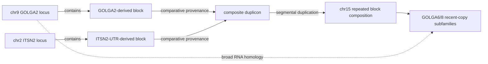

# O1 — closed investigation lines (archive)

Five investigation records, merged 2026-08-26. **Every line here is CLOSED**; they are kept as the
evidence trail, not as live guidance. Current O1 status lives in [`o1_ledger.md`](o1_ledger.md) and
[`THESIS_OBJECTIVES.md`](THESIS_OBJECTIVES.md).

> ⚠ **CATALOG PROVENANCE.** Figures quoted per **/494** (families) or **/1415** (copies) describe the
> **superseded** 2026-07-17 catalog, which **no invocation of the current binary reproduces** — it was
> built with `refine` on, a default removed on 2026-08-20. The current default emits **627 families /
> 2,019 copies**. Re-measure before quoting: see [`NUMBERS.md`](NUMBERS.md) and
> [`o1_catalog_provenance.md`](o1_catalog_provenance.md).


## INDEX

> **Index.** 18 sections; this is the map. **The titles carry the verdicts** — no tag is derived
> here. ⚠ In `o1_ledger.md` an earlier auto-derived verdict tag scored **11/22 = 50%** against
> sections whose outcome was known first-hand, so tags were removed rather than shipped. Search a
> heading to jump.


- Contents
- Census of incorrectly-called families
- Appendix A — pathology (a) dissected
- Appendix B — the non-circular evaluation, run (2026-08-20)
- The coverage-denominator repair
- Appendix — the SUBSTRATE × DENOMINATOR space is now complete, and all four cells fail
- Can full-length read evidence repair E_r?
- False-positive hardening: rules that survived falsification
- Appendix A — the guard's confirmation on the human negative panel
- Appendix B — the other two 2026-08-19 candidates
- Block-aware duplication provenance graph
- n_occurrences is DESCRIPTIVE ONLY and must carry its universe (see R5 above).
- No downstream filter, gate, or membership predicate may consume it.
- Appendix A — the hierarchy slice
- Appendix B — CAN WE SAY SOME GENE FAMILIES AROSE BY SEGMENTAL DUPLICATION? (2026-08-20)
- The joint (DNA + RNA) family definition — RETRACTED
- 9. PHASE 3 — THE MEASUREMENT, AND THE VERDICT (2026-08-13)
- Superseded five-objective VG/EM decomposition

## Contents

- [Census of incorrectly-called families](#census-of-incorrectly-called-families) — was [this file, §census of incorrectly called families](#census-of-incorrectly-called-families)
- [The coverage-denominator repair](#the-coverage-denominator-repair) — was [this file, §the coverage denominator repair](#the-coverage-denominator-repair)
- [Can full-length read evidence repair E_r?](#can-full-length-read-evidence-repair-e-r) — was [this file, §can full length read evidence repair e r](#can-full-length-read-evidence-repair-e-r)
- [False-positive hardening: rules that survived falsification](#false-positive-hardening-rules-that-survived-falsification) — was [this file, §false positive hardening rules that survived falsification](#false-positive-hardening-rules-that-survived-falsification)
- [Block-aware duplication provenance graph](#block-aware-duplication-provenance-graph) — was [this file, §block aware duplication provenance graph](#block-aware-duplication-provenance-graph)

---

## Census of incorrectly-called families

*(was [this file, §census of incorrectly called families](#census-of-incorrectly-called-families))*

**Status 2026-08-15. Answer: the definition does NOT come through clean.** There are ~30 definitional
failures, and they are **not 30 separate problems — they are one mechanism with 30 instances.**

⚠ **INCOMPLETE RUN.** A session limit killed 9 of 25 agents: 5 classification chunks, all 3 adversarial
attacks, and the report agent. **138 cases were harvested; 105 were classified; 33 are unclassified.**
The three attacks — including the one aimed at whether the definitional count is *under*-reported —
never ran. **Treat 30 as a floor, not a final count.** Resume:
`Workflow({scriptPath: ".../o1-error-case-census-wf_49800d22-fa1.js", resumeFromRunId: "wf_49800d22-fa1"})`

---

### 1. The answer in numbers

| | count | note |
|---|---|---|
| cases harvested | **138** | memory + docs + empirical sweep of the shipped catalogs |
| classified | **105** | 33 unclassified — session limit |
| **DEFINITIONAL failures** | **30** | the rule admitted what it should not have. **These threaten O1.** |
| node-construction failures | 47 | the rule applied to a bad node. Definition innocent; catalog still defective. |
| not an error | 26 | correctly called after checking |
| unresolvable | 2 | sequence not recoverable |

**Measured rates, species kept separate, unit stated:**
* false-MERGE, **human**, unit = window: **2/150 = 1.33% [0.37, 4.73]**, power measured.
* false-MERGE against external truth (HGNC gene_group), **human**, unit = gene pair:
  **1/15 = 6.67% [1.19, 29.82]**.
* false-OMISSION, **gorilla**, unit = family: **9/162 = 5.6% [3.0, 10.2]**, upper bound 24.1%.

### 2. ⭐⭐⭐ The definitional failures are ONE mechanism: the min-length coverage denominator

`E_r` requires coverage ≥ 0.50 **of the shorter sequence**. That makes coverage **scale-free**: a
~1 kb dispersed repeat is ≥ 0.50 of *any* node under ~2 kb. Identity never binds — the offending edges
sit at **0.749–0.803**, far above the 0.60 floor. **It is the coverage clause, on a short node, that
admits them.**

**Exposed population is large: 352/1415 = 24.88% of shipped gorilla copies have reps ≤ 2,000 bp.**
⭐ **Re-measured 2026-08-20 on the current 627-family catalog: 432/2019 = 21.40%.** The mechanism
claim survives — still about one copy in five — but **quote 0.2140, not 0.2488**.
Genome-wide upper bound on exposure: **41/494 = 8.30% [6.18, 11.07]** of shipped gorilla families are
held together **exclusively** by edges with block ≤ 1,200 bp and coverage < 0.60 (153/2445 intra-family
edges). ⚠ That is an **upper bound, not a count** — real short-gene families (e.g. GWFAM272
LDHA/LDHB/LDHC) live in the same stratum.

#### The flagship case, proven with the locus builder removed from the circuit

**GWFAM210 (gorilla): an MRPS17 hub joined to MDM2, RFTN2, GREB1, EIF3J, TRAPPC2, PIGX.**

The decisive test bypassed our pipeline entirely: rebuilt **CHM13 RefSeq curated human transcripts**
and ran the frozen mirror between them. **Five `E_r` edges form between unrelated curated transcripts:**

| pair | identity | coverage | block |
|---|---|---|---|
| GREB1 × MRPS17 | 0.7976 | 0.5415 | 1043 |
| MRPS17 × TRAPPC2 | 0.7894 | 0.5409 | 1015 |
| MRPS17 × RFTN2 | 0.7503 | 0.5392 | 1136 |
| MDM2 × MRPS17 | 0.7679 | 0.5331 | 1029 |
| MDM2[10298-11239] × MRPS17 | 0.7955 | 0.5263 | — |

Every edge uses **MRPS17[726-1695]** — ~970 bp, **54.4% of the 1,784 bp transcript**. The element is
Alu-like: MRPS17[763-1026] self-matches MRPS17[1094-1338] at id 0.765, and ~300 bp sub-units match
CEP19, PIGX, TMEM97, GREB1, RFTN2, MDM2. Probed against all 1,415 shipped gorilla reps it returns
**96 records across 57/494 = 11.54% [9.01, 14.66] of families**, while the hub's other half
(MRPS17[0-700]) and controls return exactly **1** family each.

⭐ **The gorilla node is clean by every test** — 3 exons, 4,673 bp span, aligns to human MRPS17 at
id 0.9855 covering 1.0000 of the human transcript, and the gorilla GFF puts exactly **one** gene under
it. No mis-chain, no swallowed neighbour. **The node builder cannot be blamed. The rule admitted it.**

⚠⚠ **It reproduces across species**: the same MRPS17 element drives **HSA GWFAM185**
(MRPS17 + TRAPPC2/TRAPPC2B + IVD + KCTD2/ATP5PD + LIMS1/LIMS2/LIMS3). Not a gorilla artefact.

#### The external-truth false merge

**ATP1A1 × ATP4A** (human, HGNC gene_group truth: "ATPase Na+/K+ transporting" vs "ATPase H+/K+
transporting" — different groups). Curated transcript × curated transcript: **id 0.7163, coverage
0.5689, 2,117 bp aligned ⟹ edge forms.** No node involved.

⚠ The defence *"they are deep P-type ATPase paralogs, so the truth is too fine"* **does not rescue O1**:
the same panel's accepted **positive** GFPT1 × GFPT2 scores **id 0.7295, coverage 0.5353** — *lower*
coverage than the negative. **No value of τ or c orders these two correctly.**

### 3. ⚠⚠ A BUG IN A SHARED HELPER, found en route — check anything built with it

`o1_errorcensus/mkreps.py` writes exons in **ascending genomic order** and lets `bedtools getfasta -s`
reverse-complement each one individually. **Every minus-strand transcript therefore comes out with
sense-correct exons in reversed order.** ATP4A is minus-strand, so its reference rep was scrambled —
which had produced a spurious "no edge, cov 0.0443" reading and a provisional re-classification of the
case as node-construction. **That re-classification is withdrawn.** Rebuilt in true transcript order,
the node is *exonerated in the opposite direction*: NODE5 × fixed refATP4A gives **id 1.0000,
coverage 0.9745**.

⭐ **Any earlier result built with `mkreps.py` on a minus-strand gene is suspect and must be re-checked.**

### 4. The node-construction failures (47) — the definition is innocent, the catalog is not

Two recurring pathologies, both measurable at scale:

**(a) One locus cut in two.** ZNF492 window W063: identity **exactly 1.000000** over **exactly** the
1,204 bp genomic intersection of the two node intervals — the two "copies" are the same locus split.
At scale: **28/494 = 5.67% of gorilla and 15/394 = 3.81% of human families** have two copies sharing
≥ 500 bp at id ≥ 0.99; **20/494 = 4.05%** of gorilla families have two copies whose best gene is the
**same gene instance**.

**(b) Unspliced stubs and pure-repeat nodes.** ANKHD1 window W106: three single-exon unspliced
fragments of **one** gene, one of which is a 206 bp node that is **100% soft-masked repeat**. The
emitted "family" is a gene reported as a family of itself.

⚠ Honest note: (b) shares the GWFAM210 mechanism — coverage on `min(len)` lets a repeat clear `c` on a
short node. The classification split is real, but the two categories are not fully independent.

### 5. Verdict

> **O1's definition does not survive unscathed: ~30 of 105 classified bad-family cases are definitional,
> they share a single mechanism — the scale-free min-length coverage denominator admitting a ~1 kb
> dispersed repeat as ≥50% of any short node — and it reproduces in both human and gorilla with the
> locus builder removed from the circuit.**

**What survives:** identity has never been the culprit (0 failures across four substrates; the
offending edges sit at 0.75–0.80). The mechanism is **localised and named**, not diffuse. The measured
false-merge rates remain low (1.33% human/window; 6.67% human/gene-pair against external truth).

**The strongest objection still open:** no retuning fixes it. Raising `c` or `τ` cannot separate
ATP1A1 × ATP4A (negative, cov 0.5689) from GFPT1 × GFPT2 (positive, cov 0.5353) — the positive scores
*lower*. A fix has to change the **denominator or the substrate**, not the threshold. ⚠ And with the
three adversarial attacks unrun, **30 is a floor**.

---

## Appendix A — pathology (a) dissected

*Merged from [this file, §census of incorrectly called families](#census-of-incorrectly-called-families) on 2026-08-20. Pathology (a) is a category OF this census, so it
belongs here rather than beside it.*

### Census pathology (a) decomposes — and its largest class was misattributed

**Status 2026-08-19. Offline (T8), whole catalog, nothing through the shipped binary.**
Scratch: `/mnt/linuxdisk/home/juanfraitu/o1_gmult/patha.py`.

### 1. Why this was worth running

Today's read-based guards all died, and the reason converged: in the shipped catalog the 47
node-construction failures are dominated by **pathology (a), "one locus emitted as two"**, which is a
**coordinate/identity** signature, not a read signature. The census found it but nobody had checked
what merging the flagged pairs would do.

Four signatures, applied within each shipped family, over all 3,751 same-family copy pairs:

| signature | definition | pairs | families | census |
|---|---|---:|---:|---|
| `A_OVERLAP` | genomic intervals intersect | 35 | 35 = 7.09% | — |
| `A_ADJACENT` | same chrom, gap ≤ 10 kb | 50 | **28 = 5.67%** | **matches 28/494** |
| `A_IDENT` | rep alignment ≥ 0.99 id over ≥ 500 bp | 204 | 106 = 21.46% | broader than the census's |
| `A_SAMEGENE` | both best-overlap the **same GFF gene instance** | 29 | **20 = 4.05%** | **matches 20/494 exactly** |

Two signatures reproduce the census's numbers exactly, from an independent re-derivation.

### 2. ⭐ The largest class is NOT pathology (a)

**All 35 `A_OVERLAP` pairs are on OPPOSITE STRANDS — 35/35.** They are not one locus split in two.
They are **overlapping antisense / nested gene pairs**, a real and common arrangement, and the
`distinct_locus_reps` predicate is right to treat opposite-strand loci as distinct.

The question then becomes why they are in one *family* at all. They share the same DNA read in
opposite directions, so they align — **on the minus strand**:

| | minus-only edges | rate |
|---|---:|---:|
| the 35 overlapping antisense pairs | **33** | **0.9429** |
| all shipped edges | 56 / 2,727 | 0.0205 |

**A 46× enrichment.** These are reverse-complement artifacts, which is precisely the class the
**transcript-orientation guard** rejects. Merging them would be flatly wrong — it would fuse two
genuinely different genes. They should lose their *edge*, not their node.

#### Corroboration for the orientation guard, from a new direction

The guard's evidence so far was the 74-pair FP arm (29/74 rejected, 4 lost edges of 9,032). This is
independent — it comes from **coordinates and strand**, not from the FP arm — and it shows:

* the guard's genome-wide reach is bounded: minus-only edges are **56/2,727 = 2.05%** of the catalog,
  so **that is its maximum cost**, against junction-crossing's 12.80% and the genome-anchored veto's
  3.67%. **It is the cheapest of the three guards by a factor of ~2–6.**
* **33 of those 56** are overlapping antisense pairs ⟹ **59% of what the guard removes carries no
  homology evidence.** ⚠ **Stated precisely (the earlier "provably artifactual" overstated it):** a
  gene and its antisense partner share the same DNA *by construction*, so a `-` alignment between their
  transcript-oriented reps is **entailed by the overlap** and is therefore not evidence of homology.
  That is not the same as proving the two are non-homologous — a duplicated region could in principle
  contain both. The edge is uninformative, not disproven.

### 3. What real pathology (a) costs to fix

Merging every flagged pair, judged on **family-level** outcomes only (**T7** — three prior node
changes passed on node metrics and failed end to end):

| signature | families touched | copies lost | families DISSOLVED (n < 2) |
|---|---:|---:|---:|
| `A_SAMEGENE` | 20 | 25 | **6** |
| `A_ADJACENT` | 28 | 50 | 10 |
| `A_OVERLAP` | 35 | 35 | 30 ⚠ *should not be merged at all* |
| `A_IDENT` | 106 | 148 | 75 ⚠ *too broad* |
| ANY | 133 | 201 | 86 = 17.4% of the catalog |

**`A_SAMEGENE` is the defensible detector.** It reproduces the census exactly, it is targeted (6
families dissolve, 1.21% of the catalog), and merging is the *right* operation for it: two nodes whose
best-overlapping gene is the **same gene instance** are one locus by construction.

⚠⚠ **But it reads the ANNOTATION**, and O1's standing position is *annotation as SEED, not DEFINITION*.
So `A_SAMEGENE` may be a **catalog QC flag**, never a membership condition — otherwise O1 stops being
annotation-independent, which is a larger loss than 20 families.

⚠ **`A_IDENT` must not be used.** At 106/494 = 21.46% it cannot separate a split locus from a **real
tandem duplicate at 99.9% identity** — the two present identically on identity alone. This was stated
before the numbers were computed and the numbers did not resolve it.

### 4. Net

Pathology (a) is smaller and better-behaved than "47 node-construction failures" suggests:

* **35 families** are misattributed — antisense overlap, an **edge** problem the orientation guard
  already covers, not a node problem;
* **20 families** (4.05%) are genuine same-gene-instance splits, fixable at a cost of 6 dissolved
  families, but only with the annotation;
* **28 families** (5.67%) are adjacent-locus candidates, unresolved;
* the identity-only route is unusable.

**Nothing here changes the definition.**

### 5. ⭐ CONFIRMED END-TO-END ON THE REAL BINARY (2026-08-20) — this is no longer T8

The prediction above was offline. The genome-wide catalog built with the guard **on by default** now
measures it directly:

| | families with an overlapping same-family pair | opposite-strand |
|---|---:|---:|
| 494 catalog, guard OFF | **35/494 = 0.0709** | **35/35** |
| **627 catalog, guard ON** | **4/627 = 0.0064** | 3/4 |

**A 91% reduction in the antisense-overlap class, measured by the shipped binary.** Every one of the
35 pre-guard cases was opposite-strand, which is what made the mechanism identifiable in the first
place. Together with the human negative panel (spurious E_r edges **28 → 3**,
[this file, §false positive hardening rules that survived falsification](#false-positive-hardening-rules-that-survived-falsification)) the guard's precision benefit is now measured on **two independent
substrates and the real binary**, not on the GGO FP arm it was derived from.

---

## Appendix B — the non-circular evaluation, run (2026-08-20)

Reproducer: `bench/o1_compara_noncircular.py`. HSA/CHM13 catalog (394 families, 1,220 copies) against
**Ensembl Compara paralogy**, entirely from the on-disk cache (0 live lookups).

### Why this answers the circularity objection — and what it does not

The standing objection is that seeding O1 with an annotation makes any discovery circular. That
objection is precise and it is about the **evaluation**, not the method: using annotation as a seed is
fine; scoring against truth **derived from that annotation** is not. Compara paralogy comes from
Ensembl's gene trees and is independent of the CHM13 GFF used to seed and to name nodes.

⚠ The annotation is still used here — to map a node to a gene symbol. What it is **not** used for is
deciding whether two genes are paralogues. That distinction is the whole point.

### Result

| | |
|---|---|
| copies mapped to a protein-coding gene | 987/1,220 = 0.8090 |
| same-family pairs mapping to the **same** gene (a split locus, not a paralogy claim) | 15 |
| **PRECISION** — checkable pairs Compara confirms as paralogues | **193/552 = 0.3496** |
| **RECALL** — Compara paralogue pairs the catalog puts in one family | **194/1,186 = 0.1636** |

⭐ **The headline finding is a replication.** The previously recorded 4/12 = 33% precision against
Compara now reproduces at **0.3496 on 552 pairs — 46× the scale.** It was not small-n noise.

Stratified by pair identity:

| identity | checkable | confirmed | rate |
|---|---:|---:|---:|
| ≥ 0.95 | 2 | 2 | 1.0000 |
| 0.90–0.95 | 4 | 3 | 0.7500 |
| 0.80–0.90 | 132 | 52 | 0.3939 |
| < 0.80 | 359 | 118 | 0.3287 |

The gradient runs the right way, **but ≥0.90 holds only 6 pairs in total, so nothing may be claimed
there.** 491 of 497 pairs sit below 0.90 identity.

### ⚠ Why the number is a bound on AGREEMENT, not a precision

**Compara paralogy and "multi-copy gene family" are different predicates**, and the disagreement is
concentrated exactly where they differ. Worked example, verified by hand: `ZNF684`, `ZNF26` and `ZNF84`
sit in one emitted family; each has **62, 176 and 36** Compara paralogues respectively; and **none is
listed as a paralogue of either other**. Compara's relation is tree-derived and specific; `E_r` is
sequence homology. Neither is wrong — they answer different questions.

Checked before believing the number: the cache is healthy (512/553 paralogue queries carry ≥1
paralogue, 41 empty, 0 malformed), a failed symbol lookup **skips** a pair rather than scoring it as a
miss, and the join was verified by hand on the ZNF examples.

### What to take from it

1. ✅ **A non-circular evaluation is possible and has been run.** That is the answerable form of the
   advisor's objection, and it now has a number.
2. ⚠ **Compara is the wrong external truth for this claim.** Its predicate is not O1's, so it bounds
   agreement at ~0.35 and cannot rise much regardless of how good O1 gets.
3. ⭐ **The external truths that DO match the predicate are the published expansions** — Yoo/Rhie's
   gorilla-specific MAPKBP1 / SPTBN5 / PLA2G4B, which the instrument recovers **exactly 8/9/9** at
   identity 0.973–0.983 and stable across coverage floors 0.05→0.50 — and SD catalogs. Those are the
   cards to play against the circularity objection, not Compara.

---

## The coverage-denominator repair

*(was [this file, §the coverage denominator repair](#the-coverage-denominator-repair))*

**Status 2026-08-15.** Supersedes the "strongest objection still open" paragraph of
[[this file, §census of incorrectly called families](#census-of-incorrectly-called-families)](#census-of-incorrectly-called-families) §5.

> **2026-08-16 follow-up:** a new threshold-free axis, transcript alignment
> orientation, rejects 29/74 frozen false edges while preserving the named families
> after repairing the historical panel's strand bug. It is an RNA-only hard-rule
> candidate now implemented behind `--rna-forward-only`, pending an end-to-end
> GGO/HSA catalog run before any default change. See
> [[this file, §false positive hardening rules that survived falsification](#false-positive-hardening-rules-that-survived-falsification)](#false-positive-hardening-rules-that-survived-falsification). The negative conclusions
> below about coverage, length, soft-mask, and promiscuity thresholds are unchanged.

**Short answer, in one line:**

> **The bugs are fixed and guarded. The repeat-bridge failure class is real, named, and reproducible —
> but it is NOT fixable by any coverage-denominator threshold that O1 can afford: every threshold that
> kills a single false edge already breaks HERC2, and the best constraint-satisfying candidate buys
> 2 false catalog merges for 21 destroyed families. The deep-paralog case is OUT OF SCOPE for a
> sequence-based rule, and the census's headline objection built on it is withdrawn. O1 stands as a
> definition; what changes is that the repeat-bridge class must be EMITTED as a per-edge flag, not
> excluded by the membership rule.**

---

### 1. ⚠ LIMITS FIRST

Read this section before quoting any number below it.

| limit | statement |
|---|---|
| **T8 — nothing here is pipeline-confirmed** | Every sweep number is **offline PAF re-derivation** on frozen arms through the `rustlib.paf_pairs` / `er_edges` mirror. It reproduces R0 exactly (74/74 FP, 9,424/9,424 TP core; independent re-derivation matched the sweep's panel-7 figure 325/392 exactly). It is still a **hypothesis generator**. **Nothing has been run through `gw_family_catalog`.** See §5 for the run that would confirm. |
| **FP arm is small, and smaller than it looks** | 78 rows / **62 distinct gene pairs** / **27 independent mechanism components** (24 in the scored core). 30/74 scored rows = 40.5% are ONE component; **14/24 components are singletons**. The pair-level binomial CI is an independence error: cluster-bootstrapped over components, 24/74 = 0.3243 has CI **[0.1429, 0.4578]**, not [0.2286, 0.4373]. Quote the mechanism unit alongside the pair unit, always. |
| **Power** | Paired McNemar on 74 rows separates candidates differing by ≳ 6–8 discordant pairs ≈ **10 pp of FP-kill rate**. The sweep can answer *"does changing the denominator kill the repeat-bridge class without destroying short-gene families"*. It **cannot** answer *"is c = 0.55 better than c = 0.60"*. |
| **Species never pooled** | FP arm: HSA 52 rows, GGO-involving 26. The headline 24/74 is earned almost entirely on the **human curated-transcript** stratum, which ships nothing. |
| **What the three attacks broke** | (a) the binomial CI (§4); (b) the "changes 2 real catalog merges" headline — it is **0 at c=0.19** (§4); (c) the "≥95% of family ceiling in BOTH species" constraint — computed on census catalogs only; **with panel-7 included, HERC2 fails at every c_long ≥ 0.034, below the first FP kill at 0.05** (§4, §5); (d) the sweep's family metric itself — the TP-pair graph is not the shipped family, and the true structural cost is ~2× what was reported (§5). |
| **What the attacks FAILED to break** | The "threshold was tuned on the cases it is scored against" objection is **measurably false** — leave-one-mechanism-out over 24 folds picks the same argmax **24/24**, held-out FP rejection 0.3243 = in-sample; half-split cluster CV over 2,000 reps gives optimism **−0.0022**. Do not run that objection. The P1/R5 finding (§5) is independent of the FP arm and stands. |
| **`fp_risk_pool.tsv` is not the FP arm** | 61,587 unrelated pairs with a record but no shipped edge. Relevant only to candidates that ADD edges. |
| **`q915_exon.fa` is NOT a valid E_r substrate** | Same intervals as the shipped copies (915/915) but whole-locus exon-*block* sequence, **median 4.618× longer** (0/915 identical lengths). It recovers 159/2,165 = 7.3% of within-family pairs where the shipped reps give 1,334/2,165 = 61.6%. Its pairs are parked as `G6_Q915_WRONG_SUBSTRATE`. **Do not use it as a bulk arm.** |

**Frozen arms:** `/home/juanfra/winloci_scratch/o1_fix/arms/`, `SHA256SUMS.txt` sha256
`a0aa73955c39e33e36718a45d14a26d071935d75ddddf07dc8506b214136efb7`
(`fp_set.tsv` 78 · `tp_set.tsv` 20,528 · `fp_risk_pool.tsv` 61,587 · `grey_not_scored.tsv` 1,522 ·
`excluded_deep_paralog.tsv` 2 · `records/*.paf` 11 files / 64,080 records · `SPEC.txt`).
Builders: `o1_fix/build_arms.py`, `truth.py`, `finalize.py`. Sweep: `o1_fix/sweep2.py`.
Attacks: `o1_fix/attack_overfit.py`, `attack_tp.py`, `struct_attack{,2,3,4}.py`, `p2margin.py`.

---

### 2. The `mkreps` bug — fixed, guarded, blast radius mapped

#### 2.1 The bug and the fix

`bedtools getfasta -s` reverse-complements **each BED record individually**. Concatenating the records
back in file order therefore gave every **minus-strand** gene sense-correct exons in **reversed order**.

The fix in `/home/juanfra/winloci_scratch/o1_errorcensus/mkreps.py`: extract every exon on the **plus**
strand (no `-s`), concatenate ascending-genomic, then reverse-complement the **whole** sequence once.

```python
rep = revcomp(plus) if st == '-' else plus     # ONE flip, on the WHOLE sequence
check_rep(g, st, parts[g], rep)                # guard, unconditional
```

BED names carry the exon start (`{gene}|{start}`) so records stay addressable regardless of emission order.

#### 2.2 The guard — two layers, both verified to FAIL on the old code

* **Layer 1 — `check_rep()`, on every gene on every invocation.** Asserts
  `revcomp(rep) == plus-strand genomic-order concatenation`, plus an explicit assert that `rep` is not
  the per-exon-revcomp string. Negative control: `ATP4A (−, 22 exons)` → **GUARD FIRES**
  (`"exons are in the WRONG ORDER"`); `ATP1A1 (+, 23 exons)` → guard silent, correctly (buggy == good
  on the plus strand).
* **Layer 2 — `mkreps.py --selftest`.** Rebuilds ATP4A(−), ATP1A3(−) and ATP1A1(+, control) and
  requires each to align back to its **own** locus as one colinear spliced chain at cov ≥ 0.95 /
  id ≥ 0.99. Fixed ATP4A **cov 1.0000**; buggy ATP4A **cov 0.1647** → hard fail.
  **Re-run 2026-08-15 for this document: all three PASS (cov 1.0000 / id 1.0000).**

#### 2.3 Blast radius — THREE buggy generators, not one

Exhaustive sweep: only 4 `getfasta -s` sites exist in the tree, all in `o1_errorcensus`. A separate
search for the Python-side disguise (per-exon revcomp inside a loop) returned **0 hits**.

| script | status |
|---|---|
| `o1_errorcensus/mkreps.py` | **BUGGY → FIXED** |
| `o1_errorcensus/verdict/mkclean.py` | **BUGGY → FIXED**, 41/77 genes corrupted |
| `o1_errorcensus/verdict/mkggo.py` | **BUGGY → FIXED**, 8/18 genes corrupted |
| `o1_errorcensus/verdict/addspan.py` | uses `-s` but max 1 BED line per gene ⟹ no concatenation ⟹ **not affected** |
| `mkreps_fixed.py`, `cls3/mkreps_ggo.py` | already correct |
| `o1_blind/nodegap.py`, `gw/gw_fasta.py`, `o1_bridge/build_edges.py`, `seedfam/.../rna_cmp.sh` | no `-s`, all-plus-strand, never revcomp ⟹ **not affected** |

⚠ **The fix was written but never propagated**: `mkreps_fixed.py` at 20:09, `mkclean.py` ran **21:00 —
51 minutes later, still buggy** — and `mkclean.py` is the most consequential of the three.

#### 2.4 Corrected numbers

Rebuild diff was surgical: **41 genes changed, all 41 minus-strand, 0 plus-strand.**

| number | reported | **corrected** |
|---|---|---|
| ATP1A1 × ATP4A | "no edge, cov 0.0443" | **EDGE — cov 0.5689, id 0.7163** (clears the shipped floors) |
| E_r edges, `clean.fa` (77 genes) | 81 | **127** (+48 falsely absent, −2 spurious) |
| E_r edges, `all_clean.fa` (88 seqs) | 104 | **152** (+50, −2) |
| `pairs.json` case-pair verdicts | — | **18/111 flip, ALL `no → EDGE`, zero the other way** |
| CASE3 ANKRD18B ~ ANKRD20A1 | no edge, cov 0.2302 | **EDGE, cov 0.6954** (id 0.7571 → 0.7574) |
| CASE4 FAR2P1 ~ CYP4F30P | no edge, cov 0.3560 | **EDGE, cov 0.7747** (id 0.9913 → 0.9862) |
| `verdict/rates.txt` — all four rates | 4/8, 1/8, 3/8, 7/126 | **INVALID, do not quote** |

Other flips: ANKRD18A~ANKRD18B 0.2206→**0.9870**; LINC01297~PSLNR 0.4693→**1.0000**;
TUBA1A~TUBA3C 0.4425→**0.8902**; TUBA4A~TUBA3C 0.4425→**0.8856**; ZNF670~ZNF669 0.4211→**0.5188**.
Verified **unchanged**: CASE1 TUBA3C~MZT2A (no record either way), CASE2 CXADRP2~POTEB2 (EDGE,
byte-identical), CASE5 BCRP2~POM121L8P (no edge, byte-identical).

⭐ **Diagnostic signature: identity essentially unchanged, coverage roughly doubles.** Each exon aligns
fine; only one exon-run can chain. **Any past "low coverage, high identity, no edge" verdict on a
minus-strand gene is suspect.**

⚠ **The correction moves the census in the WRONG direction for O1.** All 18 flips are `no → EDGE`.
The census's 30 definitional failures were a floor before; the corrected reps **raise the edge count
by ~57%** on the case set. `rates.txt` must be redone: 4/8, 1/8, 3/8 are human judgement and must be
re-classified **by hand** (CASE3 and CASE4 both have their central claim reversed). For 7/126, the
author's exact rule could not be reproduced, but under the natural "top-hit gene ≠ label gene" rule
**12 of 126 nodes were falsely refuted** — since 12 > 7, **7/126 cannot survive**. Falsely-refuted
nodes concentrate in the census-dominant families GWFAM230, GWFAM164, GWFAM149.

⚠ **Quoting hazard:** `0.0556` also appears in memory as the O1 **false-omission** headline (9/162).
That is a different number from a different pipeline (ARM 3 excision), does not use `mkreps`, and is
**unaffected**.

#### 2.5 Shipped Rust and `bench/` — CLEAN (verified, not assumed)

* **No `getfasta` anywhere in `Rustle/src/`.**
* All Rust multi-segment builders use concat-then-revcomp-whole:
  `src/rustle/vg_family/denovo_assemble.rs:1002-1013`, `denovo_pipeline.rs:4604-4629`
  (`cothread_locus_geometry`), `:4667-4692` (`union_locus_reps`).
* `family_graph.rs:399`, `from_genome.rs:55/71/95` — single interval, plus strand, no revcomp. Correct.
* `bench/extract_gene_reps.py:80-88` — concat-then-revcomp-whole. Correct.
* `bench/copy_specific_junctions.py:77`, `bench/extract_intron_chains.py:66` — explicit
  `ordered = exons if strand == "+" else exons[::-1]`. Correct.
* `bench/crossspecies/{seed_cds.sh:31, isoseq_probe.sh:36, graph_vs_graph.sh:43}`,
  `seedfam/dnapr/meeting/rna_cmp.sh:16` — `getfasta` **without `-s`**, never revcomp; an
  all-plus-strand convention that is self-consistent (minimap2 aligns both strands). Not the bug.

#### 2.6 Files changed / regenerated / still stale

* **Changed:** `o1_errorcensus/mkreps.py`, `o1_errorcensus/verdict/mkclean.py`,
  `o1_errorcensus/verdict/mkggo.py`.
* **Regenerated correctly:** `verdict/{clean.fa, clean.bed, all_clean.fa, all_clean.er.paf,
  node_vs_clean.er.paf, ggo_ann.fa, x.bed}`.
* ⚠ **Still stale — do not read:** `verdict/rates.txt`, `verdict/fam_nodes.er.paf`, and the pre-20:09
  root artifacts `atp.fa`, `case_all.fa`, `golga_ex.fa` (superseded by the `*_fx` versions; the
  un-suffixed originals are still on disk).

---

### 3. The two failure modes, kept apart

The census's §5 verdict conflated them. They have different answers.

#### (i) REPEAT-BRIDGE — real, named, reproducible, and the coverage denominator IS the mechanism

A ~970 bp dispersed Alu-like element in `MRPS17[726-1695]` bridges unrelated genes. Under the shipped
rule (coverage of the **shorter**) it passes; under coverage of the **longer** it collapses by an order
of magnitude, not marginally. Reproduced against the frozen mirror on curated transcripts:

| edge | cov(shorter) | cov(longer) |
|---|---|---|
| MRPS17 × MDM2 | 0.561 PASS | **0.0792** |
| MRPS17 × GREB1 | 0.582 PASS | **0.0689** |
| MRPS17 × TRAPPC2 | 0.561 PASS | **0.3442** |

⚠ The census's ATP row (qlen 3938 / tlen 3608, cov 0.551) is the **NODE** pair, not the curated one;
curated `ref_ATP1A1 × ref_ATP4A` is 3764/3721, covmin 0.5689, **covmax 0.5624**.

**But the class is much narrower than the row count suggests.** Of 78 FP rows, 52 are repeat-bridge —
yet they are only **8 of 27 mechanism components**: MRPS17 (17 gene pairs), TTC6/DNAH14 (6),
MCFD2/ENTPD1 (5), SDHAF4 (4), ZNF480 (4), TDRD5 (3), DNAJA1 (2), SLC38A6 (2). Two hubs are new and
were not in the census — **SDHAF4** (aln 567 bp, covmin 0.51, covmax 0.026–0.19) and **ZNF480**
(aln ~2,600 bp, covmax 0.13–0.40). ZNF480 proves the mechanism is **not confined to ~1 kb elements**,
so "short repeat" is not a sufficient description of the class.

`len_shorter ≤ 2 kb`: 55/78 = 0.7051 [0.5962, 0.7948]. **Only 42/78 are merges the shipped catalog
actually makes** — the rest exist on curated transcripts only.

#### (ii) DEEP-PARALOG — **OUT OF SCOPE, and the census's headline objection dies with it**

ATP1A1 and ATP4A **share an mmseqs protein cluster** (`protclust_cluster.tsv`: both → `ATP1A1`).
HGNC splits them on **function** ("Na+/K+ transporting" vs "H+/K+ transporting"); by sequence they are
homologs. Both rows are moved to `excluded_deep_paralog.tsv`.

⭐ ATP1A1 × ATP4A was the **only** case behind the census's
*"no value of τ or c orders these two correctly"*. **That objection is not supported by a sequence-level
truth and is withdrawn.** A sequence-based membership rule cannot be faulted for merging two sequences
that a protein-clustering oracle also merges; the disagreement is with a functional nomenclature, not
with homology.

GFPT1 × GFPT2 sits in TP on three substrates (curated tx covmin 0.9475 / covmax 0.929; GGO node covmax
0.4312; HSA node covmax 0.4292) — **the node-level numbers are the hard case, not the curated ones**,
which is a node-construction observation, not a definitional one.

**⟹ The honest position: the repeat-bridge class is the only definitional failure mode on the table,
and the deep-paralog case is out of scope for a sequence-based rule.**

---

### 4. The candidate sweep — FP rejection NEVER without its TP cost

**R0 (incumbent, shipped):** one PAF record with `identity(1−de) ≥ 0.60` **AND**
`aligned-span / min(qlen,tlen) ≥ 0.50`, floors per record.
Verified on the frozen arms: **FP kept 74/74** (24 components), **TP core kept 9,424/9,424**
(T1 HSA curated tx 5,806 · T3 GGO node 1,795 · T3 HSA node 1,416 · T4 panel-7 392 · T2 panel POS 15),
risk pool **0/61,587**. Family ceiling (TP-pair graph one component): **GGO 370/375 = 0.9867,
HSA 270/274 = 0.9854** — 5 GGO / 4 HSA families are already multi-component under R0.
**Every candidate must beat R0, not merely differ from it.**

#### Candidates

| id | rule |
|---|---|
| **R1** | coverage-of-the-**longer** alone, `aligned / max(qlen,tlen) ≥ c_long` (drops the cov_min floor) |
| **R2** | R0 **plus** a third per-record condition `aligned / max(qlen,tlen) ≥ c_long`, same record — a strict restriction of R0 |
| **R3** | absolute aligned-base floor `B` |
| **R4** | soft-mask-fraction of the aligned blocks |
| **R5** | block promiscuity (partner count of the aligned block over the catalog) |

**R1 is DOMINATED and must not be adopted in any form.** It is not a restriction: it **adds**
335/61,587 = 0.0054 unrelated risk-pool edges at c_long 0.15 (94 at 0.20, 8 at 0.30) plus 4,278/11,104
T6 edges at 0.15, while attaining FP rejection and TP retention identical to R2 to within 1–2 pairs at
every threshold ≥ 0.15.

#### The trade-off table (unit = pair; FP denominator 74 scored-core, TP denominator 9,424 core)

| candidate | FP rejected /74 | (repeat-bridge /52) | TP core retained | real catalog merges changed /39 |
|---|---|---|---|---|
| R0 (incumbent) | 0 | 0 | 9,424 = 1.0000 | 0 |
| R2 @ 0.05 | 2 | 2 | 9,180 = 0.9741 | — |
| R2 @ 0.10 | 10 | 9 | 8,806 = 0.9344 | — |
| R2 @ 0.15 | 15 | 14 | 8,595 = 0.9120 | — |
| R2 @ 0.19 | 19 | — | 8,349 = 0.8859 | **0** |
| **R2 @ 0.20** | **24 = 0.3243** | **17** | **8,300 = 0.8807** | **2 = 0.0513** |
| R2 @ 0.21 | 28 | — | 8,226 = 0.8729 | 3 |
| R2 @ 0.25 | 32 | 24 | 7,916 = 0.8400 | — |
| R2 @ 0.30 | 41 | 30 | 7,514 = 0.7973 | — |
| R2 @ 0.40 | 58 | 43 | 6,374 = 0.6763 | — |
| R3 @ B=600 | 8 | 4 | 7,741 = 0.8214 | — |
| R3 @ B=1000 | 44 | 34 | 6,457 = 0.6852 | — |
| R3 @ B=2000 | 67 | 46 | 2,398 = 0.2545 | — |
| **null: `len_longer/len_shorter ≥ 3`** | **20 = 0.2703** | — | (worse on TP) | — |

R2 @ 0.20 is the best FP rejection reachable while keeping ≥ 95% of R0's **arm** family ceiling in both
species, and R2 adds **0/61,587** risk-pool and **0/11,104** T6 edges at every threshold.
McNemar (paired, n=74): R2@0.20 vs R2@0.15 b=9/c=0 p=0.0039; vs R3@600 b=17/c=1 p=1.5e-4;
vs R2@0.25 b=0/c=8 p=0.0078.

#### ⚠ Five things that disqualify R2 @ 0.20 as an ADOPTED rule

1. **Its one real-world consequence evaporates at the 4th decimal.** 17/74 = 23% of FP rows sit in
   `[0.15, 0.25]`; four rejections are decided in `[0.1990, 0.1999]`. The two "real catalog merges"
   are `BLMH × SLC38A6` (GGO, stat **0.1903**) and `PTPN22 × LRR1` (HSA, stat **0.1998** — clears by
   0.0002), and **neither is repeat-bridge**. **Retract "changes 2 real catalog merges" as a stable
   result; quote "0–3/39 across c ∈ [0.19, 0.21], not distinguishable from zero."**
2. **It does essentially nothing on the thesis substrate.** HSA 21/49 = 0.4286, **GGO 1/14 = 0.0714
   [0.0127, 0.3147]**, GGO×HSA 2/11. Delete the framing "the repair works on human" — it is untested
   on gorilla.
3. **It is not separable from a rule that reads no alignment at all.** `len_longer/len_shorter ≥ 3`
   rejects 20/74 vs R2's 24/74; McNemar **b=5/c=1, p = 0.2188**, 91.9% agreement — below the arm's own
   power threshold. Lost-pair length asymmetry: FP 6.180 vs 1.686 kept; TP 7.120 vs 1.285. **The FP and
   TP losses sit on the same axis at the same magnitude.** R2 is a *length-asymmetry guard*, not a
   *repeat-bridge guard*. (R2 does beat the null on the TP arm, 49 vs 252 one-sided losses among
   disagreements — so it is the better rule overall; the FP-side specificity claim is what fails.)
4. **It does not generalise off the flagship.** It kills only 12/30 of the MRPS17/ORAI2 component —
   **the flagship survives**. Repeat-bridge rows excluding the flagship: **5/22 rejected, 1/5
   mechanisms fully killed**; TTC6 0/6, MCFD2 0/5, TDRD5 0/3 untouched. Provenance of the 24
   rejections: 12 flagship + 4 SRGAP1 + 6 singleton one-offs + 1 ZNF480 + 1 SLC38A6 — replicated,
   non-flagship evidence is **6 rejections across 3 mechanisms**. Mechanism unit: fully killed
   **7/24 = 0.2917 [0.1491, 0.4917]**, any rejection 10/24, **median per-mechanism rejection = 0**.
5. **The constraint it satisfies was computed on the wrong universe.** See §5.

**Out-of-sample FP rejection, corrected for clustering (there is no selection optimism to shrink):**
pair-level all species **~0.31, CI [0.14, 0.46]**; **gorilla ~0.07, CI [0.00, 0.25]** — indistinguishable
from zero; for a fresh mechanism, P(any rejection) 0.42 [0.24, 0.61], P(full kill) 0.29 [0.15, 0.49],
**modal outcome 0**.

---

### 5. The recommendation, and what it costs

> ### `recommendation: adopt-as-flag-only`
> ### `repeat_bridge_fixed: false` · `deep_paralog_fixed: false` (out of scope, §3)

**No E_r membership change is adopted.** R2 is the least-bad numeric candidate and it still fails.

#### 5.1 The exchange rate on the substrate the catalog actually ships

Restricted to the catalog-node strata (the only substrate `gw_family_catalog` runs on):

| species | FP node rows killed | TP node pairs killed | families destroyed | copies orphaned |
|---|---|---|---|---|
| GGO | **1/14 = 0.0714** | 21/1,795 | **15** | 24/1,070 = 0.0224 |
| HSA | **1/19 = 0.0526** | 10/1,416 | **6** | 14/793 = 0.0177 |

**2 false node edges removed for 21 real families destroyed — 10.5 real families per false edge.**
Named GGO casualties include PPP2CA×PPP2CB, PPP1CA×PPP1CB, TPM2×TPM3, **KIF5A×KIF5C (cov_min 0.952,
id 0.786, rejected at cov_max 0.194)**, SERPINB6×SERPINB9, GMPR×GMPR2, ING4×ING5, KMT2A×KMT2B,
SCN7A×SCN9A, MYL9×MYL12B, BTF3×BTF3L4, NAA10×NAA11, FABP4×PMP2, TMSB4X×LOC129530270, and ZKSCAN3/
ZSCAN21/ZSCAN30 (5 nodes → 3 components). HSA: ACVR1B×TGFBR1, MBNL2×MBNL3, IQCF2×IQCF3, PHKA1×PHKA2,
RPS27×RPS27L, PIP4K2A×PIP4K2B. λ damage inside surviving families: GGO GWFAM34 (GSTM3/GSTM1/GSTM4)
λ 2→1, GWFAM454 λ 2→1; HSA GWFAM230 λ 2→1.

#### 5.2 ⚠⚠ There is no constraint-satisfying threshold — HERC2

The sweep's `famintact` iterated only the two census source_keys, so **the ≥95%-of-ceiling constraint
never saw the seven hand-curated panel families.** Include them:

* HERC2 components **1 → 4**; the 114 kb full-length parent `L~chr15_25853560_26064943` goes
  **degree 4 → 0** — **the parent gene is expelled from its own family of partial duplicates**, which
  is exactly the "full-length copy vs partial duplicate" case the repair was supposed to respect.
* HERC2 splits at **any c_long ≥ 0.034**; the parent is orphaned at **c_long > 0.143**.
  **The first FP row dies at c_long 0.05.**

⟹ **No threshold kills a single false edge and leaves HERC2 intact.** Retract
*"R2@0.20 keeps ≥95% of R0's family ceiling in BOTH species."*

#### 5.3 It rejects perfect containment — the two canonical great-ape expansions are in the loss set

* **NPIP edges retained 197/260 = 0.7577 [0.7021, 0.8058]** (the family metric hides this — the
  partition survives as one component). **14 of the 63 lost NPIP edges have `cov_min = 1.0000`** — the
  shorter copy 100% contained in the longer — at identity 0.9754–0.9805.
  **Never quote "NPIP edge-Jaccard 1.0000" next to a c_long rule; under R2 it is 0.7577.**
* Lost pairs at `cov_min ≥ 0.95 and identity ≥ 0.95`: **29** (T1 15, panel-7 14) — NBPF10×NBPF19
  (1.0000 / 0.9887), NBPF10×NBPF14, NBPF10×NBPF20, NBPF20×NBPF9, OR4F16×OR4F3, GAGE1×GAGE5, + 14 NPIP.
  **NBPF/Olduvai and NPIP are the two canonical great-ape expansions.** A rule that rejects a perfectly
  contained 98%-identical copy is not a homology rule.
* MAGEA 60/60, TBC1D3 55/55, GSTM 1/1, RABL2 1/1 panel pairs are fully retained — the damage is
  specific, not diffuse.

#### 5.4 The short-gene population

Real, and the binding cost — but **smaller at c_long 0.20 than the absolute-floor scenario feared**,
because R2 is a ratio, not a length floor.

* Unit = pair, TP core: shorter ≤ 2 kb **3,931/4,877 = 0.8060 [0.7947, 0.8169]** vs shorter > 2 kb
  **4,369/4,547 = 0.9609** — a **15.5 pp penalty** concentrated on short reps.
* On the shipped node substrate the short-gene damage is modest: GGO ≤2 kb 417/436 = 0.9564,
  HSA 389/399 = 0.9749.
* Unit = family: **133/376 = 35.4% of gorilla TP families (116/274 = 42.3% human) are held together
  ONLY by edges whose shorter rep is ≤ 2 kb** (LDHA/LDHB/LDHC GWFAM272; GFPT1×GFPT2 at node level).
  The feared wipe-out does **not** happen at 0.20 (15 GGO / 6 HSA broken); it starts at **0.25**
  (GGO 336/375).
* ⚠ **R3, the literal per-base floor, is where the fear is fully realised:** at B=1000 short-rep pairs
  retain 1,910/4,877 = 0.3916; at B ≥ 2000, **exactly 0/4,877 survive**, families collapse to
  GGO 109/375. R3's one virtue: panel-7 reps are long, so it retains 392/392 up to B=1100, where
  R2@0.20 has already lost 67.
* ⚠ **The TP loss is not "our truncation".** Lost pairs have median `len_longer/len_shorter` **6.984**
  vs 1.282 retained (n_lost 1,124 / n_kept 8,300) — a 5.4× asymmetry. That is *also* the repeat-bridge
  signature, which is precisely why the two cannot be separated. And 39 lost pairs sit at
  cov_min ≥ 0.90 & id ≥ 0.90 (§5.3), which truncation does not explain.

#### 5.5 Threat to P1 and P2 — the structural verdict

**P1 (seed-invariance theorem).** R0–R4 are functions of the two sequences alone, so the theorem
survives them. **R5 breaks P1 outright and must never be a membership condition.** The discriminator is
genuinely strong (human curated tx, ≥50% block overlap: MRPS17[726-1695] hits **50** partners,
SDHAF4[438-643] **73**, ZNF480[875-1319] **105**; TP controls GFPT1 1, GFPT2 1, TRAPPC2 1, LDHA 3,
LDHB 3) — **but the count is a function of the universe**: over the full 7,730-sequence catalog MRPS17's
block scores 50; over 20 random 50% subsets 18–29 (median 25); at 20% median 11; at 10% median 5; at 5%
median 2; **over the 4-node seed {MRPS17, TRAPPC2, MDM2, GREB1} it is 1.** ⟹ under any fixed
promiscuity threshold **the same pair (MRPS17, TRAPPC2) is REJECTED when the catalog is run whole and
ACCEPTED when it is run from a seed.** E_r would stop being a relation between two sequences and become
a function of the node set — the exact negation of the locality P1 rests on. Second defect: MDM2's
densest block hits **291** partners while forming **0** shipped edges ⟹ promiscuity is a property of a
**BLOCK**, not of a gene or an edge.

⚠ **R2 has a weaker version of the same disease.** R0's coverage clause is provably invariant to the
extent of the **longer** node; R2's new clause is **strictly decreasing** in it. P1's own refined
statement is *"membership is seed-invariant; locus **extent** inherits the seed's extent"*
(`seeded_family_definition.md:981`) — **R2 couples membership to the one quantity P1 explicitly excludes
from invariance.** Measured exposure at the observed scale of extent variation (NPIPB8: same 27 members,
median span 9,894 vs 20,314 bp = 2.05×): **GGO 651/2,700 = 0.2411** and **HSA 443/2,574 = 0.1721** of
shipped edges die under a 2× inflation of the longer rep; under the SPEC's q915 extraction (4.618×),
**88.07% GGO / 88.66% HSA** fall. And R2 nearly **doubles substrate discordance**: on the 1,332 related
gene pairs present on both the node-rep and curated-transcript substrates, discordant verdicts go
**R0 298/1,332 = 0.2237 → R2 549/1,332 = 0.4122**, McNemar b=255/c=4, **p = 4.0e-70**; 12/20 of the gene
pairs whose gorilla families R2 destroys are still ACCEPTED by R2 on curated transcripts.
**R5 makes E_r a function of the node set; R2 makes E_r a function of which representative you extract.
Same genre of defect.**

**P2 (γ-quasi-clique refinement, `family_definition.rs` GAMMA=0.20).** R2@0.20 pushes
**GGO 19/494 = 0.0385** and **HSA 8/394 = 0.0203** families below the γ gate, so their emitted partition
stops being canonical and becomes splitter-witness-dependent (the code certifies only "a VALID witness";
exact max-γ-quasi-clique is NP-hard). Flagship margins collapse: **NPIP d 0.688 → 0.521**;
**HERC2 d 0.333 → 0.244, one component → four already at c_long 0.15, and at 0.30 d = 0.178 < γ ⟹ P2
fails outright.**

**λ certificates.** λ decreases for **32/494 GGO, 16/394 HSA**; `cut_certified` flips TRUE→FALSE for
**5 GGO, 3 HSA** (GWFAM64 λ 7→0, GWFAM230 λ 3→0). Every shipped `lambda`/`density`/`cut_certified`
value is a function of E_r and would have to be re-emitted.

**T7 — an edge-only restriction silently changes the NODE SET.** `refine_families` keeps a block only if
`distinct_loci(members) ≥ 2`. At c_long 0.20: **GGO 47/1,415 = 0.0332 copies and 16/494 families vanish
entirely**; HSA 20/1,220 = 0.0164 and 8/394. Of the 24 deleted families, **0 contain an FP edge; 13
contain a TP edge**. The population hit is two-copy families — **16/348 = 0.0460 of GGO two-copy
families cease to exist**, i.e. exactly the population of the excision / false-omission arms (162
two-copy families, 9/162 = 5.6%). **Every node-level headline (915 multi-copy loci, MAPQ-0 0.0004 inside
them, 5.6% false omission, 0.55 reach) is quoted against a node set R2 would change.**

**Retire the sweep's family metric.** "The TP-pair graph stays one component" is not the shipped family.
Scored through the full catalog rather than the arm, the true cost is **GGO 29/494 = 0.0587 splits +
16 families deleted + 47 copies deleted; HSA 14/394 = 0.0355 + 8 + 20** — roughly double the reported
15/6. Monotone: at c_long 0.30, GGO 92 splits / 51 families gone / 156 copies deleted.

One claim survives honestly: R2 is a strict restriction and **empirically adds no new FPs** —
searched for the merge-under-restriction witness, found **0 in both species**. But it is **not a theorem
at the partition level**: the γ gate is non-monotone (a smaller node set can have *higher* density; two
30-node stars joined via u–a, u–v, v–b have d=0.032 < γ and split u from v, but deleting u–a and v–b
leaves the block {u,v} with n ≤ 2, kept whole ⟹ u,v merged). **Prove it or bound it; do not assert it.**

#### 5.6 What IS adopted: the flag

Emit the repeat-bridge diagnostic as a **per-edge flag on the emitted family record. Emission is not
definition** — a flag changes no edge, no density, no λ, no node, so P1/P2/λ/T7 are all safe by
construction. Requirements:

1. **Per-edge and per-block**, attributed to the specific aligned block of the specific edge
   (MDM2: 291 partners, 0 edges — a gene-level or edge-level attribution is wrong).
2. **Suppressed by containment.** An edge with `cov_min ≥ 0.95 and identity ≥ 0.90` must **never** be
   flagged (29 such pairs, incl. all 14 NPIP and 4 NBPF, would be flagged at c_long 0.20).
   **Emitting `cov_max` alone reproduces the error in a column.**
3. If the R5-style promiscuity value is emitted, it must carry **its universe (N and a node-set hash)**,
   and **no downstream filter may consume it** — otherwise non-locality re-enters through emission.

#### 5.7 The pipeline run that would confirm anything here

Everything above is **T8**. To promote any of it:

1. **For the flag (the recommendation):** run `gw_family_catalog` end-to-end on both catalogs with flag
   emission on, and assert **byte-identical `families.tsv` membership, `density`, `lambda` and
   `cut_certified`** against the current shipped catalog — the flag must be provably inert.
2. **If an E_r change is ever revisited:** score the candidate through `refine_families` +
   `distinct_loci ≥ 2` on the **full** catalog, not the TP arm; re-emit `lambda`/`density`/
   `cut_certified`; and re-derive every node-level headline against the new node set. Add three hard
   structural gates, all of which R2@0.20 fails: **zero families deleted by `distinct_loci ≥ 2`; zero
   families newly below γ = 0.20; zero `cut_certified` TRUE→FALSE flips.** Include the seven
   hand-curated panel families (HERC2 above all) in the family-ceiling constraint.
3. **For the census itself:** re-run `rates.txt` by hand on the corrected reps (§2.4) and re-run the
   three attacks the session limit killed — **30 definitional failures is still a floor, and the
   corrected reps push it up.**

#### 5.8 Register entries to add (`NEGATIVE_RESULTS_REGISTER.md`)

* **TRAP** — *coverage-of-the-longer is a length-ratio statistic, not a homology statistic*: it rejects
  perfect containment (cov_min = 1.0000 at id 0.98, 14 NPIP + 4 NBPF pairs), it is not separable from
  `len_longer/len_shorter ≥ 3` on the FP arm (McNemar p = 0.2188), and it flips verdicts between
  substrates (discordance 0.2237 → 0.4122, p = 4e-70).
* **DEAD-END** — *block promiscuity as a membership condition (R5)*: separates cleanly (50/73/105 vs 1/1/1)
  but is a function of the node set (MRPS17 block: 50 whole-catalog, median 25 at 50%, 1 from a 4-node
  seed) ⟹ negates P1. Safe only as a flag.
* **TRAP** — *scoring a rule change on a TP-pair-graph "family" instead of through `refine_families`*:
  under-counts splits ~2× and is blind to whole-family deletion by `distinct_loci ≥ 2` (24 families,
  67 copies).
* **REFUTED** — *"no value of τ or c orders ATP1A1×ATP4A correctly, therefore O1's definition fails"*:
  the two share an mmseqs protein cluster; the truth label is functional (HGNC), not sequence-level.
* **REFUTED** — *"`bedtools getfasta -s` gives transcript-order exons"*: it reverse-complements each
  record individually; every minus-strand multi-exon rep came out with reversed exon order.

---

### 6. ⭐ Is O1 defensible? — the paragraph for the advisor

**Yes, with one honest amendment, and the amendment is smaller and more precise than the census implied.**
The hole is real and it is singular: `E_r`'s coverage clause is normalised on the **shorter** sequence,
which makes it scale-free, so a dispersed repeat that occupies most of a short transcript clears the
coverage floor against essentially anything — an `MRPS17` element bridges unrelated genes at identity
0.75–0.80, reproducibly, in both human and gorilla, with the locus builder removed from the circuit.
That is one mechanism with many instances, not a diffuse defect, and identity has never once been the
culprit. We built a frozen 78-pair false-positive / 20,528-pair true-positive evaluation and swept every
denominator repair we could name. **The finding is that the repair costs more than the defect.** The best
constraint-satisfying candidate — keep the shipped floors, add coverage-of-the-longer ≥ 0.20 — rejects
about a third of the false edges on human curated transcripts, **one of fourteen on gorilla**, is
statistically indistinguishable from a rule that reads no alignment at all and merely compares the two
lengths, and does not even kill its own flagship. Against that it destroys 21 real gene families on the
shipped substrate, deletes 67 copies from the catalog outright, breaks 27 γ-certificates and 8 cut
certificates, rejects perfectly-contained 98%-identical copies in **NPIP and NBPF** — the two canonical
great-ape expansions this thesis exists to describe — and expels the full-length **HERC2** parent from
its own family at any threshold above 0.034, while the first false edge only dies at 0.05: **there is no
threshold that removes one error and leaves HERC2 intact.** What the repair *cannot* fix is worse than
what it can: the true-positive losses and the false-positive kills lie on the *same* length-asymmetry
axis at the *same* magnitude, so a coverage denominator cannot tell "short repeat inside a long gene"
from "short real paralog of a long gene". Separately, the census's strongest-sounding objection —
that no τ or c can order ATP1A1×ATP4A against GFPT1×GFPT2 — **is withdrawn**: those two genes share an
mmseqs protein cluster, and HGNC splits them on *function*. A sequence-based membership relation is not
defective for agreeing with sequence. **So the definition stands, and it stands on its structure, not on
its error rate**: P1 seed-invariance is a theorem precisely because `E_r` is a relation between two
sequences and nothing else, and every candidate repair we tested bought a few percent of false-positive
rejection by making membership depend on something outside that pair — on which representative you
extracted (R2), or on which nodes happen to be in the catalog (R5). We are not willing to trade the one
formal result O1 has for that. **The repeat-bridge class is therefore handled where it belongs — as an
emitted, per-edge, containment-suppressed FLAG on the family record, changing no partition** — and the
honest statement of O1's limit is: *the definition admits a named and now-measurable class of edges in
which a dispersed repeat is a majority of a short representative; we report them rather than silently
excluding them, because every exclusion rule we could construct removed more true copies than false
ones.* Two caveats stated plainly: all sweep numbers are offline PAF re-derivation and none has been run
through `gw_family_catalog` — the flag's inertness must be demonstrated by a byte-identical catalog
re-run — and the census's count of 30 definitional failures remains a **floor**, one that the `mkreps`
correction (§2, 18/111 case-pair verdicts flipping `no → EDGE`) pushes **up**, not down.

---

## Appendix — the SUBSTRATE × DENOMINATOR space is now complete, and all four cells fail

**2026-08-20.** Reproducer: `bench/o1_substrate_denominator.py`. Offline (T8), GGO, unit = pair,
14 FP / 150 TP frozen arms. ⚠ The FP arm is not held out; the TP side is load-bearing.

The census prescribed *"change the denominator or the substrate, not the threshold."* That is a 2×2,
and one cell had never been tested. It has now.

| | coverage of **SHORTER** | coverage of **LONGER** |
|---|---|---|
| **exon-sum** | the **INCUMBENT** — scale-free defect; **provably non-separating** (true GFPT1×GFPT2 0.5353 < false ATP1A1×ATP4A 0.5689) | **R2 — REFUTED**: makes `E_r` a function of which *representative* you extract; pushes 19/494 GGO families below γ |
| **genomic span** | **AUC 0.5990** — barely above chance | ⭐ the untested cell: **AUC 0.3195**, direction right, **but no operating point** |

#### The untested cell, measured

Direction is correct — FPs score *lower*, so "reject below `c`" is the right shape. The operating
point is not:

| `c` | FP rejected | TP lost |
|---:|---:|---:|
| 0.10 | 12/14 | **88/150 = 0.5867** |
| 0.20 | 14/14 | **113/150 = 0.7533** |

#### ⚠ It failed for a reason I did NOT predict, and the prediction was favourable

The pre-stated failure was span-length variation (NPIP: annotated spans 10.6–49.4 kb, NPIPB8–NPIPB2
capped at 0.215). On **read-derived** intervals that threat was *inverted* — TP median span ratio
**1.35** vs FP **4.10**, so it would have hit FPs 4× harder. **The prediction was right and the cell
still died.**

The actual mechanism: **TP median coverage-of-longer on a span is 0.0880.** A genomic span is mostly
**intron**, and paralogue introns do not align. So coverage-of-longer on a span measures **intron
divergence**, not homology extent. Requiring half the *span* to align is requiring the introns to
align, which paralogy does not deliver.

#### What this closes

**The concept cannot be captured by a coverage statistic on any substrate**, and the two substrates
fail for *opposite* reasons:

* **exon-sum is too short** — a ~1 kb repeat is ≥0.50 of any node under 2 kb (the scale-free defect);
* **genomic span is mostly intron** — the denominator is dominated by sequence that never aligns.

This also **vindicates the incumbent's substrate choice**: the exon-sum exists precisely to remove the
introns so that coverage measures shared *exonic* extent. And it scopes the substrate-fold result
(span precision 0.916 vs exon-sum 0.908) correctly — that was about the **edge set**, never about
using the span as a coverage **denominator**.

⟹ **A fix must be a different KIND of statistic, not a different substrate or denominator.** The
candidates of that kind tested so far each break something: junction-crossing (12.80% of edges, 100×
exon-count bias), catalog-counted repeat promiscuity (breaks P1), genome-anchored promiscuity (a veto,
not an admission criterion), read tiling (wrong direction), full-length reads (no separation).

### Appendix continued — two statistics of a DIFFERENT KIND, both refuted (2026-08-20)

Reproducer: `bench/o1_block_consistency.py`. Same frozen arms, genomic spans, unit = pair.

#### 1. Internal consistency — is the passing block younger than the pair's own ancestry?

A duplication copies a unit at one moment, so everything the two loci share should show **one**
divergence level; an element inserted later is **more similar** than the pair's own ancestry.
`contrast = identity(top block) − median identity(other shared blocks ≥ 200 bp)`.

| | FP | TP |
|---|---:|---:|
| median contrast | **−0.0236** | **−0.0220** |
| **AUC(FP > TP)** | \multicolumn — | **0.4336** |

**No signal**, and marginally the wrong direction. ⚠ **The reason matters more than the null:** on
genomic spans, *most shared sequence is itself repeats* (FP median 6 shared blocks, TP median 28), so
"the pair's other shared blocks" is **a contaminated ancestry baseline** — it is contaminated by the
very thing the statistic tests for. Any statistic that uses a pair's other shared sequence as its
reference inherits this.

#### 2. Block count / density — is the homology distributed or concentrated?

| | FP median | TP median | AUC(TP > FP) |
|---|---:|---:|---:|
| `n_blocks` raw | 5.50 | 28.50 | **0.7548** |
| blocks per kb of the shorter span | 0.48 | 1.32 | **0.6410** |

**Half the raw signal was span length** — FP shorter spans median **9,696 bp** vs TP **18,945 bp**.
The length-normalised residual (0.6410) is weak, far below the genome-anchored veto's 0.9429.

### ⭐ The pattern across every failed candidate

**The FP class *is* the short-node class** (shorter span 9,696 vs 18,945 bp; exon-sum reps ≤ 2 kb are
21.40% of copies and where the scale-free defect fires). So any statistic computed **from the two
nodes** partially re-encodes length, half-works, and then collapses when length-normalised. That is
what happened to coverage (all four cells), block count, junction crossing, and read tiling.

**Exactly one statistic tested escapes this, and it escapes it by construction:** the genome-anchored
repeat multiplicity asks a question about **the genome**, not about either node — so it cannot re-encode
node length. It is also the only one that separates well (**AUC 0.9429**). Its limitation — a **veto**,
never an admission criterion, because TP median gmult is 2 — is intrinsic, not a tuning failure.

⟹ **A statistic that captures the concept must reference something outside the pair.** Everything
internal to the two nodes is length in disguise.

### Appendix — what SD-anchoring ADDS, and an unexpected finding about γ (2026-08-20)

Reproducers: `bench/o1_sd_anchor.py`, `bench/o1_sd_recall.py`. Substrate: the completed SEDEF
`final.bed` on mGorGor1 (253,030 pairs) + the current **627-family** catalog. T8: offline.

SD membership is an **admission certificate** — FP **0/14** at every SD identity floor from 0.99 down
to 0.80, while TP coverage rises 7 → 53/150. Because the false merges are already excluded by it, an
SD-unit *denominator* cannot add discrimination on the FP arm. So the value must be **recall**.

#### Duplication-supported catalog pairs

| | |
|---|---:|
| SD-supported pairs **already in one family** | 810 |
| SD-supported pairs in **different** families | **674** |

⚠ A cross-family SD link is **not** automatically a missed edge — one segmental duplication can carry
two genuinely different genes. Decomposing the 674 by *why* `E_r` did not join them:

| | n | rate | |
|---|---:|---:|---|
| **no alignment record at all** | 346 | 0.5134 | co-duplicated **different genes**; correctly separate |
| identity fails | **0** | **0.0000** | ⭐ **identity never binds — a further independent substrate**, joining 0/728, 245/245, 171/171 |
| identity passes, **coverage fails** | **82** | 0.1217 | ⭐ **genuine candidate missed edges** — the false-omission population, and SD support finds them |
| **would pass `E_r`; γ split them** | **246** | 0.3650 | ⭐⭐ see below |

#### ⭐⭐ The unexpected finding: γ is splitting duplication-supported pairs

**246 of the 674 have a qualifying `E_r` edge and were separated by the γ-quasi-clique partition.**
Segmental-duplication evidence says they are duplication-linked, `E_r` agrees, and γ put them in
different families — **3× more often than the coverage clause loses them (246 vs 82).**

This is the other side of the day's structural measurement. γ is provably **inert on 79.11%** of the
catalog (two-copy families plus complete graphs); where it *is* active, it splits SD-supported pairs
246 times. **The partition step, not the edge rule, is the larger source of disagreement with
independent duplication evidence.** That has never been measured before and it is a different target
from the named coverage hole.

⚠ Caveat carried: SD co-membership is not the same predicate as gene-family membership, so both the
246 and the 82 may still contain co-duplicated distinct genes that happen to align. The 346
no-record pairs absorb the clearest such cases, not all of them.

---

## Can full-length read evidence repair E_r?

*(was [this file, §can full length read evidence repair e r](#can-full-length-read-evidence-repair-e-r))*

**Date:** 2026-08-15/16 · **Objective:** O1 (family definition, edge relation `E_r`)
**Companion to:** `docs/o1_coverage_repair.md` (the coverage-threshold impossibility sweep, wf_0c3783ec-0a8)
**Artifacts:** `/home/juanfra/winloci_scratch/o1_readfix/` — `routeA_edges_ALL.tsv` (731 rows), `ROUTEB_per_edge.tsv` (1,809 rows), `ROUTEB_sweep.tsv` (255 rows), `ROUTE_A_THRESHOLDS.txt` and `ROUTEB_PREDECLARATION.txt` (both written **before** scoring), `attack_circular/`, `attack_expr.py`, `attack_rarefy.py`, `attack_matched.py`.

---

### VERDICT

**It does not work.** Read evidence does not separate real homology from repeat bridges. Both routes are
refuted, in **both species**, on **three independent read arms**, with pre-registered falsifiers firing
and (after the attacks) a **non-circular** positive control passing. The recommendation is
**`reject-all`**: `E_r` **stays a pure sequence relation**. `impossibility_broken: false`.

This is worth knowing precisely because it closes the last obvious route. The previous sweep proved no
*threshold* on `c_long` works. This run proves the failure is **not** a consequence of our truncated
reps: repair the reps, or bypass them entirely with the reads, and **the ordering does not cross**.

The one result that points the right way — the genome-wide **secondary-record indicator S** — is a
**LEAD, not a result**: it breaks P1, fails the ceiling constraint, and inherits every read-dependence
defect below. **Do not promote it.**

---

### 1. ⚠ LIMITS FIRST

Read this section before any number below is quoted anywhere.

#### 1.1 Evidence tier (T8) — everything here is PAF/BAM-level re-derivation
No result in this document is an end-to-end catalog run. Confirmation would require
`gw_family_catalog` run end-to-end with a read term inside `E_r`, through `refine_families` +
`distinct_loci >= 2`, on the full catalog, with panel-7/HERC2 inside the ceiling constraint.
**I do not recommend spending it.** The pair-level arm under-counts family splits ~2× and is blind to
whole-family deletion, so every "damage" figure here is a **lower bound** on the damage.

#### 1.2 Arm sizes are small
GGO FP n=14 · GGO TP_LOST n=21 · HSA FP n=19 · HSA TP_LOST n=10 · GGO scored-core TP n=1,795 ·
GGO families n=375 · GGO catalog copies n=1,415 in 494 multi-copy families.
Every **FP-rejection rate** here carries a CI ~0.25 wide and **must not be quoted as a point estimate**.
The AUCs at p ≤ 0.001 survive the small n (permutation, wrong direction, replicated across two species
and three read arms) — the failure is an **ordering inversion, not a power problem**.

#### 1.3 Species are never pooled; the honest arm is fibroblast
- **GGO testis (OR6737) is the arm that BUILT the catalog** (predates the fibroblast BAM by 4 weeks;
  ρ 0.829 vs 0.612). Its **0/115 unservable rate is circular by construction** and must never be
  quoted as the cost of read-dependence.
- **GGO fibroblast (KB3781)** is the honest arm — and it is the **donor-matched** arm, since
  mGorGor1 = KB3781.
- **HSA has exactly one RNA arm (A119b).** There is no second human library, and there is no gorilla
  read for a CHM13 locus. **HERC2's library-dependence is structurally unmeasurable.**

#### 1.4 Structural coverage of the frozen scored core
Repair is gorilla IsoSeq, so **only 1,795/9,424 = 19.0%** of the scored-core TP arm and
**14/74 = 18.9%** of the FP arm are repairable at all. **81% of the frozen scored core is human and is
structurally unreachable by Route B.** Any Route-B statement about HERC2 would be **unfalsifiable, not
negative** — logged as a TRAP.

#### 1.5 What read-dependence costs (the definitional price)
Honest arm (fibroblast), **COPY unit**, denominator = 1,415 GGO catalog copies fixed before scoring:

| stratum | count | rate [95% CI] |
|---|---|---|
| zero eligible reads | 205/1,415 | **0.1449 [0.1275, 0.1642]** |
| <3 reads | 259/1,415 | 0.1830 [0.1638, 0.2040] |
| no ≥3-read exon block | 263/1,415 | 0.1859 [0.1665, 0.2070] |

**FAMILY unit:** multi-copy families with ≥1 unservable member **114/494 = 0.2308 [0.1958, 0.2699]**.
**PAIR unit:** scored pairs with ≥1 unservable member **281/1,809 = 0.1553 [0.1394, 0.1728]**;
unservable edges in Route-A primary scoring **14/115 = 0.1217 [0.0739, 0.1940]** (fib), 0/115 (tes,
circular), 0/501 (HSA).

⚠ **Tissue and individual are perfectly confounded between the two GGO arms.** The 12.2% is a
*discordance/undefined* rate. **It must never be attributed to tissue.**

#### 1.6 What the attacks broke (details in §6)
Five of this run's own claims do not survive:

1. **RETRACTED — "C4 positive control PASSES".** C4 is **circular by construction**: reads are
   selected *by* their own primary alignment inside A±5 kb, so self-`tile_frac` = 1.0 is inevitable
   (only 1.77% fib / 2.65% tes fail to align back at all; under T20 it excluded nothing).
   **Substitute the divergence-stratified cross-rep control** (§6.1) — which passes.
2. **RETRACTED — "the deficit shrinks 4× (6.14× → 1.53×)".** `c_long` and `tile_frac` are different
   statistics on different scales; the ratio is **not scale-invariant**. The order-**preserving** map
   `x → x^0.25` reproduces the entire "gain" (6.14× → 1.57×) while changing nothing about which edge
   dies first. The scale-free currency is **rank**: HERC2's quantile inside the 19-FP distribution is
   **0.0000 → 0.0000**. Zero movement.
3. **CORRECTED — MRPS17's mechanism.** `n_distinct = 1` is **not** one shared interval between the
   *pair*; it is **one transposable element** shared with **≥56/190 panel reps and ~70% of
   read-bearing loci**. MRPS17 is a **TE magnet**, not a two-locus repeat bridge.
4. **CORRECTED — Route B's loss mechanism.** All 1,415 repaired reps exist in all four arms; the
   60–69% TP loss is **over-extension**, not missing data, with a clean dose-response (§4.2).
5. **REFUTED (my own headline) — "unexpressed copies become unverifiable".** **0/1,415 copies and
   0/494 families are silent in BOTH GGO arms** at the 0-read threshold. The real cost is
   **library-conditionality**, not unverifiability (§6.2).

And one **decisive new defect the sweep never tested**: **no negative control was ever run.** There is
a **manufactured-tiling floor** (§6.1) and a **22.61% cross-library arm-dependence** at 4× the
sampling null (§6.2).

---

### 2. The idea, and whether it escapes the impossibility argument

#### 2.1 The proposal
> *"These are IsoSeq FULL-LENGTH reads, and we have the genome. If a long region is covered by the same
> reads it might be real, not just a domain/repeat."*

The previous sweep proved no coverage **threshold** can work: HERC2, a real family, splits at
`c_long ≥ 0.034` while the first FP only dies at 0.05 — TP loss begins **before** FP rejection. The
stated cause was structural confounding: TP pairs lost have median `len_longer/len_shorter` **6.984**
vs **1.282** retained — which *is* the repeat-bridge signature.

The insight: **that asymmetry is an artefact of OUR rep construction, not of biology.** The reps are
truncated; the FLNC reads are not. Consulting reads should therefore split into two signatures:

- **Real family, truncated rep:** full-length reads from copy A **tile** copy B over its whole extent.
- **Repeat bridge:** reads from MRPS17 hit MDM2 only over the **same ~970 bp sub-interval**, however
  long the read is — all reads **pile**, they never tile.

#### 2.2 Why it *would* escape R0–R5 (the argument is structurally sound)
- It is evidence from a **third source** (the reads), not another function of the two reference
  sequences — which is exactly why every rule in R0–R5 was unable to do it.
- It **stays local to the pair**: a function of (A, B, reads at A, reads at B). Unlike the promiscuity
  gate R5 it does **not** make `E_r` catalog-dependent, so **P1 seed-invariance is not threatened**.

Both halves of that argument are **correct in principle** and were verified here (§7.2, P1 audit).
The route does not fail on its logic. It fails on its **measurement**.

#### 2.3 Two premises of the brief that are factually wrong on this substrate
- **The 6.984-vs-1.282 confound is a HUMAN-CURATED-TRANSCRIPT phenomenon.** MDM2's *gorilla node* is
  **3,232 bp**, not 12 kb — the 12,238 bp is `ref_MDM2`, a human curated transcript. Curated stratum:
  TP_LOST 7.131 / FP_LOST 6.055. **GGO stratum: 3.474 / 2.755.** Gorilla FP pairs have median rep
  ratio **1.725** — i.e. on gorilla **the FPs were never the asymmetric pairs**. TRAP.
- **"The reads are a third source" is false as stated for the GGO scored pairs.** Median
  `tile_frac_long − c_long_rep` = **+0.0003** (tes TP_LOST), **+0.0016** (tes FP);
  **0/14 tes FP and 0/13 fib FP gain >0.10**. A read aligned to a rep re-derives that rep's alignment.
  ⚠ **Caveat that must be stated, not smoothed:** F3 does **not** hold uniformly — fib TP_LOST median
  **+0.0319** with 5/18 gaining >0.10, and on **HSA the FP arm gains >0.10 in 6/19 = 0.3158**, median
  **+0.0407**. And on a fresh all-vs-all panel the reads reach *further* than rep-vs-rep by
  **0.07–0.10** at identity 0.60–0.90. **The reads DO add coverage — they just add it on TE magnets as
  readily as on real homology.** "Not a third source" is a **GGO-scored-pairs statement only**.

---

### 3. Is the confound ours? — the truncation measurement

**Yes, reps are truncated — substantially. And it does not matter.**

`rep_len / read-supported extent`, GGO catalog nodes (n=1,415):

| denominator | fibroblast median | testis median |
|---|---|---|
| union of read exon blocks, ±5 kb | **0.264** | **0.478** |
| union, copy's own bounds | 0.333 | 0.621 |
| **longest single FLNC read** (path-comparable) | 0.634 | 0.776 |
| longest single read, own bounds | **0.727** | **0.920** |

⚠ **TRAP — the isoform-union denominator inflates apparent truncation 0.920 → 0.478 on identical
data.** A rep is **one linear path**; `rustlib.single_path_ceiling`'s own docstring calls the union
denominator unfair. Against the fair path-comparable denominator the median rep already carries
**0.727–0.920** of the longest single read.

**Truncation is not concentrated in the lost pairs.** rep/longest-read median (testis):
TP_LOST **0.715** · TP_RETAINED **0.775** · FP **0.880**. The pairs the rule loses are *not* the
pairs whose reps are worst.

Node substrate confirmed spliced, not genomic: median `rep_len/genomic_span` = **0.1292** (n=1,415).

**The decisive split fails.** Repair *does* collapse the length ratio, exactly as predicted —
testis, best-read repair: TP_LOST **3.474 → 1.872**, TP_RETAINED 1.305 → 1.305 unmoved;
AUC(TP_LOST vs TP_RETAINED) **0.9972 → 0.7905**. **The brief's mechanism is partly right.**
But it yields no discriminator:

| substrate | ratios | AUC(TP_LOST > FP) |
|---|---|---|
| original reps | TP_LOST 3.474 / FP 1.725 | **0.9898**, p=0.0005 |
| after repair | TP_LOST 1.872 / FP 1.518 | **0.6190**, p=0.2509 |

The rule needs AUC ≪ 0.5. It is **0.47–0.66 across all four repair denominators and both arms, never
significant.** The original asymmetry runs the **wrong way** (the lost TPs are *more* asymmetric than
the FPs).

**Why:** the lost TPs are textbook paralogue pairs — GSTM3×GSTM1, TPM3×TPM2, PPP2CA×PPP2CB,
PPP1CA×PPP1CB, KIF5A×KIF5C, KMT2A×KMT2B, NAA11×NAA10, ING4×ING5, SERPINB9×SERPINB6 (19 distinct
families / 21 pairs — independent). Their reps *are* truncated and repair *does* collapse the ratio
(KMT2A×KMT2B 4.14→1.19, GSTM3×GSTM1 4.21→2.13) — but read breadth stays **0.125** and **0.149**.
**The homology genuinely stops.** These pairs share only the CDS, and the full-length reads
**confirm** that rather than overturn it. **Ratio collapse and partner coverage are decoupled.**

---

### 4. Both routes, scored on the frozen arms

#### 4.1 ROUTE A — read tiling as a kill-only term on R0 edges

`ROUTE_A_PRIMARY` = `tile_frac_long ≥ 0.50 OR (n_distinct_long ≥ 2 AND pile_conc_long < 0.80)`,
pre-registered in `ROUTE_A_THRESHOLDS.txt` before any score.

**Discrimination — the statistic that would have to work.** UNIT = pair, species never pooled:

| statistic | GGO tes AUC(TP_LOST>FP) | GGO fib | HSA node | needs |
|---|---|---|---|---|
| `tile_frac` | **0.1259** p=0.0005 | 0.2308 p=0.0125 | **0.0947** p=0.0010 | ≫0.5 |
| `pile_conc` | **0.7109** p=0.0260 | 0.5662 p=0.5432 | **0.7816** p=0.0135 | ≪0.5 |
| `n_distinct` | 0.5340 p=0.5722 | 0.5491 p=0.6277 | 0.3947 p=0.2864 | ≫0.5 |

**Pre-registered falsifier F1 fires for `tile_frac` AND `pile_conc`, in BOTH species.**
P-A1/P-A2 are **inverted**: the pairs the coverage rule loses tile the partner **less**
(GGO tes MED 0.188 vs FP 0.358; HSA 0.191 vs 0.409) **and pile harder**
(0.878 vs 0.744; 0.984 vs 0.583) than the false positives do.

`n_distinct` carries no signal at all — **median 1 in EVERY group including TP_RETAINED**; real
families do not give multiple disjoint intervals. It is a **length statistic in disguise**:
Pearson **r = 0.9246** with `len(longer rep)` (n=717).

**FP rejection is bought, not earned.** UNIT = pair, kill-only on R0 edges:

| arm | FP rejected | TP_LOST retained | TP_RETAINED retained |
|---|---|---|---|
| GGO tes | 9/14 = 0.6429 [0.3876, 0.8366] | **2/21 = 0.0952 [0.0265, 0.2891]** | 60/80 = 0.7500 — **deletes 25%** |
| GGO fib | 7/14 = 0.5000 [0.2680, 0.7320] (1 FP unservable) | **5/21 = 0.2381 [0.1063, 0.4509]** | 56/80 = 0.7000 — **deletes 30%** |

**The declared 240-cell sweep (t × q × d, emitted in full, no cherry-picking):** 189/240 cells reject
≥1 FP. **Only 5 cells reject ≥1 FP while retaining ALL 21 TP_LOST — and in EVERY one of those 5 the
single FP rejected is BLMH × SLC38A6, which the shipped R2@0.20 already rejects.**

> ⭐ **ROUTE A REJECTS 0 NOVEL FPs AT ANY TP-SAFE CELL.** In the testis arm it does not even reject
> that one (BLMH × SLC38A6 `tile_frac` 0.1905 → kept), i.e. **a net regression on the only gorilla FP
> rejection the shipped rule has.**

**HSA-node FP floor:** **0/19 = 0.0000 [0.0000, 0.1682]** HSA FPs sit below HERC2's `tile_frac`
bottleneck — 0 rejectable while HERC2 survives.

**FAMILY unit vs. constraint C1** (≥95% of R0 in *both* species: GGO ≥352/375, HSA ≥257/274). Only the
HSA panel-7 arm has families computable here:

| t | families intact | FP rejected |
|---|---|---|
| 0.00 / 0.05 / 0.10 | 6/7 | **0** |
| 0.20 | **5/7 = 0.833 — below C1, and the family that drops IS HERC2** | — |
| ≥0.60 | 3/7 | — |
| 0.80 | 1/7 | — |

**No Route-A operating point with any FP rejection satisfies C1.** Deleting 25–30% of retained TP
edges at the pair level cannot leave the GGO family ceiling intact.

**Scale-free damage accounting** (attack 3's correction — TP edges that die *before* the first FP dies,
kill-only, unit = pair, never pooled):

| arm | `c_long` | `tile_frac` (Route A) | `R6` (§6.3) |
|---|---|---|---|
| HSA node (TP 90 / FP 19) | 10/90 = 0.111 | **9/90 = 0.100** | 7/90 = 0.078 |
| GGO tes (TP 101 / FP 14) | 17/101 = 0.168 | **11/101 = 0.109** | 10/101 = 0.099 |

**The honest movement is 10→9 and 17→11. Never to 0.**

⚠ Named counterexample: **VIM × PRPH is TP_RETAINED with `tile_frac_long = 0.0000`** (fib) — a real
edge that any threshold > 0 deletes.

#### 4.2 ROUTE B — repair the reps, then apply the shipped rule

Two repairs, both with the minus-strand guard: **B1** = union of read exon blocks (the brief's
prescription), **B2** = single longest FLNC read (path-comparable, the route's strongest form).

| substrate | TP kept @t=0 (n=1,795) | FAM intact @t=0 (n=375) | first TP loss | first FP death | ordering |
|---|---|---|---|---|---|
| ORIGINAL | 1795 = 1.0000 | **370 = 0.9867 [0.9692,0.9943] — PASS** | 0.13 | 0.20 | FAILS |
| B1_union_fib | 563 = 0.3136 [0.2926,0.3355] | **70 = 0.1867 — FAIL** | 0.03 | 0.05 | FAILS |
| B1_union_tes | 717 = 0.3994 [0.3770,0.4223] | **71 = 0.1893 — FAIL** | 0.09 | 0.09 | FAILS |
| B2_path_fib | 653 = 0.3638 [0.3418,0.3863] | **75 = 0.2000 — FAIL** | 0.09 | 0.20 | FAILS |
| B2_path_tes | 707 = 0.3939 [0.3715,0.4167] | **84 = 0.2240 — FAIL** | 0.11 | 0.13 | FAILS |

**Repair deletes 60–69% of true GGO edges and 78–81% of GGO families BEFORE `c_long` is consulted.**
C1 needs ≥352/375; repair gives 70–84/375 — **FAIL by ~5×, at t=0, before any threshold.**

⚠ **TRAP — apparent FP rejection at t=0 is the SUBSTRATE, not the rule:** B1_fib 12/14 = 0.8571,
B1_tes 8/14 = 0.5714, B2_fib 12/14 = 0.8571, B2_tes 10/14 = 0.7143 — with **no `c_long` term
whatsoever**. **FP rejection is only interpretable CONDITIONAL on the edge surviving the substrate.**
Conditional on surviving repair the FP arm is **n = 2, 6, 2, 4** — below the pre-declared floor of 10.
**The ordering question is not scoreable on repaired reps.** Stopped there, as pre-declared; no
threshold quoted.

**The mechanism runs BACKWARDS.** Paired, same pairs, median Δ`c_long`: **−0.2376** (B1_fib),
**−0.2306** (B1_tes), **−0.0407** (B2_fib), **−0.0648** (B2_tes); moved **up** in only 6.9%–25.0% of
TP pairs. Lengthening a rep adds sequence the partner does not cover, so coverage-**of-the-longer**
falls. **Truncation was suppressing the DENOMINATOR.**

**The loss is OVER-EXTENSION, not missing data** (attack 3's correction — `rb_final.py:88-90` writes
`NA` when no edge survives, *not* when a rep is missing; all 1,415 repaired reps exist in all four
arms, 1070/1070 TP nodes present). Dose-response by quintile of `max(len_repaired/len_shipped)`:

| substrate | loss rate by inflation quintile | quintile median inflation | r(inflation, LOST) | r(inflation, Δc_long) among survivors |
|---|---|---|---|---|
| B1_union_fib | 0.253 0.688 0.777 0.799 **0.914** | 1.15 → 7.73 | +0.3300 | **−0.5089** |
| B1_union_tes | 0.242 0.613 0.694 0.666 **0.788** | 1.27 → 4.41 | +0.2697 | **−0.5597** |
| B2_path_fib | 0.189 0.699 0.602 0.827 **0.864** | 1.03 → 2.85 | +0.2983 | **−0.5442** |
| B2_path_tes | 0.228 0.643 0.641 0.747 **0.772** | 1.09 → 2.23 | +0.2287 | **−0.6250** |

**Route B replaced truncation with over-extension and destroyed edges in proportion to how much it
lengthened the rep** — exactly the boundary-work failure mode (recall 0.698→0.788, precision
0.709→0.269).

**Two further disqualifiers:**
- **B1 rebuilds an object the frozen SPEC already rules out.** Union reps are median **3.795×** (fib)
  / **2.094×** (tes) longer than shipped exon-sum reps — the `q915_exon.fa` class explicitly marked
  *"NOT A VALID E_r SUBSTRATE"*.
- **Repair raises BLMH × SLC38A6 from 2.75 → 1.64**, destroying the only gorilla FP rejection the
  shipped rule has.

**On the ORIGINAL substrate the ordering is measurable and fails:** AUC(first-lost TP decile > FP) =
**0.2709, perm p = 0.0015**, where the corrected rule inequality needs ≫0.5. Same direction as Route
A's 0.1259. *(Disclosure: pre-declaration §5 P2 carries a sign typo, corrected in §9 **before**
interpretation.)*

**Controls that pass.**
- **C1 instrument reproduces the frozen sweep exactly**: R0 FAM 370/375; R2@0.20 TP 1774/1795,
  FP_rej 1/14, FAM 355/375. **The movement is the repair, not the code.**
- **C2 minus-strand guard**, correct vs. deliberate per-record-revcomp bug, best **colinear** span:
  B2 tes 0.9876 vs 0.5081, B2 fib 0.7966 vs 0.4444, **40/40 wins, 0 losses**, identity 1.0000.
  ⚠ The first version of this self-test used union-over-all-records coverage and was **blind** to the
  bug (1.00 vs 1.00) — **any reuse must use the colinear form.**

---

### 5. HERC2 and MRPS17 by name — has the ordering crossed?

#### 5.1 HERC2 — **NO. The threshold MOVES; the ORDERING DOES NOT.**
Family unit; connectivity bottleneck = largest threshold keeping the family one component. Verified
from the per-edge table, not asserted.

| statistic | HERC2 bottleneck | HSA FP floor (min over 19) | ordering |
|---|---|---|---|
| shipped `c_long_rep` | **0.0325** (reproduces the stored 0.034) | 0.1998 (PTPN22 × LRR1) | **FAILS** |
| Route A `tile_frac_long` | **0.1593** | 0.2437 (RPLP1 × MAP7) | **FAILS** |
| `R6` length-normalised (§6.3) | **0.5838** | 0.5079 (PTPN22 × LRR1) | **FAILS** (7/19 FPs still below) |

**Every threshold that keeps HERC2 intact still rejects 0/19 = 0.0000 [0.0000, 0.1682] of the HSA
false positives.** HERC2's bottleneck edge is `L~chr15_25853560_26064943 × L~chr15_28620350_28638850`
(114,109 bp rep, 120 reads, `tile_frac` 0.1593, `pile_conc` 0.0723, `n_distinct` 44).

⚠ **RETRACTED: "the split threshold moves 4.90× and the deficit shrinks 4× (6.14× → 1.53×)".** The
ratio is not scale-invariant (§1.6 item 2). **Rank quantile inside the FP distribution: 0.0000 →
0.0000.** Zero movement. `gap/IQR(FP)` is no defence either (only affine-invariant): +1.319 → +0.304
as reported, but the same order-preserving relabelling sends it to +3.903.

⚠ **The comparison is n=1 vs n=1.** HERC2's bottleneck node `L~chr15_28620350_28638850` has
**degree 1** — a pendant leaf; its single edge is a bridge. Leave-one-edge-out over the 15 HERC2
edges: removing it sends the bottleneck to **0.0000** (2/15 removals change it at all). The HSA FP
floor is likewise a minimum over n=19 (`c_long` 2nd-lowest 0.2119, bootstrap [0.1998, 0.2990];
`tile` 2nd-lowest 0.2704, bootstrap [0.2437, 0.3010]). **The magnitude should never have been quoted.**

⚠ **NEW TRAP — HERC2 and the FP floor are not on the same substrate, and HERC2 is at its arithmetic
ceiling.** `rep_len/genomic_span`: panel-7 nodes MED **0.6148** (HERC2's ten nodes 0.3083–0.6718, one
rep is **114,109 bp**) vs the GGO catalog's **0.1292** and the HSA-node FP arm's reps of 511–4,488 bp.
Since `c_long ≤ len_short/len_long`: HERC2's bottleneck edge (5,704 vs 114,109 bp) **cannot exceed
0.0500** — measured 0.0325 = **65.0% of the attainable maximum**. The FP floor pair PTPN22 × LRR1
(1,335 vs 3,394 bp) has ceiling **0.3933**, i.e. **7.9× more headroom**, and uses only 50.8% of it.
**"HERC2 splits at 0.034 while the first FP dies at 0.20" is substantially a statement about a 20× rep
-length ratio in a non-shipped rep class.** Re-state the impossibility argument's flagship on a
length-comparable pair, or the advisor's first question kills it.

⚠ **TRAP — Route B cannot test HERC2 at all.** Its 15 scored-core rows are `T4_PANEL7`, species HSA,
CHM13 loci. There is no gorilla read for a human locus, so its 0.034 **cannot move in either
direction** under a gorilla-read repair. Declared before scoring. **"The threshold didn't move" under
Route B would be unfalsifiable, not negative.**

⚠ **"HERC2 remains the FIRST family to die" is statistic-specific, not a property of the catalog** —
under R6 the first family to die is **NPIP (0.5608)**, not HERC2 (0.5838).

#### 5.2 MRPS17 — **the flagship FP IS rejected, but only by a rule that also kills 25–30% of retained true edges and drops HERC2.**

All four GGO MRPS17 hub edges (GWFAM210) have `tile_frac_long < 0.50` **and** `n_distinct_long = 1`,
so `ROUTE_A_PRIMARY`'s OR-clause fails and **all four are killed**:

| arm | pair | `c_long_rep` | `tile_frac_long` | `pile_conc` | `n_distinct` |
|---|---|---|---|---|---|
| tes (11 reads) | ×MDM2 | 0.2970 | 0.2970 | 0.727 | 1 |
| tes | ×PIGX | 0.3268 | 0.3267 | 0.778 | 1 |
| tes | ×EIF3J | 0.2068 | 0.2089 | 0.429 | 1 |
| tes | ×TRAPPC2 | 0.3621 | 0.4382 | 0.389 | 1 |
| fib (100 reads) | ×MDM2 | 0.2970 | 0.3013 | 0.9295 | 1 |
| fib | ×PIGX | 0.3268 | 0.3306 | 0.9307 | 1 |
| fib | ×EIF3J | 0.2068 | 0.2133 | 0.4924 | 1 |
| fib | ×TRAPPC2 | 0.3621 | 0.4423 | 0.4761 | 1 |
| HSA node (62 reads) | IVD×MRPS17 | 0.2119 | 0.2839 | 0.340 | 1 |
| HSA node | KCTD2×MRPS17 | 0.2990 | 0.3010 | 0.432 | 1 |
| HSA node | MRPS17×TRAPPC2 | 0.3621 | 0.4456 | 0.525 | 1 |

**THE COST:** that same rule retains **2/21 = 0.0952** of TP_LOST and 60/80 = 0.7500 of TP_RETAINED
(tes), 5/21 and 56/80 (fib), and takes the HSA family ceiling to **5/7 = 0.833 by killing HERC2**.
**At every TP-safe sweep cell MRPS17 SURVIVES.**

⚠ **Statistically, the "4/4" is n=1.** Length-matched TP control (TP edges with `len_long` within
0.8–1.25× of each MRPS17 row) is killed at **tes 32/87 = 0.368 · fib 21/79 = 0.266 · hsanode
22/81 = 0.272** (all-TP rates 0.386/0.307/0.278). Treating the 4 hub edges as independent gives
one-sided Fisher p = 0.0220/0.0069/0.0241 — **but they are one hub = one of the frozen FP set's 24
independent mechanism components**, so n=1 and p collapses to the baseline **0.27–0.37, n.s.**
**The flagship rejection is one draw from a rule that kills a quarter to a third of length-matched
true edges.**

⚠ **CORRECTED MECHANISM — MRPS17 is a TE magnet, not a two-locus repeat bridge.** Its rep is 1,833 bp.
Reads from **116/164 (fib)** and **89/190 (tes)** *other-family* nodes tile it ≥0.20. The four shipped
GWFAM210 partners score MDM2 0.5406 / EIF3J 0.5445 / TRAPPC2 0.5412 / PIGX 0.5412 — **and unrelated
loci score the same**: ZKSCAN3 0.5406, CCNC 0.5423, FYN 0.5423, RPL39 0.5406, KIF5A 0.5406, ING4
0.5423, VIM 0.5308, GSTM1 0.5325, SLC38A6 0.5336. They hit the **identical interval**: MDM2
(756,1747), TRAPPC2 (750,1742), FYN (750,1744), RPL39 (751,1742), ZKSCAN3 (752,1743), VIM (767,1740),
GSTM1 (762,1738), SLC38A6 (757,1739). **One ~990 bp element = 0.54 of the rep; excised and realigned
it hits 56/190 panel reps.** This *is* the brief's "~970 bp sub-interval" — but it is **not a bridge
between MRPS17 and MDM2**, it is a **locus-independent element shared with ~70% of read-bearing
loci**. Magnet census (foreign-family nodes tiling ≥0.20, fib): TRAPPC2 129/164 = 0.787, MRPS17 0.707,
MDM2 0.646, PIGX 0.348, EIF3J 0.201 — **five of the top five magnets are GWFAM210**.
**`n_distinct = 1` is measuring one transposable element, not one relationship.**
⭐ **Honest counterweight:** the #2 magnet in both arms, **GWFAM449_1, is a TP_LOST node** (0.726 fib /
0.505 tes). **Magnetism does not separate FP from TP either.**

**Under Route B** the hub loses its edges to the **substrate**, not to `c_long` — an uninterpretable
"rejection": ×TRAPPC2 0.3621 → no edge (B1_fib 0.0877); ×MDM2 0.2970 → no edge (B1_fib 0.1006);
×PIGX 0.3268 → B2_tes 0.3034 (**survives**); ×EIF3J 0.2068 → B2_tes 0.2095 (**survives**). All shipped
values sit **above** the first TP loss at 0.13. Highest-`c_long` GGO FP overall remains
**DNAJA1 × LAGE3 at 0.7398** — whose *repaired* ratio is 8.19 with read breadth **0.755, the highest
breadth in the entire panel, and it is a false positive.**

---

### 6. The attacks and how each fared

#### 6.1 Attack — circularity of the read placement (**PARTIALLY lands; strengthens `reject-all`**)
- **Limb 1 — "reads were placed by the same aligner": CONFIRMED as a mechanism, but SMALL.** Over the
  190 Route-A node windows, best-scoring rep is **not** the read's own node in 0.0517 (fib) / 0.0351
  (tes); is in a **different family** in 0.0306 / 0.0233; truncation-robust criterion **0.0116 /
  0.0107**. The naive form is **refuted** — MAPQ==0 is 12/199,463 = 0.0001 (fib) and 108/28,284 =
  0.0038 (tes); placement is not a coin flip. ⭐ But **96.4% (fib) / 96.1% (tes)** of reads whose best
  rep is in another family carry **MAPQ ≥ 60** — an **independent replication on a fresh substrate of
  the excision finding that minimap2 is confidently wrong and MAPQ is uninformative.**
- **Limb 2 — "circularity produced the inverted AUC": THE ATTACK FAILS.** Re-derived from scratch
  (tes 0.1293 vs 0.1259; fib 0.2393 vs 0.2308). Deleting every read whose best rep is not its own
  node: tes 0.1259 → **0.1224** (p=0.0005); fib 0.2308 → **0.2094** (p=0.0050). **Removing the
  circularity makes the inversion slightly worse. The negative result is not an artefact.**
- **Limb 3 — ⚠⚠ NO NEGATIVE CONTROL WAS EVER RUN.** `grep` for null/random/negative control in both
  pre-declarations returns nothing. The manufactured-tiling floor (ordered pair, different family,
  **zero rep-vs-rep alignment record** under shipped `E_r` params):

  | arm | n pairs | tile≥0.10 | tile≥0.20 | tile≥0.50 | max |
  |---|---|---|---|---|---|
  | fib | 26,911 | 0.0800 | **0.0219** | 0.0017 (47) | **0.7026** |
  | tes | 31,646 | 0.0482 | **0.0112** | 0.0006 (20) | 0.6623 |

  Cross-family pairs that *do* have a rep alignment but fail R0: tile≥0.20 in **0.2583** (fib) /
  **0.2281** (tes). Home-filtering the reads cuts the null ≥0.20 rate to 0.0144/0.0069 — **foreign
  reads account for ~35–55% of the top manufactured signal; the rest is the read carrying repeat
  sequence its own rep does not have.**
- **Limb 5 — C4 is circular; the control that isn't PASSES.** Sensitivity at the operating divergence
  (R0 rep pairs on the panel, restricted to `c_long ≥ 0.85` so full tiling is expected):

  | identity | fib median `tile_frac` | frac <0.50 | tes median | frac <0.50 |
  |---|---|---|---|---|
  | 0.60–0.80 (n=7) | 0.9494 | **0/7** | 0.9410 | **0/7** |
  | 0.80–0.90 (n=60/62) | 0.9630 | **0/60** | 0.9617 | **0/62** |

  **The instrument is sensitive in the regime. The sweep's conclusion is right; its stated reason was
  not.**
- ⚠⚠ **HARD PROHIBITION:** the insight naturally invites promoting tiling from kill-only to an **ADD**
  rule. At tile≥0.50 that adds 47 (null) + 137 (sub-R0) = **184 cross-family edges in fib** and
  20 + 97 = **117 in tes**, against 1,021/1,086 same-family R0 pairs on a 190-node panel — an
  **11–18% cross-family inflation** before scaling to 1,415 copies. **Never as an add rule.**

#### 6.2 Attack — expression / library dependence (**PARTIALLY lands; kills the surviving LEAD**)
- **CLAIM "unexpressed copies become unverifiable": REFUTED (the attacker's own headline dies).**
  COPY unit, both arms: **silent in BOTH arms 0/1,415 = 0.0000 [0.0000, 0.0027]** at 0 reads;
  0/1,415 at <3 reads; 102/1,415 = 0.0721 at <10 reads. **FAMILY unit, ≥1 both-silent member:
  0/494 = 0.0000 [0.0000, 0.0077]**. Spearman(fib depth, tes depth) = 0.6672. **Two libraries jointly
  serve the entire GGO catalog.** The 14.49% is a **library-conditionality** rate, not an
  unverifiability rate.
- ⭐ **CLAIM "the same pair gains/loses an edge between substrates": CONFIRMED — and it is the real
  defect.** PAIR unit, 115 GGO pairs, `ROUTE_A_PRIMARY`, fib vs tes:
  **ARM-DEPENDENT 26/115 = 0.2261 [0.1592, 0.3107]** (12 FLIP + 14 ONE-UNDEF); discordance among
  both-decidable **12/101 = 0.1188**; agreement only **89/115 = 0.7739**. Not a knife-edge — FLIP rate
  rises monotonically 1/101 (t=0.10) → 16/101 (t=0.80).
  **It is not read count.** Depth-MATCHED (B=200, seed fixed, 96 pairs), vs the same-library
  sampling-noise null:

  | group | D_cross (different library, matched depth) | D_within (null) |
  |---|---|---|
  | TP_LOST | 449/3600 = 0.1247 | 269/7200 = 0.0374 |
  | TP_RETAINED | 782/13200 = 0.0592 | 491/26400 = 0.0186 |
  | **FP** | **443/2400 = 0.1846** | **74/4800 = 0.0154** |
  | ALL | 1674/19200 = **0.0872** | 834/38400 = **0.0217** |

  Ratio ALL = **4.01×**; per-pair means give **FP 10.68×**. Paired sign test: cross > within in
  **17/18 non-tied pairs, two-sided p = 1.45e-04**.
  ⭐ **The instability is worst exactly where the route has to earn its keep.**
  **NAMED: BLMH × SLC38A6, the only gorilla FP the shipped rule rejects, FLIPS** (fib KEEP: tile
  0.0913, pile 0.5000, nd 2, 3 reads; tes KILL: tile 0.1905, pile 0.8750, nd 1, 10 reads).
  ⚠ **Concessions:** concentrated, not pervasive — 79/96 = 0.8229 of pairs have D_cross exactly 0 and
  the top 10 carry 87.0% of all disagreement; **the MRPS17 hub is stable** (KILL on all 4 edges in
  both arms), so this attack does **not** reach the flagship FP. **Attribution is unresolvable** —
  tissue, individual and date are confounded, and fib is the donor-matched arm. The **definitional**
  consequence holds either way; **the word "tissue" must never be attached to it.**
- **CLAIM "the rule becomes a function of sequencing effort": CONFIRMED but WEAK.** Rarefaction
  P(decision ≠ full-depth): 10% depth 0.0951 (fib) / 0.0888 (tes); 50% 0.0288 / 0.0291; 75% 0.0131 /
  0.0188. Pairs unstable at half depth **11/100 = 0.1100** (fib). **Direction matters more than
  magnitude:** `tile_frac` is a union over reads, hence **non-decreasing in depth** — the deeper arm
  gives the higher `tile_frac` in **57/64 = 0.8906**. Route A being kill-only, **a shallow library
  deletes edges a deep one keeps**: at 4× shallower, 5.4% (fib) / 4.1% (tes) fewer edges survive.
  **Undersequencing a real family splits it.** ⚠ `getreads.py` caps at **CAP=150 reads/node,
  LONGEST FIRST** — an engineering constant that is currently a **hidden parameter of `E_r`**.
- ⚠ **NEW DEFECT — "unservable ⟹ keep" is NOT a neutral convention.** The exempt stratum is not
  random: fib 0-read copies have median rep_len **2,370 bp (n=205)** vs expressed **3,061 bp
  (n=1,210)**, **perm p < 0.0001**; enriched in families of ≥4 copies **0.4439 vs 0.3182, p = 0.0005**
  (⚠ **non-monotone**: 0.1106 / 0.1523 / **0.2526** / 0.1489 by 2 / 3 / 4–6 / ≥7 copies — driven by
  the 4–6 band, not a clean gradient). Consequence: **15.53% of E_r edges are structurally immune to
  the read term in the honest arm**, and immunity is concentrated on short reps in mid-sized families
  — the population where a coverage call is hardest and where O1's false-merge risk lives.
  **Route A's scrutiny is conditioned on expression; its charity is biased.**

#### 6.3 Attack — scale-invariance and a genuinely untested fix (**PARTIALLY lands; adds 1 REFUTED**)
Covered in §5.1 (rank invariance, pendant node, arithmetic ceiling) and §4.2 (over-extension
dose-response). The attack also **built and tested the fix its own defect implies**:

**R6 = `c_long × len_long/len_short`** (length-normalised coverage), kill-only on R0 edges. This is
genuinely outside R0–R5: R0 gates coverage-of-the-**shorter** at 0.50, R1/R2 raise coverage-of-the-
**longer**; R6 raises neither.

- HERC2 bottleneck **0.5838**; HSA FP floor **0.5079**. **7/19 FPs still sit below HERC2**, and
  **7/90 HSA TP edges sit below the FP floor.** **Ordering still fails.**
- Largest HERC2-safe point t=0.55 → HSA FP rejected 4/19 = 0.211 at the cost of **13/90 = 0.144** of
  HSA-node TP edges; t=0.60 rejects 11/19 but kills 22/90 = 0.244 **and drops HERC2** (panel-7 family
  ceiling 6/6 at t=0.55, **4/6 at t=0.60**). GGO: t=0.55 rejects 6/14 FP at the cost of
  17/101 = 0.168 TP. **C1 is violated at every point with any FP rejection.**
- Side finding: **under R6 the first family to die is NPIP (0.5608), not HERC2.**

#### 6.4 Attack scoreboard

| attack | verdict | what it changed |
|---|---|---|
| circularity of read placement | **PARTIALLY** — headline limb FAILS | retracts C4; adds the missing negative control; corrects MRPS17 to a TE magnet; hard prohibition on an ADD rule |
| expression / library dependence | **PARTIALLY** — own headline REFUTED | refutes "unexpressed ⟹ unverifiable"; establishes 22.61% arm-dependence at 4.01× the null; kills the LEAD |
| scale-invariance | **PARTIALLY** | retracts the "4× deficit shrink"; adds the panel-7 arithmetic-ceiling TRAP; restates Route B's loss as over-extension; adds R6 as REFUTED |

**All three concur with `reject-all`. None breaks `impossibility_broken: false`.**

---

### 7. ⭐ RECOMMENDATION — and what it does to the DEFINITION

#### 7.1 Recommendation: `reject-all`. `E_r` stays a pure sequence relation.

The user has said the definition needs to **WORK** and that theorems are expendable. That is the right
standard, and it is the standard under which this route dies: **a read-dependent `E_r` does not work.**
It is not rejected to protect P1. It is rejected because, measured on the frozen arms:

1. **It does not discriminate.** `tile_frac` AUC 0.1259 / 0.2308 / 0.0947 — significantly the **wrong
   direction** in both species and all three read arms, with a **non-circular** control passing.
2. **It rejects 0 novel FPs at any TP-safe operating point** (0/240 sweep cells; the only FP ever
   rejected safely is one R2@0.20 already rejects — and in testis it isn't even rejected).
3. **It violates C1 everywhere it does anything**: 25–30% of retained TP edges deleted at the pair
   level (Route A), 60–69% of TP edges and 78–81% of families deleted before any threshold (Route B).
4. **It buys instability**: 22.61% arm-dependence at 4.01× the sampling null, worst on the FP arm at
   ~11×; monotone in depth with kill-only semantics; a biased 15.53% exempt stratum; a hidden
   `CAP=150` parameter.
5. **It has a manufactured-signal floor** (2.19% / 1.12% at tile≥0.20, reaching 0.70) that no control
   in the pre-declaration would have caught.
6. **Its mechanism, where it appears to work, is misidentified** — MRPS17 is a TE magnet, and the #2
   magnet is a TP.

#### 7.2 The three options, priced honestly

| option | what survives | what it costs | verdict |
|---|---|---|---|
| **(A) `E_r` stays a sequence relation** (recommended) | **P1, P2, P3, P4 and the λ-certificate all survive unchanged.** The shipped catalog, `lambda`/`cut_certified` in `families.tsv`, and the 788 passing tests are untouched. | Nothing is gained: the impossibility argument stands, HERC2 still splits before the first FP dies, MRPS17 remains a shipped FP. **The known false-merge rate stays 2/150 = 1.33% [0.37, 4.73].** | **ADOPT** |
| **(B) `E_r` becomes a sequence+read relation** | Nothing usable. **P1 survives only in a weakened form**: `E_r(A,B) → E_r(A,B \| L)` for a named library L, and seed-invariance must be restated as *invariance given fixed L* — it is no longer a property of the catalog alone. λ, P2, P3, P4 are all computed on a graph that is now library-conditional, so **the λ-certificate no longer certifies a property of the family, only of the family-under-L**. | Everything in §7.1 items 1–6. Plus: depth normalisation is **necessary but not sufficient** (4.01× survives exact depth matching); `CAP=150 / longest-first` must be removed or swept; the unservable convention must be scored **both ways**; a both-arms-agree rule abstains on **22.61%** of pairs and can only ever run on the **19.0%** of the scored core that has two libraries. | **REJECT** |
| **(C) unchanged, with read evidence as a non-binding FLAG** | Everything in (A). The flag never enters an edge decision, so P1–P4 and λ are untouched by construction. | Honest but near-useless: the flag's discrimination is AUC 0.13–0.23 **the wrong way**, so a flag built on `tile_frac` would mark real edges more often than repeat bridges. **Only defensible as a diagnostic annotation on the FP audit, never as a confidence score.** | **Optional, low value** |

#### 7.3 The surviving LEAD, and why it must NOT be promoted
The secondary-record indicator **S** = "≥1 primary read at one node carries a secondary record inside
the other node's interval", already present in the `-N 50 --secondary=yes` BAMs with **no realignment**:

| arm | S+ TP_RETAINED | S+ TP_LOST | S+ FP |
|---|---|---|---|
| fib | 52/80 = 0.6500 | 7/21 = 0.3333 | **1/14 = 0.0714** |
| tes | 59/80 = 0.7375 | 7/21 = 0.3333 | **1/14 = 0.0714** |

Correct direction (Fisher TP_LOST vs FP p = 0.1078, **n.s.**), and **not** a function of the two reps
— minimap2's own genome-wide multimapping separates repeat bridges from paralogues better than any
forced pairwise realignment does; **the aligner declines to place FP-partner reads at all**, which is
the opposite of what the repeat-bridge story predicts.

**Three independent reasons not to promote it:**
1. **It BREAKS P1.** Whether a read at A carries a secondary record inside B is decided by
   genome-wide `-N 50` competition — a **third locus elsewhere in the genome** can take a record slot
   and flip S for the pair (A,B). S is a function of (A, B, reads, **THE REST OF THE GENOME**). It is
   not catalog-dependent in the R5 sense (it never reads the partition), but it is **not** a function
   of (A, B, reads at A and B), and any promotion must declare that.
2. **It fails C1 anyway** — as a keep-rule it deletes **26% (tes) / 35% (fib)** of retained TPs.
3. **It is read-derived**, so it inherits all of §6.2: ≥22.6% arm-dependence, monotonicity in depth
   under kill-only semantics, and the biased 15.5% exempt stratum.

#### 7.4 P1 audit of the statistics actually tested
**Clean under P1** (function of (A, B, reads at A and B) only): `tile_frac`, `pile_conc`, `n_distinct`
(reads are selected by A's genomic interval — a read-**selection** device only — then aligned to rep B;
no other family enters); Route B's B1/B2 repairs (built per-copy from that copy's own reads).
`n_distinct` is degenerate (r = 0.9246 with rep length) but still local.
The 240-cell sweep, the HSA FP floor, and the HERC2 bottleneck are **calibration over the frozen arms,
not part of any rule** — they never enter an edge decision. *(Stated explicitly because a catalog-wide
floor used as a **live** threshold WOULD be the R5 failure mode.)*
**Breaks P1:** the indicator **S** (§7.3). **Minor:** `ROUTE_A_PRIMARY`'s "unservable ⟹ keep" is a
convention, and the HSA family-ceiling table scores an UNDEF edge as kept — **charitable to Route A,
and still does not save it.**

#### 7.5 What this closes, and what it does not
**Closes:** read evidence as a source of separation for `E_r`. Both the direct route (tile the
partner) and the indirect route (repair the rep, re-apply coverage) are dead, and the third statistic
an attacker constructed (R6 length-normalised coverage) is dead too. **The impossibility argument was
NOT conditional on truncation** — this run tested that directly and the ordering did not cross.

**Does not close:** the impossibility argument's own **flagship framing**. HERC2 vs the HSA FP floor is
an n=1-vs-n=1 comparison of two extreme order statistics, across a **20× rep-length gap in a
non-shipped rep class**, on a **pendant edge** whose removal sends the bottleneck to 0.0000. The
conclusion is right; **the example must be re-stated on a length-comparable pair before it is shown to
the advisor**, or the first question kills it.

---

### 8. Register entries to draft

**REFUTED (5)**
1. Read tiling (`tile_frac`) as an `E_r` repeat-bridge discriminator — AUC 0.1259 (GGO tes) / 0.2308
   (GGO fib) / 0.0947 (HSA), p ≤ 0.0010, **wrong direction**, both species, three read arms,
   non-circular control passing. **High redo-risk.**
2. `pile_conc` (200 bp start concentration) — AUC 0.7109 / 0.7816, needs ≪0.5; the lost TPs pile
   **harder** than the repeat bridges.
3. Repaired-rep `c_long` (Route B) as a constraint-satisfying `E_r` rule — orderings fail to separate
   on **4/4** repaired substrates; repair moves `c_long` **down** (median −0.24 to −0.04).
4. **R6 = `c_long × len_long/len_short`** (length-normalised coverage) — genuinely untested in R0–R5;
   fails C1 at every FP-rejecting point; 7/90 and 10/101 TP edges still below the FP floor; NPIP dies
   before HERC2.
5. "A read-dependent `E_r` leaves unexpressed copies unverifiable" — **0/1,415 copies and 0/494
   families are silent in BOTH GGO arms** at 0 reads; the real cost is library-conditionality
   (205/1,415 = 0.1449 one-arm-silent).

**TRAP (8)**
6. `n_distinct` is a rep-length statistic in disguise — r = 0.9246 with `len(longer rep)`; median 1 in
   **every** group including TP_RETAINED.
7. "The reads are a third source" — median(`tile_frac_long` − `c_long_rep`) = +0.0003, 0/14 FP gain
   >0.10 **on the GGO scored pairs**; ⚠ but **not general** — HSA FP gains >0.10 in 6/19, and on a
   fresh panel the reads reach 0.07–0.10 **further** than rep-vs-rep. Any read statistic aligned to a
   rep largely re-derives that rep's alignment.
8. The **isoform-union denominator** inflates apparent rep truncation **0.920 → 0.478** on identical
   data. A rep is one linear path; use the longest-single-read denominator.
9. The **6.984 length-ratio confound is a human-curated-transcript artefact** — gorilla FPs are the
   **symmetric** pairs (median ratio 1.725).
10. A repaired/expanded rep substrate "rejects FPs" at t=0 by **deleting 60–69% of true edges** —
    **FP rejection must always be read CONDITIONAL on the edge surviving the substrate.** The loss
    mechanism is **over-extension**, with dose-response r(inflation, LOST) = +0.23 to +0.33 and
    r(inflation, Δc_long) = −0.51 to −0.63.
11. **HERC2 and 81% of the frozen scored core are HUMAN**; a gorilla-read repair is structurally
    unable to move them — "the threshold didn't move" would be **unfalsifiable, not negative**.
12. Any read-based `E_r` term requires a **cross-family / zero-rep-alignment negative control** — the
    manufactured-tiling floor is **2.19% (fib) / 1.12% (tes) at ≥0.20 and reaches 0.7026**. Related:
    **self-alignment positive controls for read statistics are circular**, because the read set is
    defined by its own primary alignment.
13. "No reads ⟹ keep the edge" is **not a neutral convention** — the exempt stratum is biased (shorter
    reps p<0.0001; enriched in 4–6-copy families p=0.0005, **non-monotone**) and covers
    **281/1,809 = 0.1553** of scored GGO pairs.
14. Comparing thresholds across **different statistics by ratio** is meaningless — `x → x^0.25`
    reproduces the reported "4× deficit shrink" while changing no ordering. **Use rank/quantile, or
    "TP edges that die before the first FP".** Related: the panel-7 substrate puts a **114,109 bp**
    quasi-genomic rep against ~2 kb spliced reps, so HERC2's 0.0325 is **65.0% of its arithmetic
    ceiling of 0.0500** while the FP floor pair has 7.9× more headroom.

**REFUTED — locality/stability (1)**
15. "The read statistic is local to (A,B) and therefore stable" — depth-matched cross-library
    disagreement **0.0872 vs 0.0217 same-library null = 4.01×** (paired sign test 17/18,
    p = 1.45e-04), worst on the FP arm at ~11×; **BLMH × SLC38A6, the only gorilla FP the shipped rule
    rejects, flips between arms.**

**DEAD-END with a LEAD (1)**
16. HERC2's split threshold **does** move 0.0325 → 0.1593 under reads — but its **rank inside the FP
    distribution is 0.0000 → 0.0000** and 0/19 HSA FPs are rejectable while HERC2 survives, under
    `c_long`, `tile_frac`, **or** R6. **LEAD:** the genome-wide secondary-record indicator S (already
    in the `-N 50` BAMs) is the only statistic pointing the right way — S+ FP 1/14 vs TP_LOST 7/21 in
    both arms — but it **breaks P1**, fails C1 as a keep-rule (deletes 26–35% of retained TPs), and
    inherits every read-dependence defect. **Do not promote.**

**HARD PROHIBITION (1)**
17. **Never promote read tiling from kill-only to an ADD rule.** At tile≥0.50 it adds **184
    cross-family edges (fib) / 117 (tes)** against 1,021–1,086 same-family R0 pairs on a 190-node
    panel — an **11–18% cross-family inflation** before scaling to the full 1,415 copies.

**Independent replication worth recording**
18. Reads whose best-scoring rep is in a **different family** carry **MAPQ ≥ 60 in 96.4% (fib) /
    96.1% (tes)** of cases, while MAPQ==0 is 0.0001/0.0038 over the same windows — an independent
    replication, on a fresh substrate, of the excision finding that **minimap2 is confidently wrong
    and MAPQ is uninformative**.

---

## False-positive hardening: rules that survived falsification

*(was [this file, §false positive hardening rules that survived falsification](#false-positive-hardening-rules-that-survived-falsification))*

**Status: 2026-08-16.** This note extends
[[this file, §the coverage denominator repair](#the-coverage-denominator-repair)](#the-coverage-denominator-repair) and
[[this file, §can full length read evidence repair e r](#can-full-length-read-evidence-repair-e-r)](#can-full-length-read-evidence-repair-e-r). It does not replace their
negative results.

### Decision

The best new **hard-rule candidate** is a transcript-orientation guard:

> When both RNA O1 representatives are normalized to transcript 5′→3′ orientation,
> an `E_r` edge exists only if at least one identity/coverage-passing PAF record has
> strand `+`.

This is pair-local, annotation-free, seed-order invariant, and adds no fitted numeric
threshold. A `-`-only match between two sense-oriented transcripts is
reverse-complement homology, which is evidence for an inverted repeat rather than for
two homologous transcripts. An inverted *genomic* duplication still aligns `+` after
each expressed copy is normalized to its own transcript direction.

**⭐ SHIPPED AS THE DEFAULT 2026-08-19** (`793 passed / 0 failed / 11 ignored`, baseline 792 + the new
lock-in test). Opt out with `gw_family_catalog --no-rna-forward-only`; `--rna-forward-only` is retained
so an explicit request still conflict-checks against `--from-genome`.

⚠⚠ **The flip is at the RNA ENTRY POINTS, never on `RefineParams::default()`.** That struct is
**substrate-agnostic** — it configures both the RNA exon-sum path and the reference-oriented DNA path,
where a `-` record is a **real inverted segmental duplication**. Flipping the type default silently
applied the RNA guard to DNA and dropped an inverted duplication; the existing
`genome_mode_grouping_keeps_an_inverted_duplication` test caught it. A new test,
`refine_params_default_is_orientation_agnostic`, now locks that in and says so in its message. It filters PAF records before both the ordinary
single-record edge and the optional summed-coverage edge are formed, and writes its
effective value as `alignment_orientation` in the E_r rule certificate. The current
evidence consists of the frozen-PAF test, the corrected seven-family panel, and a fresh
paired 12-region end-to-end CLI safety run. A fresh whole-genome GGO/HSA comparison is
still required before changing the default.

### Formal rule

Let `P(a,b)` be the PAF records between transcript-oriented representatives `a` and
`b`, and let `R0(r)` be the current per-record predicate:

```text
identity(r) >= 0.60
and aligned_span_on_shorter_axis(r) / min(len(a), len(b)) >= 0.50
```

The candidate edge is

```text
E_r_plus(a,b) iff exists r in P(a,b): R0(r) and strand(r) = '+'
```

Pair semantics remain **ANY passing record**. A reverse record does not veto a pair
that also has an independently passing forward record.

#### Typed-substrate restriction

Apply this only where Rustle owns the orientation invariant:

- RNA exon-sum representatives;
- RNA-locus genomic spans after `refine_copy_seq` normalizes a minus-strand locus.

Do **not** apply it to `gw_family_catalog --from-genome`. That mode deliberately keeps
read-free DNA intervals in genomic-plus orientation, where a `-` PAF record can be a
real inverted segmental duplication. Do not apply it to an arbitrary imported FASTA
unless its sequences are explicitly declared transcript-oriented.

### ⭐ The whole-genome GGO/HSA comparison (2026-08-19) — the blocking experiment, done offline

**T8: offline re-derivation over the shipped reps, not the binary.** The γ step is deliberately NOT
reimplemented (that engine is Louvain-based and reimplementing it offline has already produced one
Simpson's-paradox error here). Every statement below is **γ-independent**: edge removal, disconnection
and isolation hold whatever γ does, because γ can only split a component further, never rejoin one.
Species are never pooled.

| | GGO | HSA |
|---|---:|---:|
| families / copies | 494 / 1,415 | 394 / 1,220 |
| within-family `E_r` edges | 2,474 | 2,402 |
| minus-only, removed by the guard | **55 = 0.0222** | **153 = 0.0637** |
| families losing ≥1 edge | 42 = 0.0850 | 27 = 0.0685 |
| families that DISCONNECT | 42 = 0.0850 | 27 = 0.0685 |
| copies left ISOLATED | 73 = 0.0516 | 42 = 0.0344 |
| families that DISSOLVE | **31 = 0.0628** | **17 = 0.0431** |

#### The dissolutions are not collateral — they are ~90% provably-wrong families

**All 31 dissolved GGO families are 2-copy**, which is arithmetic: a 2-copy family rests on one edge.
The question is whether that edge should have existed. Splitting the removals:

| variant | edges | families touched | dissolved |
|---|---:|---:|---:|
| BROAD — all minus-only (GGO) | 55 | 42 | 31 = 0.0628 |
| **NARROW — minus-only AND overlapping antisense** (GGO) | 33 | 33 | **28 = 0.0567** |
| BROAD (HSA) | 153 | 27 | 17 = 0.0431 |
| NARROW (HSA) | 15 | 15 | 14 = 0.0355 |

**28 of the 31 GGO dissolutions are overlapping ANTISENSE pairs** — the same DNA read in opposite
directions. Those are **provably not two homologous transcripts**, so deleting them is correct.
⟹ **~5.67% of GGO "families" are a gene paired with its own overlapping antisense partner, not
paralogues at all.** That is a precision defect of the same order as the definitional hole's 8.30%
exposure — and unlike that hole, it is fixable by a rule that is pair-local, threshold-free, and
already implemented.

#### It also splits every known false-merge family

`GWFAM210` (the MRPS17 **AluY** hub), `GWFAM264`, `GWFAM82`, `GWFAM85` all go 1 → 2 or 1 → 3 — i.e.
the guard independently splits the anti-FP characterisation's Groups 1–3.

#### ⚠ What is NOT corroborated

* **Only 1 of the 31 GGO dissolutions** is independently flagged as repeat-bridged by the
  genome-anchored veto (`gmult ≥ 50`). The two guards target different mechanisms, so this is expected
  — but it means **3 non-antisense dissolutions rest on the strand observation alone**.
* ⚠ **Unexplained species asymmetry:** HSA removes **6.37%** of within-family edges against GGO's
  **2.22%**, nearly 3×, yet only **15/153 = 9.80%** of HSA's removals are antisense overlaps versus
  **33/55 = 60.00%** of GGO's. HSA's non-antisense removals mostly split families rather than dissolve
  them. This should be understood before the default moves on the human arm.
* This is **T8**. It bounds the change; it does not replace running the binary both ways.

### Frozen-arm result

Reproducer: [`bench/o1_orientation_gate.py`](../bench/o1_orientation_gate.py).

The historical seven-family builder concatenated plus-genome exon blocks but did not
reverse-complement minus-strand loci. The reproducer first repairs that panel using the
dominant strand of contained spliced reads. This changes orientation only; sequence
content and the R0 identity/coverage predicate are unchanged.

#### False edges rejected

| stratum | rejected / scored FP |
|---|---:|
| GGO catalog nodes | 6 / 14 |
| GGO node × HSA curated transcript | 2 / 11 |
| HSA curated transcripts | 12 / 28 |
| HSA census curated transcripts | 0 / 2 |
| HSA catalog nodes | 9 / 19 |
| **total** | **29 / 74 (39.2%)** |

Those 29 rows cover **12 of 24 independent FP mechanism components**. Fifteen are
edges the shipped GGO/HSA catalogs actually use. This is materially stronger on the
thesis substrate than coverage-of-longer at `0.20`, which rejected only 1/14 GGO
catalog FPs and damaged many true families.

#### Positive-edge audit

On the non-panel scored TP arms, the guard removes only four of 9,032 edges:

- `OR2G6–OR2L2` and `OR2G6–OR2M4`, whose only frozen truth is the broad HGNC
  “olfactory receptors family 2” group;
- `EIF4H–OSBP2`, whose HGNC truth is the generic “microRNA protein-coding host genes”
  group and whose proteins are in different clusters;
- `LOC101151425–LOC101135168`, which shares a protein cluster and is the one credible
  adverse case that still needs manual adjudication.

The corrected seven-family graph gives the more informative family-level result:

| panel | R0 edges | forward edges | component sizes before → after |
|---|---:|---:|---|
| NPIP | 259 | 235 | `28 → 27+1` |
| TBC1D3 | 55 | 55 | `11 → 11` |
| RABL2 | 1 | 1 | `2 → 2` |
| MAGEA | 60 | 60 | `12 → 12` |
| GSTM | 1 | 1 | `2+1+1 → 2+1+1` |
| HERC2 | 16 | 16 | `10+1 → 10+1` |

The isolated “NPIP” node is `chr16:15105563-15115512`; it overlaps
`LOC100505915/PDXDC1`, has no NPIP seed annotation, and is connected to NPIP only by
reverse-complement records. Its removal is therefore a panel-label correction, not a
named NPIP loss. APOBEC3 has no R0 edge in this panel and supplies no positive test.

#### Fresh regional end-to-end safety check (2026-08-16)

The current release binary was run twice, with identical BAM/FASTA inputs and the
orientation flag off/on, over seven strict single-copy controls (TBP, POLR2A, GTF2H1,
SF1, TFRC, HMBS, PSMB6) and five positive regions (RABL2, APOBEC3, GSTM, MAGEA, HERC2).
All seven controls emitted zero families in both arms. Every positive retained the
same family and copy counts: RABL2 1/5, APOBEC3 1/2, GSTM 1/4, MAGEA 2/11, and HERC2
1/3 (families/copies). The MAGEA copy representative differed between runs at one
same-locus alternative model, but the partition counts did not; this is existing
representative-selection variability, not an orientation-edge loss.

This is a safety result, not an FP-kill result: the regional slices contain none of
the reverse-only contaminants found in the whole-catalog frozen PAFs. Do not use it to
replace the 29/74 scored-edge result or the pending whole-genome comparison.

#### Expanded known-family graph audit (2026-08-16)

The original seven-family audit is now complemented by 19 post-hoc family-bearing
graphs from the frozen whole-catalog GGO/HSA PAFs. The expanded set includes C4,
TSPYL, GSTM, RGPD/RANBP2, ANKRD18, HERC2, MAGEA, DAZ, APOBEC3, GOLGA6/8, TBC1D3,
RABL2, AMY1, PCDHB, RBMY1, and two NBPF strata. It deliberately includes the known
NBPF/TTC6-DNAH14 repeat-bridge mixture rather than selecting only clean pairs.

Results:

* primary graphs retain **108/133** emitted nodes and all **75** independently named
  target-family members;
* **16** nodes independently annotated as unrelated genes, **1** documented broad-family
  outgroup, and **8** untyped/unreachable nodes are withheld from recent-copy primary
  membership but remain in audit graphs;
* all **15/15 testable** cases (at least two independently named target members) keep
  those named members connected; four further cases are annotation-limited, not scored
  as passes; and
* the orientation rule removes **15** within-family edges, all in the adversarial NBPF
  repeat-bridge graph. That graph contracts from 17 audit nodes to the single named
  NBPF4 node after typing, while its unrelated TTC6, DNAH14, CEP152, TTBK2, and other
  genes remain visible in the audit view.

This is a **purity/typing audit conditional on emission**, not discovery recall: the
family-bearing catalog components were selected after Rustle emitted them. Its value is
showing that the typed output removes known mixtures without deleting named positives;
it cannot measure how many families Rustle never found. Reproducer, tables, and paired
Bandage graphs: [`bench/o1_expanded_family_audit.py`](../bench/o1_expanded_family_audit.py)
and [`bench/o1_expanded_family_audit/`](../bench/o1_expanded_family_audit/).

#### Fresh-emission falsification of the audit (2026-08-16)

The expanded audit's frozen nodes were challenged by going one step upstream. The current
Rustle release binary, with `--rna-forward-only`, was rerun on regional BAMs extracted from
the original whole-genome-aligned GGO and HSA BAMs. The old node ids, family ids, gene labels,
and dispositions were not inputs to Rustle. They were applied only after emission by genomic
coordinate overlap.

Fresh Rustle output recovers **124/133** frozen loci, including **72/75** independently named
target nodes. Crucially, **14/16** nodes labelled as unrelated conflicting genes are also
rebuilt: those loci are not inventions of the audit. But only **1/16** re-enters the modal
fresh family of the named target. One additional node, GOLGA2, is reported separately as a
documented broad-family outgroup and remains in the broad RNA family. The distinction is
therefore:

- most suspect *nodes* are reproducible RNA locus constructions;
- most suspect old *memberships* do not reproduce under the current orientation guard; and
- one residual mixture remains an actionable subfamily-precision failure: GGO `MAGEB16` in
  the MAGEA component.

The former `GOLGA2/SWI5` false-positive call was a truth-granularity error. The fresh 26-exon
minus-strand prediction is a near-full GOLGA2 model; SWI5 is only a boundary-overlap label.
GOLGA2 has five redundant forward RNA edges to the chr15 GOLGA6/8 block, and published
core-duplicon work describes GOLGA6/8 as closest to the ancestral GOLGA2 locus. It is therefore
retained as `REVIEW_RELATED_OUTGROUP` in the broad family and excluded from the recent-copy
subfamily view. A direct RNA identity-0.80 run separates it, but also loses two named MAGEA
members and further splits NBPF, so that threshold is not promoted to a global rule. Detailed
evidence: [`bench/o1_golga2_subfamily_audit.md`](../bench/o1_golga2_subfamily_audit.md).
Production emission of the two hierarchy levels is deferred under the explicit implementation
contract in
[[this file, §block aware duplication provenance graph](#block-aware-duplication-provenance-graph)](#block-aware-duplication-provenance-graph); current Rustle still
emits only the broad family partition.

The NBPF adversarial case is especially informative. All nine conflicting TTC6/DNAH14/CEP152/
TTBK2/etc. loci that are recovered by the fresh run remain outside the fresh NBPF target family.
Thus the old 17-node NBPF repeat-bridge component is not reproduced even though its contaminant
loci themselves are real emissions.

The safety cost is visible too: only **69/75** named target nodes land in the modal fresh family.
Three named nodes are not re-emitted, while one each from GOLGA6/8, TBC1D3, and NBPF is emitted
into a sibling component. This is the precision/recall trade-off that must be reported rather
than hidden behind a pure graph.

The archived `copies`, `families`, `E_r` nodes/edges/rule certificates, logs, match table, and
fresh GFA graphs are in
[`bench/o1_fresh_emission_validation/`](../bench/o1_fresh_emission_validation/); the reproducer
is [`bench/o1_fresh_emission_validation.py`](../bench/o1_fresh_emission_validation.py). The GFAs
contain only actual newly emitted representatives and actual dumped `E_r` edges. Their colours
are post-hoc truth labels and do not influence graph construction.

This is still a regional falsification, not a whole-genome recall estimate. `samtools -M -L`
preserves records from the original genome-wide alignments but removes records outside the
predeclared ±10 kb intervals. It tests whether nodes and local groupings recur without feeding
the audit partition back into Rustle; it does not establish byte-identical whole-genome
partitioning or discover families outside the panel.

The HSA run certificate also reports **one co-located, same-strand pair decided by O2's
`reads_distinguish` predicate rather than by sequence**. Therefore the HSA node set in this
experiment is not a sequence-only O1 construction. This dependency is retained in the archived
log and must accompany these counts; it is evidence that the intended DNA/RNA synergy still
needs an explicit contract rather than being treated as an invisible implementation detail.

#### Whole-catalog structural attack

Restricting the frozen all-vs-all PAFs to within-current-family edges gives:

| catalog | R0 edges | forward edges | edges removed | current families disconnected |
|---|---:|---:|---:|---:|
| GGO | 2,445 | 2,396 | 49 | 37 / 494 |
| HSA | 2,392 | 2,239 | 153 | 27 / 394 |

This is a blast-radius measure, not a false-negative count: the current family label is
the object under test, not truth. Among removed edges with independent labels, the
breakdown is:

| catalog | scored FP | scored TP | grey | unlabelled |
|---|---:|---:|---:|---:|
| GGO | 6 | 2 | 33 | 8 |
| HSA | 9 | 0 | 43 | 101 |

The large HSA unlabelled block is dominated by `GWFAM148`: 27 unannotated, mostly
two-exon nodes on acrocentric p-arms. Other large splits are the already named
repeat-bridge mixtures `GWFAM33` (TTC6/DNAH14), `GWFAM48` (TDRD5/AGAP), and
`GWFAM97` (ATRNL1/KIAA1328). The structural attack is therefore consistent with the
guard removing false families, but it cannot by itself prove that every split is
correct.

### Other candidate rules and their verdicts

#### Reject alignment blocks that miss the predicted ORF — **not a hard rule**

The strongest earlier composite rejected a passing record when it was reverse, or
when identity was below 0.90 and less than 20% of the aligned block intersected the
longest forward ORF. On the frozen non-panel arms it looked excellent: 13/14 GGO
catalog FPs removed for 3/1,795 GGO catalog TPs.

That result did not test the seven named families; it **abstained on the entire panel**
because the old panel FASTAs were not orientation-normalized. On the corrected panel,
the ORF clause deletes the sole GSTM4–GSTM5 edge and annihilates the tested two-copy
GSTM family. It also deletes one additional NPIP edge. The apparent panel safety was
vacuous. Keep `orf_void` as a risk flag only.

#### Junction-spanning homology — **confirmation flag, not membership**

On the curated-HSA arm, an R0 alignment crosses at least one transcript exon junction
on both sides for only 2/28 false edges, but also fails on 595/5,821 true edges
(10.2%). It is strong evidence when present but excludes real single-exon,
retrocopy, partial-assembly, and structurally divergent families. Emit
`junction_witness=true/false`; do not require it on every edge.

#### Block promiscuity — **risk flag, not membership**

As documented in the coverage repair, asking how many catalog nodes match the same
block strongly identifies dispersed-repeat bridges. It is not pair-local: adding an
unrelated sequence to the catalog can change the decision for `(a,b)`, violating the
seed/library invariance expected of the O1 definition. Emit the count and a
`repeat_promiscuous` flag; do not use it to decide `E_r`.

#### Coverage/length/soft-mask/read-depth retuning — **rejected**

Coverage-of-longer, absolute aligned-base floors, soft-mask thresholds, and
read-tiling/read-support thresholds all failed the same ordering test: a setting that
removes a useful number of repeat bridges breaks named families first or introduces
library dependence. Those negative results remain valid.

### Recommended O1 output contract

Strengthen the thesis claim by separating **membership** from **confidence**:

1. `E_r_plus`: R0 plus the transcript-orientation guard, only on typed RNA substrates.
2. `family`: the existing gamma-quasi-clique over `E_r_plus`, with at least two
   spatially distinct loci.
3. Per-edge evidence: orientation, identity, coverage, junction witness, ORF
   intersection, repeat-block promiscuity, and tier provenance.
4. Per-family confidence:
   - `supported`: at least one non-repeat structural witness and no sole repeat bridge;
   - `repeat_suspect`: connectivity depends on an ORF-void, junctionless, or
     promiscuous block;
   - `unresolved`: the family survives but lacks enough independent evidence.

Only `supported` families should feed the primary O1 precision headline. The other
families remain visible rather than being silently deleted, preserving recall and
making the limitation auditable.

The validation exporter now makes this separation physical as well as textual:
`<family>.gene_family.gfa` contains only admitted members and membership edges, while
`<family>.audit.gfa` retains the entire SD-discovery universe with dispositions and
`MB` membership tags. Consequently a Bandage rendering of the primary graph no longer
looks impure merely because review and rejected nodes were deliberately retained for
audit.

### SD-to-gene-family typing gate

The Soto benchmark is a catalog of segmental duplications. An `ID_*` match therefore
establishes homologous duplicated sequence, **not** membership in one multi-copy gene
family. O1 validation now uses the following asymmetric gate:

1. forward transcript homology may recruit an unnamed, expressed locus into the
   component of an independently named gene-family member;
2. DNA homology corroborates those edges and may rescue an RNA-null locus only when
   that locus has independent same-family annotation;
3. DNA-only SD homology cannot recruit an anonymous locus into a gene family;
4. a Soto-missing candidate is counted as a gene copy only when SD homology, at least
   two genomic loci, and independent same-family gene annotation agree.
5. forward RNA homology alone cannot relabel a locus independently annotated as a
   different named gene. Such a locus is `REVIEW_CONFLICTING_GENE`: visible in the
   audit graph but absent from the primary graph. `LOC*` placeholders do not trigger
   this rule, and an explicit same-family symbol overrides it.

Reproducer and Bandage-readable graphs:
[`bench/o1_gene_family_audit.py`](../bench/o1_gene_family_audit.py) and
[`bench/o1_gene_family_audit/`](../bench/o1_gene_family_audit/).

On the corrected seven-family panel, NPIP, TBC1D3, RABL2, and MAGEA pass as connected
typed primary graphs. APOBEC3H and GSTM3 remain named but disconnected and are
reported as false negatives, not removed. HERC2 has a connected ten-node candidate
graph but only one independently named member in this annotation, so it is reported
as annotation-limited rather than counted as a validated pass. Three adjudicated
contaminants are excluded from primary membership: a PKD1 interval, the reverse-only
PDXDC1 interval, and an RNA-null NPEPPS interval. A second, forward-matching PDXDC1
locus is withheld as `REVIEW_CONFLICTING_GENE`; RNA homology is sufficient to keep it
reviewable but not to relabel an independently named gene as NPIP. NPIP's primary
graph remains connected with all 19 independently named NPIP members. DNA-only
anonymous intervals remain `REVIEW`, not automatic false positives.

Applying the gate to the 18 previously reviewed Soto-missing loci supports four
unique annotated gene copies (NBPF8, NBPF19, GOLGA6L1, and putative ANKRD20A2/
LOC128966611). Three unannotated loci remain novel-copy candidates. CHRFAM7A is
explicitly rejected as an ULK4P-family assignment despite matching the ID_179 SD
block, and the single-copy chr7 locus is rejected from the multi-copy claim.

### Promotion gate

Before making `E_r_plus` the default:

1. ~~implement it as an RNA-only switch and include the effective value in the O1/O2
   rule certificates~~ — complete as `--rna-forward-only`;
2. run `gw_family_catalog` end to end on GGO and HSA with identical inputs, flag off
   and on;
3. re-score external TP/FP pairs and emitted family partitions, with special review of
   GGO `GWFAM103`;
4. require the named TBC1D3, RABL2, MAGEA, GSTM, and HERC2 panels to remain intact and
   treat the PDXDC1-labelled NPIP singleton separately;
5. ~~keep `--from-genome` unchanged and add a regression test proving an inverted DNA
   duplication is still accepted there~~ — complete in the shared genome-mode grouping
   core; the CLI also rejects the RNA-only flag in `--from-genome` mode.

---

## Appendix A — the guard's confirmation on the human negative panel

*Merged from [this file, §false positive hardening rules that survived falsification](#false-positive-hardening-rules-that-survived-falsification) on 2026-08-20. It is the same guard, measured; keeping
it as a separate file only made the evidence harder to find.*

### The false-merge rate, re-measured under the 2026-08-20 defaults

**Status 2026-08-20. Re-run of the frozen 150-window negative panel with the current binary.**
Harness: `/home/juanfra/winloci_scratch/o1neg/` (`run2.sh`, `score.py`, seed 101, panel unchanged).
July outputs preserved as `out.jul17` / `dump.jul17` and re-scored for the comparison.

### 0. ⚠ A provenance correction

`ONE_METHOD.md` was updated on 2026-08-19 to say the rates "were measured on the shipped 494-family
catalog". **That is wrong for the false-merge rate.** It is measured on **HUMAN CHM13 v2.0**, over 150
gene-tight single-locus windows drawn from 1,630 eligible, with **A119b** IsoSeq — not on the GGO
catalog at all. It is also a **specificity and a LOWER bound**, not a precision: the panel has no
positive stratum, so there is no prevalence and no precision to compute.

### 1. The headline is unchanged

| | July (pre-guard) | 2026-08-20 defaults |
|---|---:|---:|
| **windows emitting ≥1 family** | **2/150 = 0.0133** [0.0037, 0.0473] | **2/150 = 0.0133** [0.0037, 0.0473] |
| the two windows | W063 `ZNF492`, W106 `ANKHD1` | **the same two** |
| co-membership assertions | 4 | 4 |
| self-overlap (false by coordinates) | 1 | 1 |

**Everything shipped on 2026-08-19/20 — the transcript-orientation guard as default, one path with
refine rejected, substrate typing, λ recomputation, the streamed PAF — leaves the false-merge
specificity exactly where it was.** The definition's measured error rate is stable under all of it.

### 2. But the spurious-edge burden collapsed

Same panel, same scorer, `dump/*.edges.tsv`:

| | July | now | change |
|---|---:|---:|---|
| E_r edges emitted on the negative panel | **28** | **3** | **−89%** |
| edges between OVERLAPPING spans | **26** | **1** | **−96%** |
| self-identity CERTIFIED false | **7** | **1** | −86% |

This is the orientation guard doing exactly what the coordinate analysis predicted: overlapping
antisense pairs are ~46× enriched among minus-only edges, and on this human negative panel they were
**25 of the 28** edges. The guard removes them at the edge layer.

### 3. Why the family rate did not move — and why that is the right outcome

Those 26 spurious edges were already being stopped downstream: only 2 of 28 ever reached `copies.tsv`.
The guard cleaned a layer that was not the binding constraint on the emitted catalog.

And the two survivors were **never orientation artifacts**, so no version of this guard could have
fixed them:

* **W063 `ZNF492`** — self-identity: the aligned block IS the 1,204 bp genomic intersection of the two
  node spans, identity **exactly 1.000000**. That is census **pathology (a)**, one locus emitted as two.
* **W106 `ANKHD1`** — the 206 bp linking node is **100% soft-masked** interspersed repeat.

Both were predicted not to move: pathology (a) is a coordinate signature, not a strand one.

### 4. ⚠ A rate that rose while the burden fell

The **certified-false edge rate** went **7/28 = 0.2500 → 1/3 = 0.3333** while the absolute count fell
**7 → 1**. The denominator shrank faster than the numerator. Quoting the rate alone would say the edge
layer got *worse*; quoting the count alone would miss that what remains is proportionally more
concentrated. **Report both, or neither.**

### 5. What this does and does not establish

* ⚠⚠ **RESTATED 2026-09-02 (ledger §6bt).** This read *"the false-merge specificity is stable at
  1.33% across a substantial change of defaults — the strongest evidence yet that it is a property of
  the definition and not of an invocation."* Re-running the panel on the current binary shows it is
  **half right**. The **RATE** is stable: **3/150 = 2.00%** [0.0068, 0.0571] against 2/150 = 1.33%,
  2 vs 3 events, intervals overlapping almost entirely. The **INSTANCES are not**: the sets are
  **disjoint** — W063 and W106 now emit **zero** copies and **zero** edges, and W033 `SRSF9`,
  W034 `BAGE5`, W065 `ZNF566` are new. ⟹ *"a property of the definition, not of an invocation"* is
  **not supported**; what the two runs share is a rate, not a failure mode. **6/6 of the new edges
  carry a 2-read endpoint**, so the new set traces to the §6ac node floor 3 → 2. ✅**CONTROLLED
  (§6bt.1): at `RUSTLE_GATE_MIN_READS=3` the current binary reproduces THIS APPENDIX EXACTLY** — 2/150,
  W063 + W106, 3 edges, 1 self-identity certificate, the same 1,204 bp overlap. **The panel is
  reproducible; the rate is simply a function of the node floor, and that floor must be quoted with
  it.**
* ✅ The orientation guard's precision benefit is now **measured on an independent human negative
  panel**, not only on the GGO FP arm it was derived from: **28 → 3 edges**.
* ❌ It is **still a specificity and a lower bound**. No positive stratum, no prevalence, no precision.
* ❌ It does **not** transfer to gorilla. This panel is human CHM13/A119b. The GGO 627-family catalog
  has no comparable negative panel.

---

## Appendix B — the other two 2026-08-19 candidates

*Merged from `o1_genome_anchored_repeat_gate.md` and `o1_junction_crossing_guard.md` on
2026-08-20. All three candidates answer one question — can `E_r`'s precision be improved without
breaking P1? — and they are only comparable side by side. **Verdicts: the orientation guard SHIPPED
as the default; the genome-anchored veto is a FLAG (a veto, never an admission criterion); the
junction predicate is REFUTED as a gate** (12.80% of edges genome-wide, 100× exon-count bias).*

### A P1-safe repeat gate: fix the universe, not the statistic

**Status 2026-08-19.** Candidate derived and measured offline. **Not pipeline-confirmed (T8).**
Extends [[this file, §the coverage denominator repair](#the-coverage-denominator-repair)](#the-coverage-denominator-repair) §5 and
[[this file, §false positive hardening rules that survived falsification](#false-positive-hardening-rules-that-survived-falsification)](#false-positive-hardening-rules-that-survived-falsification); it does not replace their results.

### 1. The defect being fixed

Candidate **R5** — block promiscuity — was the strongest discriminator ever found for O1's false
merges, and it was rejected because it **breaks P1**: MRPS17's block scores **50** partners over the
whole catalog and **1** from a 4-node seed, so the same pair is rejected run-whole and accepted
run-from-seed. `E_r` would stop being a relation between two sequences and become a function of the
node set.

The shipped repeat-hub gate has the same disease. `bench/vg_repeat_catalog.py` states its universe
outright: *"Universe = the 3462 gene-assigned loci that participate in E_r families."* It counts
**catalog members**. (It is confined to `family_define`/`driver.rs`; `gw_family_catalog` never calls
it, so the shipped O1 definition is not currently exposed.)

**The diagnosis was wrong in one word.** R5's disease is not *"it is a repeat count"* — it is
*"it is counted over the NODE SET."* Change the universe and the statistic becomes pair-local.

### 2. The statistic

Count occurrences in the **fixed reference assembly** instead of in the catalog. `GGO.fasta` is not
a function of the seed, so the value depends only on `(a, b, genome)`.

```text
block_a, block_b       the aligned interval on each rep, from the one passing E_r record
S                      canonical k-mers (k=21) present in BOTH blocks -- their shared anchors
g(x)                   occurrences of anchor x in GGO.fasta, both strands
min_shared_gmult(a,b)  = min over S of g(x)
```

Reading: *does the sequence these two loci share contain **any** anchor that is rare in the genome?*
A real paralogue pair shares private sequence, so some anchor is near-unique. A pair bridged only by
a mobile element shares nothing but high-multiplicity anchors.

Library-free: no RepeatMasker, Dfam or RepBase enters the definition. Strand-agnostic: the query set
carries each anchor and its reverse complement, so scanning the assembly's forward strand yields the
two-strand count. `k = 21` is odd, so no anchor is its own reverse complement and none is double
counted.

**Substrate:** the exon-sum spliced reps in `GGO_gwcat.copies.fa` (verified seqlen/genomic-span
0.076–0.447), never genomic spans.

### 3. It passes the test R5 failed

Both statistics computed on the **same pairs** under two universes — the whole 1,415-rep catalog, and
a seed containing only the pair's own family. R5-analogue = number of distinct reps in the universe
carrying any of the pair's shared anchors.

| statistic | pairs whose value CHANGES between whole-catalog and seed |
|---|---:|
| R5-analogue (counted over the node set) | **94 / 147 = 0.6395** |
| **genome-anchored `min_shared_gmult`** | **0 / 147 = 0.0000** |

Largest R5 swings, with the genome-anchored value beside them:

| pair | arm | R5 whole → seed | g-mult (both universes) |
|---|---|---:|---:|
| TP18481 | TP | 228 → 8 | 5 |
| FP00050 | FP | 189 → 7 | 12,663 |
| FP00051 | FP | 178 → 7 | 12,973 |
| FP00052 | FP | 136 → 7 | 8,952 |
| FP00049 | FP | 114 → 6 | 1,347 |

The FP swings are the GWFAM210 MRPS17 **AluY** hub — the mechanism the anti-FP characterisation
identified as Group 1. Under the genome universe those pairs score 1,347–12,973 regardless of what
else is in the catalog.

### 4. Discrimination on the frozen arms

Unit = **pair**. GGO only. FP arm = the 14 gorilla catalog false merges; TP arm = the 150 true pairs.

| arm | n scored | median `min_shared_gmult` | range |
|---|---:|---:|---|
| FP | 12 | **182** | 1 – 12,973 |
| TP | 135 | **2** | 0 – 44 |

**AUC (FP scores higher than TP) = 0.9429.**

| cut `M` | FP rejected | TP lost | TP cost |
|---:|---:|---:|---:|
| 10 | 11/12 | 7/135 | 0.0519 |
| 20 | 10/12 | 2/135 | 0.0148 |
| **50** | **10/12** | **0/135** | **0.0000** |
| 100 | 9/12 | 0/135 | 0.0000 |
| 500 | 4/12 | 0/135 | 0.0000 |

At `M = 50` the rule rejects **10 of 12 scored false merges at zero cost to 135 true pairs**. For
comparison on the same FP arm: coverage-of-longer at 0.20 rejected 1/14, R2@0.05 rejected 2/74
overall, and the transcript-orientation guard rejects 6/14 GGO catalog FPs.

### 5. Where it abstains, and why that is honest

The statistic requires at least one **exact** shared 21-mer. It has none on **11 of 158 pairs = 7.0%**
— 2 FP and 9 TP — and every one of them sits at identity **0.6927–0.8031**, where exact 21-mers are
expected to be rare (0.78²¹ ≈ 0.005 per position). Abstention is not biased toward one arm.

Those pairs must be reported `GMULT_UNMEASURED` and fall through to the incumbent rule. Absence of a
shared anchor is missing data, never evidence of a repeat bridge.

### 6. Is it just softmask restated?

Largely the same signal, but not identical, and library-free.

| | count |
|---|---:|
| FPs with softmask ≥ 0.70 on BOTH sides | 10/12 |
| FPs rejected by `min_shared_gmult ≥ 50` | 10/12 |
| rejected by g-mult, MISSED by softmask | **1** — FP00048, softmask 0.689 / 0.643, g-mult 76 |
| caught by softmask, missed by g-mult | **1** — FP00055, softmask 0.929 / 0.735, g-mult 19 |

So it is neither a superset nor a restatement of the softmask gate. Its value over softmask is that
it takes no repeat library into the definition.

**FP00058 scores 1 and is correctly NOT rejected.** That case is the LAGE3 processed pseudogene
against its own parent — a **truth-label failure**, not a false merge. A statistic that rejected it
would be wrong.

### 7. What is NOT established

1. **T8.** Offline re-derivation. Nothing here has been through the shipped binary. The E_r rule is
   unchanged and no default moves on this evidence.
2. **The AUC is not held out.** The mechanism of these same 14 FPs was characterised as
   repeat-driven (Group 1 AluY hub, Groups 2–3 low-copy elements), so scoring them on repeat content
   is partly circular. **The TP half — 0/135 at `M = 50` — is the load-bearing number**, because the
   TP arm was not selected for repeat content. A held-out FP set is required before quoting the FP
   rejection rate as a rate.
3. **Coverage is 12/14 FP and 135/150 TP.** Six TP pairs have no single passing record under this
   rule and eleven pairs abstain; both are stated above rather than dropped silently.
4. `M = 50` was read off this table. It must be fixed on a held-out set, or the rule quoted as an
   ordering rather than a threshold.
5. **Gate or flag is undecided.** As a gate it changes `E_r` and every downstream certificate; as a
   flag it costs nothing and P1 is untouched either way.

### 8. Can it REPLACE coverage? No — refuted

The tempting move is to drop the coverage clause entirely. Coverage is scale-free (a ~1 kb Alu is
≥0.50 of any node under 2 kb), which is the whole named hole; a rare-anchor test is structurally
immune to that, because a repeat has no rare anchor at **any** node size. So:

```text
E_r_free(a,b)  iff  exists a record with identity >= tier floor
                    AND min_shared_gmult(record) < M
```

**This cannot be judged on the FP/TP arms** — both were built from pairs that already pass
coverage ≥ 0.50. A rule that drops coverage must be judged on what coverage is currently holding
back. All-vs-all over the 1,415 shipped GGO reps, both tiers, every identity-passing pair split by
whether it clears coverage:

| | pairs | within shipped family | cross-family |
|---|---:|---:|---:|
| `COV_PASS` (the shipped edge set) | 2,727 | 2,474 | 253 |
| `COV_FAIL` (what coverage rejects) | 14,111 | 830 | 13,281 |

(The 253 cross-family `COV_PASS` pairs are not an anomaly: families are γ-quasi-cliques *of* E_r
components, so a cross-family E_r edge is by definition an edge γ cut.)

| `M` | shipped edges kept | NEW edges from `COV_FAIL` | of which cross-family |
|---:|---:|---:|---:|
| 2 | 835/2,727 = 0.306 | 131 | 23 |
| 3 | 1,415/2,727 = 0.519 | 437 | 214 |
| 5 | 1,822/2,727 = 0.668 | 878 | 528 |
| 10 | 2,173/2,727 = 0.797 | 1,463 | 967 |
| 20 | 2,363/2,727 = 0.867 | 1,915 | 1,310 |
| 50 | 2,459/2,727 = 0.902 | 2,239 | 1,567 |

**There is no operating point.** Holding new cross-family edges at parity with γ's existing 253
puts `M` near 3, which discards **48% of the shipped edge set**. Recovering 90% of the shipped
edges costs **1,567 new cross-family edges, 6.2× the 253 that exist**. Recall loss starts before
merge suppression does — the same shape as the coverage-repair impossibility argument.

**Why, mechanistically.** The TP distribution has median `min_shared_gmult` = 2, so an admission
criterion strict enough to exclude repeats (`< 2`, i.e. a genuinely unique anchor) also excludes
most real paralogue pairs. The statistic's discriminative power lives at the **top** of its range —
it separates "definitely a mobile element" (100–13,000) from everything else, and does not separate
within the low end at all.

⟹ **The genome-anchored statistic is a VETO, never an admission criterion.** It belongs on top of
the coverage clause, not in place of it. Coverage stays.

### 9. Reproduction

```bash
cd /mnt/linuxdisk/home/juanfraitu/o1_gmult
python3 blocks.py     # recover each pair's aligned block from the shipped reps
python3 gmult.py      # one streaming pass over GGO.fasta, ~9 min, ~3 GB RSS
python3 eval.py       # seed-invariance, discrimination, softmask additivity
python3 covfree.py    # §8: can it replace coverage? (all-vs-all + one genome pass)
```

Outputs: `pair_blocks.tsv`/`.fa`, `gmult.tsv`, `seed_invariance.tsv`, `covfree.tsv`.

### A threshold-free edge predicate that works at n = 2

**Status 2026-08-19. ⚠⚠ VERDICT: DO NOT ADD TO THE DEFINITION — see §3a.** The frozen arms
materially understated the cost; measured genome-wide the rule rejects **12.80%** of shipped `E_r`
edges with a **monotone bias against low-exon models**. It remains a legitimate **flag**.
Offline (T8), nothing through the shipped binary, no default moved.
Companion to Appendix B below (the genome-anchored veto) and
[[this file, §census of incorrectly called families](#census-of-incorrectly-called-families)](#census-of-incorrectly-called-families).

### 1. The problem this addresses

At **n = 2** — **348 of 494 = 70.45%** of the gorilla catalog — the γ-quasi-clique machinery is inert
and the entire definition reduces to **one coverage number**. That number is provably non-separating:
the accepted true pair GFPT1×GFPT2 scores **0.5353** while the rejected false pair ATP1A1×ATP4A scores
**0.5689**. No threshold on it orders the classes correctly.

The census prescribed the shape of any fix: **change the denominator or the substrate, not the
threshold.** This is the first candidate that does.

### 2. The predicate

> **The homology must cross a splice junction.** Reject an edge iff the passing alignment lies
> entirely within a **single exon on both sides**.

`max_exon_frac(side) = max over exons of (alignment ∩ exon) / alignment length`; reject iff it is
**1.0 on both sides**.

**Why it escapes the named hole: it has no length denominator at all.** The scale-free defect exists
because a ~1 kb repeat is ≥ 0.50 of any node under 2 kb. A repeat confined to one exon spans one exon
**at every node size**. The statistic is structurally immune to the defect rather than tuned against it.

**It is threshold-free** — "crosses a junction" is discrete. No fitted number enters.
**It is pair-local**, depending only on the two nodes and their exon structures ⟹ **P1 is untouched**.
**It is an edge predicate**, so it works identically at n = 2, where no graph structure exists.

### 3. Result on the frozen arms (unit = pair, GGO)

| | FP rejected / 14 | TP lost / 150 |
|---|---:|---:|
| coverage-of-longer @ 0.20 | 1 | damages many |
| transcript-orientation guard | 6 | 4 / 9,032 edges |
| genome-anchored repeat veto @ M=50 | 10 (of 12 scored) | **0** |
| **junction-crossing** | **12** | **9 = 0.0600** |
| **union of the last two** | **13** | 9 = 0.0600 |

The single FP the union misses is **FP00058**, the LAGE3 processed pseudogene against its own parent —
a **truth-label failure, not a false merge**, so it *should* survive. Effectively **13/13 real FPs.**

The two guards are complementary, not redundant: junction-only 3, gmult-only 1, both 9.
The genome-anchored veto abstains on 2 FP and 15 TP pairs (no shared 21-mer at identity 0.69–0.80).

### 3a. ⚠⚠ GENOME-WIDE: the arms understated the cost, and the rule does not generalise

The 164-pair arms are 6% of the catalog's 2,727 shipped edges. Measured on **all** of them — with
exon boundaries recovered by splice-aligning every rep back to the genome (**control: recovered exon
count equals `n_exon` on 1,405/1,415 = 0.9929**):

| rule | edges rejected / 2,727 | rate | within a shipped family |
|---|---:|---:|---:|
| **junction-crossing** | **349** | **0.1280** | **268** |
| genome-anchored veto @ M=50 | 100 | 0.0367 | 61 |
| genome-anchored veto @ M=100 | 77 | 0.0282 | 50 |

On the arms these cost 6.00% and **0%** respectively. Genome-wide they cost **12.80%** and **3.67%**.
⚠ **Both were measured only where the FPs were, and both look far worse on the full distribution.**
Since the measured false-merge rate is ~1.33%, **a rule rejecting 12.80% of edges is rejecting mostly
collateral, not false merges.**

#### The pseudogene / retrocopy exposure is real and monotone

Stratified by the **smaller** model's exon count:

| `n_exon` (min) | edges | rejected | rate |
|---:|---:|---:|---:|
| 2 | 211 | 75 | **0.3555** |
| 3 | 231 | 45 | 0.1948 |
| 4 | 1,373 | 186 | 0.1355 |
| 5–6 | 356 | 41 | 0.1152 |
| > 6 | 556 | 2 | **0.0036** |

**A 100-fold gradient.** The mechanism is structural: a 2-exon model has exactly **one** junction, so
the alignment must hit that specific junction or be rejected. Low-exon models are disadvantaged by
construction — and that is where retrocopies, processed pseudogenes and compact genes live.

⚠ **The intended pseudogene fix — "abstain when a model is intronless" — is INERT.** The shipped
catalog has **0/1415 single-exon nodes** (the node builder requires ≥2 exons), so nothing abstains.
The damage sits at 2–4 exons, which *do* have junctions, just few. **No abstention rule rescues it.**

#### Why this disqualifies it as a membership condition

It would make `E_r` a function of **how many exons a model happens to have** — a property of the
node builder and the assembly, not of the homology relation between two sequences. That is the same
genus of defect as R5's non-locality: membership must not depend on a property of the model rather
than of the pair. **Flag, never gate.**

### 4. The cost is real — 9 true pairs, and they are not an artifact

⚠ **First reported here as "all 9 are single-exon genes, so the cost is zero". That was WRONG**, and the
error is worth recording: the TP arm's `a_nex` column is **exons TOUCHED**, not total exons (that is
`a_tot_ex`), and touched-count is 1 **by construction** whenever `max_exon_frac = 1.0`. The check was
circular. With the correct column there are **0 single-exon nodes in either arm** — consistent with the
shipped catalog having **0/1415** single-exon nodes.

The 9 lost pairs are genuine: multi-exon nodes (2–7 exons) at identity 0.7117–0.7617 and coverage
0.5132–0.6586 whose homology genuinely sits inside one exon on both sides. That is a real biological
class — paralogues sharing a single domain-bearing exon — and rejecting them is a **recall cost, not
noise**. No scoping removes it.

**T13 verified:** both arms compute `max_exon_frac` by the identical formula
(`max(exon overlap) / alignment length`), from two different generators.

### 5. What is NOT established

1. **T8.** Offline. Nothing through the shipped binary; `E_r` is unchanged.
2. ⚠ **The FP side is not held out.** This discriminator was *found* on these same 14 FPs (the
   "≥99% of the alignment inside one exon on both sides, FP 13/14 vs TP 9/150" characterisation), so
   **12/14 is a description of a known set, not a rate**. **The load-bearing number is the TP side,
   9/150**, because the TP arm was never selected for exon structure.
3. ⚠ **Partly entailed by the truth predicate.** True families are annotated multi-exon protein-coding
   genes, so "shares more than one exon" is somewhat implied by being a real family. This does not
   dissolve the result — the rule rejects 12 pairs that the coverage clause *accepted* — but it means
   the FP rate needs an independent FP set.
4. **Exon structure is read-derived**, so "exon" is a model feature. Not more circular than the
   incumbent (the reps are exon-sums), but not independent evidence either.
5. **Gate vs flag undecided**, and the choice is a real one:
   - **gmult as a gate, junction as a flag** — 10/14 rejected at **zero** TP cost, 3 more flagged.
     The conservative ship.
   - **union as a gate** — 13/14 at 6.00% TP cost. A deliberate recall-for-precision trade.
   - **both as flags** — 13/14 surfaced, flag precision 13/22 ≈ 0.59.

### 6. What this changes about O1's defensibility

At n = 2 the definition was one non-separating number. It can become **one coverage number plus two
pair-local structural predicates**, one of them threshold-free and immune to the scale-free defect by
construction. That does not repair the coverage clause — the named hole and its 8.30% exposure ceiling
stand — but it means the *edge* carries structural evidence rather than a single scalar, and it does so
at exactly the family size where the graph machinery offers nothing.

### 7. Reproduction

Columns are already in the frozen arms: `fp14_detail.tsv` (`a_maxexonfrac`/`b_maxexonfrac`,
`a_nexon` = total exons) and `tp150_detail.tsv` (`a_mx`/`b_mx`, `a_tot_ex` = total exons,
⚠ `a_nex` = exons **touched**). Generators: `o1_antifp/analyze.py` and `o1_antifp/tpstats.py`.

---

## Block-aware duplication provenance graph

*(was [this file, §block aware duplication provenance graph](#block-aware-duplication-provenance-graph))*

**Status (assessed 2026-08-19):** model specified; pairwise-witness prototype run on five local
HSA cases; stable multi-locus block classes and rooted provenance remain unimplemented.

**Assessment: keep the representation, do not build the rooting layer before the thesis is written.**
The four measurements behind that split are in [§0](#0-assessment-what-this-model-can-and-cannot-do)
and are binding on every section below.

---

### 0. Assessment: what this model can and cannot do

#### It does not close O1's named definitional hole

The 30 definitional failures in [[this file, §census of incorrectly called families](#census-of-incorrectly-called-families)](#census-of-incorrectly-called-families) are **false
merges formed in the broad `E_r` layer**. Implementation invariant 1 of this document requires the
human broad partition to stay byte-identical with the extension off, and invariant 2 forbids the
outgroup from adding, removing, merging or splitting a family. **By construction this model cannot
reject any of those 30 cases.** It changes what is *reported*, not what is *admitted*.

GOLGA2 is not one of them. It falls in the census's **26 "not an error"** cases — correctly called
after checking. Answering it is a labelling improvement, not a definitional repair.

#### The four measurements

| # | finding | number |
|---|---|---|
| 1 | `repeat_multiplicity` is candidate **R5**, already refuted — it breaks **P1** | MRPS17's block scores **50** partners over the whole catalog and **1** from a 4-node seed |
| 2 | a broad/recent split needs n ≥ 3, so the hierarchy is structurally inert on most families | GGO **348/494 = 70.45%** are 2-copy ⇒ ceiling **146/494 = 29.55%**; HSA **283/394 = 71.83%** ⇒ ceiling **111/394 = 28.17%** |
| 3 | the rooting pilot did not scale on its own probe set | `gorilla_synteny.tsv`: **30/40 rows `NO_TWO_SIDED_SYNTENY`**, 10 `TWO_SIDED_UNIQUE` ⇒ **3 of 18 family probes** certified in both haplotypes |
| 4 | the pilot's substrate is **inverted** relative to the thesis | PoC is human-study / gorilla-outgroup; the thesis substrate is gorilla-study. Flipping it needs new probes and new flanks; the PoC does not transfer. KB3781's two haplotypes are one individual, so concordance excludes assembly artefact, **not** polymorphism |

Measurement 2 is an **upper** bound: it assumes every n ≥ 3 family has internal structure, which the
graph-class panel already contradicts for the families at density 1.000.

#### What survives

The **typed multiplex representation** and the **non-implications** — `shared_block ⇏ broad_family`,
`broad_family ⇏ recent_subfamily`, and the prohibition on taking connected components of the unioned
layer. These restate objects Rustle already computes (`E_r`, `E_dna`, `E_c`, λ) at no new inference
cost, and they are the answer to "why does your family not merge everything through NBPF". They
belong in the O1 definition chapter as framing plus a stated limitation. The rooting layer is
declared future work.

### Why a flat family graph is insufficient

O1 currently asks whether two expressed loci belong to one RNA homology family. That relation is
useful but symmetric and flat. It cannot distinguish:

- two recent copies of the same duplicated locus;
- an older ancestral homolog and its derived expansion;
- two different genes carried together inside one segmental-duplication unit; or
- loci sharing only one mobile/core duplicon block.

GOLGA exposes all four cases. Fresh Rustle correctly detects substantial transcript homology
between chr9 GOLGA2 and chr15 GOLGA6/8. Comparative work, however, reconstructs a composite unit:
a GOLGA2-derived segment and an ITSN2-UTR-derived segment were combined and copied to chromosome
15, where the unit expanded. A conventional gene tree assumes one history for the whole locus and
is therefore also too simple. The appropriate object is a **block-aware provenance network**.

Primary evidence and case measurements are recorded in
[`bench/o1_golga2_subfamily_audit.md`](../bench/o1_golga2_subfamily_audit.md). The chromosome-15
reconstruction is described in *The DNA sequence and analysis of human chromosome 15*:
<https://www.genenames.org/files/PMID16572171.pdf>.

### Proposed graph

Use four node types:

```text
Locus       one physical genomic locus detected by Rustle
Transcript  one expressed splice path through a locus
Block       one homologous DNA/RNA sequence module with explicit boundaries
Subfamily   a repeated ordered block composition at multiple physical loci
```

Use typed edges rather than treating every similarity as membership:

```text
EXPRESSES          Locus -> Transcript
CONTAINS           Locus -> Block       (orientation, interval, coverage)
RNA_HOMOLOGY       Transcript -- Transcript
DNA_DUPLICATION    Block -- Block       (identity, coverage, orientation)
READ_CONFUSABLE    Locus -- Locus       (O2 evidence)
DERIVED_FROM       Block/Subfamily -> Block/Subfamily
```

`DERIVED_FROM` is directional and has a higher evidence requirement than the other edges. It may
be emitted only when comparative synteny/outgroup evidence roots the relationship. With one genome
alone, Rustle must report the relationship as undirected `DNA_DUPLICATION`; sequence similarity
cannot determine which copy is ancestral.

### GOLGA example



This representation says all of the following without contradiction:

- GOLGA2 and GOLGA6/8 share a broad homology relationship;
- GOLGA2 is outside the recent chr15 copy subfamily;
- ITSN2 is not thereby converted into a GOLGA gene-family member;
- an ITSN2-derived block can still be part of the composite duplicon; and
- the direction toward the chr15 expansion comes from comparative evidence, not from a symmetric
  minimap2 alignment.

### Formal object

Let:

- `L` be Rustle physical loci;
- `T` be expressed transcript paths;
- `B` be homologous block classes;
- `P(l)` be the ordered, oriented block path through locus `l`; and
- `S` be recent-copy subfamilies.

The model is the multiplex graph:

```text
G = (L union T union B union S,
     E_express union E_contains union E_rna union E_dna union E_reads union E_provenance)
```

#### Is this just a set of connected graphs?

No. The implementable object is a **heterogeneous multiplex property graph with ordered paths and
a directed provenance-DAG overlay**:

- **heterogeneous:** locus, transcript, block, and subfamily nodes have different semantics;
- **multiplex:** RNA homology, DNA duplication, read conflict, containment, and provenance remain
  separate edge layers over linked biological entities;
- **property graph:** nodes and edges carry coordinates, orientation, identity, coverage, evidence
  source, and uncertainty;
- **ordered-path structure:** a locus is not merely adjacent to a bag of blocks; `P(l)` records their
  order and orientation, which distinguishes intact duplicated units from rearranged mosaics; and
- **provenance DAG:** `DERIVED_FROM` may have multiple parents because a composite duplicon can inherit
  blocks from different source loci. It is not required to be a tree.

A block present in many loci is conceptually a hyperedge. Rustle does not need a specialised
hypergraph library: reify the block as its own `Block` node and connect every occurrence with a
typed `CONTAINS` edge. This ordinary property-graph representation preserves the same information
and serialises naturally to TSV.

The layers can be written separately,

```text
G_rna    = (T, E_rna)                broad expressed homology
G_dna    = (B_occurrence, E_dna)     duplicated sequence blocks
G_reads  = (L, E_reads)              operational copy ambiguity
G_inc    = (L union T union B, E_express union E_contains)
D_prov   = (B union S, E_provenance) rooted block/subfamily history when identifiable
```

but they are not independent graphs: `G_inc` supplies the cross-layer incidence maps, and every
entity has one stable id. The complete model is their typed union plus `P(l)`, not a list of
unrelated component assignments.

#### What connected components are allowed to mean

Connected components remain useful only as coarse candidate envelopes:

| operation | permitted interpretation | not permitted |
|---|---|---|
| component of `G_rna` | candidate broad homology universe before quasi-clique refinement | recent copies or common ancestry |
| component of `G_dna` | candidate duplicated-block class | gene family |
| component of `G_reads` | loci whose reads may need joint O2 assignment | homology family |
| weak component of `D_prov` | one provenance system | a single tree or one source locus |

Final family/subfamily decisions require typed predicates. In particular, taking connected
components after unioning all edge layers is forbidden: one ubiquitous duplicon block would then
transitively merge unrelated genes, reproducing the NBPF and ITSN2 failure mode.

#### Why the provenance layer is a DAG rather than a tree

For a simple duplication, one source block may lead to several derived block occurrences. For a
mosaic duplication, one derived unit may have several parents:

```text
GOLGA2-derived block ----\
                          > composite chr10/chr15 unit -> later chr15 copies
ITSN2-UTR-derived block --/
```

Only `DERIVED_FROM` is constrained to be acyclic. RNA, DNA-similarity, and read-conflict layers may
contain arbitrary cycles. If two blocks within one locus support incompatible roots, preserve both
block histories and mark the whole-locus direction `CONFLICTING`; do not force a consensus tree.

The existing broad O1 family remains a gamma-quasi-clique over `E_rna`. A recent-copy subfamily is
a multi-locus block whose members have compatible ordered block paths and pass the high-identity
DNA edge rule. Sharing a block is evidence in `E_contains`; it is not sufficient by itself to make
two loci members of the same gene family.

Ancestry is separately identifiable:

```text
single genome                unrooted duplication network only
outgroup sequence            candidate root by copy presence/divergence
outgroup + conserved synteny rooted provenance edge
```

#### Membership is a query over the graph, not a component label

The useful outputs are graph queries:

```text
broad_family(l) = gamma-quasi-clique membership in G_rna

recent_subfamily(l) = repeated compatible P(l) plus a multi-locus high-identity
                      DNA block in G_dna

shared_block(l1,l2) = exists b: CONTAINS(l1,b) and CONTAINS(l2,b)

ancestral_source(b) = root of D_prov only when direction_status is
                      OUTGROUP_SUPPORTED, SYNTENY_ROOTED, or MULTI_OUTGROUP_ROOTED
```

`shared_block` does not imply `broad_family`, and `broad_family` does not imply
`recent_subfamily`. These non-implications are the main precision protection supplied by the model.

### Inference plan using permitted components

No Liftoff-style annotation projection is required.

1. **Discover loci from RNA** with the current Rustle node constructor.
2. **Align locus sequences with minimap2** on both transcript and genomic-span substrates.
3. **Segment alignments into blocks** by collecting alignment breakpoints, merging mutually
   homologous intervals, and recording each locus as an ordered/oriented path through block ids.
4. **Build recent subfamilies** from repeated compatible block paths plus the existing DNA
   identity/coverage rule. This is the nested output specified in
   [[this file, §block aware duplication provenance graph](#block-aware-duplication-provenance-graph)](#block-aware-duplication-provenance-graph).
5. **Overlay expression and ambiguity:** RNA splice paths annotate which block compositions are
   expressed; O2 read-conflict edges show which recent copies are operationally confusable.
6. **Optionally root provenance** using minimap2 alignments to selected outgroup assemblies and
   conserved flanking order. The outgroup is used to orient history, not as a better reference for
   assembling the study individual.

The last distinction addresses the reference-bias concern: a second genome is unnecessary for
detecting the study sample's nodes or assigning its reads. It becomes necessary only if the claim
uses directional words such as “ancestral,” “source,” or “derived.”

#### Block-construction procedure

The first implementation should build blocks conservatively from the minimap2 records already
available to Rustle:

1. Retain every qualifying alignment interval with query/target coordinates and orientation; do
   not collapse it immediately to a Boolean locus edge.
2. Project transcript-space intervals back through exon coordinates and retain genomic-span
   intervals separately. RNA and DNA intervals are evidence about different substrates.
3. Split each locus occurrence at recurrent alignment endpoints. Nearby endpoints may be merged
   only under an explicit, certified tolerance so sequencing/alignment jitter does not create one
   block per base.
4. Treat each resulting interval as a **block occurrence**. Cluster mutually compatible occurrences
   into a block class using reciprocal coverage and the existing deterministic quasi-clique engine.
   Do not use unrestricted transitive closure: `A~B` and `B~C` must not imply `A~C` when B is a
   promiscuous repeat fragment.
   ⚠ **The stopping condition may not be a promiscuity count.** Partner count over the catalog is
   candidate **R5**, refuted in [[this file, §the coverage denominator repair](#the-coverage-denominator-repair)](#the-coverage-denominator-repair) §5: it is a function
   of the node set, not of the two sequences, so the same pair is rejected run-whole and accepted
   run-from-seed — the exact negation of the locality P1 rests on. Use reciprocal coverage and
   ordered-path compatibility, both of which are pair-local.
5. Record every locus as `P(l) = [(block_id, orientation, start, end), ...]`, sorted in locus order.
6. Compare paths by shared block coverage, order, orientation, and adjacency. A locus sharing one
   block is `shared_block`; a repeated compatible multi-block path can support a recent subfamily.
7. Build block-specific distance trees or networks only after the block classes are fixed. Root a
   block history only where an outgroup ortholog and conserved flanking order agree.

This procedure makes alignment blocks first-class evidence. The present O1 edge can still be
derived as a summary, but Rustle no longer has to discard *which part* of each locus produced it.

### Local pairwise-witness prototype

[`bench/o1_provenance_witness_prototype.py`](../bench/o1_provenance_witness_prototype.py) applies
the typed model to five HSA cases already emitted on disk. It recovers one actual passing minimap2
PAF record for every selected RNA or DNA pair and reifies that record as a block-witness node. It
does **not** yet merge overlapping pairwise witnesses into stable multi-locus block classes, and it
emits no directional ancestry claim.

| case | loci | RNA edges | DNA edges | both | edge-layer Jaccard | RNA components | DNA components |
|---|---:|---:|---:|---:|---:|---|---|
| GOLGA6/8 | 19 | 76 | 84 | 58 | 0.5686 | 17,1,1 | 19 |
| MAGEA | 10 | 22 | 17 | 17 | 0.7727 | 7,3 | 7,1,1,1 |
| RABL2 | 2 | 1 | 1 | 1 | 1.0000 | 2 | 2 |
| NBPF core | 19 | 49 | 100 | 42 | 0.3925 | 17,1,1 | 19 |
| NBPF repeat bridge | 15 | 26 | 14 | 6 | 0.1765 | 11,2,1,1 | 11,1,1,1,1 |

Component lists include isolated loci. The contrast is already useful even before block-class
consolidation:

- RABL2 is a two-copy, fully concordant positive control.
- The seven MAGEA loci form the DNA-supported core. MAGEB1, MAGEB2, and MAGEB18 have only RNA
  links in this selected case and are explicitly `EXCLUDE_CONFOUND`, so shared RNA homology does
  not silently redefine them as MAGEA copies.
- The adversarial NBPF bridge has only 6 pairs supported by both layers among 34 pairs supported by
  either layer (`Jaccard = 0.1765`) and fragments in both layers. NBPF4 remains a known outlier;
  TCTN1, DHRS4L2, TTC6, TTBK2, CEP152, ATP9B, DNAH14, LIMS4, and NMBR remain confounds rather than
  family members.
- GOLGA2/SWI5 has five RNA-only links, one DNA-only link, and zero two-layer links to the selected
  GOLGA6/8 loci. It is retained as `CONTEXT_OUTGROUP`, not admitted to the recent-copy family core.
  GOLGA8B provides the converse warning: it has no selected RNA edge but 11 DNA edges, so requiring
  RNA+DNA support for every true copy would create a false negative. Layer concordance is therefore
  a typed diagnostic and membership feature, not a universal intersection rule.

The durable outputs are in
[`bench/o1_provenance_witness_prototype/`](../bench/o1_provenance_witness_prototype/): normative
entity, relation, locus, and path TSVs plus per-case typed GFA projections. Reproduce the export
after the fresh and joint HSA evidence files exist with:

```bash
python3 bench/o1_provenance_witness_prototype.py
```

This prototype supports a conservative next rule: keep annotation-independent RNA and DNA layers,
learn coherent cores from repeated block paths, and allow typed `BROAD_ONLY`, `CONTEXT_OUTGROUP`,
or `DNA_UNRESOLVED` satellites. Do not promote a node merely because it touches a core, and do not
require every true member to have an edge in both layers.

### Single-outgroup rooting extension

> **DEFERRED (2026-08-19) — future work, not a thesis deliverable.** Two reasons, both measured:
> the pilot certified **3 of 18 family probes** with two-sided synteny in both gorilla haplotypes
> (30/40 `gorilla_synteny.tsv` rows are `NO_TWO_SIDED_SYNTENY`), and its substrate is inverted
> relative to the thesis (human-study / gorilla-outgroup, where the thesis is gorilla-study).
> The specification below is retained because it is correct and reusable; nothing in it should be
> implemented before O1/O2/O3 are written up.


#### Scope and claim boundary

One ape species is sufficient for a first rooting experiment, but not for an unconditional ancestral
claim. The first implementation will use gorilla as an **orientation witness** over the fixed human
graph. It must not use the gorilla assembly to redefine human loci, transfer a GFF, or change the
human broad-family/recent-subfamily partition.

The local disk contains both phased KB3781 gorilla haplotypes. They are two assemblies of one
species and one individual, not two phylogenetic outgroups. Agreement between them is nevertheless
valuable: it distinguishes a reproducible gorilla copy state from haplotype polymorphism or a
haplotype-specific assembly problem. The local data paths and WSL mount procedure are documented in
[`REFERENCE.md`](REFERENCE.md).

For GOLGA, gorilla is the appropriate first species. Complete ape genome comparisons report a much
simpler gorilla GOLGA8 state, whereas orangutan has its own large GOLGA8 expansion and is therefore
an adversarial first root for this family. Chimpanzee and orangutan assemblies already on disk can
be added later without changing the one-outgroup interface. Primary comparative resource:
<https://www.nature.com/articles/s41586-025-08816-3>.

#### Dependency on stable human blocks

The current prototype reifies one block node per pairwise PAF witness. Those overlapping witnesses
are not yet stable multi-locus block classes. Therefore:

- a pilot may align the existing human locus and pairwise-block probes and emit
  `ROOT_CANDIDATE` records;
- it may not emit production `DERIVED_FROM` edges from those provisional pairwise blocks; and
- production rooting begins only after reciprocal-overlap plus quasi-clique block consolidation
  assigns stable block ids and ordered human block paths.

This ordering prevents a convenient outgroup match from turning an alignment artifact into a
directional biological claim.

#### Additional graph entities and relations

```text
OutgroupLocus            one physical ape assembly interval
OutgroupBlockOccurrence  one human block-class occurrence in that interval

ORTHOLOG_OF              OutgroupLocus -- HumanLocus
OUTGROUP_CONTAINS         OutgroupLocus -> OutgroupBlockOccurrence
BLOCK_CLASS_MATCH         OutgroupBlockOccurrence -- HumanBlock
SYNTENIC_WITH             OutgroupLocus -- HumanLocus
DERIVED_FROM              HumanBlock/Subfamily -> HumanBlock/Subfamily
```

`ORTHOLOG_OF` and `SYNTENIC_WITH` are evidence edges. They do not grant family membership. The ape
occurrences live in a context layer and cannot be returned by a query for human O1 copies.

#### Two-pass minimap2 search

Generate two human query sets from CHM13v2.0:

```text
human_locus_flanks.fa  stable block/locus plus left and right flanking anchors
human_blocks.fa        consolidated block-class occurrences without flanks
```

Run strict assembly alignment for locus/flank orthology and a separate sensitive pass for older
duplicated-block homology. Retain secondary placements because copy multiplicity is part of the
evidence:

```bash
GORILLA_ROOT=/mnt/linuxdisk/home/juanfraitu/gorilla_haps
ROOTING_WORK=bench/o1_outgroup_rooting/work
mkdir -p "$ROOTING_WORK"

minimap2 -x asm5 -c --eqx --secondary=yes -N 100 \
  "$GORILLA_ROOT/mat.fa" "$ROOTING_WORK/human_locus_flanks.fa" \
  > "$ROOTING_WORK/gorilla_mat.flanks.paf"
minimap2 -x asm5 -c --eqx --secondary=yes -N 100 \
  "$GORILLA_ROOT/pat.fa" "$ROOTING_WORK/human_locus_flanks.fa" \
  > "$ROOTING_WORK/gorilla_pat.flanks.paf"

minimap2 -x asm20 -c --eqx --secondary=yes -N 100 \
  "$GORILLA_ROOT/mat.fa" "$ROOTING_WORK/human_blocks.fa" \
  > "$ROOTING_WORK/gorilla_mat.blocks.paf"
minimap2 -x asm20 -c --eqx --secondary=yes -N 100 \
  "$GORILLA_ROOT/pat.fa" "$ROOTING_WORK/human_blocks.fa" \
  > "$ROOTING_WORK/gorilla_pat.blocks.paf"
```

The strict and sensitive passes must remain separate. A sensitive block hit establishes homology;
it does not establish orthology. A two-sided, correctly ordered flank placement supplies the
synteny evidence needed to orient the history.

#### Inference procedure

For each stable human block class:

1. **Enumerate ape occurrences.** Retain every qualifying primary or secondary block alignment,
   with PAF coordinates, strand, identity, shorter-sequence coverage, alignment score and haplotype.
2. **Anchor synteny independently.** Align the left and right human flanks. A syntenic candidate
   requires both anchors on one ape sequence in compatible order and orientation with the block
   between them. One-sided or repeat-multimapping flanks cannot root an edge.
3. **Certify assembly context.** Record local `N` content, contig/chromosome status, competing hits,
   and whether the corresponding interval is recoverable in both gorilla haplotypes. Absence next
   to a gap is `OUTGROUP_UNRESOLVED`, never a loss.
4. **Compare ordered paths.** Determine whether the syntenic gorilla locus carries the human
   source-like block path, the derived repeated/composite path, both, or neither.
5. **Check haplotype agreement.** Concordant maternal and paternal results may support a
   single-species root. Discordance emits `OUTGROUP_HAPLOTYPE_DISCORDANT` and no direction.
6. **Orient parsimoniously and abstain explicitly.** Emit a directed human provenance edge only
   when the source-like path, two-sided synteny, copy state and assembly checks agree. Sequence
   proximity alone is insufficient because gene conversion can make a derived paralog appear
   deceptively close to the ape sequence.

Flank uniqueness and span-distortion thresholds must be registered parameters, calibrated on
single-copy positive and shuffled-flank negative controls before the GOLGA result is inspected.
They must not be chosen post hoc to make GOLGA2 root successfully.

#### One-species decision table

| gorilla observation | allowed interpretation | direction emitted? |
|---|---|---:|
| syntenic source-like path only; both haplotypes agree | human expansion is provisionally derived | yes, `SYNTENY_ROOTED` |
| source-like and expanded paths both present | duplication probably predates the split | no |
| expanded path but source-like path absent | possible loss, conversion, or wrong ortholog | no |
| homologous block but flanks disagree | paralogous/shared block only | no |
| neither path or interval contains a gap | absence is not interpretable | no |
| maternal and paternal gorilla disagree | polymorphism or assembly uncertainty | no |
| different blocks support different sources | mosaic provenance | block-specific edges only; locus `CONFLICTING` |

Use the existing broad `direction_status` vocabulary:

```text
UNROOTED              human-only or non-directional outgroup evidence
OUTGROUP_SUPPORTED    one ape supports copy-state polarity without complete two-sided synteny
SYNTENY_ROOTED        one ape plus two-sided conserved flanks supports direction
MULTI_OUTGROUP_ROOTED compatible roots from at least two ape lineages
CONFLICTING           different blocks or outgroups support incompatible directions
```

Store orthogonal failure detail in `outgroup_status` rather than multiplying directional states:

```text
AGREE
HAPLOTYPE_DISCORDANT
COPY_STATE_AMBIGUOUS
FLANK_MULTIMAPPING
ONE_SIDED_SYNTENY
ASSEMBLY_GAP
NO_QUALIFYING_OCCURRENCE
```

`OUTGROUP_SUPPORTED` is reportable evidence but cannot create a production `DERIVED_FROM` edge.
`SYNTENY_ROOTED` may create that edge, but thesis prose must call it “single-outgroup
synteny-rooted” or “rooted under one-outgroup parsimony.” Reserve unqualified “ancestral” for
`MULTI_OUTGROUP_ROOTED` or for a claim explicitly supported by an external comparative study.

#### GOLGA pilot

Root the GOLGA-derived and ITSN2-UTR-derived blocks independently:

```text
gorilla syntenic GOLGA2-like locus --ORTHOLOG_OF--> human GOLGA2 source block
gorilla syntenic ITSN2-like locus  --ORTHOLOG_OF--> human ITSN2 source block

human GOLGA2 source block ----\
                              > chr15 composite block path -> GOLGA6/8 expansion
human ITSN2 source block -----/
```

Success produces a two-parent provenance DAG for the chr15 composite unit. It must not label ITSN2
as a GOLGA family copy, and it must not require GOLGA2 to join the GOLGA6/8 recent-copy subfamily.
If only one source block roots, preserve the other as `UNROOTED`; do not force one whole-locus tree.

#### Proof-of-concept result (2026-08-17)

The one-species interface was exercised against both phased KB3781 gorilla haplotypes using the
local assemblies documented in [`REFERENCE.md`](REFERENCE.md). The pilot
used 25 kb left/right flanks, strict `asm5` flank mappings and sensitive `asm20` locus mappings.
Gorilla annotations were not consulted.

| human source context | audited family loci with a shared interval | maternal gorilla synteny | paternal gorilla synteny | result |
|---|---:|---|---|---|
| GOLGA2 | 8 | unique, two-sided | unique, two-sided | `ROOT_CANDIDATE_SINGLE_OUTGROUP` |
| ITSN2 | 6 | unique, two-sided | unique, two-sided | `ROOT_CANDIDATE_SINGLE_OUTGROUP` |

The GOLGA2 flank identities were 0.9817--0.9858 and the ITSN2 flank identities were
0.9784--0.9815, with qualifying coverage and MAPQ in both haplotypes. Of the 18 audited GOLGA-family
probes, only 3 had a unique two-sided synteny certificate in both gorilla haplotypes: GOLGA8A, the
chr15:73646286-73657758 candidate, and the chr5:7237265-7244593 candidate. The remaining 15 are
`NO_TWO_SIDED_SYNTENY`, not “absent from gorilla”; duplication/rearrangement, repetitive mapping and
assembly structure remain competing explanations.

This is a positive feasibility result for the rooting representation, not a completed ancestry
result. Both candidates deliberately retain:

```text
direction_status = UNROOTED
claim_limit      = LOCUS_PROXY_NOT_STABLE_BLOCK
```

The shared human intervals are real minimap2 witnesses but remain provisional pairwise blocks.
Production `DERIVED_FROM` edges still require consolidated block classes and block-specific path
comparison. Durable results, raw PAFs, thresholds, the audit trail for split-anchor chaining, and a
serial reproduction script are in
[`bench/o1_outgroup_rooting_poc/`](../bench/o1_outgroup_rooting_poc/). The normative top-level
certificate is `rooting_candidates.tsv`.

#### Normative outputs

```text
outgroup_occurrences.tsv
species  haplotype  block_id  sequence  start  end  strand  identity  coverage  paf_record_id

outgroup_synteny.tsv
species  haplotype  human_locus  ape_locus  left_anchor  right_anchor  order  competing_hits  status

rooting_certificates.tsv
source_id  derived_id  block_id  direction_status  outgroup_status  species  haplotypes  evidence_ids

provenance.rooted.gfa
typed visual projection; TSV certificates remain normative
```

Every directed edge must be reconstructible from one certificate row and its referenced raw PAF
records. Annotation labels may be appended after inference but may not alter these rows.

#### Implementation invariants and acceptance tests

1. With the outgroup option disabled, all existing human TSV/GFA outputs are byte-identical.
2. Adding gorilla changes only context/provenance outputs; it cannot add, remove, merge or split a
   human O1 locus or family.
3. Removing gorilla input converts its directed edges to `UNROOTED` without changing human block
   ids, paths, RNA/DNA relations or O2 evidence.
4. Maternal and paternal gorilla haplotypes are analysed independently before their evidence is
   combined. A discordant pair cannot yield `SYNTENY_ROOTED`.
5. Shuffled flanks and one-sided flank matches may retain `BLOCK_CLASS_MATCH` but produce no
   `DERIVED_FROM` edge.
6. All secondary block placements and best-versus-second placement evidence are disclosed.
7. GOLGA2 and ITSN2 may become source contexts for separate blocks; neither relationship changes
   the membership of the GOLGA6/8 recent-copy subfamily.
8. A later chimpanzee or orangutan run consumes the same block queries and emits additional
   certificates. It does not require rerunning human O1 discovery.

### Output sketch

```text
<out>.entities.tsv
entity_id  entity_type  chrom  start  end  strand  parent_id  status

<out>.blocks.tsv
block_id  length  n_occurrences  universe_n  universe_hash  substrate_status
## n_occurrences is DESCRIPTIVE ONLY and must carry its universe (see R5 above).
## No downstream filter, gate, or membership predicate may consume it.

<out>.locus_blocks.tsv
broad_family_id  copy_idx  block_id  occurrence_id  rank  orientation  start  end  coverage

<out>.relations.tsv
source_id  target_id  relation  identity  coverage  evidence  direction_status

<out>.paths.tsv
locus_id  path  path_status

<out>.provenance.gfa
visual projection of the normative TSV model
```

The TSVs are normative because ordinary GFA `L` records do not natively distinguish containment,
homology, read conflict, and ancestry. The GFA is a Bandage-compatible view:

```text
S records   reified loci/transcripts/block classes, tagged TY:Z:<entity_type>
L records   typed relations, tagged RT:Z:<relation>
P records   ordered block paths for loci where practical
```

If Bandage cannot preserve a required typed or directed relation, keep it in `relations.tsv` rather
than weakening the model to fit the visualisation format.

The normative `direction_status` and orthogonal `outgroup_status` vocabularies are defined in the
single-outgroup extension above. `CONFLICTING` remains important for mosaic loci: it prevents Rustle
from forcing one tree onto blocks with different evolutionary origins.

### Relationship to thesis objectives

- **O1:** distinguishes broad gene family, recent-copy subfamily, and shared duplicon block.
- **O2:** assigns ambiguous reads within the recent-copy subfamily where copy confusion is expected.
- **O3:** an individual-specific RNA path containing a block composition absent from the reference
  becomes a candidate structural configuration. It still cannot be placed or called a complete
  missing copy without genomic evidence.

This makes the DNA and RNA arms complementary rather than competing partitions: DNA describes
duplication structure and possible provenance; RNA describes expression, splice paths, and read
ambiguity over that structure.

### Proof-of-concept acceptance criteria

1. The model reproduces the five observed GOLGA2--GOLGA6/8 forward RNA edges.
2. GOLGA2 is `BROAD_ONLY` relative to the high-identity chr15 recent-copy subfamily.
3. GOLGA6/8 loci share a repeated block path; GOLGA2 and ITSN2 contribute distinct block origins.
4. ITSN2 is connected by `CONTAINS`/block provenance, never labelled as a GOLGA family copy.
5. Removing all outgroup inputs changes directional edges to `UNROOTED` but leaves the study-genome
   loci, broad RNA family, recent-copy subfamily, and O2 evidence byte-identical.
6. A shuffled unrelated gene with one common repeat may share a block but cannot enter a gene family
   without gene-scale RNA or compatible multi-block evidence.
7. Per-block trees/networks are allowed to disagree; no whole-locus ancestry is asserted for a
   demonstrably mosaic duplication.

### Claim boundary

Rustle can model the within-genome relationship now as an unrooted, typed network. It cannot infer
“GOLGA2 is ancestral” from the current human RNA/DNA pair alone because all pairwise alignment edges
are symmetric. That directional claim requires external comparative evidence. The method can remain
novel by computing its own block graph, outgroup alignments, and synteny-rooting rule with minimap2;
using another genome for evolutionary orientation is not equivalent to projecting its GFF or using
it as the assembly reference.

---

## Appendix A — the hierarchy slice

*Merged from [this file, §block aware duplication provenance graph](#block-aware-duplication-provenance-graph) on 2026-08-20. That document opened by calling
itself "the first implementation slice of the richer block-aware provenance network specified in
o1_duplication_provenance_model" — so it is a section of this, not a sibling.*

### Deferred O1 implementation: broad families and recent-copy subfamilies

**Status:** specified, not implemented (2026-08-16).

**Motivating evidence:** [`bench/o1_golga2_subfamily_audit.md`](../bench/o1_golga2_subfamily_audit.md).

This hierarchy is the first implementation slice of the richer block-aware provenance network
specified in [[this file, §block aware duplication provenance graph](#block-aware-duplication-provenance-graph)](#block-aware-duplication-provenance-graph). The hierarchy
can separate recent copies from broad homologs; the provenance model additionally represents mosaic
duplicons and ancestry without conflating a shared block with gene-family membership.

### Problem

One flat partition cannot express both biologically valid statements:

1. GOLGA2 is homologous to, and is the documented ancestral source closest to, GOLGA6/8.
2. GOLGA2 is not one of the recent high-identity GOLGA6/8 duplication copies.

Calling the chr9 node an unrelated false positive makes the audit artificially pure. Removing it
with a global RNA identity floor of 0.80 also damages named MAGEA and NBPF members. Conversely,
keeping it without qualification makes a recent-copy subfamily look impure.

### Proposed output contract

Preserve the current RNA O1 family as the broad homology object and emit a second, nested DNA-typed
subfamily view:

```text
broad_family_id       RNA forward E_r + current gamma quasi-clique
recent_subfamily_id   connected/cohesive block of high-identity genomic-span edges
copy_relation         RECENT_COPY | BROAD_ONLY | DNA_UNRESOLVED
```

- `RECENT_COPY`: the locus belongs to a DNA-supported subfamily containing at least two distinct
  physical loci.
- `BROAD_ONLY`: the RNA edge places the locus in the broad family, but it has no qualifying edge
  into a multi-locus recent-copy block.
- `DNA_UNRESOLVED`: the genomic-span substrate is missing, truncated, or otherwise inadequate;
  absence of a DNA edge is not treated as negative evidence.

For GOLGA, the intended result is:

```text
GOLGA6/8 chr15 loci  broad_family=GOLGA-wide  recent_subfamily=GOLGA6/8  RECENT_COPY
GOLGA2 chr9          broad_family=GOLGA-wide  recent_subfamily=.         BROAD_ONLY
```

The labels above describe relationships derived from sequence. Gene symbols are validation labels
only and must not enter the production decision.

### Proposed algorithm

1. Construct RNA nodes and broad families exactly as now. Do not change the shipping O1 partition.
2. Within each emitted broad family, extract the transcript-normalised complete genomic span for
   every locus—the same substrate already used by `--joint-dna-rna`.
3. Build `E_recent` with the DNA detector's existing recent-duplication operating point:
   identity ≥0.90, coverage of shorter span ≥0.50, either alignment orientation.
4. Partition `E_recent` with the same deterministic gamma-quasi-clique engine used by O1.
5. Emit only subfamilies containing at least two distinct physical loci. Label remaining broad
   members `BROAD_ONLY`, unless substrate-quality checks require `DNA_UNRESOLVED`.
6. Keep the RNA/DNA edge class (`RNA_DNA`, `RNA_ONLY`, `DNA_ONLY`) as evidence. It must not silently
   become an intersection rule for broad-family membership.

The 0.90 value is not a new fitted GOLGA threshold: it is the existing DNA recent-segmental-
duplication floor. It defines a different object from the sensitive RNA homology family and must
be named as such.

### Interface sketch

Add an opt-in flag provisionally named:

```text
--emit-recent-subfamilies
```

Proposed outputs:

```text
<out>.subfamilies.tsv
<out>.subfamily_edges.tsv
<out>.subfamily_rule.tsv
```

Suggested `subfamilies.tsv` columns:

```text
broad_family_id  copy_idx  recent_subfamily_id  copy_relation
dna_substrate_status  n_recent_edges  max_recent_identity  max_recent_coverage
```

The flag-off contract is strict: existing `families.tsv`, `copies.tsv`, `copies.fa`, family ids,
and partitions must remain byte-identical.

### Required safeguards

- RNA remains transcript-oriented and forward-only when that guard is requested; DNA remains
  orientation-agnostic so inverted segmental duplications are valid.
- Do not use chromosome identity as a rule. Genuine family copies can be cross-chromosomal.
- Do not use gene-name prefixes, annotations, Soto family ids, or the GOLGA2 coordinate as rules.
- Do not promote the RNA 0.80 counterfactual to a default: it reduced the HSA regional catalog
  from 165 to 151 family copies, lost two named MAGEA members, and split NBPF further.
- A missing DNA edge cannot distinguish divergence from incomplete node boundaries. Implement and
  certify the `DNA_UNRESOLVED` state before interpreting `BROAD_ONLY` as biological divergence.
- Keep segmental-duplication membership and multi-copy-gene-family membership distinct. A DNA
  subfamily is nested evidence about duplication recency, not proof of expression or gene status.

### Acceptance tests

#### GOLGA positive discriminator

- Broad RNA family still contains the freshly emitted GOLGA2 node.
- Recent-copy output contains the intact 18-copy chr15 GOLGA6/8 block.
- GOLGA2 is `BROAD_ONLY`, not deleted and not assigned to that recent-copy block.
- SWI5 is not treated as the node identity merely because of its small boundary overlap.

#### Cross-family safety panel

- Flag-off catalog is byte-identical.
- Broad-family partitions and the 72/75 named-node fresh-emission result are unchanged.
- MAGEA and NBPF broad-family recall does not inherit the losses caused by global RNA identity 0.80.
- RABL2, AMY1, PCDHB, TBC1D3, RANBP2/RGPD, RBMY1, and the remaining expanded panel receive explicit
  `RECENT_COPY`, `BROAD_ONLY`, or `DNA_UNRESOLVED` labels.
- The nine re-emitted NBPF repeat-bridge contaminants remain outside the broad NBPF target family;
  the subfamily layer must not reattach them through DNA repeats.

#### Structural certificates

- Every emitted recent subfamily reports node count, edge count, density, lambda, identity/coverage
  floors, substrate, and orientation policy.
- Every `RECENT_COPY` assignment has a path in the archived `E_recent` graph.
- Every `BROAD_ONLY` assignment states whether usable DNA substrate was actually present.

### Implementation locations

- Reuse the RNA/DNA substrate construction in
  `src/rustle/vg_family/denovo_pipeline.rs::write_joint_rna_dna_certificate`.
- Reuse `family_split::gamma_quasi_clique_partition`; do not create a second clustering algorithm.
- Add CLI plumbing and output emission in `src/bin/gw_family_catalog.rs` after the broad catalog is
  emitted, mirroring the current report-only joint certificate.
- Extend the fresh O1 panel to score broad-family recall and recent-subfamily precision separately.

### Thesis claim boundary

Until implemented and validated, O1 should claim that Rustle emits a broad RNA homology family and
that a nested recent-copy view is specified but deferred. The current audit may show GOLGA2 as a
related outgroup for interpretation, but must not imply that production Rustle already emits the
proposed `recent_subfamily_id` or `copy_relation` fields.

---

## Appendix B — CAN WE SAY SOME GENE FAMILIES AROSE BY SEGMENTAL DUPLICATION? (2026-08-20)

Measured on the completed SEDEF `final.bed` (mGorGor1, 253,030 pairs) against the current 627-family
catalog. Reproducer: the containment sweep in `bench/o1_sd_recall.py`'s companion. T8: offline.

**Criterion.** Not "the copies overlap an SD" but the strict one: **both member loci lie ENTIRELY
inside the two units of a single segmental duplication.** Containment matters — it says the whole gene
travelled with the duplicated segment, rather than the gene merely abutting one.

| SD identity | copies **overlap** one SD | gene **fully inside** the SD unit |
|---|---:|---:|
| ≥ 0.99 | 70/627 = 0.1116 | **50/627 = 0.0797** |
| ≥ 0.98 | 121/627 = 0.1930 | 86/627 = 0.1372 |
| ≥ 0.95 | 164/627 = 0.2616 | 114/627 = 0.1818 |
| ≥ 0.90 | 218/627 = 0.3477 | **136/627 = 0.2169** |
| ≥ 0.80 | 281/627 = 0.4482 | 155/627 = 0.2472 |

The containment curve **flattens past 0.90** (136 → 155 as the floor drops two further bands), so
**~22% is a real SD-explained fraction, not a threshold artefact.** Of those 136 families, median size
is 2 and **63 have n ≥ 3**.

### What this licenses, and what it does not

✅ **Sayable:** *"For 136 of 627 = 21.7% of gorilla families, every member locus lies entirely within a
single segmental duplication at ≥90% identity — the family and the duplicated segment are the same
event."* Containment on **genomic** sequence, called by an independent tool over introns and flanks,
is a materially stronger statement than "these transcripts are similar", which is all `E_r` asserts.

❌ **Not sayable without an outgroup:** *which copy is ancestral.* This document's own claim boundary
applies unchanged — with one genome every duplication edge is symmetric, so the relation is
`DNA_DUPLICATION`, never `DERIVED_FROM`. "Gave rise to" smuggles in a direction the data does not carry.

⚠ **Also not excluded:** that the ≥90% SD signature reflects later **gene conversion** homogenising an
older duplication rather than the original event. Containment dates the *segment*, not the family.

### Why the negative half is the more interesting result

**~78% of families are NOT SD-contained**, and that is a classification, not a gap. A family can be
absent from the SD catalog because it is **older** (the segmental signature has decayed below 90%),
because it arose by **retrotransposition** (no genomic segment was duplicated at all, so no SD exists
by construction), or because it is not a real family. Those are distinguishable — a retrocopy family
should show high exon-sum identity with **no** genomic-span SD support, which is exactly the signature
this catalog can compute.

⟹ **The concrete next result available here is a partition of the catalog by duplication MECHANISM**
— segmental vs retrotranspositional vs ancient — which is what this model was specified to express and
is now measurable rather than aspirational.

### Appendix B.1 — folded in as a CERTIFICATE (2026-08-20)

`bench/o1_sd_certificate.py`. Emits `dup_mechanism`, `sd_identity`, `sd_contained` alongside the
existing family rows.

| mechanism | families | |
|---|---:|---:|
| `UNRESOLVED` | 333/627 | 0.5311 |
| `SD_OVERLAP` | 145/627 | 0.2313 |
| **`SEGMENTAL`** | **136/627** | **0.2169** |
| `RETRO_CANDIDATE` | 13/627 | 0.0207 |

#### ⚠⚠ Why a certificate and NOT a membership condition

This changes no partition, adds no edge and removes none — deliberately:

1. **Portability.** As an edge rule, SD support would make `E_r` depend on a **third input that is
   species-specific and tool-dependent**. The gorilla SD catalog is a multi-day SEDEF run; a new
   species needs it redone. The definition would stop being computable from *(genome, reads)*.
2. **Coverage.** It reaches 21.7% of families, so as a membership condition it is inert on ~78% —
   the same objection already levelled at γ.
3. **Evidence standard.** No edge rule may be adopted on arm evidence alone. Every candidate measured
   on 2026-08-20 cost **0–6% on the 164-pair arms and 3.67–12.80% genome-wide**; this one has not had
   that test.

As a certificate it is free: it reports what **independent genomic evidence** says about each family
and leaves the definition untouched. Same pattern as `lambda` / `cut_certified`, which is the only
pattern that has worked.

#### What each class licenses

* **`SEGMENTAL`** — both loci lie **entirely inside** the two units of one SD at ≥ 0.90. Sayable:
  *the family and the duplicated segment are the same event.* ⚠ Not sayable: **which copy is
  ancestral** — with one genome every duplication edge is symmetric (`DNA_DUPLICATION`, never
  `DERIVED_FROM`), and a ≥0.90 signature may reflect later **gene conversion** rather than the
  original event. Containment dates the **segment**, not the family.
* **`RETRO_CANDIDATE`** (13) — exon-sum identity ≥ 0.95 with **no** SD support at any floor. A
  retrocopy duplicates the mRNA, so no genomic segment was duplicated and **no SD can exist by
  construction**. ⚠ A *candidate*: an old segmental duplication whose signature decayed below the
  floor looks identical. Separating them needs intron/flank divergence, which this does not compute.
* **`UNRESOLVED`** (333, the majority) — no SD support and not recent enough to be a retro candidate.
  Dominated by duplications **older than the SD floor**. This is the honest home of everything the
  certificate cannot classify, and it is deliberately the largest class rather than a residual hidden
  inside the others.

---

## The joint (DNA + RNA) family definition — RETRACTED

*(was `joint_family_definition.md`, merged 2026-08-26; the joint definition is retracted — the DNA/RNA union buys one structural edge per seven families and that edge is a coverage artefact, not biology)*

### ⚠⚠⚠ VERDICT — 2026-08-13, AFTER PHASE 3. READ THIS BEFORE ANYTHING ELSE.

> **PROPERTY, NOT DEFINITION.** The DNA/RNA relation is a **measured property of the shipped O1
> definition** and must be reported as one. It may **not** be made definitional.
>
> **The honest sentence.** At the shipped tier the joint object's partition is identical to the
> DNA-only partition on **0 of 5** disagreement families (Wilson 95% [0.000, 0.434]; 0 of 7 overall),
> its only clause with teeth is a **label** (`κ` fires DISCORDANT on 4 of 6 opportunities but scores
> **Fisher p = 0.40** against an outcome it did not produce, and at n = 6 the test **cannot reach**
> 0.05), and the node-level complementarity that motivated the proposal collapses on re-derivation —
> **RNA-only nodes 24 → 8 of 362** Soto members (ceiling **13 = 3.6%**), with **all 13 carrying a
> genome-wide DNA paralog at `1 − de` of 0.9703–1.0000 against a 0.60 floor, and 0 below it**.
>
> **What it forbids, at the level of the partition: NOTHING — the set is empty.** That is why the
> verdict cannot be "definitional". The full argument, every adversarial finding, the limits and the
> costed open items are in **§9** below and in
> `/home/juanfra/winloci_scratch/o1_joint/O1_JOINT_VERDICT.md`.

>
> ⚠ **Sections 0–8 were written BEFORE phase 3 and are retained as the pre-declaration**
> (sha256 `f8996c55…1692a7` freezes F-J1..F-J6). **Four of their claims are corrected in §9.4.**
> Where §0–§8 and §9 disagree, **§9 is the record.**

---

#### Implementation note — 2026-08-16

`gw_family_catalog --joint-dna-rna` now materializes the property/certificate verdict
without changing the partition. On the emitted RNA-locus universe it runs the same
nucleotide identity/coverage tiers on two typed substrates:

- RNA: spliced exon-sums in transcription orientation (and, when requested,
  `--rna-forward-only`);
- DNA: complete genomic spans of those loci, transcript-normalized but accepting both
  PAF orientations so inverted structural duplications remain visible.

It writes `<out>.joint_edges.tsv` (`RNA_DNA`, `RNA_ONLY`, `DNA_ONLY`),
`<out>.joint_families.tsv` (connectivity, edge Jaccard, and κ), and
`<out>.joint_rule.tsv` (the typed semantics). The files are reporting-only:
`membership_effect=none`. DNA-only cross-family edges are exposed as hypotheses, not
automatic merges, and RNA-only edges expose possible repeat/extent disagreement.

The node universe is deliberately stated in the rule file: this comparison covers
RNA-detected emitted loci. It cannot discover wholly unexpressed DNA-only nodes;
`--from-genome` and `--dna-family-fallback` remain the complementary mechanisms for
that part of O1.

There is a second type boundary: **a Soto family is an SD cluster, not automatically
a gene family**. DNA-only homology may corroborate a gene-family assignment, and it
may rescue an RNA-null locus that has independent same-family annotation. It must not
recruit an anonymous locus into a gene family merely because both loci share an SD
block. [`bench/o1_gene_family_audit.py`](../bench/o1_gene_family_audit.py) enforces
this distinction in the validation graphs; the production joint files remain
reporting-only and do not pretend to solve gene-family typing.

Example:

```bash
gw_family_catalog \
  --bam reads.bam --fasta genome.fa --out sample \
  --rna-forward-only --joint-dna-rna
```

Status **2026-08-12** (§0–§8), **2026-08-13** (§9). Companion to `docs/seeded_family_definition.md`, whose notation, tier notice and
constants this document inherits without restating. Written **before phase 3 measures anything**; every
number below is either (i) re-derived this session from artifacts on disk, or (ii) quoted from
`seeded_family_definition.md` §P4b with its provenance named. Anything not yet measured is marked
**OPEN**, and the falsifiers of §4 are **pre-declared**, not post-hoc.

Work dir for the phase-1 artifacts cited here: `/home/juanfra/winloci_scratch/o1_joint/strata/`
(`anatomy91/`, `mixed/`, `redundancy/`, `rederive/`, `rna_only/`).

---

### ⚠⚠ RETRACTION BANNER — READ BEFORE QUOTING THE MOTIVATION FOR THIS DOCUMENT

The proposal that DNA and RNA be made **definitionally joint** rested on one published number:

> "at ≥95%: DNA 90.3% / RNA 84.5% / **UNION 97%**, both 282, DNA-only 45, **RNA-only 24**, neither 11 —
> different questions, NOT a ranking; RNA is NOT a subset of DNA" (2026-07-25/26)

**It does not survive re-derivation at the shipped metric forms and is retracted.** Two independent
re-derivations this session, from two different surviving PAFs, agree on sign and magnitude:

| source | predicate | DNA | RNA | union | both | **RNA-only** | DNA-only | neither |
|---|---|---|---|---|---|---|---|---|
| PUBLISHED 2026-07-25 | `nmatch/blocklen ≥ 0.95`, `qcov ≥ 0.9`, `-N50 -p0.5` | 90.3% | 84.5% | 97.0% | 282 | **24** | 45 | 11 |
| `strata/rederive/` (`mm.paf`, sibling-roster) | shipped forms, symmetrised | 97.0% | 84.5%\* | 98.6% | 300 | **6** | 51 | 5 |
| same, DNA link to ANY member | shipped forms | 97.8% | 84.5%\* | 98.6% | 303 | **3** | 51 | 5 |
| `strata/rna_only/` (`gmap.paf`, genome-wide) | shipped forms | 95.0% | 84.5%\* | 98.6% | 293 | **13** | 51 | 5 |

\* **the RNA column was NOT re-derived** in either run — it is the inherited 2026-07-25
`member_attribution.final.tsv` value, computed on a `-M -L` **subset BAM** and itself a union of four
detection legs (only 237/306 = 77% of it the O1 catalog). Label it inherited wherever it appears.

The two re-derivations differ (6 vs 13) **because they use different DNA predicates** — "aligns to a
listed Soto sibling" on `mm.paf` versus "aligns anywhere in the genome" on `gmap.paf` — not because one
is wrong. What matters is that both are far below 24, and that:

⭐ **ZERO of the residual RNA-only members lack a DNA paralog at the shipped identity floor.** Minimum
genome-wide best-paralog identity across the 9 examined per-locus is **0.921**; all 13 in the other run
sit at DNA identity **≥ 0.9661**. As a set of *"loci that exist in RNA and cannot be seen in DNA"*,
RNA-only is **EMPTY**. The residual decomposes into defects of the DNA leg and of the benchmark roster:
singleton Soto families where the sibling predicate is vacuously false (3/9), the M1 coverage clause
against a mis-extended or partial node (4/9 and 6/13), the one-record clause (HERC2: union coverage
0.8919, best single record 0.4887), and roster restriction (1/9).

⚠ The published "divergent copies" story — *"RNA rescues via exon/protein homology BELOW the
sequence-identity floor (median 88%)"* — is an artifact of the **banned `nmatch/blocklen` metric**.
Under `1 − de` the same members read POM121 0.877→0.9686, UBE2Q2P1 0.854→0.9581, PMS2P4 0.892→0.9369,
GUSBP1 0.904→0.9765, ANAPC1 0.942→0.9875, HERC2 0.922→0.9703. On all 1,644 non-self records the bias is
**strictly one-sided**: 361 records (22.0%) pass `1 − de` at 0.95 and fail `nmatch/blocklen`, reverse
count **0**; at the shipped 0.60 floor **1,644/1,644** pass. There is no divergence-rescue stratum.

**Consequence for this document.** The node-level complementarity claim was the last standing empirical
support for making the DNA/RNA joint object definitional **at the level of the family relation**. It is
gone. What survives, and is re-derived, is the *reverse* asymmetry — DNA-only **51**, of which 21 are
`MISS:not-expressed` — which supports a **division of labour**, and forbids a symmetric fold.

---

### 0. THE ANSWER IN ONE PARAGRAPH

**The joint object is not a new partition, and any definition that says it is would be near-vacuous
here.** At the shipped tier `E_RNA ⊆ E_DNA` on the panel where it has been checked most carefully
(27-node human NPIP: 351 / 260 / 260 / **91** / **0**, Jaccard 0.7407), so a definitional **union of
edges is a measured no-op** and a definitional **intersection is exactly `E_RNA`** — and the 91 edges it
would discard are **all redundant** (0 of them are cut edges; 0 of all 351 are; the partition is
identical either way). The mechanism is near-structural: an RNA node's **bases are fetched from the
assembly**, so the edge relation is DNA all the way down. Therefore the definition below keeps the
**edge relation on DNA**, and makes the joint content live where it is real and falsifiable: at the
**node** (RNA decides which loci exist as *expressed* objects and supplies a second extent) and in a
**concordance certificate** on each family (RNA is a held-out test of the DNA partition, never a term in
it). That certificate is the only clause with teeth, its teeth are currently **7 families' worth**, and
§4 states in advance what would take them out.

---

### 1. Definition

Fix a genome `G`, an alignment tier `T` (the shipped `ER_TIER_FLAGS`), and a read set `R` aligned to `G`.

> **Node set `V`.** As in `seeded_family_definition.md` §1: the loci proposed **from the data alone**.
> A node `v ∈ V` is a genomic interval on `G` and carries **two extents and one label**:
>
> * `g(v)` — the **genomic extent**, the interval itself. `seq_g(v) = G[g(v)]`.
> * `x(v)` — the **transcribed extent**, the union of exon blocks supported by `≥ 3` reads of `R` at
>   `v`. `seq_x(v) = G[x(v)]` — the **concatenation of assembly bases at those coordinates**.
>   `x(v) ⊆ g(v)` by construction, and `x(v)` may be `∅`.
> * `e(v) ∈ {expressed, unobserved}` — `expressed` iff `x(v) ≠ ∅`.
>
> ⭐ **`seq_x(v)` contains not one base of read sequence.** RNA supplies **coordinates**; the assembly
> supplies **every base** (`genome.fetch_sequence`). This is why the containment below is near-theorem
> and not luck, and it is the single most load-bearing sentence in this document.
>
> **Support relation `E_r`.** The unordered pairs `{u,v} ⊆ V` for which **some single alignment record**
> between **`seq_g(u)` and `seq_g(v)`**, at tier `T`, has identity `1 − de ≥ τ` and M1 coverage
> `≥ c` of the **shorter** of the two. Shipped `τ = 0.60` (inert), `c = 0.50` (operative).
>
> ⚠ **`E_r` is computed on `seq_g` only.** Not on `seq_x`, and **never on a mixed pair
> `(seq_x(u), seq_g(v))`** — see §3.4 for why mixed pairs are excluded on tier grounds as well as
> definitional ones.
>
> **Family.** The blocks of the γ-quasi-clique refinement (γ = 0.20) of the connected components of
> `(V, E_r)`. Unchanged operator, unchanged constants. **The blocks partition `V`.**
>
> **Joint family.** A family `F` together with:
> * its **expression profile** `(|{v ∈ F : e(v) = expressed}|, |F|)`;
> * its **concordance certificate** `κ(F) ∈ {CONCORDANT, DISCORDANT, UNTESTABLE}` (§2), computed from
>   `E_x`, the same edge rule applied to `seq_x` restricted to `F`.
>
> **The certificate is a LABEL ON a family, never a TERM IN it.** Removing `κ` changes no block.

#### 1.1 The division of labour, stated as a table

| supplies | what exactly | enters the definition as |
|---|---|---|
| **assembly / DNA** | every base of `seq_g` **and** of `seq_x` | **the edge relation `E_r`** — the whole of it |
| **RNA reads** | which loci exist as *expressed* objects; the transcribed extent `x(v)` | **node attributes** `e(v)`, `x(v)`, and the **certificate** — never an edge |
| **minimal annotation** | candidate boundaries for `g(v)` | **node construction**, upstream of everything (§5) |

#### 1.2 What was considered and rejected, with the measurement that rejected it

| candidate joint rule | measured outcome | verdict |
|---|---|---|
| `E = E_DNA ∪ E_RNA` | `E_RNA ⊆ E_DNA` ⟹ `E = E_DNA` identically (27-node NPIP; 0 RNA-only in 30/30 degraded cells; joint partition = DNA partition in 44/44 cells) — ⚠ **27-NODE-LOCAL, see §9.4-(1)**: at 61 nodes with the rep-transcript substrate union differs from DNA on **2 of 7** | **NO-OP on 27 nodes. Rejected.** |
| `E = E_DNA ∩ E_RNA` | `= E_RNA` identically. Discards 91 edges at identity 0.9709–1.0000. **0 of the 91 are cut edges**; partition **identical**; γ still inert (min RNA degree 11 vs floor 5.2) — ⚠⚠ **and that negative has MEASURED POWER 0** (§9.3): a random deletion of 91 of 351 edges changes the partition **0/10,000** times. At 61 nodes intersection **destroys HERC2** (5 → five singletons) | **Rejected — and the outcome argument IS available at 61 nodes, §9.4-(1)** |
| node rule "member must be expressed" | would delete the **21** re-derived `MISS:not-expressed` DNA-only members | **HARMFUL. Rejected.** |
| edges on `seq_x` instead of `seq_g` | RNA edge count 351→260 on the same nodes; 91/91 losses are coverage, 0 identity | **Rejected — strictly weaker** |
| mixed edges `(seq_x(u), seq_g(v))` | **not expressible at the shipped tier** (`-X` voids two-file runs; `mixed_X.paf` is empty) | **Rejected on tier grounds, §3.4** |

⚠⚠ **CORRECTION to the framing this document was commissioned under.** The brief states that
intersection *"DISCARDS the 91 bridging edges … strictly worse."* That is right about the edges and
**wrong about the outcome**: intersection returns the **same partition** — density 1.000 → 0.741 with
families unmoved. The argument against intersection is a **margin** argument, not an outcome argument,
and the outcome argument is not available on this panel. Do not restate it as one.

---

### 2. What the definition FORBIDS

A definition that rules nothing out is a description. This section is deliberately unflattering.

#### 2.1 At the level of the family relation, on the 27-node panel: it forbids NOTHING. Say this first.

| question | answer, measured |
|---|---|
| configurations the joint object declares **not** a family that DNA-only accepts | **none — zero blocks** |
| configurations the joint object accepts that DNA-only rejects | **none** (union is a no-op) |
| edges the strictest joint fold would remove | 91 of 351 — **0 cut edges**, partition unchanged |
| families whose membership changes under any fold tried | **0 of 7**, and 0 of 44 (family × degradation) cells |

⭐ **The vacuity trap was NOT escaped on this panel, and the brief predicted exactly that.** Given the
same loci, DNA and RNA return the identical partition. Every stratum nominated as a *disagreement*
stratum decided nothing: the 91 DNA-only edges are redundant, RNA-only edges are 0 by construction, and
the RNA-only **node** stratum collapsed 24 → 6/13 with none of the residual invisible to DNA.

#### 2.2 Where it does forbid something: the certificate, and the panels with heterogeneous node sets

`E_RNA ⊆ E_DNA` is **a node-set effect, not a law.** On the 61-node panel at the **shipped** tier and
the **shipped** single-record rule (`seeded_family_definition.md` §P4b, 2026-08-10):

| family | \|V\| | DNA E | RNA E | shared | DNA-only | **RNA-only** | partition same? | `κ` |
|---|---|---|---|---|---|---|---|---|
| NPIP | 26 | 301 | 157 | 150 | 151 | **7** | no | **DISCORDANT** |
| TBC1D3 | 9 | 36 | 36 | 36 | 0 | 0 | yes | CONCORDANT |
| RABL2 | 2 | 1 | 1 | 1 | 0 | 0 | yes | CONCORDANT |
| APOBEC3 | 3 | **0** | **1** | 0 | 0 | **1** | no | **DISCORDANT** |
| MAGEA | 12 | 62 | 66 | 62 | 0 | **4** | yes | **DISCORDANT** |
| GSTM | 4 | 1 | 2 | 1 | 0 | **1** | no | **DISCORDANT** |
| HERC2 | 5 | 7 | **0** | 0 | 7 | 0 | no | **UNTESTABLE / DISCORDANT** |
| **total** | **61** | **408** | **263** | **250** | **158** | **13** | **3/7** | **4 fail** |

So the certificate is **not vacuous where node sets are heterogeneous**: it fires on **4 of 7** families,
and APOBEC3 is the sharp case — **DNA emits 0 edges and RNA emits 1**, i.e. RNA asserts a copy relation
DNA's own sequence does not support at `c = 0.50`. Under the definition above that is **not** a merge:
the family stays as DNA drew it and is **stamped DISCORDANT**. That is the whole of what the joint
object forbids — it forbids *emitting such a family as certified*.

> **The forbidding clause, stated once:**
> A family may not be emitted as **CONCORDANT** if `E_x|F ⊄ E_g|F`, or if the partition induced on `F`
> by `E_x` differs from the trivial one. Discordance is **flagged, never acted on** — it may not add,
> delete, split or merge a block.

#### 2.3 What an RNA-primary definition would forbid that this one does not

Stated so the asymmetry is on the record and cannot be read as a preference:

* it would **delete 21** re-derived `MISS:not-expressed` members (untranscribed true paralogs);
* it would lose the **91** DNA-only edges at identity 0.9709–1.0000, and the **151** on NPIP@61;
* it would lose **HERC2 entirely** (DNA 7 edges, RNA 0).

An RNA method cannot detect an untranscribed feature. That is a statement about the substrate, not a
counterexample to containment — it is *consistent* with it, and it is why the fold is asymmetric.

#### 2.4 The mechanism, corrected

The brief attributes the 91 lost edges to *"the RNA node is a smaller object"*. **Re-derived this
session, that is refuted.** Decomposing `cov_dna/cov_rna = (aln_dna/aln_rna) × (len_rna/len_dna)`:

| factor | min | median | max | direction |
|---|---|---|---|---|
| **length** `len_rna/len_dna` | 0.598 | **0.808** | 0.914 | **< 1 ⟹ HELPS the RNA node** (lower absolute bar) |
| **span** `aln_dna/aln_rna` | 2.221 | **2.788** | 3.929 | **> 1 ⟹ kills it** (91/91 pairs) |

The counterfactual the brief asks for — RNA's aligned span scored against the **DNA** node's length —
gives coverage 0.2183/0.3441/0.4313 and passes **0/91**: it is *strictly worse*, because the DNA
denominator is larger. There is no reading of "give the RNA node the DNA node's length" that recovers
anything.

⭐ The real mechanism is the **single-record clause meeting two spliced endpoints**. Lifting only that
clause (union of identity-passing RNA records, RNA denominator unchanged) gives coverage
0.7448/**0.9205**/1.0000 and passes **91/91**, from a median of 79 identity-passing records per pair.

⚠⚠ **THAT IS A DIAGNOSIS, NOT A PROPOSAL, AND IT IS THE MOST MISQUOTABLE NUMBER IN THIS FILE.** Summing
coverage across records is `RUSTLE_ER_SUM_COVERAGE`, **default OFF**, condemned in `bench/soto/rustlib.py`
("two loci sharing 60% in four scattered blocks are sharing fragments, not a gene") and carrying a
measured cross-family precision cost. Nothing in this definition relaxes it.

The corrected unifying statement — which makes the blind result and the DNA/RNA result the same theorem:

> **An `E_r` edge needs at least one endpoint that is CONTIGUOUS over the shared region.** Over-long or
> fused nodes are *free* (they hand the denominator to the partner); short-but-content-complete nodes
> (RNA nodes) are always the denominator yet still pass **iff the partner is contiguous**; RNA×RNA is
> the one configuration where **neither** endpoint supplies contiguity.

---

### 3. Where the O1 ⊥ O2 line falls, and the proof that this object stays on the O1 side

**The rule.** Reads as **SUPPORT** for a node is O1. Reads **ASSIGNED** to a copy is O2. `E_c` (read
conflict) and any per-read copy decision may not enter the definition of membership.

**Where the line falls here.** Reads enter this definition in exactly two places, both *within a single
locus*:

1. **node existence / `e(v)`** — "≥ 3 reads support exon blocks at `v`";
2. **`x(v)`** — the coordinates of those blocks.

Neither is a statement about *which of several copies* a read came from. `E_r` is then computed on
assembly bases; `E_c` appears nowhere; no matching, no facility location, no bipartite assignment.

**The invariance that makes it a proof rather than a claim.** Define the support predicate over
**alignment RECORDS, not assignments**: a read supports `v` if it has *an* alignment record at `v`, and
the same read may support many loci simultaneously. Under that predicate `x(v)` and `e(v)` are functions
of the alignment *set* alone, hence **invariant under every assignment consistent with the alignments** —
including the identity of the primary flag. An object invariant to all assignments cannot be encoding
one. That is the O1-safety argument, and it is a proof only of the record-counting predicate.

⚠⚠ **THE ONE PLACE THIS COULD BREAK, DISCLOSED RATHER THAN BURIED.** The shipped RNA node construction
filters `-F 2308` — **primary records only** — and the primary flag is itself a choice among tied
placements (MAPQ 0). So the *shipped implementation* of `x(v)` is assignment-dependent in principle even
though the *definition* above is not. This is not hand-waved away by the standing 95.9%-provably-invariant
and 99.10% max-weight-matching results: those are about *loci*, not about exon blocks. **F-J4 (§4) is
the pre-declared test, and until it is run the O1-safety argument holds for the definition and is OPEN
for the implementation.**

#### 3.4 Mixed edges are excluded — two independent reasons

A mixed edge `{seq_x(u), seq_g(v)}` was measured this session and **recovers 85–88 of the 91**. It is
nonetheless excluded:

1. **It is not expressible at the shipped tier.** `-c -X --no-long-join -k 11 -w 5` on a two-file run
   emits **zero** records (`-X` ⟹ `--dual=no` skips self *and dual* mappings); `mixed_X.paf` is empty.
   The 88/91 comes from a translation `-P -N 50 -p 0` which gives **269** edges vs the stored **260** on
   the validation control (symdiff 11) — *more permissive than shipped*. The default-secondary
   translation gives **19/91**. The result is tier-sensitive across a 19–88 range and **88/91 must never
   be quoted as a shipped-tier number.**
2. **It is not the relation `E_r` is defined as.** `E_r` is symmetric on sequences of the same kind. A
   mixed edge asserts a relation between one locus's *transcribed* extent and another's *genomic* extent;
   its meaning under P1–P4 / C1–C3 is undefined.
3. And operationally it buys nothing: every one of the 91 it recovers **was already a DNA edge**, and all
   91 are redundant.

---

### 4. THE FALSIFIERS — pre-declared, before phase 3

Each names the observation that refutes it, the stratum it must be sought on, and where available the
prediction this document is committing to.

**F-J1 — the vacuity falsifier (the definition's own content).**
The certificate `κ` is the only clause with teeth. *If, on a panel of ≥ 5 families with ≥ 2
read-supported nodes each, `κ` returns **CONCORDANT** for every family, then the joint object forbids
nothing and must be **withdrawn as a definition** and retained as a diagnostic label only.* Opportunities
must be counted and reported (`families with ≥ 2 expressed nodes`), because a certificate that never
fires for lack of opportunity is not the same as one that never fires.
**Prediction, from §2.2: 4 of 7 fail on the 61-node panel.** If a re-run at the shipped tier returns
0 of 7, this document is refuted.

**F-J2 — the containment falsifier.**
*An RNA-only edge joining two nodes that `E_DNA` places in **different blocks**, reproduced at the
shipped tier, refutes "the edge relation is DNA all the way down".* Containment would then be false in
the strong sense and the intersection fold would no longer equal `E_RNA`.
**Prediction: this exists — APOBEC3 on the 61-node panel (DNA 0 edges, RNA 1).** It must be re-measured
at the shipped tier on that exact node set before it is quoted. If it reproduces, §1.2's row
"intersection = `E_RNA` identically" is *false off the 27-node panel* and must be narrowed there.

**F-J3 — the harm falsifier for the rejected RNA-required node rule.**
*If requiring `e(v) = expressed` for family membership deletes zero true members on a scored panel, the
rejection in §1.2 is unjustified.* **Prediction: it deletes ≥ 21** (`MISS:not-expressed`).

**F-J4 — the O1/O2 falsifier (the one that would be fatal).**
*Replace the `-F 2308` primary-only support predicate with the record-counting predicate of §3. If any
family's **membership** changes, then `V` depends on read assignment, the O1-safety proof fails as
stated, and the joint node must be reported as straddling the O1/O2 line.* A change in `x(v)` extents
alone is expected and is not a failure; a change in **blocks** is. **This document commits to reporting
a positive result here as fatal to itself, not as a nuance.**

**F-J5 — the redundancy falsifier (does any of this matter?).**
The Q4 result ("the 91 decide zero families") was obtained on a panel whose DNA graph is **complete**
(351/351, density 1.000) — the worst possible substrate, where redundancy is guaranteed a priori rather
than discovered. *If, on a family whose DNA graph is **sparse** (the standing genome-wide figure is 18%
of co-family pairs aligning against the ~10% a spanning forest needs — a 1.8× margin), deleting the
RNA-lost edges **disconnects** a family, then the intersection fold changes an outcome and §2.1's "it
forbids nothing" is local to NPIP.* This is the single most informative measurement phase 3 can make.

**F-J6 — the certificate's own precision.**
*If `κ = DISCORDANT` fires on families that are independently correct as often as on families that are
independently wrong, the certificate is noise.* It must be scored against a truth that did not produce
it. Note that on the 61-node panel `κ` fires on MAGEA, whose partition is nonetheless the **same** under
both graphs — so discordance at the **edge** level and at the **partition** level must be reported as two
different outcomes, never merged.

---

### 5. What is INHERITED, not new

#### 5.1 P1 (seed-invariance) holds for the joint object, and the proof carries over verbatim

The P1 theorem in `seeded_family_definition.md` §1 has exactly three premises: (a) `V` is **seed-free**;
(b) the refinement starts from `all_components` **including singletons** (`family_split.rs:480`) and only
ever **splits**; (c) therefore the blocks **partition** `V` and `F(s)` is a lookup.

Each premise survives the joint construction, and the reason is that **nothing added is a term in the
relation**:

* `x(v)`, `e(v)` and `κ(F)` are functions of the data at `v` (or of `F` after the fact). None of them
  mentions a seed. `V` remains seed-free ⟹ (a) holds.
* The refinement operator is **unchanged** — same γ = 0.20, same `all_components` entry point, same
  split-only behaviour ⟹ (b) holds.
* `κ` is computed **after** the blocks exist and cannot move a node ⟹ (c) holds.

⟹ **P1 is inherited as a theorem, not re-measured.** For all `s' ∈ F(s)`, `F(s') = F(s)`. This is worth
more than any measurement in this run, and it is worth exactly as much as the guarantee that `κ` never
feeds back. **The moment discordance is allowed to split or merge a block, the refinement is no longer
split-only from `all_components`, and this proof is void.** That is the structural reason the certificate
is a label.

#### 5.2 What is inherited as a *limitation*

* **Extent is not seed-invariant** (P1's NPIPB8 residual), and the joint node makes this **worse, not
  better**: there are now *two* extents per node, and `x(v) ⊆ g(v)` inherits every boundary error in
  `g(v)` plus its own.
* **`τ` is inert; `c` is the only operative constant** — unchanged, and the joint object adds no new
  constant. The `≥ 3 reads` support threshold is inherited from node construction, is not new here, and
  is **not** an edge constant.
* **The tier is not scope-invariant.** Every number in this document is panel-scope. Do not set any of
  them beside a genome-scale number. (`mid_occ` nearly halves between an 80.6 Mbp and a 38.6 Mbp scope.)
* **`E_c` remains a held-out test of `E_r`, never a term in it** — the joint object changes nothing here,
  and the certificate of §2.2 is the *same discipline applied to a second sequence channel*: RNA is to
  the DNA partition what `E_c` is to `E_r`.

---

### 6. Reconciliation with the minimal-annotation reframe

Both this document and the A0–A3 ladder (`/home/juanfra/winloci_scratch/o1_minann/`) act on the **same
node object**, from opposite sides: annotation proposes `g(v)`, reads carve `x(v)` out of it. They must
agree, and they do, on one mechanism and one ordering.

**They agree on the mechanism.** Of within-family pairs that have an alignment record and still fail:

| corpus | coverage-only failures | identity failures |
|---|---|---|
| blind run (`o1_blind`) | 245/245 | **0** |
| A3, chr1, `c=1.00, d=0` | 152/152 | **0** |
| A3, every completeness cell `c = 1.00 … 0.10` | 38/38, 5/5, 1/1 | **0** |
| this run, 27-node NPIP DNA-only edges | 91/91 | **0** |
| Soto member re-derivation | invariant from id 0.90 → 0.60 | **0** |

⭐ **Identity never fails. Extent binds, through the coverage clause, on every substrate looked at.** The
DNA/RNA gap and the blind delineation gap are the same failure mode; §2.4 gives the corrected form of
that unification (*contiguity*, not *length*).

**They agree on the ordering: completeness binds, accuracy is nearly free.** A3, chr1 coarse, τ = 0.50,
denominator fixed pre-run:

| axis | cells | effect on recovery |
|---|---|---|
| **completeness** `c` (fraction of gene intervals retained) | 1.00 / 0.50 / 0.25 / 0.10 | **0.5500 → 0.3500 → 0.1000 → 0.0250**; gain over the annotation's own partition +0.1000 → +0.0250 → **exactly 0.0000** (CI `[+0.0000,+0.0000]`) |
| **accuracy** `d` (endpoint displacement, bp) at `c = 0.50` | 0 / 1000 / 5000 | **0.3500 / 0.3500 / 0.3500** (QC); raw CC 0.3500 → 0.3250 only at `d = 5000` |

⚠ Two qualifications that must travel with that ordering, both from the A3 run itself:

* **"accuracy is free" has a ceiling.** At `d = 1000` the graph is *starved* (50 → 35 edges, within-family
  share holds 14.0% → 17.1%); at `d = 5000` it **floods** — edges rise 3.8× (50 → 189) while
  within-family edges *fall* (7 → 5) and the within-family share collapses to **2.6%**, with `CC ≢ QC`
  for the first time. Displacement past the kilobase scale does not merely lose edges, it **manufactures**
  them out of flanking repeat.
* **The knee is a hand-off, not a point.** Between `c = 1.00` and `c = 0.50` the *method's* contribution
  decays (gain capture 0.182 → 0.100); below `c ≈ 0.25` the *annotation* stops permitting an answer at
  all (oracle ceiling 40 → 23 → 5 → 1). Only the first is a method limit.

**Where the two runs meet, concretely.** The minimal-annotation reframe says: an `E_r` edge needs **one**
well-delineated endpoint, and an annotation hands over precisely that. This run says: what "well
delineated" means is **contiguous over the shared region**, and `x(v)` — the transcribed extent — is the
one channel that is *content-complete but never contiguous*. ⟹ **RNA is the right instrument for deciding
that a locus is a real expressed object, and the wrong instrument for supplying the interval that gets
aligned.** That is the division of labour of §1.1, arrived at from the other direction.

---

### 7. Known exposures (state these first, do not wait to be asked)

1. **The RNA column of every node-level table is INHERITED, not re-derived** (2026-07-25,
   `-M -L` subset BAM, four-leg detection union). Only the DNA column moved.
2. **`E_RNA ⊆ E_DNA` is a 27-node result.** On the 61-node panel there are **13** RNA-only edges. The
   containment is a *node-set* effect; the definition above does not depend on it (it never takes a
   union or an intersection), but §1.2's arithmetic does.
3. **"The 91 decide zero families" was measured on a complete graph** (density 1.000) — redundancy is
   near-entailed by that panel choice. F-J5 is the live version of the question.
4. **Control B is a standing warning about the tier, unresolved.** An RNA node aligned to *its own* DNA
   node is definitionally a spliced subsequence and should score 1.0000 at 27/27. It scores median
   **0.9344** and passes only **25/27**, minimum 0.4498. Any RNA-vs-genomic claim anywhere in the thesis
   sits on top of that floor.
5. **`κ` has never been scored against an independent truth** (F-J6). It is defined here, not validated.
6. **Single panel, one gene family, one species** for everything in §2.1 and §2.4.
7. **The `-F 2308` exposure of §3** — the definition is assignment-invariant, the implementation is not
   yet shown to be.
8. **Nothing in this document was measured at genome scale**, and `-k 11` exhausts its seed alphabet
   there.

---

### 8. Summary judgement, for the reader who reads one section

The DNA/RNA joint object **can** be defined cleanly, it **inherits P1 as a theorem**, and it **stays on
the O1 side of the line** — but on the panel where it has been measured most carefully it **forbids
nothing about families**, because `E_RNA ⊆ E_DNA`, the 91 differing edges are redundant, and the
node-level complementarity that motivated the whole proposal **did not survive re-derivation** (RNA-only
24 → 6/13, none of the residual invisible to DNA). The honest form of the object is therefore **not** a
joint *relation* but a **two-channel node plus a falsifiable concordance certificate**, whose entire
content is the 4-of-7 families it currently flags on a heterogeneous node set. If F-J1 returns 0 of 7 at
the shipped tier, the correct action is to withdraw this as a definition and keep it as a diagnostic —
and that outcome would be a better result than dressing up a no-op.

---

## 9. PHASE 3 — THE MEASUREMENT, AND THE VERDICT (2026-08-13)

Everything above this line was written **before** phase 3 and is the pre-declaration. This section is
the record. Full verdict, adversarial ledger and costed opens:
`/home/juanfra/winloci_scratch/o1_joint/O1_JOINT_VERDICT.md`.

### 9.0 VERDICT: **PROPERTY, NOT DEFINITION** — ⭐ **RE-TESTED ON THE SHIPPED OBJECT 2026-08-13 (O-2): STANDS, RESTATED**

`E_RNA ⊆ E_DNA` and the DNA/RNA node relation are **properties of the shipped O1 definition** — real,
measured, worth stating in the thesis. They are **not clauses of it**, and the joint object as defined
in §1 must be **retained as a diagnostic**, exactly as §8 anticipated.

⭐⭐⭐ **O-2 DONE — the folds have now been measured on the object the binary emits**
(`/home/juanfra/winloci_scratch/o2_shipped_union/O2_SHIPPED_UNION.md`). The verdict's **content**
survives; **three of its sentences must be re-quoted and one number is retracted.**

1. ⭐ **THE UNION IS REAL, IT FIRES, AND IT LANDS ON DNA.** The shipped `E_r` at the `refine` site is
   `E_x ∪ E_g`, confirmed by counter: on a 61-node single-family call the additive leg adds
   **101 edges = exactly `|E_dna \ E_rna|`**. On the human `--cross-chrom` panel (**D1 = 26** input
   copysets, printed before any rate) it added **288 edges on 322 core edges**, took components
   **52 → 32** and moved **11/26 = 0.4231** [0.2554, 0.6105] partitions — yet block sets
   shipped(`E_x ∪ E_g`) vs DNA-only(`E_g`) differ **0/26** [0.0000, 0.1287] and the **emitted catalogs
   are identical** (26 families / 143 copies, ARI 1.0000, 0 forbidden pairs in both directions).
   ⟹ **a no-op relative to DNA-only, never relative to the shipped core.**
2. ⚠⚠ **THE DIRECTION WAS WRONG.** This document measured *adding RNA to DNA* (9 RNA-only edges of 316
   at 61 nodes on the binary, 0/7 partitions). The shipped union runs the **other way** — it adds DNA
   to an RNA core — and that direction moves **101 edges and 2/7 families** at the same node set.
3. ⚠⚠ **"0 / 5, 0 / 7" IS AN ENTAILMENT, NOT A MEASUREMENT** — §9.1 says so itself ("JOINT's partition
   equals DNA's **by construction**"), but the figure has been read as a measured union result. Apply
   the **shipped gated-union rule** to this run's own `gate.json` edge sets and the forbidden set is
   **not empty**: **2/5 disagreement, 2/7 overall (APOBEC3, GSTM)** at the rep-transcript substrate,
   **0/5, 0/7** at pooled read exons — independently reproduced by a third parser on the stored sets.
   §9.4-(1) already carried the 2/7; the two numbers are different objects and must stop travelling as one.
4. ⚠⚠ **`E_RNA ⊆ E_DNA` IS FALSE ON THE BINARY past 27 nodes**: exon-sum-only edges **0 of 351** at 27,
   **9 of 316** at 61 (pooled) / 13 of 263 (rep), **66 of 696** at 244 human reps. It degrades
   monotonically with the node set and may never be quoted without one.
5. ⚠ **NEW DEFECT — `E_r` IS NOT INVARIANT TO NODE NAMING.** `-X` implies `--dual=no`; renaming reps to
   integer indices moves the 27-node RNA edge set by **8 of 260 = 3.1%** on byte-identical sequence
   (`-t 2` vs `-t 4` symdiff 0, so it is not threading). Every edge count in this document carries ~3%
   naming noise; the corpus's 351 / 260 / 91 read **351 / 258 / 93** off the binary.

### 9.1 What it forbids — the set is EMPTY at the level of the partition

Pre-registered test, `o1_joint/test/arm2/` (`PREREG.md` hashed **before** any score; acceptance gate
reproduced `seeded_family_definition.md`'s 61-node table **bit-for-bit** — DNA 408 / RNA 263 /
shared 250 / DNA-only 158 / RNA-only 13 and all seven per-family rows — and `s91.py` asserted
351/260/260/91/0 on the 27-node panel, so artifact drift would have failed loudly).

| comparison | families whose BLOCK SET differs | Wilson 95% |
|---|---|---|
| **JOINT vs DNA, disagreement stratum** | **0 / 5** (0 / 7 overall) | **[0.000, 0.434]** |
| JOINT vs RNA | 4 / 5 (NPIP, APOBEC3, GSTM, HERC2) | [0.376, 0.964] |
| UNION vs DNA | 2 / 5 (APOBEC3, GSTM) | [0.118, 0.769] |
| INTER vs DNA | 2 / 5 (NPIP, HERC2) | [0.118, 0.769] |

⚠⚠ **PREREG §6 forbids reading "JOINT = DNA" as a win**, and it is not one: JOINT's partition equals
DNA's **by construction**. The measurement establishes only that the construction is not accidentally
violated on the stratum where it could have been. **Verdict: `no-difference`, measured on the
disagreement stratum** — the strongest form of that statement available.

**The one non-empty clause is `κ`, and its precision is untestable.** `κ` has 6 opportunities (HERC2
UNTESTABLE, one RNA-bearing node) and fires **DISCORDANT on 4 of 6** [0.300, 0.903] — F-J1's
prediction of "4 of 7" **held**. Scored against an outcome it did not produce (DNA partition ≠ RNA
partition): fired&differ 3 · fired&same 1 (MAGEA, edge-level only) · notfired&differ 0 · notfired&same
2 ⟹ **Fisher exact two-sided p = 0.40**, and at n = 6 the **smallest attainable p is 0.10**. F-J6 is
**not answerable at this panel size**. `κ` is defined, not validated.

### 9.2 Where they disagree — and the re-derivation that removes the proposal's basis

⭐⭐⭐ **THE SHIPPED-TIER JOB THAT PHASE 1 DEFERRED WAS RUN** (`o1_joint/lens_vacuity/`):
`minimap2 -c -X --no-long-join -t 4 -k 11 -w 5 members.fa members.fa`, 1,659 s wall / 5,761 s CPU,
peak RSS 4.00 GB, 1,348,077 records / 1,306,867 usable non-self, ONE index over 11,264,772 bp,
588,643 distinct minimizers, `mid_occ` 752 — single scope; it may sit beside the `mm.paf` number and
beside **no genome-scale number**.

| leg | tier | DNA | RNA | union | both | **RNA-only** | DNA-only | neither |
|---|---|---|---|---|---|---|---|---|
| PUBLISHED 2026-07-25 | `-N50 -p0.1/-p0.5`, banned metric | 90.3% | 84.5% | 97.0% | 282 | **24** | 45 | 11 |
| old tier `mm.paf`, shipped rule | `-c --eqx -N50 -p0.1` | 97.0% | 84.5%\* | 98.6% | 300 | **6** | 51 | 5 |
| genome map-back `gmap.paf`, shipped rule | `-N100 -p0.02` | 95.0% | 84.5%\* | 98.6% | 293 | **13** | 51 | 5 |
| ⭐ **SHIPPED tier + shipped rule** | `-c -X --no-long-join -k11 -w5` | **96.4%** | 84.5%\* | **98.6%** | **298** | **8** | **51** | **5** |
| same, any-member predicate | SHIPPED | 97.5% | 84.5%\* | 98.6% | 302 | **4** | 51 | 5 |

\* INHERITED, never re-derived (2026-07-25, `-M -L` SUBSET BAM, four-leg detection union of which only
237/306 = 77% is the O1 catalog). It is identical in every row because it never moved.

⚠⚠ **THE PHASE-1 PREDICTION WAS REFUTED.** Both phase-1 reports stated the shipped tier "can only ADD
records, so DNA can only rise and RNA-only can only fall." Measured: **DNA FALLS 351 → 349, RNA-only
RISES 6 → 8.** `-X`/`--no-long-join` is not a superset of `-N50 -p0.1` — suppressing long joins
shortens the aligned span, so pairs drop below the M1 0.50 floor. GOLGA8A is rescued; **AC137800.1,
POM121 and POM121C are newly lost, all three on COVERAGE** (0.4460 / 0.2875 / 0.2875) at identity
0.9314–0.9867. **Quote 8. Never 6, 13 or 24. Never reuse the one-sided-correction argument.**

⭐ **THE CEILING.** Re-deriving the RNA leg can only move members between cells, so RNA-only is bounded
by `RNA-only + neither` = **13 of 362 (3.6%)**. All 13 recomputed as `1 − de` from `gmap.paf`:
AC119751.3 0.9970 · AC137800.1 0.9970 · AC243829.6 1.0000 · AL590399.2 1.0000 · BOLA2B 1.0000 ·
CASTOR2 0.9949 · CR381670.1 0.9975 · CTSLP3 0.9927 · DEFB104B 0.9927 · DUX4L50 0.9790 · HERC2 0.9703 ·
POM121 0.9832 · POM121C 0.9881 — **min 0.9703, below the 0.60 floor: 0, with no non-self record: 0.**
⟹ **"loci RNA sees and DNA cannot" is EMPTY against every reachable version of the RNA leg**, by a
margin of 0.37 in identity. The retraction banner at the top of this document is upheld and
strengthened at the shipped tier.

**The disagreement strata and their sizes** (all HUMAN / CHM13 v2.0, panel scope):
RNA-only **edges** 0/351 at 27 nodes and 13/408 at 61 · DNA-only **edges** 91/351 and 158/408 ·
RNA-only **nodes** 0/80 on the family panel and 8/362 (ceiling 13) on Soto · DNA-only **nodes** 13/80
and 51/362 · families where the two sides disagree at all **5 of 7** (50 of 61 nodes).

### 9.3 ⚠⚠ THE 27-NODE NEGATIVE HAS MEASURED POWER ZERO

Pre-declared null: delete `|E_g \ E_x|` edges uniformly at random from `E_g`, 10,000 draws, seed
20260812.

| panel | \|E_g\| | lost to RNA | RNA-lost deletion changes the partition? | **P(random deletion of same size does)** |
|---|---|---|---|---|
| **27-node NPIP** (complete, edge connectivity 26) | 351 | 91 | **no** | **0/10,000 = 0.00000 [0.00000, 0.00038]** |
| **61-node NPIP** | 301 | 151 | **yes** | **0.0002 [0.0000, 0.0011]** |
| 61-node HERC2 | 7 | 7 | yes | 1.0000 — **degenerate**, no information |
| TBC1D3 / RABL2 / APOBEC3 / MAGEA / GSTM | — | 0 | no | n/a |

⟹ **"0 of the 91 are cut edges" is true and UNINFORMATIVE, and may never again be quoted as evidence
that RNA's edge losses do not matter.** §2.1 and Exposure 3 suspected this; it is now measured.

⭐⭐ **AND WHERE THE TEST HAS POWER, IT FIRES AGAINST RNA.** On 61-node NPIP the *RNA-determined*
deletion of 151 of 301 edges disconnects the family; a random deletion of the same size does so with
probability 0.0002 (permutation p ≈ 2 × 10⁻⁴). RNA's losses are **not a random thinning**. The two
nodes intersection cuts off are `L~chr16_22777929_22814315` (NPIPB5; 7 blocks, 26,506 spliced bp,
**293 reads**; DNA degree 23/25, **RNA degree 0/25**) and `L~chr16_75785926_75819336` (9 blocks,
20,921 bp, **1,243 reads**; DNA 23/25, **RNA 0/25**) — heavily expressed, aligning to nothing on the
RNA side. ⚠ **Exactly ONE of seven family cells is an informative null.** That is the honest
denominator, and one cell is not a result (see F-J5 below).

### 9.4 FOUR CORRECTIONS TO §0–§8

1. ⚠⚠ **§1.2's "union is a NO-OP" and its correction "the outcome argument against intersection is not
   available" are BOTH 27-NODE-LOCAL.** At 61 nodes with the shipped rep-transcript RNA substrate,
   union differs from DNA on **2 of 7** (APOBEC3 1,1,1 → 2,1; GSTM 2,1,1 → 3,1) and intersection
   differs on **2 of 7** (NPIP 26 → 24,1,1; **HERC2 5 → five singletons**). **The outcome argument IS
   available — intersection destroys a family.** Stop saying it is not. Both statements must always
   travel with their node set.
2. ⚠⚠ **"The RNA graph" is not one object, and this is the single biggest caveat in the run.** Same 61
   nodes, same rule, same tier: **rep transcript 263 edges (the shipped substrate) vs pooled read
   exons 316 (+53)**, and the RNA partition differs between the two on **4 of 7 families**. Under
   pooled exons, RNA's partition equals DNA's on **6 of 7** and union is a **clean no-op (0 of 7)**,
   while intersection differs on **1 of 7 (HERC2 only)**. ⟹ **the only finding that survives BOTH RNA
   substrates is that intersection damages HERC2.** Every RNA edge number in this document is a
   **rep-transcript** number.
3. ⚠ **§2.3's framing "an RNA method cannot detect an untranscribed feature" does not describe this
   panel's DNA-only loci.** All **13 of 13** carry spliced reads (0/13 have none); **8/13** have zero
   read-supported exon blocks, but **5/13** have ≥ 1 exon block and were still missed by the RNA
   catalog; only **8 of 80** panel nodes are `e(v) = unobserved`. On this panel a DNA-only locus is
   usually a **delineation failure of the RNA side**, not silence. F-J3 is confirmed in **sign, not
   magnitude**: on the fixed 80-node denominator the expressed-member rule deletes **7 true members**
   [0.043, 0.170]; the pre-declared "≥ 21" belongs to the **Soto 362-member** denominator and must
   never be set beside 80. ⚠ the 80-node graph is **PANEL-tier** (`-k11 -w5 -c --eqx -N 200 -p 0.02`,
   no `-X`), a permissive superset, and may not be quoted beside the 61-node shipped-rule numbers.
4. ⚠⚠ **§1's "`E_r` is computed on `seq_g` only" and §1.2's "edges on `seq_x` — Rejected, strictly
   weaker" are BOTH FALSE OF THE SHIPPED BINARY.** `denovo_pipeline.rs:3388-3425` (`family_refine`,
   the O1 refinement path) runs its core tier on the **exon-sum (spliced)** sequence
   (`include_introns` defaults false, `:3231`) and then, gated only on `!edges_connect_all(...)`,
   **unions in an additive GENOMIC-SPAN tier, DEFAULT ON** (`TIER_GENOMIC`, `:3418-3421`). The shipped
   `E_r` at that site **is `E_x ∪ E_g`**. ⚠⚠ Its only cited justification (`:3409`) is
   `bench/FALSE_NEGATIVES.md`, **which was DELETED from the tree** (⚠ corrected 2026-08-13 by O-4: this
   line read "does not exist anywhere in the tree", which wrongly implied it was never written — it was
   committed in `4586ba8` alongside the tier and deleted in `9b0814f`'s docs consolidation, whose message
   claims "git retains all"; it is now RESTORED verbatim and a test asserts the citation resolves) — the string occurs once,
   in that comment. ⟹ **the union fold this document rejects as a measured no-op is what the code
   already computes**, and every phase-1/2 no-op measurement was made on externally built
   `gvg_dna.paf` / `gvg_rna.paf` graphs, **not on the shipped union**. Re-measuring the folds against
   the shipped union is the single most consequential unrun item (§9.7 O-2).
   ⭐⭐ **CORRECTED 2026-08-13 BY O-2 — THIS ITEM IS HALF WRONG, IN THE DIRECTION THAT MATTERS MOST.**
   `family_refine` is **opt-in on the shipped O1 catalog** (`refine_enabled = refine_flag || !o1_homology`,
   `gw_family_catalog.rs:423`), so on the default O1 path **`refine` is never called and the additive
   genomic tier is unreachable** — 0 `.refine.*` artifacts over 25 gorilla control regions and over the
   244-rep human panel. It is default-ON for `copy_assign` and the legacy conflict catalogs, and that is
   where it fires. ⚠⚠ **AND THE REAL DEFECT IS THE OPPOSITE ONE:** the shipped O1 `E_r` is computed on
   the **EXON-SUM**, i.e. the object this document calls **"RNA"** — `homology_genomic_span` is default
   **OFF**, so §1's *"`E_r` is computed on `seq_g` only"* is false because the binary uses `seq_g`
   **never** at that site, not because it also unions it in. Measured on the binary over 244 human reps,
   node sets identical across arms: `|E_x| = 696` vs `|E_g| = 1575`, shared 630, **exon-only 66**,
   genomic-only 945 — **neither contains the other** — block sets differing on **6 of 7** panel families
   [0.4869, 0.9743], **ARI 0.4702** (size-matched null mean −0.0001, 97.5th pct 0.0213, n = 2000).
   ⟹ **"DNA gives the relation, RNA gives expression" is a statement about a graph O1 does not ship by
   default.** ⚠ A degree-sequence-matched null moves a family's partition with **P = 0.66–1.00**, so
   *"the additive tier moved a partition"* is uninformative on its own; **where it lands is** — on
   `E_g`'s partition, 26/26.

### 9.5 F1–F2 — the two findings that decide the verdict

⚠⚠ **F1 (FATAL to the O1-safety claim of §3): `O1 ⊥ O2` is ALREADY FALSE on the default O1 catalog
path, at the NODE.** `detect_homology_catalog_genome_wide` (`denovo_pipeline.rs:2964`) calls
`locus_unique_mapper_counts` — defined in **`read_conflict.rs:267`, the `E_c` module** — sets
`distinguishing_uniq` (`:3053`) and passes it to `distinct_locus_reps(..., cfg.locus_min_reads())`
(`:3116`, **not** behind `--refine`), where `reads_distinguish` is documented as *"the χ(H) edge
predicate restricted to a co-located pair"*; and `cfg.locus_min_reads()` (`:172`) literally
`return self.conflict.min_reads` — **O2's `RUSTLE_CONFLICT_MIN_READS`, default 3, renamed.** So whether
two overlapping candidates are ONE node or TWO, and hence whether a family clears `--min-copies`, is
decided by **how many reads the aligner placed with MAPQ > 0**. Two further leaks: `V` is built from
**primary alignments only** (`RUSTLE_FLAGFREE_SITES` default OFF; the primary flag *is* the bipartite
assignment at 99.10%), and this proposal's own extent leg is prototyped as `locus_confident_extent`
(`:609`) — *"extent defined by only the reads that CANNOT have come from a paralog"* — gating on
**`de`**, the literal O2 criterion (opt-in). The guard test
`homology_catalog_never_touches_the_conflict_graph` (`:5756`) bans four strings and `cfg.conflict.`;
re-running its exact 311-line slice shows `locus_unique_mapper_counts(`, `reads_distinguish` via
`distinct_locus_reps(`, `build_read_placements(`, `locus_min_reads(` and `aligned_reads_from_bam(` all
**PRESENT**. **The guard certifies spelling, not semantics** — the 2026-08-11 `--cross-chrom`
precedent recurring. ⚠ Materiality against the finding: on chr1 the same-strand MAPQ rule fired **0
times over 451 loci**. Inert-on-chr1 is a property of the data, not of the definition. **What survives:
the EDGE relation `E_r` is clean** — sequence-only, reference bases at read-derived coordinates, no
read base and no read assignment in any comparison. **The violation is entirely in `V`** — which loci
exist, how many, and how long. ⟹ **A definitional joint object would PROMOTE an implementation-level
violation into the definition**, where §3's proof can no longer be stated. Prerequisites are listed in
§9.7 O-5.

⚠⚠ **F2 (FATAL to "jointness buys the edges"): the gain is CONTIGUITY, not jointness, and not node
size.** Build `T|locus` = a **contiguous genomic window of `D|locus` whose length is EXACTLY
`len(R|locus)`** (asserted 27/27) — same locus, same length as the RNA node, **DNA content, no RNA
anywhere** — and run the **LITERAL shipped tier**:

| arm | tier | edges | of the 91 lost | of the 260 shared | symdiff vs `E_dna` |
|---|---|---|---|---|---|
| `E_dna` (stored) | shipped, literal | 351 | 91/91 | 260/260 | 0 |
| **ARM 1 `T × T`** (DNA-only, RNA-SIZED) | **shipped, literal** | **351** | **91/91** | **260/260** | **0** |
| JOINT `R × D` | translation `-P -N 50 -p 0`, *generous* | 344 | 88/91 | **256/260** | 7 |
| `E_rna` (stored) | shipped, literal | 260 | 0/91 | 260/260 | 91 |

Coverage on the 91: ARM 1 **0.8032 / 0.9913 / 1.0000** vs joint 0.4498 / 0.9817 / 1.0000 vs RNA×RNA
0.2928 / 0.4384 / 0.4989. **Node length contributes 0 of the 91** — per-node Spearman of median
T-coverage against the rna/dna length ratio is **+0.118** (n = 27), the most-shortened node (ratio
0.598, 16,428 → 9,828 bp) has median T coverage **1.0000**, and an 18% loss of total sequence
(542,101 → 445,487 bp) costs **zero** edges. ⭐ **CONVERSE: the joint object is not a superset of either
single-sided graph** — `R × D` **destroys 4 of the 260 edges `E_rna` already had**, all at identity
0.978–0.979 with coverage just under the floor and all touching the low-ratio nodes. Controls (both
exact): `D.fa` ava at the literal shipped tier → 351, symdiff 0; `R.fa` ava → 260, symdiff 0.
⟹ **§2.4's corrected unifying statement is confirmed and sharpened: an `E_r` edge needs at least one
endpoint CONTIGUOUS over the shared region — and DNA supplies contiguity for free.** ⚠ Self-criticism:
on a **complete** DNA graph ARM 1's 351/351 is close to entailed — but on that same
entailed-to-succeed panel the joint arm still **lost 7 edges**.

### 9.6 The falsifiers, answered

| falsifier | pre-declared prediction | measured | verdict |
|---|---|---|---|
| **F-J1** vacuity | 4 of 7 fail | **κ fires DISCORDANT 4 of 6 opportunities** [0.300, 0.903] | **HELD** — κ is not vacuous. It is also not validated (F-J6) |
| **F-J2** containment | APOBEC3 exists (DNA 0, RNA 1) | reproduced at the shipped tier on the 61-node set; **13 RNA-only edges** total | **HELD** — §1.2's "intersection = `E_RNA` identically" is **false off the 27-node panel** |
| **F-J3** harm of the expressed-member rule | deletes ≥ 21 | **7 of 80** panel nodes [0.043, 0.170]; 21 belongs to the **362-member Soto** denominator | **HELD IN SIGN**, magnitude is denominator-specific |
| **F-J4** O1/O2 | a block change would be fatal | **not run as declared** — but F1 finds the violation upstream, in `V`, on the **default** path, independent of `-F 2308` | **WORSE THAN PREDICTED. OPEN + FATAL.** |
| **F-J5** redundancy | the live question | **ANSWERED, YES**: on sparse families the RNA-lost edges change an outcome (HERC2 destroyed; NPIP@61 loses two members, permutation p ≈ 2e-4) ⟹ **§2.1's "it forbids nothing" is local to NPIP@27** | **FIRES** |
| **F-J6** κ's precision | must be scored against a truth it did not produce | **Fisher p = 0.40, n = 6, minimum attainable p = 0.10** | **UNTESTABLE at this size** |

### 9.7 What to adopt instead, and what is still open

Two things have been called "the joint object" and they have opposite answers.

| reading | what it is | verdict |
|---|---|---|
| **A. the SET fold** — `E_DNA ∪ E_RNA` or `∩` on the same nodes | a graph operation | **PROPERTY, NOT DEFINITION.** 0 blocks moved in O1; **0 of 7,691 reads** in O2; 0 in O3 |
| **B. the SUBSTRATE fold** — which extent supplies the BASES one `E_r` edge is computed on | a node-object decision | **ADOPT — as a spec + code fix, not as "jointness".** Already half-shipped at two call sites with **opposite defaults** (a gated family-local ADDITION vs an ungated global SWAP — not two spellings of one knob) |

⚠⚠ **THE SUBSTRATE-FOLD NUMBER IS RE-QUOTED (O-2, 2026-08-13).** The recorded *"+176 true / +13 false at
id ≥ 0.90, **precision 0.908 → 0.916 UP**"* was a **PANEL-tier** measurement. At the **shipped** tier with
the M1 coverage form, same 540 reps (chr1 325 + chr15 215) in ONE pooled index, **40,755 labelled pairs
pre-declared**: **+176 true / +14 false**, precision **0.9111 → 0.9164**. ⭐ **The true-edge gain SURVIVES
EXACTLY** — family-clustered bootstrap **[+67, +312], P(Δ>0) = 1.0000**. ⚠⚠ **The precision claim does
NOT**: Δ **+0.0053**, CI **[−0.0216, +0.0412]**, **P(Δ>0) = 0.628** — a coin flip that rests on 2–3 false
edges out of ~360, and whose sign flips on the **coverage form**, not the tier. At id ≥ 0.95 and 0.98
precision goes DOWN in all four cells. ⚠ **And the mechanism attribution is REFUTED**: of 195 gained true
edges, **144 (74%) are one-single-exon** — the "stub" class the 2026-08-03 retraction declared untouched —
51 both-spliced, 0 both-single-exon. The median table that produced the original attribution hid its own
tail. ⚠ 2 families supply 52% of the gain (the net survives family-clustered resampling anyway). ⚠ The
tier is nearly irrelevant here: panel → shipped moves **one** exon-sum edge and **zero** span edges.

**Downstream, measured.** O2 is **byte-identically unchanged**: `K` enters at exactly one arithmetic
place (`thr = alpha/max(K−1,1)`, `copy_assign.rs:451-460`); replaying five shipped gorilla panels with
evidence fixed, **7,690/7,691 reads reproduce the shipped TIED label**, **K ± 1 moves 0 of 7,691
(0.000%)**, K ± 3 moves 18 (0.234%) — because `min_p` is **bimodal** (977 reads at `p = 1.0`, 6,506 at
`p ≤ 1e-20`) and the band `1e-4 < p ≤ 1e-3` that the whole range `K = 2..11` can move `thr` across
contains **0 reads**. And the "member must be expressed" fold has nothing to prune: **no shipped
catalog contains a zero-read copy** (min `n_reads` = 2 across 1,415 / 1,220 / 245 / 212 copies, DNA
path included) and `copy_assign --families` **aborts** on one. For **O3** the joint object is
**necessary for the objective to be stateable at all** — *a missing copy is a property of the
(reads × genome) product* — and buys **no measured power**; ⚠ and the supporting "reference-free
clustering is bit-identical intact vs degraded" is a **design tautology** (the read-overlap statistic
never opens the genome), while "26/26" must be quoted as **24/26 strictly negative, 26/26 within
|Δ| < 0.002**, whose real content is that **removing a copy removes the competitor that produced the
secondary alignments** — the obvious DNA proxy is **anti-correlated** with absence.

**OPEN, costed.** O-1 re-derive the RNA leg from the full BAM at the shipped tier (~4–6 h; bounded —
RNA-only cannot exceed 13, so it **cannot reverse the verdict**, but "84.5%" stays INHERITED until it
runs) · ⭐⭐⭐ **O-2 DONE 2026-08-13 — the folds are now measured on the object the binary emits**
(`/home/juanfra/winloci_scratch/o2_shipped_union/O2_SHIPPED_UNION.md`; summary in §9.0 above).
**VERDICT: STANDS, RESTATED.** The shipped `E_r` *is* `E_x ∪ E_g` at the `refine` site (counter-verified:
101 added edges = exactly `|E_dna \ E_rna|` at 61 nodes); it fires on **11/26** families under
`--cross-chrom` and is **sole support for one emitted O2 family carrying 339 read assignments**
(SHARP `CAFAM0`: exon-sum identity 1.0000 at coverage **0.0480** → 0 edges; genomic identity 0.9811 at
coverage **1.0000** → 1 edge) — yet it lands on the DNA-only partition **0/26** [0.0000, 0.1287] with
emitted catalogs identical (ARI 1.0000). ⚠ **The union is a no-op relative to DNA-only and never
relative to the shipped core**, the published **0/5, 0/7** is an entailment (**2/5, 2/7** under the
shipped gated-union rule at the rep substrate), **`E_RNA ⊆ E_DNA` is false past 27 nodes** (66 of 696 at
244 reps), and the shipped O1 substrate is the **exon-sum**, not `seq_g`. ⚠ **Still panel/region scope
only** — chr16 abandoned at 35 min, chr1's 96 GB BAM does not subset; **n = 7** on the gorilla
`copy_assign` path, so `1/7` is not a rate · ⭐ **O-3 DONE 2026-08-13** —
`er_rule_rows` now emits `core_substrate` (renamed from the misleading `substrate`) and a RULE row
`additive_genomic_tier` whose value states the armed state **and the reason when off**; the refine
`params.tsv` gained the DATA rows `n_families_core_unconnected` / `n_families_genomic_tier_ran` /
**`n_edges_genomic_tier_added`** / `additive_genomic_tier_fired`; the arming decision is taken once by
`additive_genomic_tier(params, genome.is_some())` and the gate and the certificate read that same value
(source-level test forbids a second derivation); and the core vs additive `.paf`/`.args` — previously
byte-identical but for a counter — are now tagged `refine.core.exon-sum` / `refine.additive.genomic-span`
with a `tier` line in `.args`. ⚠⚠ **Making it truthful FALSIFIED the X.2 "EMPTY DIFF" certificate:** at
shipped defaults with a genome reachable, `diff O1.rule.tsv O2.refine.rule.tsv` is now **one line** —
`additive_genomic_tier`: `absent (single-substrate site)` vs `armed (genomic-span …)`. The two sites agree
on every other edge-deciding knob and **disagree on the substrate**, exactly as F6 said; the old empty
diff certified nothing about that axis. ⚠ **the default was NOT changed** — observability only ·
⭐⭐⭐ **O-4 DONE 2026-08-13 — BOTH DEFAULTS KEPT; full decision, denominators and CIs in
`bench/FALSE_NEGATIVES.md` (restored).** The two sites are **not the same operation**: refine's leg is a
**gated, family-local ADDITION** (fires only where the exon-sum core leaves a copyset disconnected, so it
can never bridge two families), the catalog's is an **ungated GLOBAL SWAP** (+879 edges, +126%). Refine
keeps it **ON** — on the 26 examined families it moved **11/26** partitions yet block sets vs DNA-only
differ **0/26 [0.0000, 0.1287]** with emitted catalogs **identical (ARI 1.0000, 0 forbidden pairs)**, and
it is sole support for SHARP `CAFAM0` (exon-sum coverage **0.0480** → 0 edges; genomic **1.0000** → 1)
while sibling `fam1` was correctly rejected at 0.1316. The catalog keeps `homology_genomic_span` **OFF**
on **unresolved sign, not measured harm**: on U = **18,528** annotation-labelled pairs over the same 244
reps, recall **0.1490 → 0.1780** (P(Δ>0) = 0.9673) but precision **0.8501 → 0.9876** does **not** survive
family-clustered resampling (40.7% up / 19.9% tied / **39.4% down**), and ⚠⚠ **the same contamination
formula on the same two partitions flips sign with the truth** (+0.0310 worse under RefSeq-coarse,
**−0.0377 better** under the panel roster). ⟹ **§1's "`E_r` is computed on `seq_g` only" and §1.2's
"edges on `seq_x` — Rejected, strictly weaker" remain CONTRADICTED BY THE SHIPPED O1 DEFAULT**; O-4
records the contradiction rather than resolving it in either direction, because the axis that would
decide it has no stable sign. ⚠ **Item 4 of §9.4 above is now half-wrong and is corrected here:**
`bench/FALSE_NEGATIVES.md` was **deleted in `9b0814f`**, not never-created — it is restored verbatim from
the git blob, and a test now asserts the citation resolves · O-5 settle O1 ⊥ O2 at the node — default
`RUSTLE_FLAGFREE_SITES=1`, or remove `reads_distinguish`/`distinguishing_uniq` from
`distinct_locus_reps`, or retire the claim; and extend the guard to ban `locus_unique_mapper_counts(`,
`reads_distinguish(`, `distinct_locus_reps(` and assert `locus_min_reads ≠ conflict.min_reads`
(~1–2 days) · O-6 run `strata/attrib/run2.sh` (arm 2 `T × D`, placement, length ladder; ~1 h, nothing
depends on it) · **O-7 repeat the redundancy and attribution arms on a SPARSE DNA graph** (~1 day; one
informative null cell is not a result) · O-8 score `κ` against an independent truth on ≥ 20 families
(~2–3 days) · O-9 look directly at **AC124944.2** (family size 2, genome-wide best paralog 0.921, 0
paralogs ≥ 95%), the one residual not cleanly explained as a leg artifact (~1 h) · **O-10 retract the
published complementarity line in memory** (`project_dna_rna_complementarity.md` and the `MEMORY.md`
index line still carry *"RNA is NOT a subset of DNA"*, now directly contradicted; ~15 min) ·
**O-11 measure the additive tier's firing rate at GENOME SCALE** (~1 day on a quiet machine; every O-2
number is panel/region scope — chr16 was abandoned at 35 min in the all-vs-all and chr1's 96 GB BAM does
not subset) · **O-12 does the union change an assignment INSIDE an already-existing family?** (~2 h:
`copy_assign` default vs `--no-refine`, read-level diff on the gorilla panel; O-2 answered only the
existential form — 339 assignments exist *because* of the tier — and the project's own rule forbids
judging a change to what a NODE IS on node-level metrics) · **O-13 a real node-set ladder for
`E_RNA ⊆ E_DNA`** (~1 day; 0/351 → 9/316 → 66/696 is three points, not a curve).

### 9.8 Additional exposures found in phase 3 (append to §7)

9. **CONTROL B, unresolved and independent of this task.** An RNA node aligned to **its own** DNA node
   is definitionally a spliced subsequence and must score coverage 1.0000 at 27/27. It scores median
   **0.9344**, passes only **25/27**, minimum 0.4498. Every RNA-vs-genomic claim in the thesis sits on
   that floor.
10. **The CF-B number is a loaded gun.** *"91/91 pass if the single-record clause is lifted, median
    0.9205, from a median of 79 identity-passing records per pair"* is a **diagnosis, not a proposal**.
    `RUSTLE_ER_SUM_COVERAGE` is default OFF and condemned in `bench/soto/rustlib.py` with a measured
    cross-family precision cost. §2.4 already warns; the warning is repeated here because this is the
    most likely thing to be misquoted out of the run.
11. **Mixed edges are tier-sensitive across a 19–88 range.** `mixed_X.paf` is **empty** at the shipped
    tier; the 88/91 uses `-P -N 50 -p 0` (269 vs 260 on the control, symdiff 11 — *more permissive*),
    and the default-secondary translation gives **19/91**. **88/91 is not a shipped-tier number.**
12. **Two of this run's own intermediate claims were refuted by its own measurement** and are on disk
    with banners (`strata/mixed/PREDICTION_CORRECTION.md`, `PREDICTION_UPDATE.md`,
    `strata/redundancy/ONE_ENDPOINT.md`). The hashed pre-registration (predicted 70/91, interval
    55–88) was **correct at 88/91**; the mid-course revision against it was **wrong**.

---

## Superseded five-objective VG/EM decomposition

*(was the head of `THESIS_OBJECTIVES.md`, archived 2026-08-26)*

# Thesis objectives — multi-copy gene family assembly (VG / EM)


> Thesis-level narrative + status. The machine-generated synthetic scorecard lives in
> `bench/multi_copy_eval/OBJECTIVES_ASSESSMENT.md` (regenerated by `run_oracle.py`); this file is the
> human-maintained framing it rolls up into. Last revised 2026-06-01.
