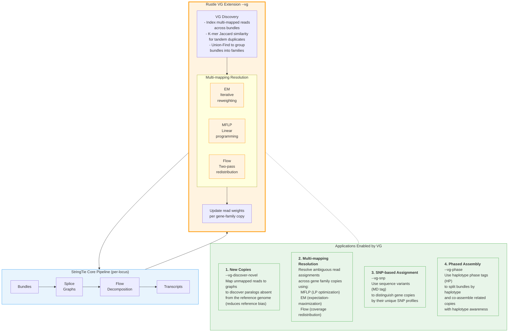
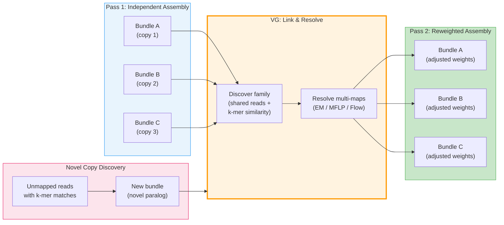

# Rustle Pipeline Overview

## How StringTie works (and by extension, Rustle)

Rustle is a Rust reimplementation of the StringTie transcript assembly algorithm,
extended with a **Variation Graph (VG) mode** for multi-copy gene family resolution.

### Core StringTie/Rustle Pipeline

```mermaid
flowchart TD
    subgraph INPUT["1. Input"]
        BAM["BAM/SAM\n(aligned reads)"]
        REF["Reference GTF\n(optional guide)"]
        FASTA["Genome FASTA\n(splice consensus)"]
    end

    subgraph BUNDLE["2. Bundle Detection"]
        CLUSTER["Cluster overlapping\nreads into loci"]
        JUNC["Extract & filter\nsplice junctions"]
        CPAS["Detect poly-A\ncut sites (long reads)"]
    end

    subgraph GRAPH["3. Splice Graph Construction"]
        NODES["Segment exonic regions\ninto graph nodes"]
        EDGES["Add collinear +\njunction edges"]
        SRC_SINK["Add source & sink\nnodes"]
        LONGTRIM["Longtrim: split nodes\nat read-boundary peaks\n(long-read mode)"]
    end

    subgraph MAPFLOW["4-5. Read Mapping & Flow"]
        MAP["Map reads onto\ngraph paths (transfrags)"]
        ABSORB["Merge compatible\ntransfrags"]
        MAXFLOW["Edmonds-Karp\nmax-flow decomposition"]
    end

    subgraph EXTRACT["6. Path Extraction"]
        SEED["Seed transcripts from:\n- guide matches\n- junction paths\n- long-read paths"]
        EXTEND["Extend paths\nsource <-> sink"]
        ABUND["Compute per-transcript\nabundance (cov, FPKM, TPM)"]
    end

    subgraph FILTER["7. Transcript Filtering"]
        ISOFRAC["Isofrac: remove\nlow-fraction isoforms"]
        PAIRWISE["Pairwise: remove\ncontained transcripts"]
        DEDUP["Dedup: remove\nintron-chain subsets"]
        RUNOFF["Filter polymerase\nrun-off / run-on"]
    end

    subgraph OUTPUT["8. Output"]
        GTF["Transcript GTF"]
        ABUND_TAB["Gene abundance\ntable"]
        BALL["Ballgown tables\n(optional)"]
    end

    INPUT --> BUNDLE --> GRAPH --> MAPFLOW --> EXTRACT --> FILTER --> OUTPUT

    style INPUT fill:#e8f4fd,stroke:#2196F3
    style BUNDLE fill:#e8f4fd,stroke:#2196F3
    style GRAPH fill:#e8f4fd,stroke:#2196F3
    style MAPFLOW fill:#e8f4fd,stroke:#2196F3
    style EXTRACT fill:#e8f4fd,stroke:#2196F3
    style FILTER fill:#e8f4fd,stroke:#2196F3
    style OUTPUT fill:#e8f4fd,stroke:#2196F3
```

### Rustle's VG Extension: Variation Graph Mode

The standard StringTie pipeline (above) treats each locus independently.
Rustle adds a **Variation Graph (VG) layer** that links related loci
(paralogs, tandem duplicates) and resolves multi-mapping reads across them.

### How the VG layer interacts with the core pipeline

### Key Insight

> **StringTie** assembles each locus in isolation.
> **Rustle** adds a graph-aware layer that recognizes when multiple loci
> belong to the same gene family and uses variation-graph principles
> (multi-mapping resolution, SNP discrimination, haplotype phasing,
> novel copy discovery) to produce more accurate, less reference-biased
> transcript assemblies for duplicated gene families.
