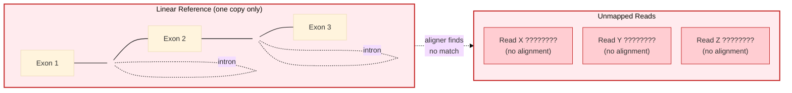
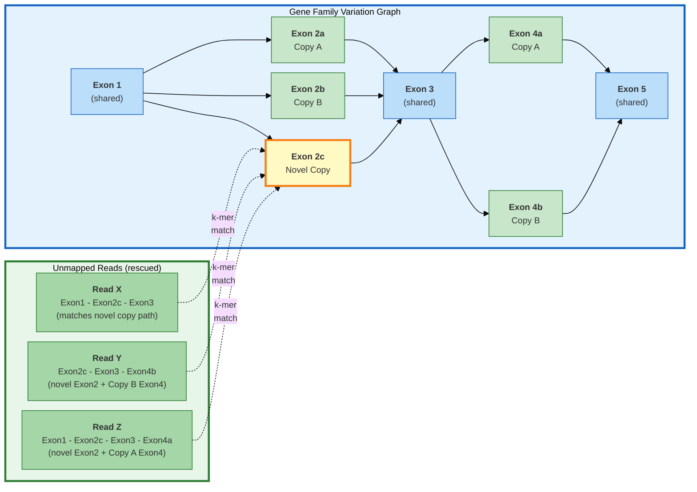
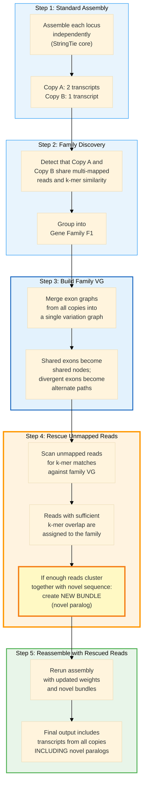

# Variation Graph: Novel Copy Discovery and Read Rescue

## Gene Family Variation Graph with Unmapped Read Rescue

In a linear reference, reads from paralogs absent in the assembly have
nowhere to map and are lost. A **variation graph** encodes all known copies
of a gene family as alternate paths through shared and divergent exons,
allowing unmapped reads to be rescued by aligning to the graph.

### Conceptual Overview



**Problem:** The reference genome contains only one copy of the gene.
Reads originating from a missing paralog cannot map and are discarded.

---

### The Variation Graph Solution

```mermaid
%%{init: {'theme': 'base', 'themeVariables': {'fontSize': '13px'}, 'flowchart': {'nodeSpacing': 15, 'rankSpacing': 50, 'curve': 'basis'}}}%%
flowchart LR

    START((" "))

    subgraph VG["Gene Family Variation Graph"]
        direction LR

        E1_shared["<b>Exon 1</b>\n(shared)"]

        E2_A["<b>Exon 2a</b>\nCopy A\n...ACGTGC..."]
        E2_B["<b>Exon 2b</b>\nCopy B\n...ACATGC...\n(1 SNP)"]
        E2_C["<b>Exon 2c</b>\nNovel Copy\n...ACTTGC...\n(2 SNPs)"]

        E3_shared["<b>Exon 3</b>\n(shared)"]

        E4_A["<b>Exon 4a</b>\nCopy A only"]
        E4_B["<b>Exon 4b</b>\nCopy B only"]

        E5_shared["<b>Exon 5</b>\n(shared)"]

        E1_shared -->|"intron"| E2_A
        E1_shared -->|"intron"| E2_B
        E1_shared -->|"intron"| E2_C

        E2_A -->|"intron"| E3_shared
        E2_B -->|"intron"| E3_shared
        E2_C -->|"intron"| E3_shared

        E3_shared -->|"intron"| E4_A
        E3_shared -->|"intron"| E4_B

        E4_A -->|"intron"| E5_shared
        E4_B -->|"intron"| E5_shared
    end

    STOP((" "))

    START --> E1_shared
    E5_shared --> STOP

    style VG fill:#e3f2fd,stroke:#1565C0,stroke-width:3px
    style E1_shared fill:#bbdefb,stroke:#1565C0
    style E3_shared fill:#bbdefb,stroke:#1565C0
    style E5_shared fill:#bbdefb,stroke:#1565C0
    style E2_A fill:#c8e6c9,stroke:#2E7D32
    style E2_B fill:#c8e6c9,stroke:#2E7D32
    style E2_C fill:#fff9c4,stroke:#F57F17,stroke-width:3px
    style E4_A fill:#c8e6c9,stroke:#2E7D32
    style E4_B fill:#c8e6c9,stroke:#2E7D32
    style START fill:#000,stroke:#000
    style STOP fill:#000,stroke:#000
```



**Legend:**
- **Blue nodes** = exons shared across all copies (identical sequence)
- **Green nodes** = exons specific to known copies A and B (in reference)
- **Yellow node (bold border)** = exon from a **novel copy** not in the reference

---

### Read Rescue: Mapping Unmapped Reads to the VG



### How the Rescue Works (step by step)



### Why This Matters: Reference Bias in Gene Families

```
    LINEAR REFERENCE                    VARIATION GRAPH
    (1 copy only)                       (all copies)

    =====[E1]==[E2a]==[E3]==[E4a]====   E1 is shared by all copies
                                         |
    Reads from novel copy:               E2 branches into 3 variants:
    "I have exon 2c, never seen          a (Copy A), b (Copy B), c (Novel)
     in this reference"                  |
         |                               E3 is shared
         v                               |
    UNMAPPED / DISCARDED                 E4 branches: a (Copy A), b (Copy B)
    (reference bias!)                    |
                                         Reads from novel copy:
                                         "E2c matches a VG path!"
                                              |
                                              v
                                         RESCUED --> new bundle
                                         --> novel paralog assembled
```

> **Key insight:** Unmapped reads are not necessarily low-quality or
> erroneous. In gene families, they often originate from paralogs that
> are simply absent from the reference assembly. By building a variation
> graph from all known copies and scanning unmapped reads against it,
> Rustle can **rescue** these reads and even **discover novel gene copies**
> that the reference genome is missing, directly reducing reference bias.
