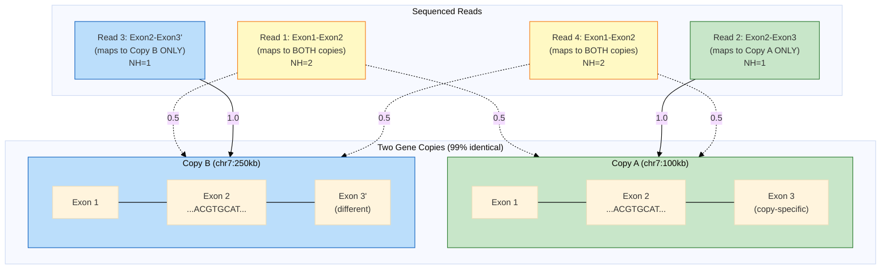
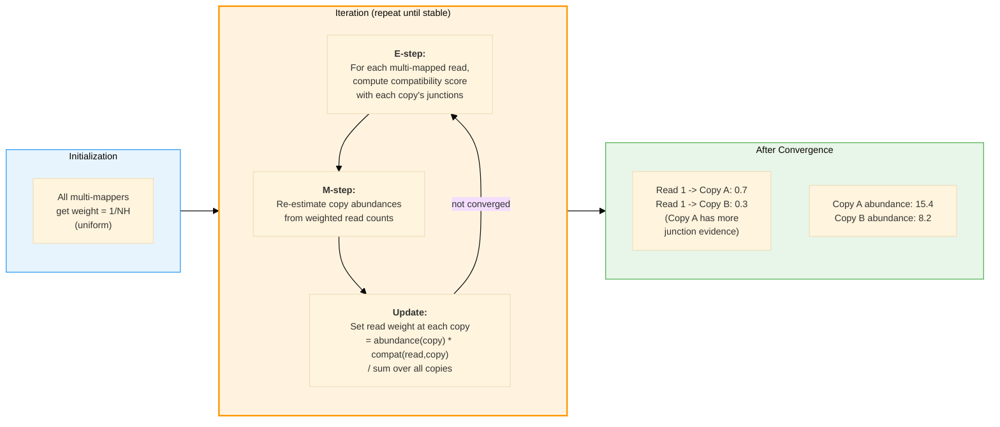
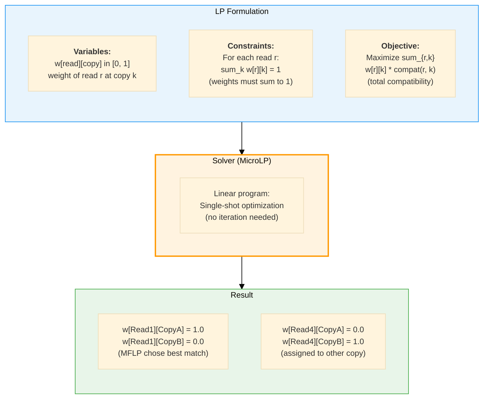
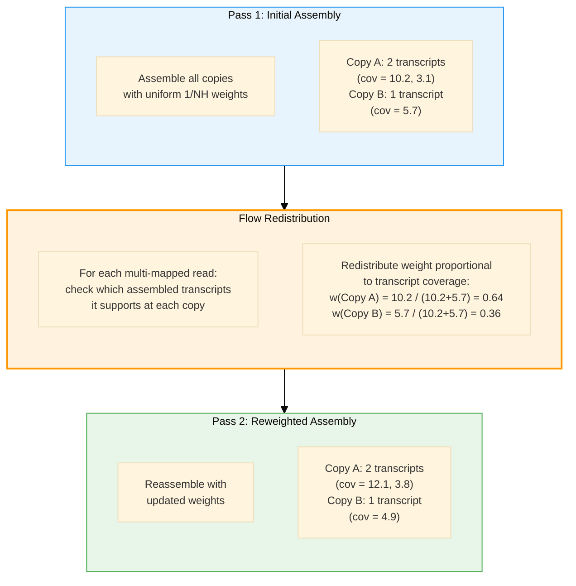
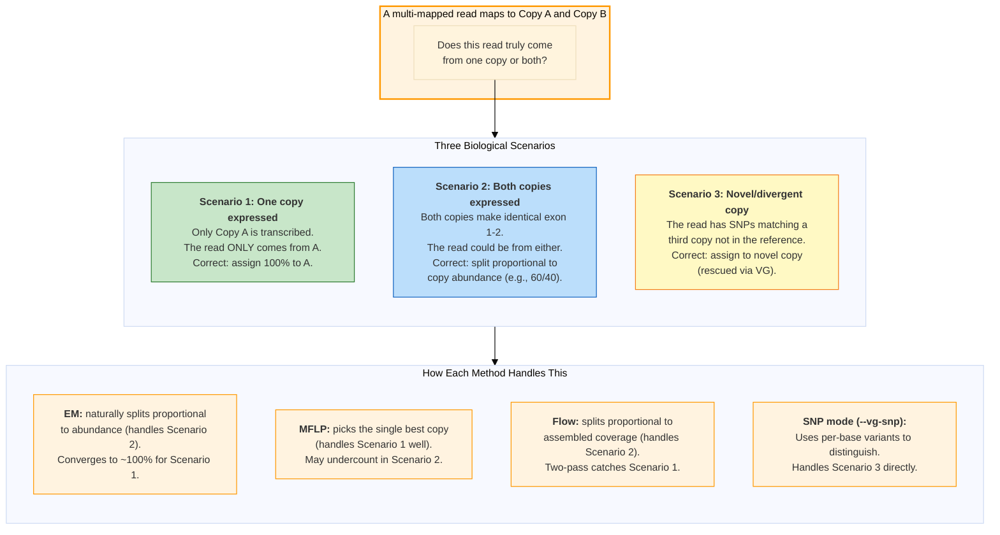

# Multi-Mapping Resolution: EM, MFLP, and Flow

## The Multi-Mapping Problem in Gene Families

When a read maps equally well to multiple gene copies, the aligner reports it
as "multi-mapped" (NH tag > 1). Standard assemblers either discard these reads
or split their weight equally (1/NH), both of which distort transcript abundance
and can merge distinct copies or miss low-expressed copies entirely.

### Why Multi-Mappers Are Real (Not Artifacts)



**The core question:** Read 1 and Read 4 map to both copies. Do they truly come
from both? Or from one copy only? The answer depends on the _expression context_.

---

## Three Resolution Strategies

### Strategy 1: EM (Expectation-Maximization)

Iteratively refines read weights based on junction compatibility scores.
Each round updates the probability that a read belongs to each copy,
converging to a stable assignment.



**Key property:** EM allows **fractional assignment** — a multi-mapper can
contribute weight to multiple copies simultaneously. This is correct when
a read truly could come from either copy (e.g., exon 1-2 reads in a family
where both copies are expressed). EM naturally handles the "read belongs in
several places" scenario by distributing weight proportional to evidence.

---

### Strategy 2: MFLP (Minimum Flow Linear Program)

Single-shot optimization that assigns each multi-mapper to copies by
maximizing total compatibility, subject to the constraint that weights
sum to 1 per read.



**Key property:** MFLP tends toward **hard assignment** (0 or 1 weights) because
the LP optimum sits at vertices of the feasible polytope. This is appropriate when
you believe each read truly originates from a single copy and want the globally
optimal assignment. However, when a read genuinely comes from a region shared
between expressed copies, MFLP will still assign it to one — potentially
underestimating the weaker copy.

---

### Strategy 3: Flow-Based Redistribution

Two-pass approach: assemble first with uniform weights, then use the
assembled transcripts' coverage to redistribute multi-mapper weights,
then reassemble.



**Key property:** Flow uses the **assembler's own output** as evidence for
redistribution. Like EM, it allows fractional weights, but the evidence comes
from assembled transcripts rather than raw junction compatibility. This makes
it robust to cases where junction structure alone is ambiguous but coverage
patterns distinguish the copies.

---

## When Does a Multi-Mapper Really Belong in Several Places?



### Controlling False Multi-Mapping: How Many Are Real?

The question "how many multi-mappers are real?" is controlled by two mechanisms:

1. **Compatibility scoring:** A read is only assigned weight at a copy where
   its splice junctions are compatible. If Read 1 has junctions A-B-C and
   Copy B only has junctions A-B-D, the compatibility score is low and the
   read gets near-zero weight at Copy B regardless of method.

2. **Abundance feedback:** In EM and Flow, the abundance of each copy acts
   as a prior. If Copy B has very few uniquely-mapped reads, multi-mappers
   get less weight there — the method "learns" that Copy B is weakly expressed
   and avoids over-assigning reads to it.

3. **The fractional truth:** A multi-mapper that maps to two expressed copies
   _does_ belong in both places. EM and Flow correctly split it. This is not
   an error — it reflects the biological reality that the sequencer cannot
   distinguish which copy produced the molecule when the copies are identical
   in that region. The fractional weight (e.g., 0.6/0.4) is the honest answer.

```
    Method    | Fractional? | Handles "belongs in both" | Best for
    ----------|-------------|---------------------------|------------------
    EM        | Yes         | Yes (proportional split)  | General use
    MFLP      | Tends to 0/1| No (picks one)           | Clear-cut cases
    Flow      | Yes         | Yes (coverage-based)      | Complex families
    SNP       | N/A         | Distinguishes copies      | Divergent copies
```
