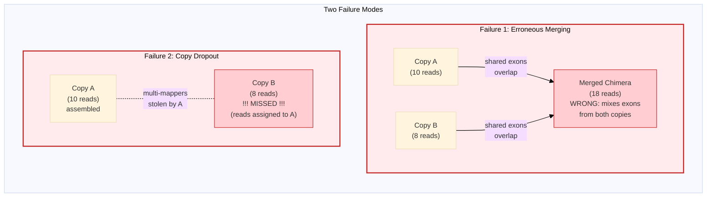
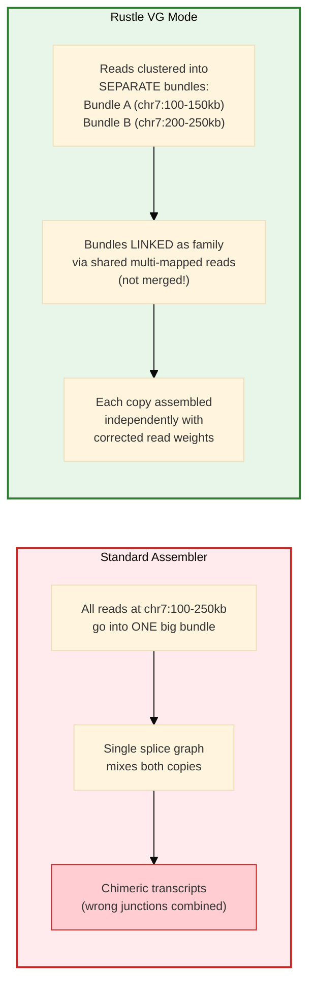
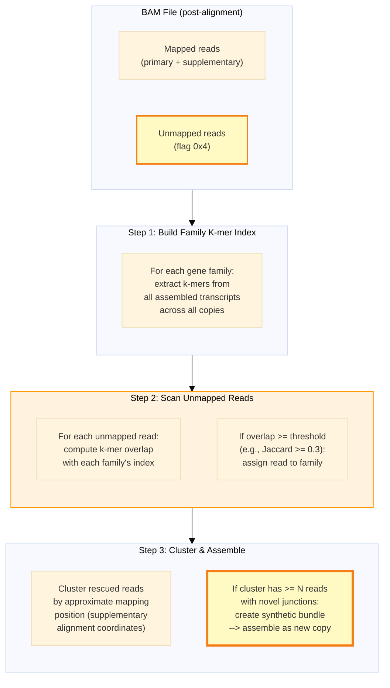

# Avoiding Assembly Artifacts in Multi-Copy Gene Families

## The Problem: Copies That Are Too Close Together

When gene copies share >95% sequence identity, standard assemblers face
two failure modes:



---

## How VG Mode Prevents Erroneous Merging

### Step 1: Family Discovery (Separate, Don't Merge)



**Key principle:** VG mode **links** related bundles but keeps them as
**separate assembly units**. Multi-mapped reads are redistributed with
corrected weights — they are never physically merged into one bundle.

### Step 2: Junction-Based Copy Discrimination

Even when copies share most exons, they often differ at one or two
splice junctions. VG mode uses these differences:

```mermaid
%%{init: {'theme': 'base', 'themeVariables': {'fontSize': '12px'}}}%%
flowchart LR
    subgraph COPIES["Two copies differing by one exon"]
        direction TB
        subgraph CA["Copy A"]
            direction LR
            CA1["E1"] --- CA2["E2"] --- CA3["<b>E3a</b>"] --- CA4["E4"]
        end
        subgraph CB["Copy B"]
            direction LR
            CB1["E1"] --- CB2["E2"] --- CB3["<b>E3b</b>\n(3bp shorter)"] --- CB4["E4"]
        end
    end

    subgraph READS_J["Read Junction Evidence"]
        direction TB
        RU["Multi-mapped reads\n(E1-E2: shared junction)\nCannot distinguish copies"]
        RD1["Unique to A:\nE2---E3a junction\n(donor at pos 5000)"]
        RD2["Unique to B:\nE2---E3b junction\n(donor at pos 5003)"]
    end

    subgraph ASSIGN["VG Assignment"]
        direction TB
        A1["Reads with E2-E3a junction\n--> 100% to Copy A"]
        A2["Reads with E2-E3b junction\n--> 100% to Copy B"]
        A3["Reads with E1-E2 only\n--> split by EM/MFLP/Flow\nproportional to unique evidence"]
    end

    COPIES --> READS_J --> ASSIGN

    style CA3 fill:#c8e6c9,stroke:#2E7D32,stroke-width:3px
    style CB3 fill:#bbdefb,stroke:#1565C0,stroke-width:3px
    style RD1 fill:#c8e6c9,stroke:#2E7D32
    style RD2 fill:#bbdefb,stroke:#1565C0
    style RU fill:#fff9c4,stroke:#F57F17
```



**Even a single nucleotide difference** at a splice junction creates a
unique junction coordinate that unambiguously assigns a read to one copy.
The compatibility score in EM/MFLP uses these junction differences to
weight assignments.

---

## Recovering Missing Gene Family Members

### How Unmapped Reads Find Their Family

Reads from a paralog absent from the reference fail to align. But they
share sequence (k-mers) with known family members. VG mode exploits this:



**The reads never passed through the mapper for this locus** — they were
unmapped or mapped elsewhere as supplementary alignments. VG mode
re-discovers them through sequence similarity (k-mer matching) to the
family's assembled transcripts, bypassing the aligner's reference bias.

---

## Summary: VG Mode Artifact Prevention

```
    Artifact              | Cause                    | VG Prevention
    ----------------------|--------------------------|---------------------------
    Chimeric transcripts  | Merging reads from       | Keep copies as separate
                          | different copies into    | bundles; link via family
                          | one splice graph         | grouping, not merging
                          |                          |
    Copy dropout          | Multi-mappers stolen     | EM/MFLP/Flow redistribute
                          | by dominant copy         | weights using junction
                          | (winner-takes-all)       | compatibility evidence
                          |                          |
    Missing paralogs      | Novel copy absent from   | K-mer scan of unmapped
                          | reference; reads can't   | reads against family VG;
                          | align                    | create novel bundles
                          |                          |
    SNP-identical copies  | Copies differ only by    | --vg-snp mode: parse MD
                          | point mutations, not     | tag for per-base variants;
                          | splice junctions         | build diagnostic SNP
                          |                          | profiles per copy
                          |                          |
    Haplotype confusion   | Two haplotypes of same   | --vg-phase: use HP/PS
                          | copy create false        | tags to split reads by
                          | isoform diversity        | haplotype before assembly
```
